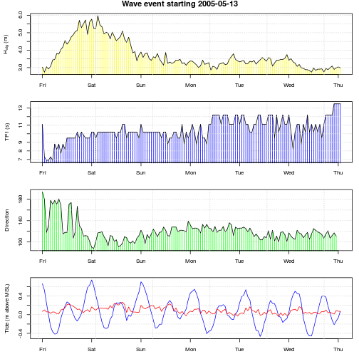
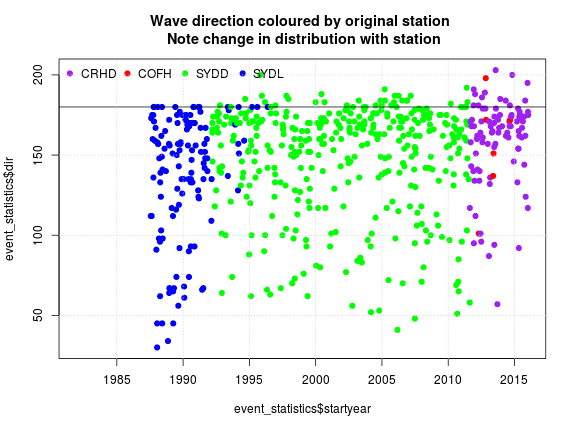
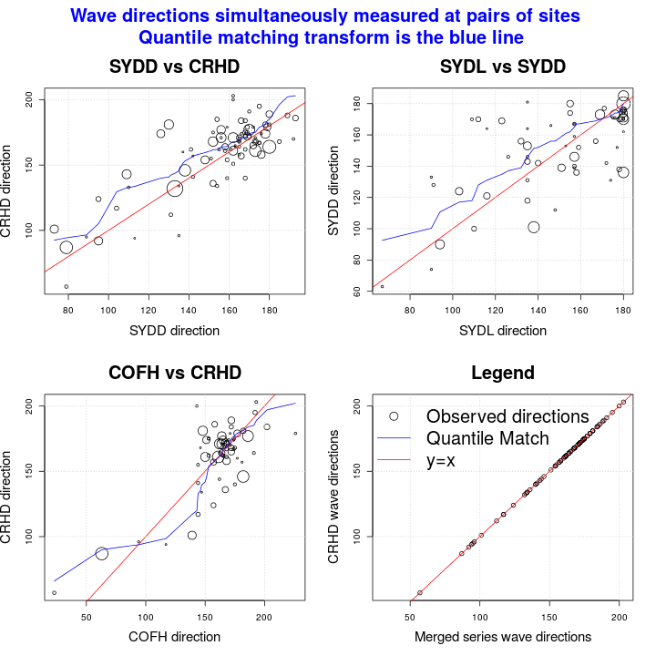
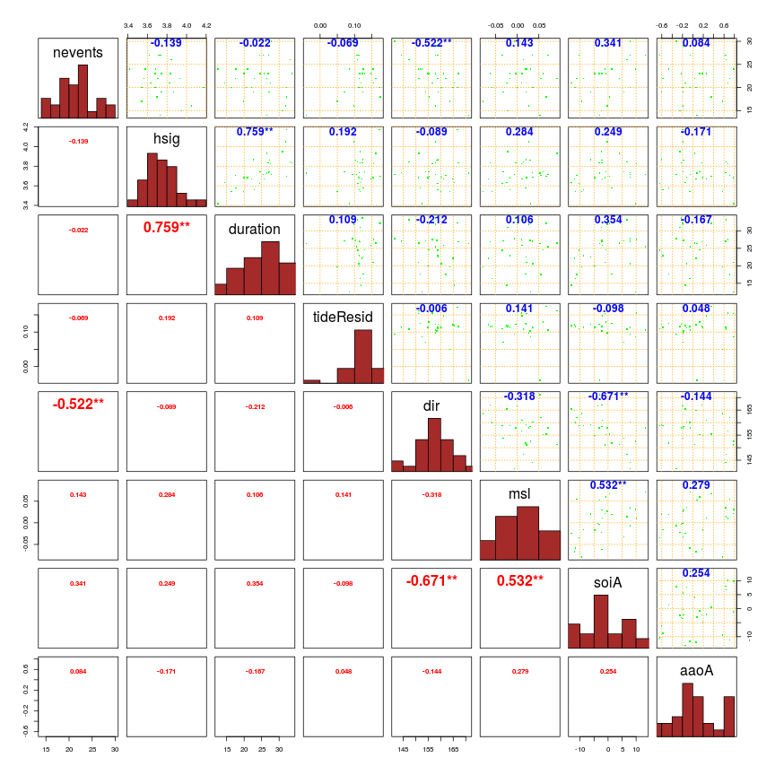

# **Extract storm events and conduct an exploratory data analysis**
-------------------------------------------------------------

*Gareth Davies, Geoscience Australia 2017*

# Introduction
------------------

This document follows on from [preprocess_data.md](preprocess_data.md) in describing
our analysis of storm waves at Old Bar. It illustrates the extraction
of storm wave events from the "Old Bar" time-series created in the earlier script, and 
some preliminary analyses of the data.

It is essential that the earlier script has already been run, and produced an
RDS file *'Rimages/Session_data_processing_clean.Rdata'*. **To make sure, the
code below throws an error if the latter file does not exist.**

```r
# Check that the pre-requisites exist
if(!file.exists('Rimages/Session_data_processing_clean.Rdata')){
    stop('It appears you have not yet run preprocess_data.Rmd. That must be run before continuing')
}
```

Supposing the above did not generate any errors, and you have R installed,
along with all the packages required to run this code, and a copy of the
*stormwavecluster* git repository, then you should be able to re-run the
analysis here by simply copy-pasting the code. Alternatively, it can be run
with the `knit` command in the *knitr* package: 

```r
library(knitr)
knit('extract_storm_events.Rmd')
```

The basic approach followed here is to:
* **Step 1**: Extract storm events from the "Old Bar" time-series created earlier
* **Step 2**: Compute summary statistics for each storm event
* **Step 3**: Study changes in monthly mean sea level, and remove seasonal and inter-annual trends from our tidal residual, to better estimate the storm surge component.
* **Step 4**: Perform bias correction of the wave directions obtained from stations other than Crowdy Head.
* **Step 5**: Do some exploratory analysis of the data

Later we will develop the statistical analysis of the storm events.

# **Step 1: Extract storm events from the "Old Bar" time-series**
-----------------------------------------------------------------

Here we follow on from the analysis in [preprocess_data.md](preprocess_data.md)
by loading the associated R session.

```r
# This will only work if the 'preprocess_data' code has already been run
load('Rimages/Session_data_processing_clean.Rdata')
```

**Now, we extract storm events from the `full_data` time-series.** We initially
define storm events as periods in which the significant wave height exceeds its
95th percentile. We also merge storm events which are separated by less than 24
hours.

```r
# Event extraction
hsig_threshold = quantile(full_data$hsig, p=0.95, na.rm=T)
hsig_threshold
```

```
##    95% 
## 2.9235
```

```r
duration_threshold_hours = 0 # Suggest 0 -- remove short events later if needed 
duration_gap_hours = 24 # Must always be >= data time spacing (1 in this case)

# See the routine extract_events in data_utilities.R for details
event_set = DU$extract_events(full_data, 
    hsig_threshold = hsig_threshold,
    duration_threshold_hours = duration_threshold_hours, 
    duration_gap_hours = duration_gap_hours,
    events_to_combine = NULL)
```

**Here we check how many storms were identified, and show an example plot of one**

```r
# event_set is a list containing the start/end index of each event, and another
# list called 'data' which contains the event data (a separate entry for each
# event)
names(event_set)
```

```
## [1] "start_index" "end_index"   "data"
```

```r
# How many events?
length(event_set$start_index)
```

```
## [1] 678
```

```r
# Start should always be <= end!
stopifnot(all(event_set$start_index <= event_set$end_index))

# How many datasets do we have (should be 1 for each event)
num_events = length(event_set$data)
num_events
```

```
## [1] 678
```

```r
# Plot one event [ change the index to get a good one, number 442 was good for me ]
event_example = event_set$data[[442]]
par(mar=c(3,4.5,1,1)) # Change plot margins, make it look better
DU$plot_single_storm_event(event_example)
```



```r
# Clean up
rm(event_example)
```

**Here we plot the entire full_data time-series, with events overlain.** This
goes to a separate PDF file under FIG, because it is very large.


```r
# Plot will go in this directory
dir.create('FIG', showWarnings=FALSE)

# Function to plot all wave data, with storm events overlain
multi_year_pdf_plot<-function(site, event_data=NULL){

    # Open a pdf file to plot to
    pdf(paste0('FIG/yearly_timeseries_', site, '.pdf'), width=45, height=8)

    # Compute the axis limits for the plot
    max_hsig = max(wd[[site]]$hsig, na.rm=TRUE)
    max_tp1 = max(wd[[site]]$tp1, na.rm=TRUE)

    # Make a one page plot for each year
    for(year in 1985:2016){
        DU$wave_data_single_year_plot(year, site, wd, max_hsig, max_tp1, event_data,
            add_days=TRUE, add_event_start_lines=TRUE)
    }

    dev.off()
}

multi_year_pdf_plot('full_data', event_set$data)
```

```
## png 
##   2
```

# **Step 2: Compute summary statistics for each storm event**
---------------------------------------------------------------

**The statistical analysis of event magnitude / frequency is performed on storm
event summary statistics -- and the latter are defined and extracted in the
following code**. Look at the computational routine in *data_utilities.R* for
more information on the extraction. At the time of writing we extract the
maximum significant wave height (m); TP1 (s) and direction (degrees from North)
at the time of peak significant wave height; the maximum tidal residual (m),
the event duration in hours, and the start time and end time as decimal years
(this is useful for some later analysis). The event summary statistics should
obviously reflect our event definition, which imposes a lower limit on the
significant wave height (`> hsig_threshold`), and the time between storms (`> 24 hours`).

```r
duration_offset_hours = 1.0 # Duration (hrs) for single-point event. Must be <= duration gap hours
stopifnot(duration_offset_hours <= duration_gap_hours)

event_statistics = DU$extract_event_statistics(event_set$data, median_tp1_dir=FALSE, 
    duration_offset_hours=duration_offset_hours)

# Get a basic summary
summary(event_statistics, digits=6)
```

```
##     duration             hsig              tp1               dir         
##  Min.   :  1.0000   Min.   :2.92400   Min.   : 6.2000   Min.   : 30.000  
##  1st Qu.:  4.0000   1st Qu.:3.12475   1st Qu.: 9.7700   1st Qu.:134.000  
##  Median : 16.0000   Median :3.47600   Median :11.1000   Median :160.000  
##  Mean   : 24.4853   Mean   :3.73825   Mean   :11.1191   Mean   :147.649  
##  3rd Qu.: 35.0000   3rd Qu.:4.08925   3rd Qu.:12.2000   3rd Qu.:172.000  
##  Max.   :167.0000   Max.   :7.35000   Max.   :17.1000   Max.   :203.000  
##                                                         NA's   :85       
##    tideResid          startyear          endyear       
##  Min.   :-0.29472   Min.   :1985.80   Min.   :1985.80  
##  1st Qu.: 0.02128   1st Qu.:1992.81   1st Qu.:1992.82  
##  Median : 0.12328   Median :2000.44   Median :2000.44  
##  Mean   : 0.12416   Mean   :2000.81   Mean   :2000.81  
##  3rd Qu.: 0.21603   3rd Qu.:2008.37   3rd Qu.:2008.37  
##  Max.   : 0.62828   Max.   :2016.04   Max.   :2016.04  
##  NA's   :52                                            
##       time                    
##  Min.   :1985-10-20 03:00:00  
##  1st Qu.:1992-10-24 22:30:00  
##  Median :2000-06-09 06:30:00  
##  Mean   :2000-10-22 14:02:49  
##  3rd Qu.:2008-05-14 10:15:00  
##  Max.   :2016-01-15 07:00:00  
## 
```

```r
# Make pairwise scatterplots (ignoring time variables)
DU$nice_pairs(event_statistics[c('duration', 'hsig', 'tp1', 'dir', 'tideResid')])
```


# **Step 3: Study changes in monthly mean sea level, and remove seasonal and inter-annual trends from the tidal residual, to better estimate the storm surge**
-------------------------------------------------------------------------------------------------------------------------------------------------

**At this point, various exploratory analyses are undertaken to understand
non-stationarities and inhomogeneities in the data.** In particular,
we remove MSL related non-stationarities in the tidal residual, and also
perform an adjustment to the wave direction.


**Here we show that the tidal-residual is non-stationary**, with an obvious
increasing trend.

```r
# Tidal residual
scatter.smooth(event_statistics$startyear, event_statistics$tideResid, 
    xlab='Year', ylab='Tidal Residual (m)', col='blue', 
    cex = 0.5, main='Tidal residual over time')

# Fit a linear regression
tidal_resid_vs_startyear = lm(event_statistics$tideResid ~ event_statistics$startyear)
abline(coef(tidal_resid_vs_startyear), col='red')
grid(col='brown')
```


```r
# Look at regression coefficients
summary(tidal_resid_vs_startyear)
```

```
## 
## Call:
## lm(formula = event_statistics$tideResid ~ event_statistics$startyear)
## 
## Residuals:
##      Min       1Q   Median       3Q      Max 
## -0.39340 -0.09537 -0.00124  0.08876  0.51538 
## 
## Coefficients:
##                              Estimate Std. Error t value Pr(>|t|)    
## (Intercept)                -8.1842031  1.3002282  -6.294 5.82e-10 ***
## event_statistics$startyear  0.0041540  0.0006501   6.390 3.25e-10 ***
## ---
## Signif. codes:  0 '***' 0.001 '**' 0.01 '*' 0.05 '.' 0.1 ' ' 1
## 
## Residual standard error: 0.1343 on 624 degrees of freedom
##   (52 observations deleted due to missingness)
## Multiple R-squared:  0.06142,	Adjusted R-squared:  0.05991 
## F-statistic: 40.83 on 1 and 624 DF,  p-value: 3.247e-10
```

```r
# Clean up
rm(tidal_resid_vs_startyear)

# A different check -- basic spearman correlation
cor.test(event_statistics$startyear, event_statistics$tideResid, method='s')
```

```
## Warning in cor.test.default(event_statistics$startyear, event_statistics
## $tideResid, : Cannot compute exact p-value with ties
```

```
## 
## 	Spearman's rank correlation rho
## 
## data:  event_statistics$startyear and event_statistics$tideResid
## S = 30859000, p-value = 5.015e-10
## alternative hypothesis: true rho is not equal to 0
## sample estimates:
##       rho 
## 0.2452314
```

```r
# Can remove the warnings about p-values with ties by 'jittering' the data
# Qualitative result should be unchanged
cor.test( jitter(event_statistics$startyear), jitter(event_statistics$tideResid), 
    method='s')
```

```
## 
## 	Spearman's rank correlation rho
## 
## data:  jitter(event_statistics$startyear) and jitter(event_statistics$tideResid)
## S = 30848000, p-value = 5.481e-10
## alternative hypothesis: true rho is not equal to 0
## sample estimates:
##       rho 
## 0.2454997
```

**The increasing trend in the surge might be reflective of changes in MSL**
(e.g.  due to climate change, among other forcings). To further investigate
this, we study monthly mean sea levels at Tomaree -- with the idea of removing
the long-term and seasonal trends in mean-sea-level from the surge residual we
have just defined.

```r
# Compute annual sea levels
yearly_SL = aggregate(wd$full_data$tide, list(floor(wd$full_data$year)), 
    f<-function(x) mean(x, na.rm=T))

# Also compute shorter time-scale sea levels
monthly_SL = aggregate(wd$full_data$tide, 
    list(month=as.numeric(format(wd$full_data$time, '%m')), 
         year=as.numeric(format(wd$full_data$time, '%Y'))),
    f<-function(x) mean(x, na.rm=TRUE))

monthly_tidal_residual = aggregate(wd$full_data$tideResid, 
    list(month=as.numeric(format(wd$full_data$time, '%m')), 
         year=as.numeric(format(wd$full_data$time, '%Y'))),
    f<-function(x) mean(x, na.rm=TRUE))

# Convert the time of the monthly sea level /residual to decimal year, and
# gap-fill NA values
# Associate the monthly value to the 15th of the month
monthly_SL_year = DU$time_to_year(
    strptime(paste0(monthly_SL$year, '-', monthly_SL$month, '-15 00:00:00'), 
    format='%Y-%m-%d %H:%M:%S', tz='GMT'))
monthly_SL_filled = monthly_SL$x
monthly_tidal_residual_filled = monthly_tidal_residual$x
nan_fix = which(is.nan(monthly_SL_filled)) 

# The missing values of the residual and the monthly SL should be the same
# Confirm they are!
stopifnot(all(nan_fix == which(is.nan(monthly_tidal_residual$x))))

# This will gap fill, assuming no consecutive nan values within the data, which
# is true for our current data (but check before applying to other data!)
monthly_SL_filled[nan_fix] = 0.5 * 
    (monthly_SL_filled[nan_fix - 1] + monthly_SL_filled[nan_fix + 1])
monthly_tidal_residual_filled[nan_fix] = 0.5 * 
    (monthly_tidal_residual_filled[nan_fix - 1] + 
     monthly_tidal_residual_filled[nan_fix + 1])

# Remove trailing nan
nan_fix = which(is.nan(monthly_SL_filled)) 
monthly_SL_filled = monthly_SL_filled[-nan_fix]
monthly_SL_year = monthly_SL_year[-nan_fix]
monthly_tidal_residual_filled = monthly_tidal_residual_filled[-nan_fix]

#
plot(monthly_SL_year, monthly_SL_filled, t='l')
points(monthly_SL_year, monthly_tidal_residual_filled, t='l', col='red')
legend('topleft', c('Monthly sea level', 'Monthly tidal residual'), 
    col=c('black', 'red'), lty=c(1,1), pch=c(NA, NA))
```


The above figure suggests significant non-stationarities in the monthly mean
sea level.

**Here we apply the STL method to model non-stationarities in the monthly tidal
residual series** (Cleveland et al 1990). We decompose the sea level into an
seasonal periodic component and an annual trend. This is later used to correct
the derived non-astronimical tidal surge, so that the latter becomes more
obviously related to the storm related surge component.

```r
# Make a seasonal timeseries. 
monthly_tidal_residual_filled_ts = ts(monthly_tidal_residual_filled, 
    start=c(1985, 10), frequency=12)
# Stl smoothing
monthly_tidal_residual_filled_stl = stl(monthly_tidal_residual_filled_ts, 
    s.window='periodic')
plot(monthly_tidal_residual_filled_stl)
```


```r
## Convert to function
smooth_tideResid_fun_stl = approxfun(monthly_SL_year, 
    rowSums(monthly_tidal_residual_filled_stl$time.series[,1:2]),
    rule=2)

# For convenience later, we also keep separate annual and monthly functions
smooth_tideResid_fun_stl_annual = approxfun(monthly_SL_year, 
    monthly_tidal_residual_filled_stl$time.series[,2],
    rule=2)
smooth_tideResid_fun_stl_monthly = approxfun(monthly_SL_year, 
    monthly_tidal_residual_filled_stl$time.series[,1],
    rule=2)
```

Below we investigate relationships between MSL and annual mean SOI, as well as
long-term MSL changes. To enable further analyses we read climate variables,
computing various averages, and appending them to the event statistics to
support later analysis.

```r
# Get climate index info, along with a smoothed soi with df ~= number of years
CI = DU$read_climate_indices(
    soi_file = '../../Data/Climate_Indices/ENSO/SOI_BOM.txt',
    aao_file = '../../Data/Climate_Indices/AAO/AAO.txt')
CI_annual = lapply(CI, 
    f<-function(x) aggregate(x[,2], list(year=as.numeric(format(x[,1], '%Y'))), mean ))
CI_annual_fun = lapply(CI_annual, 
    f<-function(x) approxfun(x[,1], x[,2], method='constant') )

# In the table, soiA = annual mean soi, aaoA = annual mean aao, etc
for(nm in names(CI_annual_fun)){
    es_name = paste0(nm, 'A')
    event_statistics[[es_name]] = CI_annual_fun[[nm]](floor(event_statistics$startyear))
}
soi_time = DU$time_to_year(CI$soi$time)
soi_fun = approxfun(soi_time, CI$soi$index)
soi_NA = which(is.na(CI$soi$index))
if(length(soi_NA) > 0){
    smooth_soi = smooth.spline(soi_time[-soi_NA], CI$soi$index[-soi_NA], 
        df = diff(range(soi_time[-soi_NA])))
}else{
    smooth_soi = smooth.spline(soi_time[], CI$soi$index[], 
        df = diff(range(soi_time[])))
}
```

**Question: Is annual averaged SOI related to annual averaged sea level?**

```r
# Is annual average SOI related to annual average sea level?
# This is suggested in White et al (2014)
yearly_soi = CI_annual$soi
mm = match(yearly_SL[,1], yearly_soi[,1])
cor.test(yearly_SL[,2], yearly_soi[mm,2]) # Yes, positive relationship
```

```
## 
## 	Pearson's product-moment correlation
## 
## data:  yearly_SL[, 2] and yearly_soi[mm, 2]
## t = 3.5398, df = 28, p-value = 0.001421
## alternative hypothesis: true correlation is not equal to 0
## 95 percent confidence interval:
##  0.2447792 0.7633700
## sample estimates:
##       cor 
## 0.5560154
```

**Question: How does the correlation between MSL and mean annual SOI change if
we assume recent sea level rise ~ 1.8mm/year (White et al., 2014)?**

```r
#  Not much change compared to the result above
cor.test(yearly_SL[,2] - 0.0018*(yearly_SL[,1] - 1985), yearly_soi[mm,2])
```

```
## 
## 	Pearson's product-moment correlation
## 
## data:  yearly_SL[, 2] - 0.0018 * (yearly_SL[, 1] - 1985) and yearly_soi[mm, 2]
## t = 3.1215, df = 28, p-value = 0.00415
## alternative hypothesis: true correlation is not equal to 0
## 95 percent confidence interval:
##  0.1809481 0.7340038
## sample estimates:
##       cor 
## 0.5080946
```

```r
# Here we make a simple linear regression of MSL, related to SOI and time
soi_SL_yearly = data.frame(soiA=yearly_soi[mm,2], sl=yearly_SL[,2], year = yearly_soi[mm,1])
soi_SL_lm = lm(sl ~ soiA + year, data=soi_SL_yearly)
summary(soi_SL_lm) # Should suggest relations between MSL, SOI, and time
```

```
## 
## Call:
## lm(formula = sl ~ soiA + year, data = soi_SL_yearly)
## 
## Residuals:
##      Min       1Q   Median       3Q      Max 
## -0.05575 -0.01350 -0.00035  0.01834  0.06478 
## 
## Coefficients:
##               Estimate Std. Error t value Pr(>|t|)   
## (Intercept) -4.0788748  1.3430789  -3.037  0.00525 **
## soiA         0.0022952  0.0008273   2.774  0.00991 **
## year         0.0020409  0.0006716   3.039  0.00522 **
## ---
## Signif. codes:  0 '***' 0.001 '**' 0.01 '*' 0.05 '.' 0.1 ' ' 1
## 
## Residual standard error: 0.02999 on 27 degrees of freedom
##   (2 observations deleted due to missingness)
## Multiple R-squared:  0.4852,	Adjusted R-squared:  0.4471 
## F-statistic: 12.72 on 2 and 27 DF,  p-value: 0.0001279
```

Below we make some plots of the sea level information, and the tidal residual
after monthly SL residuals are removed. **The definition of the tidal residual
is changed in the following code** to remove the component related to
inter-annual and seasonal mean sea level. The idea is that A) the adjusted
tidal residual should more strongly reflect storm type processes. Further, B)
we can still model the influence of seasons and SOI/sea-level-rise on MSL, and
integrate that into our analysis, so nothing is lost by this modelling approach. 

```r
# Plot MSL over time, with SOI
par(mfrow=c(3,1))
plot(yearly_SL[,1]+0.5, yearly_SL[,2], xlab = 'Year', ylab='Annual mean sea level',
    main='Annual MSL over time with a smoother (red) and smooth scaled SOI (green)',
    cex.main=2)
points(monthly_SL_year, smooth_tideResid_fun_stl_annual(monthly_SL_year), t='l', col='red')
points(smooth_soi$x, smooth_soi$y/200, t='l', col='green')
points(yearly_soi[,1]+0.5, yearly_soi[,2]/200, col='green')
abline(v=1985:2015, col='grey')
grid(col='brown')

plot(monthly_SL_year, monthly_SL_filled, t='l', 
    xlab='Year', ylab='Monthly mean sea level',
    main='Monthly sea level with smoother (red), and scaled SOI (green)',
    cex.main=2)
points(monthly_SL_year, smooth_tideResid_fun_stl(monthly_SL_year), 
    col='red', t='l')
points(DU$time_to_year(CI$soi$time), CI$soi$index/200, t='l', 
    col='green')
grid(col='brown')
abline(v=1985:2016, col='grey')


# Use the STL decomposition to adjust the tidal residuals
SL_adjustment_events = smooth_tideResid_fun_stl(event_statistics$startyear)

#
# REMOVE THE MSL COMPONENT FROM THE EVENT STATISTICS
#
event_statistics$tideResid = event_statistics$tideResid - SL_adjustment_events
# Append msl to the event_statistics table
event_statistics$msl = SL_adjustment_events

# Add in a plot of the NEW tidal residual
plot(event_statistics$startyear, event_statistics$tideResid, col='blue',
    xlab='Time', ylab='Adjusted Tidal Residual', 
    main='Tidal Residual, adjusted for annual and monthly drifts in the sea level',
    cex.main=2)
grid(col='brown'); abline(h=0, col='red')
```


**Here we perform a few statistical checks on the adjusted tidal residual, to see
whether long-term and ENSO related trends have been removed**

```r
# Is there still a small increasing trend in the tidal residual? It's possible,
# but the result is statistically borderline, and is much weaker than the result
# prior to the removal of the monthly sea level trends (reported above)
cor.test(event_statistics$startyear, event_statistics$tideResid, method='s')
```

```
## 
## 	Spearman's rank correlation rho
## 
## data:  event_statistics$startyear and event_statistics$tideResid
## S = 37520000, p-value = 0.03953
## alternative hypothesis: true rho is not equal to 0
## sample estimates:
##        rho 
## 0.08231296
```

```r
# Here check the same thing as above, with linear regression. Suggests a small
# increasing trend, with borderline statistical significance
summary(lm(event_statistics$tideResid ~ event_statistics$startyear))
```

```
## 
## Call:
## lm(formula = event_statistics$tideResid ~ event_statistics$startyear)
## 
## Residuals:
##      Min       1Q   Median       3Q      Max 
## -0.31266 -0.07747 -0.00072  0.07336  0.51964 
## 
## Coefficients:
##                              Estimate Std. Error t value Pr(>|t|)  
## (Intercept)                -2.1126736  1.1566465  -1.827   0.0682 .
## event_statistics$startyear  0.0011153  0.0005783   1.929   0.0542 .
## ---
## Signif. codes:  0 '***' 0.001 '**' 0.01 '*' 0.05 '.' 0.1 ' ' 1
## 
## Residual standard error: 0.1195 on 624 degrees of freedom
##   (52 observations deleted due to missingness)
## Multiple R-squared:  0.005926,	Adjusted R-squared:  0.004332 
## F-statistic:  3.72 on 1 and 624 DF,  p-value: 0.05423
```

```r
# What about a relation between the surge and soiA ? Seems to have been convincingly removed.
cor.test(event_statistics$soiA, event_statistics$tideResid, method='s')
```

```
## Warning in cor.test.default(event_statistics$soiA, event_statistics
## $tideResid, : Cannot compute exact p-value with ties
```

```
## 
## 	Spearman's rank correlation rho
## 
## data:  event_statistics$soiA and event_statistics$tideResid
## S = 39786000, p-value = 0.5017
## alternative hypothesis: true rho is not equal to 0
## sample estimates:
##        rho 
## 0.02689707
```

```r
# Any warnings about 'cannot compute exact p-values with ties' can be cross-checked
# by removing ties from the data with a jitter. e.g.
cor.test(jitter(event_statistics$soiA), jitter(event_statistics$tideResid), method='s') # Should be very similar to the last one
```

```
## 
## 	Spearman's rank correlation rho
## 
## data:  jitter(event_statistics$soiA) and jitter(event_statistics$tideResid)
## S = 39700000, p-value = 0.4688
## alternative hypothesis: true rho is not equal to 0
## sample estimates:
##        rho 
## 0.02900215
```

```r
# As an alternative to correlation, let's check by fitting a linear regression. Should
# not suggest a significant trend [since we removed SOI from the tidal residual already]
summary(lm(event_statistics$tideResid ~ event_statistics$soiA))
```

```
## 
## Call:
## lm(formula = event_statistics$tideResid ~ event_statistics$soiA)
## 
## Residuals:
##      Min       1Q   Median       3Q      Max 
## -0.32033 -0.07696  0.00125  0.07179  0.51559 
## 
## Coefficients:
##                         Estimate Std. Error t value Pr(>|t|)    
## (Intercept)            0.1180199  0.0047925  24.626   <2e-16 ***
## event_statistics$soiA -0.0000900  0.0006453  -0.139    0.889    
## ---
## Signif. codes:  0 '***' 0.001 '**' 0.01 '*' 0.05 '.' 0.1 ' ' 1
## 
## Residual standard error: 0.1198 on 624 degrees of freedom
##   (52 observations deleted due to missingness)
## Multiple R-squared:  3.117e-05,	Adjusted R-squared:  -0.001571 
## F-statistic: 0.01945 on 1 and 624 DF,  p-value: 0.8891
```


# **Step 4: Perform bias correction of the wave directions obtained from stations other than Crowdy Head.**
------------------------------------------------------------------------------------------------------------

In the code above, the gap-filling method is `use direction from the most
preferable station' but does not account for possible changes in distribution
between stations. 

Below, we give evidence that **the wave direction distribution seems to change
between stations used to create the merged time-series**, leading to an
apparent (artificial) long-term drift in the Old-Bar series wave directions. So
there are concerns about non-homogeneity in wave-directions between sites
affecting our combined series. Here, a bias adjustment is applied to the
direction data (based on quantile matching).

As a first step we, below we:
- Use the 'Old-Bar' series to find the time of peak Hsig for each event (let's
  call it the "storm peak time"). 
- For each "storm peak time", find the station from which our corresponding storm
  wave direction originates.
- Also extract the wave direction at every individual station,
  if it was measured. Recall we have 4 stations: COFH, CRHD, SYDD, SYDL. So for
  each storm event, at the time of peak Hsig we will have at most 4 station
  measurements of wave directions, only one of which would have been used to
  represent the storm wave direction [with preference order 1) Crowdy Head; 2)
  Coffs Harbour; 3) Sydney Measured; 4) Sydney hindcast].
- Now, for our gap-filling to be valid, we would like for the distribution of
  wave direction at each station during the "storm peak time" to be similar
  to that at Crowdy Head (our 'first preference' station).
- Unfortunately, the plot below suggests this is not the case


```r
# Get the wave direction for each site during our storm events.
# (at the time of hsig peak)
dir_store = rep(NA, len=length(event_statistics$startyear))

dir_store = data.frame(
    startyear = event_statistics$startyear, 
    CRHD=dir_store, 
    COFH=dir_store, 
    SYDD=dir_store, 
    SYDL=dir_store)

# Also get the original data source for the event
event_waves_site = rep(NA, length(event_statistics))
event_dir_site = rep(NA, length(event_statistics))

for(i in 1:length(dir_store$startyear)){

    # Find the time of the hsig peak in the merged time-series
    event_hsig_peak = max(event_set$data[[i]]$hsig, na.rm=TRUE)
    event_peak_ind = which(event_set$data[[i]]$hsig == event_hsig_peak)[1]
    t0 = event_set$data[[i]]$year[event_peak_ind]

    # Store the site which has the peak wave
    event_waves_site[i] = event_set$data[[i]]$waves_site[event_peak_ind]
    event_dir_site[i] = event_set$data[[i]]$dir_site[event_peak_ind]

    # Find the direction value during the Hsig peak, as measured at each
    # station individually
    for(site in c('CRHD', 'COFH', 'SYDD', 'SYDL')){
        ind = match(t0, wd[[site]]$year)
        if(is.na(ind)){
            dir_store[[site]][i] = NA
        }else{
            dir_store[[site]][i] = wd[[site]]$dir[ind]
        }
    }
}

# Plot the directions in 'event_statistics', coloured by the original station
site_abb = c('CRHD', 'COFH', 'SYDD', 'SYDL')
col_inds = match(event_dir_site, site_abb)
col_vals = c('purple', 'red', 'green', 'blue')
plot(event_statistics$startyear, event_statistics$dir, 
    col = col_vals[col_inds],
    main = 'Wave direction coloured by original station \n Note change in distribution with station',
    xlim = c(1982, 2016),
    pch=19)
legend('topleft', legend=site_abb, col=col_vals, pch=19, horiz=TRUE, bty='n')
abline(h=180); grid()
```



**The above plot suggests that wave directions are more easterly at the Sydney
stations, compared with the Crowdy Head / Coffs Harbour stations.** Below, 
we implement a quantile-matching based gap-filling method to work-around this.


```r
#' Function to do gap-filling, given predicted/predictor data
#'
#' This 'single-wrapper' approach makes it convenient for us to try new quantile-matching methods.
#' It returns 'predfun' which we can use to predict 'predicted' based on 'predictor'
#
#' @param predicted variable we will need to make predictions of (for gap-filling)
#' @param predictor variable we will use for gap-filling when raw
#' 'predicted' values are unavailable. 
#' @param method prediction method
#' @return function predfun(x) which takes x values at the predictor site, and 
#' gives predictions at the 'predicted' site
#'
gap_fill_function<-function(predicted, predictor, method='quantile_match'){

    kk = which( is.na(predicted) + is.na(predictor) == 0)
  
    if(method == 'linear_regression'){ 
        fit = lm(predicted[kk] ~ predictor[kk])

        predfun<-function(predictor_site){
            coef(fit)[1] + coef(fit)[2]*predictor_site
        }
    }else if(method == 'raw'){
        predfun<-function(predictor_site){
            predictor_site
        }
    }else if(method == 'quantile_match'){
        # Function to get 'predicted' value from a non-exceedence probability
        q_predicted = sort(na.omit(predicted))
        q_predicted_p = (1:length(na.omit(predicted)))/(length(na.omit(predicted)) + 1)
        predfun0 = approxfun(q_predicted_p, q_predicted, rule=2)
       
        # Function to get 'predictor' probability from a non-exceedence
        # probability
        q_predictor = sort(na.omit(predictor))
        q_predictor_p = (1:length(na.omit(predictor)))/(length(na.omit(predictor)) + 1)
        predfun1 = approxfun(q_predictor, q_predictor_p, rule=2)
      
        # Function to get 'predicted' value based on non-exceedence probability of
        # 'predictor' value 
        predfun<-function(predictor_site){
            predfun0(predfun1(predictor_site))
        } 
    }else{
        stop(paste0('method ', method, ' not supported'))
    }

    return(predfun)
}

# Use quantile matching 
gap_fill_method = 'quantile_match'

# Plot the direction at Crowdy head vs the direction we would get by back-filling
par(mfrow=c(2,2))
par(oma=c(0,0,4,0))
# CRHD and SYDD
kk = which( is.na(dir_store$SYDD) + is.na(dir_store$CRHD) == 0)
plot(dir_store$SYDD[kk], dir_store$CRHD[kk], cex=event_statistics$hsig[kk] - 2.5,
    main='SYDD vs CRHD', xlab='SYDD direction', ylab='CRHD direction',
    cex.main=2, cex.lab=1.5)
abline(0, 1, col='red'); grid()
fit_sc = gap_fill_function(dir_store$CRHD, dir_store$SYDD, method=gap_fill_method)
points(sort(dir_store$SYDD[kk]), fit_sc(sort(dir_store$SYDD[kk])), t='l', col='blue')

# SYDD and SYDL [note that SYDL does not overlap CRHD]
kk = which( is.na(dir_store$SYDD) + is.na(dir_store$SYDL) == 0)
plot(dir_store$SYDL[kk], dir_store$SYDD[kk], cex=event_statistics$hsig[kk] - 2.5,
    main='SYDL vs SYDD', xlab='SYDL direction', ylab='SYDD direction',
    cex.main=2, cex.lab=1.5)
abline(0, 1, col='red'); grid()
fit_ss = gap_fill_function(dir_store$SYDD, dir_store$SYDL, method=gap_fill_method)
points(sort(dir_store$SYDL[kk]), fit_ss(sort(dir_store$SYDL[kk])), t='l', col='blue')

# COFH and CRHD
kk = which( is.na(dir_store$COFH) + is.na(dir_store$CRHD) == 0)
plot(dir_store$COFH[kk], dir_store$CRHD[kk], cex=event_statistics$hsig[kk] - 2.5,
    main='COFH vs CRHD', xlab='COFH direction', ylab='CRHD direction',
    cex.main=2, cex.lab=1.5)
abline(0, 1, col='red'); grid()
fit_cc = gap_fill_function(dir_store$CRHD, dir_store$COFH, method=gap_fill_method)
points(sort(dir_store$COFH[kk]), fit_cc(sort(dir_store$COFH[kk])), t='l', col='blue')

plot(event_statistics$dir, dir_store$CRHD, 
    main='Legend',
    xlab='Merged series wave directions', ylab='CRHD wave directions',
    cex.main=2, cex.lab=1.5)
abline(0, 1, col='red'); grid()
legend('topleft', c('Observed directions', 'Quantile Match', 'y=x'),
    pch=c(1, NA, NA), col=c('black', 'blue', 'red'), lty=c(NA, 1, 1),
    cex=2, bty='n')

title('Wave directions simultaneously measured at pairs of sites \n Quantile matching transform is the blue line', 
    outer=TRUE, line=0, cex.main=2, col.main='blue')
```



The above plots further illustrate that wave directions at the CRHD site tend
to be more southerly (i.e. higher values) than those at SYDD, while those at
SYDD tend to be more southerly than those at SYDL.

**Below we compute new wave directions using the quantile matching**

```r
# Compute direction as predicted for Crowdy Head from SYDD
dir_crhd_sydd = fit_sc(dir_store$SYDD)

# Compute direction as predicted for Crowdy Head from COFH
dir_crhd_cofs = fit_cc(dir_store$COFH)

if(gap_fill_method == 'linear_regression'){
    # Compute direction as predicted for Crowdy Head from SYDL by stacking regressions.
    # (SYDL --> SYDD --> CRHD)
    dir_crhd_sydl = fit_sc(fit_ss(dir_store$SYDL))
}else{
    # Quantile matching or 'raw' regression does not require
    # stacking 
    fit_sc2 = gap_fill_function(dir_store$CRHD, dir_store$SYDL, method=gap_fill_method)
    dir_crhd_sydl = fit_sc2(dir_store$SYDL)
}

# Now get the predicted direction based on the bias-correction
predicted_dir = dir_store$CRHD
for(i in 1:length(predicted_dir)){

    # Check if we need to gap-fill
    if(is.na(predicted_dir[i])){
        # First choice -- regressed from Coffs
        if(!is.na(dir_crhd_cofs[i])){
            predicted_dir[i] = dir_crhd_cofs[i]
            next
        }

        # Second choice -- regressed from SYDD
        if(!is.na(dir_crhd_sydd[i])){
            predicted_dir[i] = dir_crhd_sydd[i]
            next
        }

        # Third choice -- regressed from SYDL
        if(!is.na(dir_crhd_sydl[i])){
            predicted_dir[i] = dir_crhd_sydl[i]
            next
        }

    }
}
```

**Below we compare the properties of the ```predicted_dir``` directions (which
include a quantile matching bias correction) with the non-bias-corrected
directions.** Notice how relations between wave direction and SOI do not
qualitatively change (in terms of rank correlations, and the relative frequency
of events in El-Nino and La-Nina type conditions), even though quantile
matching leads to a large reduction in the frequency of easterly events in the
series. However, the spurious temporal drift is no longer present in the
```predicted_dir``` directions, as desired.

```r
# New timeseries plots
par(mfrow=c(1,2))
plot(event_statistics$startyear, event_statistics$dir, main='Raw gap-fill',
    col=c('purple', 'red', 'green', 'blue')[as.numeric(as.factor(event_dir_site))]
    )
abline(h=180); grid()
plot(event_statistics$startyear, predicted_dir, main='Quantile-matching gap-fill',
    col=c('purple', 'red', 'green', 'blue')[as.numeric(as.factor(event_dir_site))]
    )
abline(h=180); grid()
```


```r
# Impact of this 'regression' based gap-filling method?
# Do we still have the soiA relation? (Yes)
cor.test(predicted_dir, event_statistics$soiA, method='s')
```

```
## Warning in cor.test.default(predicted_dir, event_statistics$soiA, method =
## "s"): Cannot compute exact p-value with ties
```

```
## 
## 	Spearman's rank correlation rho
## 
## data:  predicted_dir and event_statistics$soiA
## S = 39235000, p-value = 0.0003661
## alternative hypothesis: true rho is not equal to 0
## sample estimates:
##        rho 
## -0.1462245
```

```r
# Is there still a temporal drift? (No)
cor.test(predicted_dir, event_statistics$startyear, method='s')
```

```
## Warning in cor.test.default(predicted_dir, event_statistics$startyear,
## method = "s"): Cannot compute exact p-value with ties
```

```
## 
## 	Spearman's rank correlation rho
## 
## data:  predicted_dir and event_statistics$startyear
## S = 32845000, p-value = 0.1815
## alternative hypothesis: true rho is not equal to 0
## sample estimates:
##        rho 
## 0.05493994
```

```r
# Compare with the method we started with.
# Previously, was there an soi relation? (Yes, and it is retained by the
# quantile-matching directions)
cor.test(event_statistics$dir, event_statistics$soiA, method='s')
```

```
## Warning in cor.test.default(event_statistics$dir, event_statistics$soiA, :
## Cannot compute exact p-value with ties
```

```
## 
## 	Spearman's rank correlation rho
## 
## data:  event_statistics$dir and event_statistics$soiA
## S = 39051000, p-value = 0.0006006
## alternative hypothesis: true rho is not equal to 0
## sample estimates:
##        rho 
## -0.1408607
```

```r
# Previously, was there a temporal drift? (Yes -- but this was attributed to
# non-homogeneity in the station properties)
cor.test(event_statistics$dir, event_statistics$startyear, method='s')
```

```
## Warning in cor.test.default(event_statistics$dir, event_statistics
## $startyear, : Cannot compute exact p-value with ties
```

```
## 
## 	Spearman's rank correlation rho
## 
## data:  event_statistics$dir and event_statistics$startyear
## S = 28708000, p-value = 2.042e-05
## alternative hypothesis: true rho is not equal to 0
## sample estimates:
##       rho 
## 0.1739766
```

```r
########################################################################
#
# Number of events in el-nino vs la-nina years?
#
########################################################################

# Using direction with regression-based gap-filling
elnino_lt_120_A = sum(predicted_dir < 120 & event_statistics$soiA < -5, na.rm=TRUE)
print(elnino_lt_120_A)
```

```
## [1] 12
```

```r
lanina_lt_120_A = sum(predicted_dir < 120 & event_statistics$soiA > 5, na.rm=TRUE)
print(lanina_lt_120_A)
```

```
## [1] 32
```

```r
# What is the ratio?
print(elnino_lt_120_A/lanina_lt_120_A)
```

```
## [1] 0.375
```

```r
# Using direction with 'raw value' gap-filling
#
# Ratio should be similar with the current approach. However, the 
# actual tail fractions may differ, because regression will stop us from
# hitting the tails of the variable that is predicted.
elnino_lt_120_B = sum(event_statistics$dir < 120 & event_statistics$soiA < -5, na.rm=TRUE)
print(elnino_lt_120_B)
```

```
## [1] 19
```

```r
lanina_lt_120_B = sum(event_statistics$dir < 120 & event_statistics$soiA > 5, na.rm=TRUE)
print(lanina_lt_120_B)
```

```
## [1] 48
```

```r
# What is the ratio? [Hopefully similar to the case with predicted_dir]
print(elnino_lt_120_B/lanina_lt_120_B)
```

```
## [1] 0.3958333
```

```r
## Overall number of events
sum(event_statistics$soiA < -5, na.rm=TRUE)
```

```
## [1] 171
```

```r
sum(event_statistics$soiA > 5, na.rm=TRUE)
```

```
## [1] 198
```
The above analysis suggests that **the quantile matching transform retains the
qualitative relations between wave directions and SOI**, even while it
**substantially reduces the overall rate of easterly events**. The rank
correlation between SOI and wave direction is about the same, as is the
relative frequency of events north of 120 degrees during El-Nino and La-Nina
years.

However, the quantile-matching transform **removes the apparent temporal drifts
in wave direction**. This is desirable because that was judged to be a result of
site inhomogeneities.

**Therefore, the code below replaces the ```event_statistics``` directions with the
ones based on quantile matching***


```r
old_dir = event_statistics$dir
event_statistics$dir = predicted_dir
# Store the original direction for future checks
event_statistics$old_dir = old_dir
```

# **Step 5: Some further exploratory analysis of the data**
----------------------------------------------------------


**Is non-homogeneity obvious in any remaining variables?**

Following the above adjustments, here we make plots to look for remaining
non-homogeneities in the ```event_statistics```. In general we would like to
avoid non-homogeneities (unless we are going to explicitly model them, like
temporal and ENSO related drifts, etc). 

**Here we plot each variable over time. There do not seem to be obvious
temporal drifts**

```r
# Add timeseries plots
par(mfrow=c(3,2))
par(mar=c(4,3,2,1))
for(i in 1:5){
    nm = names(event_statistics)[i]
   
    if(nm == 'dir'){
        col_inds = match(event_dir_site, c('CRHD', 'COFH', 'SYDD', 'SYDL'))
    }else{
        if(nm == 'tideResid'){
            col_inds = rep(5, length(event_waves_site))
        }else{
            col_inds = match(event_waves_site, c('CRHD', 'COFH', 'SYDD', 'SYDL')) 
        }
    }

    plot(event_statistics$startyear, event_statistics[,i], 
         main=nm, xlab='Year', ylab=nm, cex.main=1.5,
         col=c('green', 'blue', 'red', 'purple', 'black')[col_inds],
         pch=19)
    grid()
}
plot(c(0, 1), c(0, 1), col=0, axes=FALSE, xlab="", ylab="")
legend('center', c('CRHD', 'COFH', 'SYDD', 'SYDL', 'TOM'), pch=rep(19,4),
    col=c('green', 'blue', 'red', 'purple', 'black'), cex=1.5,
    bty='n')
```


**Here we check for long-term drifts by regressing each variable against time**.
Consistent with the graphical checks, there do not seem to be significant trends
in the data, although the result is marginal for the tidal residual (consistent
with the analysis above).

```r
for(i in 1:5){
    print(' ')
    print(names(event_statistics)[i])
    print(summary(lm(event_statistics[,i] ~ event_statistics$startyear)))
}
```

```
## [1] " "
## [1] "duration"
## 
## Call:
## lm(formula = event_statistics[, i] ~ event_statistics$startyear)
## 
## Residuals:
##     Min      1Q  Median      3Q     Max 
## -24.740 -20.332  -8.599   9.893 141.548 
## 
## Coefficients:
##                             Estimate Std. Error t value Pr(>|t|)
## (Intercept)                192.73088  234.92925   0.820    0.412
## event_statistics$startyear  -0.08409    0.11742  -0.716    0.474
## 
## Residual standard error: 26.71 on 676 degrees of freedom
## Multiple R-squared:  0.0007581,	Adjusted R-squared:  -0.00072 
## F-statistic: 0.5129 on 1 and 676 DF,  p-value: 0.4741
## 
## [1] " "
## [1] "hsig"
## 
## Call:
## lm(formula = event_statistics[, i] ~ event_statistics$startyear)
## 
## Residuals:
##     Min      1Q  Median      3Q     Max 
## -0.8252 -0.6132 -0.2677  0.3514  3.6176 
## 
## Coefficients:
##                            Estimate Std. Error t value Pr(>|t|)
## (Intercept)                1.665462   7.076874   0.235    0.814
## event_statistics$startyear 0.001036   0.003537   0.293    0.770
## 
## Residual standard error: 0.8045 on 676 degrees of freedom
## Multiple R-squared:  0.0001269,	Adjusted R-squared:  -0.001352 
## F-statistic: 0.08579 on 1 and 676 DF,  p-value: 0.7697
## 
## [1] " "
## [1] "tp1"
## 
## Call:
## lm(formula = event_statistics[, i] ~ event_statistics$startyear)
## 
## Residuals:
##     Min      1Q  Median      3Q     Max 
## -4.8292 -1.4759  0.0001  1.1338  6.1000 
## 
## Coefficients:
##                             Estimate Std. Error t value Pr(>|t|)
## (Intercept)                -11.71457   15.72580  -0.745    0.457
## event_statistics$startyear   0.01141    0.00786   1.452    0.147
## 
## Residual standard error: 1.788 on 676 degrees of freedom
## Multiple R-squared:  0.003109,	Adjusted R-squared:  0.001634 
## F-statistic: 2.108 on 1 and 676 DF,  p-value: 0.147
## 
## [1] " "
## [1] "dir"
## 
## Call:
## lm(formula = event_statistics[, i] ~ event_statistics$startyear)
## 
## Residuals:
##      Min       1Q   Median       3Q      Max 
## -101.511  -12.499    8.699   17.973   46.865 
## 
## Coefficients:
##                             Estimate Std. Error t value Pr(>|t|)
## (Intercept)                -108.8049   278.2703  -0.391    0.696
## event_statistics$startyear    0.1327     0.1390   0.955    0.340
## 
## Residual standard error: 29.06 on 591 degrees of freedom
##   (85 observations deleted due to missingness)
## Multiple R-squared:  0.00154,	Adjusted R-squared:  -0.0001494 
## F-statistic: 0.9116 on 1 and 591 DF,  p-value: 0.3401
## 
## [1] " "
## [1] "tideResid"
## 
## Call:
## lm(formula = event_statistics[, i] ~ event_statistics$startyear)
## 
## Residuals:
##      Min       1Q   Median       3Q      Max 
## -0.31266 -0.07747 -0.00072  0.07336  0.51964 
## 
## Coefficients:
##                              Estimate Std. Error t value Pr(>|t|)  
## (Intercept)                -2.1126736  1.1566465  -1.827   0.0682 .
## event_statistics$startyear  0.0011153  0.0005783   1.929   0.0542 .
## ---
## Signif. codes:  0 '***' 0.001 '**' 0.01 '*' 0.05 '.' 0.1 ' ' 1
## 
## Residual standard error: 0.1195 on 624 degrees of freedom
##   (52 observations deleted due to missingness)
## Multiple R-squared:  0.005926,	Adjusted R-squared:  0.004332 
## F-statistic:  3.72 on 1 and 624 DF,  p-value: 0.05423
```


**Are there short-term auto-correlations in the ```event_statistics```?**
Here we check whether storm variables are significant correlated with values
from the previous storm (lag = 1) or earlier storms (lag > 1). 

The plot does not suggest the presence of strong autocorrelations -- which is
convenient, in that it simplifies the modelling. If our event definition had
not involved merging of storms separated by < 24 hours, then the
autocorrelations would have been important. 

```r
# Make auto-correlation plots for all variables.
# By definition the lag-0 auto-correlation is 1.0
# The blue horizontal lines give the threshold of statisical significance with
# p=0.05, with the null hypothesis that the true variable is white noise. With
# 5 variables, it is unsurprising to have minor excursions over the blue lines
# in some instances.
par(mfrow=c(3,2))
for(i in 1:5){
    acf(rank(na.omit(event_statistics[,i])), main=names(event_statistics)[i])
}
```


**Below we compute correlations between *yearly averaged* SOI/AAO, and yearly
averaged storm variables**. These relationships are considered in the subsequent
analysis.

```r
yearly_mean_event_statistics = aggregate(event_statistics, 
    list(year=floor(event_statistics$startyear)), 
    f<-function(x) mean(x, na.rm=TRUE))

yearly_event_count = aggregate(event_statistics[,1], 
    list(year=floor(event_statistics$startyear)), length)

# Combine to a single data.frame, and drop first/last rows
# (incomplete years)
yearly_mean_event_statistics = cbind(
    data.frame(nevents = yearly_event_count$x),
    yearly_mean_event_statistics
    )

todrop = c(1, length(yearly_mean_event_statistics[,1]))
yearly_mean_event_statistics = yearly_mean_event_statistics[-todrop,]

## This plot can be informative but doesn't display well here
# DU$nice_pairs(yearly_mean_event_statistics)

## This reduced plot shows the key relationships
tocheck = c('nevents', 'hsig', 'duration', 'tideResid', 'dir', 'msl', 'soiA', 
    'aaoA')
DU$nice_pairs(yearly_mean_event_statistics[,tocheck])
```



**Below we record the rank correlations between climatic variables and storm
statistics**. It is desirable to have confidence intervals to assess the significance 
of these quantities, and here a bootstrap method is used (BCA).


```r
# Output a file with rank correlations / p-values for storm statistics vs indices
tmp = rep(NA, 2)
yearly_stats = data.frame(nevents=tmp, hsig=tmp, duration=tmp, tideResid=tmp, 
    dir=tmp, msl=tmp)
rownames(yearly_stats) = c('soiA', 'aaoA')

yearly_stats_lower = yearly_stats
yearly_stats_upper = yearly_stats

# Use this one to hold output later
yearly_cor_table = yearly_stats

#library(boot)
for(stormvar in colnames(yearly_stats)){
    for(civar in rownames(yearly_stats)){

        # Correlation. Below we compute confidence intervals.
        corval = cor(
            yearly_mean_event_statistics[,stormvar],
            yearly_mean_event_statistics[,civar], 
            method='s', use='pairwise.complete.obs')

        # Ruscio (2008) suggests 'BCA' bootstrap confidence intervals
        spearman_boot = boot::boot(
            cbind(yearly_mean_event_statistics[,stormvar], 
                yearly_mean_event_statistics[,civar]), 
            f<-function(x, i){
                cor(x[i,1], x[i,2], method='s', 
                    use='pairwise.complete.obs')
            }, 
            R=10000)

        spearman_ci = boot::boot.ci(spearman_boot, type='bca')$bca

        # Store the results
        yearly_stats[civar, stormvar] = corval
        yearly_stats_lower[civar, stormvar] = spearman_ci[4]
        yearly_stats_upper[civar, stormvar] = spearman_ci[5]

        # Add a flag to the table for CI's which do not overlap zero
        signif_flag = ' '
        if(sign(yearly_stats_lower[civar, stormvar]) == 
            sign(yearly_stats_upper[civar, stormvar])){
            signif_flag = '* '
        }

        # Save for later tabular output
        yearly_cor_table[civar, stormvar] = paste0(
            round(yearly_stats[civar, stormvar], 2), ' (',
            round(yearly_stats_lower[civar, stormvar], 2), ' , ',
            round(yearly_stats_upper[civar, stormvar], 2), ')',
            signif_flag)
        
    }
}

# Write it out in 'close to latex' format
yearly_cor_table = t(yearly_cor_table)
yearly_cor_table[,2] = paste(yearly_cor_table[,2], ' \\')
write.table( yearly_cor_table[,1:2], 
    file='yearly_mean_stormvar_climate_index_cor.txt', 
    sep=" & ", quote=FALSE)

## A few good statistics
# El-nino rate
print( mean(yearly_mean_event_statistics$nevents[yearly_mean_event_statistics$soiA < -5]) )
```

```
## [1] 21.375
```

```r
# La-nina rate
print( mean(yearly_mean_event_statistics$nevents[yearly_mean_event_statistics$soiA >  5]) )
```

```
## [1] 24.75
```

```r
## Check direction, only considering events >= 1988 and < 2016 since our
## direction data is not complete enough outside that time

el_nino_inds = which(event_statistics$soiA < -5 & event_statistics$startyear > 1988 & 
    event_statistics$startyear < 2016)
la_nina_inds = which(event_statistics$soiA >  5 & event_statistics$startyear > 1988 & 
    event_statistics$startyear < 2016)

el_yr_count = length(unique(floor(event_statistics$startyear[el_nino_inds])))
la_yr_count = length(unique(floor(event_statistics$startyear[la_nina_inds])))

el_easterly_rate = sum(event_statistics$dir[el_nino_inds] < 120, na.rm=TRUE)/el_yr_count
la_easterly_rate = sum(event_statistics$dir[la_nina_inds] < 120, na.rm=TRUE)/la_yr_count

print(el_easterly_rate)
```

```
## [1] 1.714286
```

```r
print(la_easterly_rate)
```

```
## [1] 4
```


**Finally we save key variables for future analyses**


```r
# Data required for statistical modelling

# Duration of observations (required for bootstrapping)
data_duration_years = full_data$year[length(full_data[,1])] - full_data$year[1]

outputs = list(event_statistics = event_statistics,
               hsig_threshold = hsig_threshold,
               duration_threshold_hours = duration_threshold_hours,
               duration_gap_hours = duration_gap_hours,
               duration_offset_hours = duration_offset_hours,
               obs_start_time_strptime = full_data$time[1],
               data_duration_years = data_duration_years,
               soi_SL_lm = soi_SL_lm,
               smooth_tideResid_fun_stl_monthly=smooth_tideResid_fun_stl_monthly,
               CI_annual_fun = CI_annual_fun)
                
dir.create('Derived_data', showWarnings=FALSE)
saveRDS(outputs, file='Derived_data/event_statistics.RDS')

save.image('Rimages/Session_end_methodology_data.Rdata')

# Write out for easy analysis later on
write.table(event_statistics, file='Derived_data/event_statistics_out.csv', sep=",", 
    row.names=FALSE)
```

