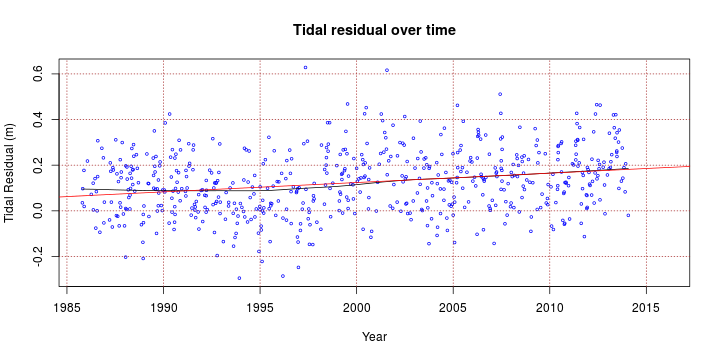
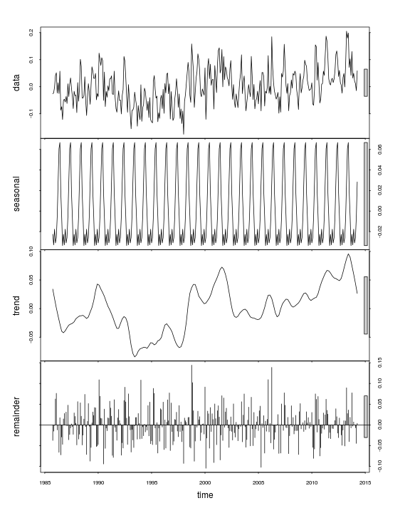
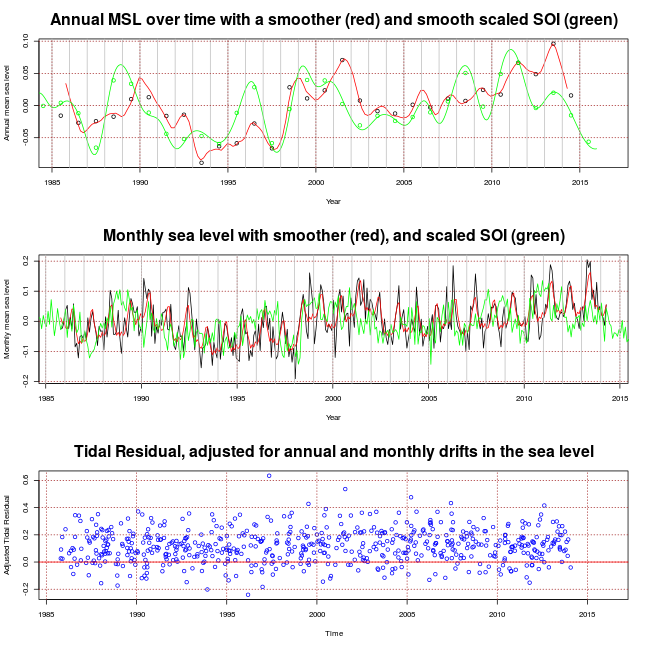

# **Extract storm events and conduct an exploratory data analysis**
-------------------------------------------------------------

*Gareth Davies, Geoscience Australia 2017*

# Introduction
------------------

This document follows on from [preprocess_data.md](preprocess_data.md) in describing
our analysis of storm waves at Old Bar. It illustrates the extraction
of storm wave events from the "Old Bar" time-series created in the earlier script, and 
some preliminary analyses of the data.

It is essential that the earlier script has already been run, and produced an
RDS file - so we check that now with code.

```r
# Check that the pre-requisites exist
if(!file.exists('Rimages/Session_data_processing_clean.Rdata')){
    stop('It appears you have not yet run preprocess_data.Rmd. That must be run before continuing')
}
```

Supposing the above did not generate any errors, and you have R installed,
along with all the packages required to run this code, and a copy of the
*stormwavecluster* git repository, then you should be able to re-run the
analysis here by simply copy-pasting the code. Alternatively, it can be run
with the `knit` command in the *knitr* package: 

```r
library(knitr)
knit('extract_storm_events.Rmd')
```

The basic approach followed here is to:
* **Step 1**: Extract storm events from the "Old Bar" time-series created earlier
* **Step 2**: Compute summary statistics for each storm event
* **Step 3**: Study changes in monthly mean sea level, and remove related trends from our estimated surge.
* **Step 4**: Perform bias correction of the wave directions obtained from stations other than Crowdy Head.
* **Step 5**: Do some exploratory analysis of the data

Later we will develop the statistical analysis of the storm events.

# **Step 1: Extract storm events from the "Old Bar" time-series**
-----------------------------------------------------------------

Here we follow on from the analysis in [preprocess_data.md](preprocess_data.md) by loading
the associated R session.

```r
# This will only work if preprocess_data.md has already been run
load('Rimages/Session_data_processing_clean.Rdata')
```

Now, we extract storm events from the `full_data` time-series. We initially
define storm events as periods in which the significant wave height exceeds its
95th percentile. We also merge storm events which are separated by less than 24
hours.


```r
# Event extraction
hsig_threshold = quantile(full_data$hsig, p=0.95, na.rm=T)
hsig_threshold
```

```
##    95% 
## 2.9235
```

```r
duration_threshold_hours = 0 # Suggest 0 -- remove short events later if needed 
duration_gap_hours = 24 # Must always be >= data time spacing (1 in this case)

# See the routine extract_events in data_utilities.R for details
event_set = DU$extract_events(full_data, 
    hsig_threshold = hsig_threshold,
    duration_threshold_hours = duration_threshold_hours, 
    duration_gap_hours = duration_gap_hours,
    events_to_combine = NULL)
```

**Here we check a few of the properties of the extracted events, and make a plot of one**

```r
# event_set is a list containing the start/end index of each event, and another
# list called 'data' which contains the event data (a separate entry for each
# event)
names(event_set)
```

```
## [1] "start_index" "end_index"   "data"
```

```r
# How many events?
length(event_set$start_index)
```

```
## [1] 678
```

```r
# Start should always be <= end!
stopifnot(all(event_set$start_index <= event_set$end_index))

# How many datasets do we have (should be 1 for each event)
num_events = length(event_set$data)
num_events
```

```
## [1] 678
```

```r
# Plot one event [ change the index to get a good one :) ]
event_example = event_set$data[[floor(num_events*3/4)]]
par(mar=c(3,4.5,1,1)) # Change plot margins, make it look better
DU$plot_single_storm_event(event_example)
```


```r
# Clean up
rm(event_example)
```

**Here we plot the entire full_data time-series, with events overlain.** This
goes to a separate PDF file under FIG, because it is very large.


```r
# Plot will go in this directory
dir.create('FIG', showWarnings=FALSE)

# Function to plot all wave data, with storm events overlain
multi_year_pdf_plot<-function(site, event_data=NULL){

    # Open a pdf file to plot to
    pdf(paste0('FIG/yearly_timeseries_', site, '.pdf'), width=45, height=8)

    # Compute the axis limits for the plot
    max_hsig = max(wd[[site]]$hsig, na.rm=TRUE)
    max_tp1 = max(wd[[site]]$tp1, na.rm=TRUE)

    # Make a one page plot for each year
    for(year in 1985:2016){
        DU$wave_data_single_year_plot(year, site, wd, max_hsig, max_tp1, event_data,
            add_days=TRUE, add_event_start_lines=TRUE)
    }

    dev.off()
}

multi_year_pdf_plot('full_data', event_set$data)
```

```
## png 
##   2
```

# **Step 2: Compute summary statistics for each storm event**
---------------------------------------------------------------

**The statistical analysis of event magnitude / frequency is performed on storm
event summary statistics -- and the latter are defined and extracted in the
following code**. Look at the computational routine in *data_utilities.R* for
more information on the extraction. At the time of writing we extract the
maximum significant wave height (m); TP1 (s) and direction (degrees from North)
at the time of peak significant wave height; the maximum tidal residual (m),
the event duration in hours, and the start time and end time as decimal years
(this is useful for some later analysis). The event summary statistics should
obviously reflect our event definition, which imposes a lower limit on the
duration and significant wave height.

```r
duration_offset_hours = 1.0 # Duration (hrs) for single-point event. Must be <= duration gap hours
stopifnot(duration_offset_hours <= duration_gap_hours)

event_statistics = DU$extract_event_statistics(event_set$data, median_tp1_dir=FALSE, 
    duration_offset_hours=duration_offset_hours)

# Get a basic summary
summary(event_statistics, digits=6)
```

```
##     duration             hsig              tp1               dir         
##  Min.   :  1.0000   Min.   :2.92400   Min.   : 6.2000   Min.   : 30.000  
##  1st Qu.:  4.0000   1st Qu.:3.12475   1st Qu.: 9.7700   1st Qu.:134.000  
##  Median : 16.0000   Median :3.47600   Median :11.1000   Median :160.000  
##  Mean   : 24.4853   Mean   :3.73825   Mean   :11.1191   Mean   :147.649  
##  3rd Qu.: 35.0000   3rd Qu.:4.08925   3rd Qu.:12.2000   3rd Qu.:172.000  
##  Max.   :167.0000   Max.   :7.35000   Max.   :17.1000   Max.   :203.000  
##                                                         NA's   :85       
##    tideResid          startyear          endyear       
##  Min.   :-0.29472   Min.   :1985.80   Min.   :1985.80  
##  1st Qu.: 0.02128   1st Qu.:1992.81   1st Qu.:1992.82  
##  Median : 0.12328   Median :2000.44   Median :2000.44  
##  Mean   : 0.12416   Mean   :2000.81   Mean   :2000.81  
##  3rd Qu.: 0.21603   3rd Qu.:2008.37   3rd Qu.:2008.37  
##  Max.   : 0.62828   Max.   :2016.04   Max.   :2016.04  
##  NA's   :52                                            
##       time                    
##  Min.   :1985-10-20 03:00:00  
##  1st Qu.:1992-10-24 22:30:00  
##  Median :2000-06-09 06:30:00  
##  Mean   :2000-10-22 14:02:49  
##  3rd Qu.:2008-05-14 10:15:00  
##  Max.   :2016-01-15 07:00:00  
## 
```

```r
# Make pairwise scatterplots (ignoring time variables)
DU$nice_pairs(event_statistics[c('duration', 'hsig', 'tp1', 'dir', 'tideResid')])
```


# **Step 3: Study changes in monthly mean sea level, and remove related trends from the estimated surge**
---------------------------------------------------------------------------------------------------------

**At this point, various exploratory analyses were undertaken to understand
non-stationarities and inhomogeneities in the data.** On that basis, we then
went back and removed various sources of non-stationarity/inhomogeneity from
the analysis. Herein, we present these adjustments *before* the exploratory
analysis that motivated them. This presentation may be regarded as confusing --
in general one would explore the data, then determine what adjustments need to
be made, implement them, and then further explore the data to check that it
worked. We present the analysis in this way so as to avoid reporting on two exploratory 
analyses (i.e. before and after the adjustment related to non-stationary sea levels, and
station-specific biases in direction).

**Here we show that the tidal-residual is non-stationary**, with an obvious
increasing trend.

```r
# Tidal residual
scatter.smooth(event_statistics$startyear, event_statistics$tideResid, 
    xlab='Year', ylab='Tidal Residual (m)', col='blue', 
    cex = 0.5, main='Tidal residual over time')

# Fit a linear regression
tidal_resid_vs_startyear = lm(event_statistics$tideResid ~ event_statistics$startyear)
abline(coef(tidal_resid_vs_startyear), col='red')
grid(col='brown')
```



```r
# Look at regression coefficients
summary(tidal_resid_vs_startyear)
```

```
## 
## Call:
## lm(formula = event_statistics$tideResid ~ event_statistics$startyear)
## 
## Residuals:
##      Min       1Q   Median       3Q      Max 
## -0.39340 -0.09537 -0.00124  0.08876  0.51538 
## 
## Coefficients:
##                              Estimate Std. Error t value Pr(>|t|)    
## (Intercept)                -8.1842031  1.3002282  -6.294 5.82e-10 ***
## event_statistics$startyear  0.0041540  0.0006501   6.390 3.25e-10 ***
## ---
## Signif. codes:  0 '***' 0.001 '**' 0.01 '*' 0.05 '.' 0.1 ' ' 1
## 
## Residual standard error: 0.1343 on 624 degrees of freedom
##   (52 observations deleted due to missingness)
## Multiple R-squared:  0.06142,	Adjusted R-squared:  0.05991 
## F-statistic: 40.83 on 1 and 624 DF,  p-value: 3.247e-10
```

```r
# Clean up
rm(tidal_resid_vs_startyear)
```

**The increasing trend in the surge might be reflective of changes in MSL**
(e.g.  due to climate change, among other forcings). To further investigate
this, we study monthly mean sea levels at Tomaree -- with the idea of removing
the long-term and seasonal trends in mean-sea-level from the surge residual we
have just defined.

```r
# Compute annual sea levels
yearly_SL = aggregate(wd$full_data$tide, list(floor(wd$full_data$year)), 
    f<-function(x) mean(x, na.rm=T))

# Also compute shorter time-scale sea levels
monthly_SL = aggregate(wd$full_data$tide, 
    list(month=as.numeric(format(wd$full_data$time, '%m')), 
         year=as.numeric(format(wd$full_data$time, '%Y'))),
    f<-function(x) mean(x, na.rm=TRUE))

monthly_tidal_residual = aggregate(wd$full_data$tideResid, 
    list(month=as.numeric(format(wd$full_data$time, '%m')), 
         year=as.numeric(format(wd$full_data$time, '%Y'))),
    f<-function(x) mean(x, na.rm=TRUE))

# Convert the time of the monthly sea level /residual to decimal year, and
# gap-fill NA values
# Associate the monthly value to the 15th of the month
monthly_SL_year = DU$time_to_year(
    strptime(paste0(monthly_SL$year, '-', monthly_SL$month, '-15 00:00:00'), 
    format='%Y-%m-%d %H:%M:%S', tz='GMT'))
monthly_SL_filled = monthly_SL$x
monthly_tidal_residual_filled = monthly_tidal_residual$x
nan_fix = which(is.nan(monthly_SL_filled)) 

# The missing values of the residual and the monthly SL should be the same
# Confirm they are!
stopifnot(all(nan_fix == which(is.nan(monthly_tidal_residual$x))))

# This will gap fill, assuming no consecutive nan values 
# within the data, which is true for us
monthly_SL_filled[nan_fix] = 0.5 * 
    (monthly_SL_filled[nan_fix - 1] + monthly_SL_filled[nan_fix + 1])
monthly_tidal_residual_filled[nan_fix] = 0.5 * 
    (monthly_tidal_residual_filled[nan_fix - 1] + 
     monthly_tidal_residual_filled[nan_fix + 1])

# Remove trailing nan
nan_fix = which(is.nan(monthly_SL_filled)) 
monthly_SL_filled = monthly_SL_filled[-nan_fix]
monthly_SL_year = monthly_SL_year[-nan_fix]
monthly_tidal_residual_filled = monthly_tidal_residual_filled[-nan_fix]

#
plot(monthly_SL_year, monthly_SL_filled, t='l')
points(monthly_SL_year, monthly_tidal_residual_filled, t='l', col='red')
legend('topleft', c('Monthly sea level', 'Monthly tidal residual'), 
    col=c('black', 'red'), lty=c(1,1), pch=c(NA, NA))
```


The above figure suggests significant non-stationarities in the monthly mean
sea level.

**Here we apply the STL method to model non-stationarities in the monthly tidal
residual series** (Cleveland et al 1990). We decompose it into an seasonal
periodic component and an annual trend. This is later used to correct the
derived non-astronimical tidal surge, so that the latter becomes more obviously
related to the storm related surge component.

```r
# Make a seasonal timeseries. 
monthly_tidal_residual_filled_ts = ts(monthly_tidal_residual_filled, 
    start=c(1985, 10), frequency=12)
# Stl smoothing
monthly_tidal_residual_filled_stl = stl(monthly_tidal_residual_filled_ts, 
    s.window='periodic')
plot(monthly_tidal_residual_filled_stl)
```



```r
## Convert to function
smooth_tideResid_fun_stl = approxfun(monthly_SL_year, 
    rowSums(monthly_tidal_residual_filled_stl$time.series[,1:2]),
    rule=2)

# For convenience later, we also keep separate annual and monthly functions
smooth_tideResid_fun_stl_annual = approxfun(monthly_SL_year, 
    monthly_tidal_residual_filled_stl$time.series[,2],
    rule=2)
smooth_tideResid_fun_stl_monthly = approxfun(monthly_SL_year, 
    monthly_tidal_residual_filled_stl$time.series[,1],
    rule=2)
```

Here we investigate relationships between MSL and annual mean SOI, as well as
long-term MSL changes. To enable further analyses we read climate variables,
computing various averages, and appending them to the event statistics to
support later analysis.

```r
# Get climate index info, along with a smoothed soi with df ~= number of years
CI = DU$read_climate_indices(
    soi_file = '../../Data/Climate_Indices/ENSO/SOI_BOM.txt',
    aao_file = '../../Data/Climate_Indices/AAO/AAO.txt')
CI_annual = lapply(CI, 
    f<-function(x) aggregate(x[,2], list(year=as.numeric(format(x[,1], '%Y'))), mean ))
CI_annual_fun = lapply(CI_annual, 
    f<-function(x) approxfun(x[,1], x[,2], method='constant') )

# In the table, soiA = annual mean soi, aaoA = annual mean aao, etc
for(nm in names(CI_annual_fun)){
    es_name = paste0(nm, 'A')
    event_statistics[[es_name]] = CI_annual_fun[[nm]](floor(event_statistics$startyear))
}
soi_time = DU$time_to_year(CI$soi$time)
soi_fun = approxfun(soi_time, CI$soi$index)
soi_NA = which(is.na(CI$soi$index))
if(length(soi_NA) > 0){
    smooth_soi = smooth.spline(soi_time[-soi_NA], CI$soi$index[-soi_NA], 
        df = diff(range(soi_time[-soi_NA])))
}else{
    smooth_soi = smooth.spline(soi_time[], CI$soi$index[], 
        df = diff(range(soi_time[])))
}
```

**Question: Is annual averaged SOI related to annual averaged sea level?**

```r
# Is annual average SOI related to annual average sea level?
# This is suggested in White et al (2014)
yearly_soi = CI_annual$soi
mm = match(yearly_SL[,1], yearly_soi[,1])
cor.test(yearly_SL[,2], yearly_soi[mm,2])
```

```
## 
## 	Pearson's product-moment correlation
## 
## data:  yearly_SL[, 2] and yearly_soi[mm, 2]
## t = 3.5398, df = 28, p-value = 0.001421
## alternative hypothesis: true correlation is not equal to 0
## 95 percent confidence interval:
##  0.2447792 0.7633700
## sample estimates:
##       cor 
## 0.5560154
```

**Question: How does the correlation between MSL and mean annual SOI change if
we assume recent sea level rise ~ 1.8mm/year (White et al., 2014)?**

```r
#  Not much change compared to the result above
cor.test(yearly_SL[,2] - 0.0018*(yearly_SL[,1] - 1985), yearly_soi[mm,2])
```

```
## 
## 	Pearson's product-moment correlation
## 
## data:  yearly_SL[, 2] - 0.0018 * (yearly_SL[, 1] - 1985) and yearly_soi[mm, 2]
## t = 3.1215, df = 28, p-value = 0.00415
## alternative hypothesis: true correlation is not equal to 0
## 95 percent confidence interval:
##  0.1809481 0.7340038
## sample estimates:
##       cor 
## 0.5080946
```

```r
# Here we make a simple linear regression of MSL, related to SOI and time
soi_SL_yearly = data.frame(soiA=yearly_soi[mm,2], sl=yearly_SL[,2], year = yearly_soi[mm,1])
soi_SL_lm = lm(sl ~ soiA + year, data=soi_SL_yearly)
summary(soi_SL_lm)
```

```
## 
## Call:
## lm(formula = sl ~ soiA + year, data = soi_SL_yearly)
## 
## Residuals:
##      Min       1Q   Median       3Q      Max 
## -0.05575 -0.01350 -0.00035  0.01834  0.06478 
## 
## Coefficients:
##               Estimate Std. Error t value Pr(>|t|)   
## (Intercept) -4.0788748  1.3430789  -3.037  0.00525 **
## soiA         0.0022952  0.0008273   2.774  0.00991 **
## year         0.0020409  0.0006716   3.039  0.00522 **
## ---
## Signif. codes:  0 '***' 0.001 '**' 0.01 '*' 0.05 '.' 0.1 ' ' 1
## 
## Residual standard error: 0.02999 on 27 degrees of freedom
##   (2 observations deleted due to missingness)
## Multiple R-squared:  0.4852,	Adjusted R-squared:  0.4471 
## F-statistic: 12.72 on 2 and 27 DF,  p-value: 0.0001279
```

Below we make some plots of the sea level information, and the tidal residual
after monthly SL residuals are removed. **The definition of the tidal residual
is changed in the following code** to remove the component related to
inter-annual and seasonal mean sea level. The idea is that A) the adjusted
tidal residual should more strongly reflect storm type processes. Further, B)
we can still model the influence of seasons and SOI/sea-level-rise on MSL, and
integrate that into our analysis, so nothing is lost by this modelling approach. 

```r
# Plot MSL over time, with SOI
par(mfrow=c(3,1))
plot(yearly_SL[,1]+0.5, yearly_SL[,2], xlab = 'Year', ylab='Annual mean sea level',
    main='Annual MSL over time with a smoother (red) and smooth scaled SOI (green)')
points(monthly_SL_year, smooth_tideResid_fun_stl_annual(monthly_SL_year), t='l', col='red')
points(smooth_soi$x, smooth_soi$y/200, t='l', col='green')
points(yearly_soi[,1]+0.5, yearly_soi[,2]/200, col='green')
abline(v=1985:2015, col='grey')
grid(col='brown')

plot(monthly_SL_year, monthly_SL_filled, t='l', 
    xlab='Year', ylab='Monthly mean sea level',
    main='Monthly sea level with smoother (red), and scaled SOI (green)')
points(monthly_SL_year, smooth_tideResid_fun_stl(monthly_SL_year), 
    col='red', t='l')
points(DU$time_to_year(CI$soi$time), CI$soi$index/200, t='l', 
    col='green')
grid(col='brown')
abline(v=1985:2016, col='grey')


# Use the STL decomposition to adjust the tidal residuals
SL_adjustment_events = smooth_tideResid_fun_stl(event_statistics$startyear)

#
# REMOVE THE MSL COMPONENT FROM THE EVENT STATISTICS
#
event_statistics$tideResid = event_statistics$tideResid - SL_adjustment_events
# Append msl to the event_statistics table
event_statistics$msl = SL_adjustment_events

# Add in a plot of the NEW tidal residual
plot(event_statistics$startyear, event_statistics$tideResid, col='blue',
    xlab='Time', ylab='Adjusted Tidal Residual', 
    main='Tidal Residual, adjusted for annual and monthly drifts in the sea level')
grid(col='brown'); abline(h=0, col='red')
```



```r
# But there is still a small increasing trend?? Possible, but borderline.
cor.test(event_statistics$startyear, event_statistics$tideResid, method='s')
```

```
## 
## 	Spearman's rank correlation rho
## 
## data:  event_statistics$startyear and event_statistics$tideResid
## S = 37520000, p-value = 0.03953
## alternative hypothesis: true rho is not equal to 0
## sample estimates:
##        rho 
## 0.08231296
```

```r
summary(lm(event_statistics$tideResid ~ event_statistics$startyear))
```

```
## 
## Call:
## lm(formula = event_statistics$tideResid ~ event_statistics$startyear)
## 
## Residuals:
##      Min       1Q   Median       3Q      Max 
## -0.31266 -0.07747 -0.00072  0.07336  0.51964 
## 
## Coefficients:
##                              Estimate Std. Error t value Pr(>|t|)  
## (Intercept)                -2.1126736  1.1566465  -1.827   0.0682 .
## event_statistics$startyear  0.0011153  0.0005783   1.929   0.0542 .
## ---
## Signif. codes:  0 '***' 0.001 '**' 0.01 '*' 0.05 '.' 0.1 ' ' 1
## 
## Residual standard error: 0.1195 on 624 degrees of freedom
##   (52 observations deleted due to missingness)
## Multiple R-squared:  0.005926,	Adjusted R-squared:  0.004332 
## F-statistic:  3.72 on 1 and 624 DF,  p-value: 0.05423
```

```r
# What about an soiA relation? Seems to have been convincingly removed.
cor.test(event_statistics$soiA, event_statistics$tideResid, method='s')
```

```
## Warning in cor.test.default(event_statistics$soiA, event_statistics
## $tideResid, : Cannot compute exact p-value with ties
```

```
## 
## 	Spearman's rank correlation rho
## 
## data:  event_statistics$soiA and event_statistics$tideResid
## S = 39786000, p-value = 0.5017
## alternative hypothesis: true rho is not equal to 0
## sample estimates:
##        rho 
## 0.02689707
```

```r
summary(lm(event_statistics$tideResid ~ event_statistics$soiA))
```

```
## 
## Call:
## lm(formula = event_statistics$tideResid ~ event_statistics$soiA)
## 
## Residuals:
##      Min       1Q   Median       3Q      Max 
## -0.32033 -0.07696  0.00125  0.07179  0.51559 
## 
## Coefficients:
##                         Estimate Std. Error t value Pr(>|t|)    
## (Intercept)            0.1180199  0.0047925  24.626   <2e-16 ***
## event_statistics$soiA -0.0000900  0.0006453  -0.139    0.889    
## ---
## Signif. codes:  0 '***' 0.001 '**' 0.01 '*' 0.05 '.' 0.1 ' ' 1
## 
## Residual standard error: 0.1198 on 624 degrees of freedom
##   (52 observations deleted due to missingness)
## Multiple R-squared:  3.117e-05,	Adjusted R-squared:  -0.001571 
## F-statistic: 0.01945 on 1 and 624 DF,  p-value: 0.8891
```
