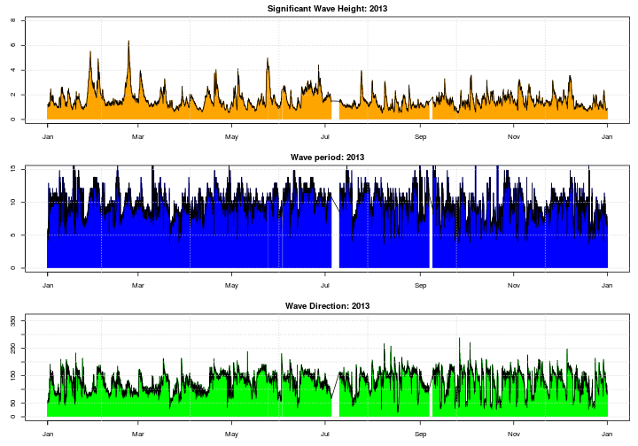
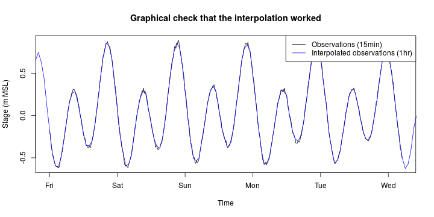

# **Parsing of storm wave and tidal data, and conversion to a single time-series**
---------------------------------------------------------------------------------

*Gareth Davies, Geoscience Australia 2017*

# Introduction
------------------

This document illustrates the parsing of storm wave and tide data for our study
of storm wave statistics near the coastal town of Old Bar, NSW. It was
generated from the file [preprocess_data.Rmd](preprocess_data.Rmd), using the
literate programming R package *knitr*. 

If you have R installed, along with all the packages required to run this code,
and a copy of the *stormwavecluster* git repository, then you should be able to
re-run the analysis here by simply copy-pasting the code.

Alternatively, it can be run with the `knit` command in the *knitr* package: 

```r
library(knitr)
knit('preprocess_data.Rmd')
```

To run the code in tie-breaking mode, be sure to pass the a command-line
argument matching `break_ties` to R when starting, followed by an integer ID > 0,
e.g.

    R --args --break_ties 1234

or

    Rscript script_name_here.R --break_ties 1234

Running the above commands many times is facilitated by scripts in
[../preprocessing_perturbed_data](../preprocessing_perturbed_data)

The basic approach followed here is to:
* **Step 1:** Parse relevant wave time-series data at a number of sites (all near-ish to the coastal town Old Bar, which was the site of interest for our study), and convert them to a single time-series representing waves at Old Bar. 
* **Step 2:** Parse tidal observations, and astronomical tidal predictions, for a site near Old Bar, and interpolate these onto the previous time-series.

In later parts of this analysis we will extract storm summary statistics from
the provided time-series, and statistically model their properties. 

# **Step 0: Store a variable which determines whether we randomly perturb the data by the expected measurement error**
----------------------------------------------------------------------------------------------------------------------

A reader may wish to skip this section, unless needing to understand how
to run the code with data perturbation.

*Background:* If data is measured and/or stored to limited precision, then
artifical ties (repeated data values) may occur even if the variable is
genuinely continuous.  Ties can be a problem, since they introduce ambiguity in
the definition of data ranks, and may cause issues for some statistical
procedures. Hence, much literature suggests breaking ties by randomly
perturbing the data prior to analysis. This implies that the analysis must be
re-ran many times with different random tie-breaks, to ensure the results are
robust to the perturbation. The following code facilitates us automating that
process.

Before starting the main analysis, here we check whether R was started with a
command line argument which matches `break_ties`. We will make use of this
information from time-to-time throughout the analysis. 


```r
# Optionally remove ties in the event statistics by jittering.
# To do this, a commandline argument matching 'break_ties' must
# have been passed to R before running. Otherwise no jittering is applied. 
# We design this way to facilitate running many random jobs with scripts, using
# the same code.
if( length(grep('break_ties', commandArgs(trailingOnly=TRUE))) > 0){
    # Apply jittering
    break_ties_with_jitter = TRUE
    # Get the ID for this run
    session_n = as.numeric(commandArgs(trailingOnly=TRUE)[2])

    if(session_n < 1) stop('Invalid tie-breaking ID value')

}else{
    # No jittering -- use the raw data
    break_ties_with_jitter = FALSE

    # A dummy id for the run with no data perturbation
    session_n = 0

}

# Make a 'title' which can appear in filenames to identify this run
run_title_id = paste0(break_ties_with_jitter, '_', session_n)

print(c('run_title_id: ', run_title_id))
```

```
## [1] "run_title_id: " "FALSE_0"
```


# **Step 1: Parse the wave time-series data**
--------------------------------------------

# *Parse the measured wave time-series at Crowdy Head, Coffs Harbour and Sydney*
------------------------------------------------------------------------------------------

Here we parse measured wave time-series from Crowdy Head (since that is near
Old Bar, our primary site of interest). We also parse similar data measured at
Coffs Harbour and Sydney, for the purposes of filling gaps in the Crowdy Head
observations. 

**Below we source a script 'data_utilities.R'**, containing functions for various
parts of this analysis (for example: reading the wave data files; making plots
of the wave data; gap filling wave data). To see details of the latter steps, consult
the script. We put all the functions in 'data_utilities.R' into an enviroment
named `DU`. By using an environment, we avoid the possibility of accidentally
over-writing variables inside 'data_utilities.R'. 

```r
DU = new.env() # Make a new environment
source('../preprocessing/data_utilities.R', local=DU)  # Put the data_utilities.R functions in DU
```

Wave data for Crowdy Head, Coffs Harbour and Sydney was kindly provided by
Manly Hydraulics Laboratory for this study. It is included in this repository.
**Below we read wave data measured from 1985-2014.**

```r
mhl_wave_dir = '../../Data/NSW_Waves/'

# There are zipped csv files for each site, for the data from 1985-2014
mhl_wave_files = Sys.glob(paste0(mhl_wave_dir, '*1985*.csv.zip'))
mhl_wave_files
```

```
## [1] "../../Data/NSW_Waves/COFHOW 10-10-1985 to 1-11-2014.csv.zip"
## [2] "../../Data/NSW_Waves/CRHDOW 10-10-1985 to 1-11-2014.csv.zip"
## [3] "../../Data/NSW_Waves/SYDDOW 10-10-1985 to 1-11-2014.csv.zip"
```

```r
# Make a short name for each site
mhl_wave_sites = substr(basename(mhl_wave_files), 1, 4)
mhl_wave_sites
```

```
## [1] "COFH" "CRHD" "SYDD"
```

```r
# Read the data
# wd = "wave data"
wd = DU$parse_MHL_wave_buoy_data(mhl_wave_sites, mhl_wave_files)
```

Next, we append data from 2015 to the above 1985-2014 data. We also read data
from another Sydney station which includes hindcast wave directions (based on
meteorological charts).

**Append the more recent wave data to `wd`**

```r
# Update: In early 2016 we received updated wave-buoy data
#
# Append the updated MHL wave buoy data
mhl_wave_files = Sys.glob(paste0(mhl_wave_dir, '*2016*.csv.zip'))
mhl_wave_sites = substr(basename(mhl_wave_files), 1, 4)
wd_update = DU$parse_MHL_wave_buoy_data(mhl_wave_sites, mhl_wave_files)

for(nm in names(wd)){
    matchInds = match(wd_update[[nm]]$time, wd[[nm]]$time)

    ## Lots of checks here

    # From graphical checks the overlapping data seems identical
    # So matchInds should be a sequence of consecutive integers, followed
    # by a sequence of NA's
    stopifnot( (max(which(!is.na(matchInds))) + 1) == min(which(is.na(matchInds))) )
    stopifnot( max(diff(matchInds), na.rm=TRUE)  == 1)
    stopifnot( min(diff(matchInds), na.rm=TRUE)  == 1)

    # Ensure names and overlapping data are identical
    stopifnot(all(names(wd_update[[nm]]) == names(wd[[nm]])))
    for(varname in names(wd_update[[nm]])){
        stopifnot(
            all(range(wd_update[[nm]][[varname]] - wd[[nm]][[varname]][matchInds], 
                    na.rm=TRUE) == 
                c(0, 0))
            )
    }

    # If all those tests have passed, we can update the data with an rbind 
    ll = matchInds[1] - 1
    wd[[nm]] = rbind(wd[[nm]][1:ll,], wd_update[[nm]])
}


# Get the other sydney data. It's in a different format, so we parse it here,
# and append it to the 'wd' list

syd1 = read.table(
    unz(description = paste0(mhl_wave_dir, 'SYDNOW 17-7-1987 to 4-10-2000.csv.zip'), 
        filename = 'SYDNOW 17-7-1987 to 4-10-2000.csv'),
    skip=7, header=TRUE, sep=",")

# Add a time variable
syd1$time = strptime(syd1$Date.Time, format='%d-%B-%Y %H:%M', tz='Etc/GMT-10')
# Add names to data.frame
names(syd1) = c('datetime', 'hsig', 'hmax', 'tz', 'tsig', 'tp1', 'dir', 'time')
# Add a year variable
syd1$year = DU$time_to_year(syd1$time)
# Append to 'wd' list under the name 'SYDL'
wd$SYDL = syd1
```

As a result of the above operations, we have a list `wd` containing data.frames
for each station. The station names and data dimensions are:

```r
# Station names
names(wd)
```

```
## [1] "COFH" "CRHD" "SYDD" "SYDL"
```

```r
# Number of rows/columns for each station
lapply(wd, dim)
```

```
## $COFH
## [1] 229880      7
## 
## $CRHD
## [1] 229983      7
## 
## $SYDD
## [1] 174953      7
## 
## $SYDL
## [1] 107378      9
```
The data format looks like this (using the example of Crowdy Head):

```r
wd$CRHD[1:10,]
```

```
##                   time  hsig  hmax  tz tp1 dir     year
## 1  1985-10-10 08:00:00 0.953 1.723 5.8 9.5  NA 1985.774
## 2  1985-10-10 09:00:00 0.827 1.422 5.8 9.5  NA 1985.774
## 3  1985-10-10 10:00:00 0.913 1.657 6.5 9.5  NA 1985.774
## 4  1985-10-10 11:00:00 0.895 1.513 6.2 9.5  NA 1985.774
## 5  1985-10-10 12:00:00 0.911 1.561 6.3 8.2  NA 1985.774
## 6  1985-10-10 13:00:00 1.051 1.764 6.7 8.2  NA 1985.774
## 7  1985-10-10 14:00:00 0.863 1.493 6.0 8.8  NA 1985.774
## 8  1985-10-10 15:00:00 0.951 1.852 6.5 8.8  NA 1985.774
## 9  1985-10-10 16:00:00 0.926 1.459 5.8 9.5  NA 1985.774
## 10 1985-10-10 17:00:00 0.968 1.816 5.7 8.8  NA 1985.775
```
The data for the SYDL station actually has a few more columns. That does not
affect the analysis so long as it also contains columns with the same names and
data as observed at the other stations.

```r
wd$SYDL[1:10,]
```

```
##             datetime  hsig  hmax  tz tsig  tp1 dir                time
## 1  17-JUL-1987 13:00 1.001 2.185 5.1  9.0 11.1 123 1987-07-17 13:00:00
## 2  17-JUL-1987 14:00 1.063 1.982 5.9 10.0 11.1 123 1987-07-17 14:00:00
## 3  17-JUL-1987 15:00 0.994 1.762 6.3 10.4 11.1 122 1987-07-17 15:00:00
## 4  17-JUL-1987 16:00 0.912 1.736 5.8  9.7 11.1 122 1987-07-17 16:00:00
## 5  17-JUL-1987 17:00 0.915 1.721 5.6  9.8 11.1 121 1987-07-17 17:00:00
## 6  17-JUL-1987 18:00 0.910 1.767 5.8  9.9 10.2 121 1987-07-17 18:00:00
## 7  17-JUL-1987 19:00 0.844 1.701 5.7 10.0 10.2 120 1987-07-17 19:00:00
## 8  17-JUL-1987 20:00 0.869 1.710 5.9 10.0 11.1 120 1987-07-17 20:00:00
## 9  17-JUL-1987 21:00 0.945 1.703 5.7 10.0 11.1 119 1987-07-17 21:00:00
## 10 17-JUL-1987 22:00 1.031 1.970 5.8  9.9 11.1 119 1987-07-17 22:00:00
##        year
## 1  1987.541
## 2  1987.541
## 3  1987.541
## 4  1987.542
## 5  1987.542
## 6  1987.542
## 7  1987.542
## 8  1987.542
## 9  1987.542
## 10 1987.542
```

The data_utilities.R script includes a function to plot the station data.
Here's an example. Note there are gaps in the data, which will be filled at
a later stage of the analysis.

```r
# Plot 2013 for Crowdy head
DU$wave_data_single_year_plot(year=2013, site='CRHD', wd=wd, max_hsig=8, max_tp1=15)
```



# *Convert the wave observations to a single 'Old Bar' time-series*
----------------------------------------------------------------------

Here we create a 'gap-filled' wave time-series which we will treat as
representative of wave conditions at Old Bar. The time-series consists of wave
properties measured in about 80m water depth, and tidal time-series measured
near the coast. 

Because Crowdy Head is much closer to Old Bar than the other wave measuring
sites, it is natural to take measurements at Crowdy Head as a 'first
preference' representation of waves at Old Bar. When Crowdy Head data was
missing, we decided to gap-fill preferentially with data from Coffs Harbour. If
the latter were missing, we used Sydney observations, firstly from the `SYDD` site
(the directional wave-rider buoy, measured since 1992), and secondly from the
`SYDL` site (the long-reef wave-rider measurements complemented with hind-cast
wave-directional data). 

These preferences were justified by comparison of observed wave height and
direction at the gap-filling stations with those from Crowdy Head during
high-wave events. A few plots comparing wave heights and directions are shown
below. 

**Compare wave directions during storms @ Crowdy Head with other stations, in 2013**

```r
# Compare wave directions in a year, when waves at Crowdy Head exceed hsig_thresh
hsig_thresh = 2.9
year2compare = 2013

# We have put most of the comparison in a data_utilities.R function, for simplicity.
par(mfrow=c(1,2))
DU$check_station_correlations(year2compare, 'CRHD', 'SYDD', wd, 'dir', 
    site1_restriction = (wd$CRHD$hsig > hsig_thresh))
```

```
## [1] 0.8254451
```

```r
title(main='Wave direction at Crowdy Head vs Sydney', line=0.5)
DU$check_station_correlations(year2compare, 'CRHD', 'COFH', wd, 'dir', 
    site1_restriction = (wd$CRHD$hsig > hsig_thresh))
```

```
## [1] 0.899565
```

```r
title(main='Wave direction at Crowdy Head vs Coffs Harbour', line=0.5)
```


```r
# Note -- we do not have SYDL direction data from this year
```

**Compare significant wave height during storms @ Crowdy Head with other stations, in 2013**

```r
# Still using the same hsig_thresh and year2compare
par(mfrow=c(2,2))
DU$check_station_correlations(year2compare, 'CRHD', 'SYDD', wd, 'hsig',
    site1_restriction = (wd$CRHD$hsig > hsig_thresh))
```

```
## [1] 0.3872359
```

```r
title(main=bquote(H[sig] ~ 'at Crowdy Head vs Sydney'), line=0.5)
DU$check_station_correlations(year2compare, 'CRHD', 'COFH', wd, 'hsig',
    site1_restriction = (wd$CRHD$hsig > hsig_thresh))
```

```
## [1] 0.6368558
```

```r
title(main=bquote(H[sig] ~ 'at Crowdy Head vs Coffs Harbour'), line=0.5)
DU$check_station_correlations(1990, 'CRHD', 'SYDL', wd, 'hsig',
    site1_restriction = (wd$CRHD$hsig > hsig_thresh))
```

```
## [1] 0.3298255
```

```r
title(main=bquote(H[sig] ~ 'at Crowdy Head vs Long Reef'), line=0.5)
```


**Make the gap-filled wave data. It is stored in a variable named `full_data`**

```r
# Get times to interpolate at
len_crhd = length(wd$CRHD$time)
desired_times = seq(wd$CRHD$time[1], wd$CRHD$time[len_crhd], by='hour')

# Get the interpolated 'full' data
# Note that for gaps < 4 hours (i.e. 1, 2, or 3 hours), we fill with 
# interpolation in preference to gap filling from another site, since
# generally interpolation is preferable over 'short' gaps
site_preference_order = c('CRHD', 'COFH', 'SYDD', 'SYDL')
full_data = DU$gap_fill_wave_data(desired_times, site_preference_order, wd,
    use_interpolation_for_gaps_less_than = 4)
head(full_data)
```

```
##                  time  hsig  hmax  tz tp1 dir     year waves_site dir_site
## 1 1985-10-10 08:00:00 0.953 1.723 5.8 9.5  NA 1985.774       CRHD     SYDL
## 2 1985-10-10 09:00:00 0.827 1.422 5.8 9.5  NA 1985.774       CRHD     SYDL
## 3 1985-10-10 10:00:00 0.913 1.657 6.5 9.5  NA 1985.774       CRHD     SYDL
## 4 1985-10-10 11:00:00 0.895 1.513 6.2 9.5  NA 1985.774       CRHD     SYDL
## 5 1985-10-10 12:00:00 0.911 1.561 6.3 8.2  NA 1985.774       CRHD     SYDL
## 6 1985-10-10 13:00:00 1.051 1.764 6.7 8.2  NA 1985.774       CRHD     SYDL
```

```r
tail(full_data)
```

```
##                       time  hsig hmax   tz  tp1 dir     year waves_site
## 265692 2016-01-31 19:00:00 0.970 2.07 5.09 9.77  98 2016.084       CRHD
## 265693 2016-01-31 20:00:00 0.899 1.72 5.02 8.17  84 2016.084       CRHD
## 265694 2016-01-31 21:00:00 0.936 1.73 5.24 8.52  89 2016.084       CRHD
## 265695 2016-01-31 22:00:00 1.008 1.75 4.99 9.32  95 2016.084       CRHD
## 265696 2016-01-31 23:00:00 0.981 1.76 5.14 9.77  94 2016.085       CRHD
## 265697 2016-02-01 00:00:00 0.946 1.77 5.21 8.17  71 2016.085       CRHD
##        dir_site
## 265692     CRHD
## 265693     CRHD
## 265694     CRHD
## 265695     CRHD
## 265696     CRHD
## 265697     CRHD
```

**Optionally perturb the gap-filled wave data.** This is used to break ties,
and check the sensitivity of our results to expected sampling error in the `hsig`
measurement. To determine the right perturbation size, note that our `hsig`
data is based on waverider buoy measurements. According to Manly Hydraulics
Laboratory
(http://new.mhl.nsw.gov.au/data/realtime/wave/AnalysisAndStatistics), the buoys
normally do a 34 minute burst of measurement on the hour, providing 0.5s data
over this time-period. Supposing the wave period is on the order of 11s (which
is the median tp1 for our storm events), we would then expect the buoy to
measure about 34 * 60 / 11 = 185 waves each hour.  The mean height of the top
third of these would be used to compute `hsig` from the buoy data (about 185/3
= 62 waves). If the waves have a Rayleigh distribution, then it can be shown
that even under constant wave conditions, we expect repeated `hsig`
measurements to be normally distributed with a standard deviation of around
`0.039 * hsig`. For justification of the last point, see computations in
[../preprocessing/rayleigh_sd.R](../preprocessing/rayleigh_sd.R). We do not
expect this result to be exact, but it gives a reasonable scale for the
perturbation.

```r
if(break_ties_with_jitter){
    print('Perturbing wave heights based on estimated sampling error of measurements')

    print('Before:')
    print(summary(full_data$hsig))

    # Perturb hsig by a normally distributed amount, with standard deviation
    # proportional to hsig
    full_data$hsig = full_data$hsig * (1 + rnorm(length(full_data$hsig))*0.039)

    print('After:')
    print(summary(full_data$hsig))
}

# Append the 'full_data' to wd, and plot it
wd$full_data = full_data
```

**How much does each station contribute to the gap-filled wave data?**

The following plots show that most wave directions in `full_data` originate
from Crowdy Head, whereas most wave directions originate from the Sydney
waverider buoy. This is inevitable, because wave direction was only measured at
Crowdy Head and Coffs Harbour after ~ 2011, while measurements have been taken at
Sydney since 1992.

```r
par(mfrow=c(1,2))
pie(table(full_data$waves_site), main='Source of wave data in Old Bar wave series')
pie(table(full_data$dir_site), main='Source of direction data in Old Bar wave series')
```


# **Step 2: Parse the tidal time-series data, and use astronomical tidal predictions to estimate the non-astronomical tidal residual**
--------------------------------------------------------------------------------------------------------------------------------------

The nearest tidal record to Old Bar is at Tomaree, Port Stephens. (Actually some
closer records do exist, but they were strongly affected by local seiching and
so judged unsuitable for representing regional conditions).

**Read the tomaree tidal data**

```r
tomaree_gauge_data = '../../Data/NSW_Tides/TomareePW.csv.zip'
tidal_obs = DU$read_MHL_csv_tide_gauge(tomaree_gauge_data)

if(break_ties_with_jitter){
    print('Perturbing tidal measurements by 1/2 cm')

    print('Before:')
    print(summary(tidal_obs$tide))

    # Do the perturbation
    tidal_obs$tide = jitter(tidal_obs$tide, amount=0.005)

    print('After:')
    print(summary(tidal_obs$tide))

}

head(tidal_obs)
```

```
##                  time julian_time tide  status
## 1 1985-09-23 00:00:00    5744.000   NA missing
## 2 1985-09-23 00:15:00    5744.010   NA missing
## 3 1985-09-23 00:30:00    5744.021   NA missing
## 4 1985-09-23 00:45:00    5744.031   NA missing
## 5 1985-09-23 01:00:00    5744.042   NA missing
## 6 1985-09-23 01:15:00    5744.052   NA missing
```

```r
plot(tidal_obs$time, tidal_obs$tide, t='l', main='Tomaree tidal measurements')
```


The above figure shows there are some gaps in the data.

**Get astronomical tidal predictions**. Next we get astronomical tidal
predictions for the same area, in order to estimate the astronomical tidal
residual. This makes use of our R interface to the TPXO7.2 tidal prediction
model, which turns out to work quite well along the NSW coast. 

```r
# Use this variable to switch on/off use of TPXO72 interface. If it is not installed,
# we read the results I stored earlier. 
# Basically this is just a work-around for various installation problems that
# people might have (since tpxo72 is only tested on unix).
assume_tpxo72_is_installed = FALSE

if(assume_tpxo72_is_installed){
    # Get the R interface to TPXO72 -- note the 'chdir=TRUE' is important
    TPXO72 = new.env()
    source('../../R/tpxo7.2/BASIC_R_INTERFACE/predict_tide.R',
        chdir=TRUE, local=TPXO72)

    # Let's get the data near Tomaree for comparison -- this would be changed to
    # Old Bar for the final analysis -- but using Tomaree let's us compare with the
    # data, and check everything is ok

    site_name = 'tomaree' # This is just for convenience

    # Decimal degrees input.
    # Long,+152:10:56.06,,
    # Lat,-32:42:53.57,,
    site_coordinates = c(152 + 10/60 + 56.06/(60*60), -(32 + 42/60 + 53.57/(60*60)))

    # Set the output start-time and end-time (which can be in the past or future)
    #
    # NOTE: The start-time and end-time are in timezone 'Etc/GMT-10' according to
    # R's timezone database, which is the Sydney time-zone without daylight
    # savings (Beware: 'Etc/GMT-10' is what most people think of as 'GMT+10'). 
    #
    # This is because the tidal_obs$time vector is in that timezone (see the
    # function that created tidal_obs)
    #
    # It is important that the start_time / end_time specified have
    # the correct timezone -- since the tidal_prediction interface code converts
    # these times to GMT for TPXO72, and then reports back in the input timezone.
    #
    start_time = tidal_obs$time[1]
    end_time = tidal_obs$time[ length(tidal_obs$time) ]

    # For the time interval, I think choices like '2 hour' or '30 sec' or '5 days'
    # would be accepted as well.
    time_interval = '15 min' 

    # Use the R interface to get the tidal prediction
    tidal_pred = TPXO72$get_tidal_prediction(site_name, site_coordinates, 
        start_time, end_time, time_interval)

    #saveRDS(tidal_pred, '../../Data/NSW_Tides/tomaree_predictions.RDS')
}else{
    tidal_pred = readRDS('../../Data/NSW_Tides/tomaree_predictions.RDS')
}

head(tidal_pred)
```

```
##                  time   tide
## 1 1985-09-23 00:00:00 -0.264
## 2 1985-09-23 00:15:00 -0.221
## 3 1985-09-23 00:30:00 -0.178
## 4 1985-09-23 00:45:00 -0.135
## 5 1985-09-23 01:00:00 -0.092
## 6 1985-09-23 01:15:00 -0.051
```

**Compare astronomical predictions and measurements around June-September
2007**.  To check that the astronomical tidal predictions are reasonable, we
compare them with data during June-September 2007. We note a large storm
occurred in early June in this area (the Pasha-Bulker floods), which is
reflected in an increase in the computed tidal residual at this time (peaking
around 0.5 m, see figure below). In general, the tidal residual drifts around
zero in the figure, reflecting changes in atmospheric pressure and
oceanographic conditions, as well as smaller short-term errors in the tidal
prediction model. The residual is generally positive in the early part of the
figure (before mid July), and inspection of the data reveals this was a period
with numerous significant storm wave events. The agreement between the
astronomical model and observations is improved in the latter half of the
observational series, consistent with observations which suggest fewer storm
waves in this time.  However, it is worth noting that the tidal residual on
this coast is not purely related to storm wave activity, but also e.g. shelf
waves and seasonal factors, which have different origins.

```r
# Plot June-September 2007 (Pasha-Bulker floods were in early June)
inds = which( (format(tidal_obs$time, '%Y')=='2007') &
              (format(tidal_obs$time, '%m')%in%c('06', '07', '08', '09')) )
mean_tidal_obs = mean(tidal_obs$tide, na.rm=TRUE)

# Compute the tidal residual. For these datasets the predicted and observed
# times should be identical -- so here we test that this is true, then subtract
# the 2 levels. Interpolation is required in the general case
stopifnot(all(tidal_obs$time == tidal_pred$time))
tidal_residual = (tidal_obs$tide - tidal_pred$tide) - mean_tidal_obs

# Summarise the tidal residual distribution
summary(tidal_residual)
```

```
##    Min. 1st Qu.  Median    Mean 3rd Qu.    Max.    NA's 
##  -0.443  -0.077  -0.005   0.000   0.071   0.759   30347
```

```r
plot(tidal_obs$time[inds], tidal_obs$tide[inds] - mean_tidal_obs, t='l',
    xlab='Time', ylab='Stage (m MSL)', main='Tomaree tides, June-September 2007', 
    cex.main=2)
points(tidal_pred$time, tidal_pred$tide, t='l', col='red')
points(tidal_obs$time[inds], tidal_residual[inds], t='l', col='green')
grid(col='brown')
legend('topright', c('Measured', 'Astronomical Predictions', 'Residual'), 
    lty=c(1,1,1), col = c('black', 'red', 'green'), bg='white')
```


**Interpolate the measured tides and astronomical tidal residual onto the wave data series**.
We interpolate the observed tide and the tidal residual onto the hourly
storm wave data (`full_data`). Because their are gaps in the tidal data, we
only interpolate if the time difference between the nearest tidal observation
and the interpolation time is less than 1.5 hours. Otherwise, the tide and
surge are denoted as `NA` (missing data).

```r
# Make a function to interpolate the tidal observations
# Note this will 'interpolate over' missing data
tidal_data_fun = approxfun(tidal_obs$time, tidal_obs$tide - mean_tidal_obs)

# Find where we have missing tidal data. 
t0 = as.numeric(julian(full_data$time))
t1 = as.numeric(julian(tidal_obs$time))
source('../../R/nearest_index_sorted/nearest_index_sorted_cpp.R', local=TRUE)
nearest_tidalobs_ind = nearest_index_sorted_cpp(t1, t0, check_is_sorted = 1)

# Say "if the time-difference between the nearest tidal observation and the
# full_data time is > 1.5 hours", then we are missing data
full_data_missing_tidal_obs = which( 
    (abs(t0 - t1[nearest_tidalobs_ind]) > (1.5/24)) |
    (is.na(tidal_obs$tide[nearest_tidalobs_ind]))
    )

# Append interpolated values to the full_data (which has 1hour spacing)
full_data$tide = tidal_data_fun(full_data$time)
full_data$tide[full_data_missing_tidal_obs] = NA
# Do the same for the tidal_residual
tidal_resid_fun = approxfun(tidal_obs$time, tidal_residual)
full_data$tideResid = tidal_resid_fun(full_data$time)
full_data$tideResid[full_data_missing_tidal_obs] = NA
head(full_data)
```

```
##                  time  hsig  hmax  tz tp1 dir     year waves_site dir_site
## 1 1985-10-10 08:00:00 0.953 1.723 5.8 9.5  NA 1985.774       CRHD     SYDL
## 2 1985-10-10 09:00:00 0.827 1.422 5.8 9.5  NA 1985.774       CRHD     SYDL
## 3 1985-10-10 10:00:00 0.913 1.657 6.5 9.5  NA 1985.774       CRHD     SYDL
## 4 1985-10-10 11:00:00 0.895 1.513 6.2 9.5  NA 1985.774       CRHD     SYDL
## 5 1985-10-10 12:00:00 0.911 1.561 6.3 8.2  NA 1985.774       CRHD     SYDL
## 6 1985-10-10 13:00:00 1.051 1.764 6.7 8.2  NA 1985.774       CRHD     SYDL
##          tide    tideResid
## 1 -0.14572256 -0.119722559
## 2 -0.32572256 -0.133722559
## 3 -0.39572256 -0.087722559
## 4 -0.39572256 -0.058722559
## 5 -0.27572256 -0.015722559
## 6 -0.08572256  0.000277441
```

```r
# Overwrite the old full_data in 'wd'
wd$full_data = full_data

# Check it -- overplot the interpolated and original tidal data, to see that they agree
plot(tidal_obs$time[inds[1:500]], tidal_obs$tide[inds[1:500]] - mean_tidal_obs, t='l',
    xlab='Time', ylab='Stage (m MSL)', main='Graphical check that the interpolation worked')
points(full_data$time, full_data$tide, t='l', col='blue')
legend('topright', c('Observations (15min)', 'Interpolated observations (1hr)'), 
    col=c('black', 'blue'), lty=c(1,1), bg='white')
```



```r
# Clean up temporary variables
rm(inds, tidal_resid_fun)
```

**Save the current session for later usage**. We actually save the session with
all variables, and then remove all non-essential variables and save again.

```r
# Save the current state of R
dir.create('Rimages', showWarnings=FALSE)
output_filename = paste0('Rimages/Session_data_processing_', run_title_id, '.Rdata')
save.image(output_filename)
# It may be easier to work with a simplified version of the session.

# List all variables in the workspace
ls()
```

```
##  [1] "assume_tpxo72_is_installed"  "break_ties_with_jitter"     
##  [3] "cpp_nearest_index_sorted"    "desired_times"              
##  [5] "DU"                          "full_data"                  
##  [7] "full_data_missing_tidal_obs" "hsig_thresh"                
##  [9] "len_crhd"                    "ll"                         
## [11] "matchInds"                   "mean_tidal_obs"             
## [13] "mhl_wave_dir"                "mhl_wave_files"             
## [15] "mhl_wave_sites"              "nearest_index_sorted_cpp"   
## [17] "nearest_tidalobs_ind"        "nm"                         
## [19] "output_filename"             "run_title_id"               
## [21] "session_n"                   "site_preference_order"      
## [23] "syd1"                        "t0"                         
## [25] "t1"                          "tidal_data_fun"             
## [27] "tidal_obs"                   "tidal_pred"                 
## [29] "tidal_residual"              "tomaree_gauge_data"         
## [31] "varname"                     "wd"                         
## [33] "wd_update"                   "year2compare"
```

```r
# Variables to keep (note library packages will be kept anyway)
keepVars = c('full_data', 'DU', 'wd', 'run_title_id')

# Remove everything except the variables named in keepVars
rm(list = setdiff(ls(), keepVars))

# Check what we have now
ls()
```

```
## [1] "DU"           "full_data"    "run_title_id" "wd"
```

```r
# Save an image with just the remaining variables
output_filename = paste0('Rimages/Session_data_processing_clean_', run_title_id, '.Rdata')
save.image(output_filename)
```

## **Moving on**

The next step of this vignette is in [extract_storm_events.md](extract_storm_events.md).
