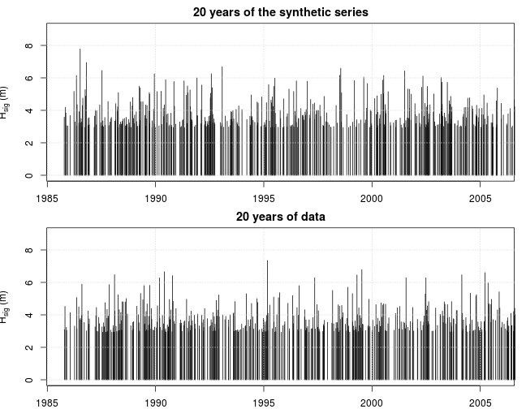

# **Statistical modelling of multivariate dependence in the storm event dataset**
------------------------------------------------------------------------------------

*Gareth Davies, Geoscience Australia 2017*

# Introduction
------------------

This document follows on from
[statistical_model_vine_copula.md](statistical_model_vine_copula.md)
in describing our statistical analysis of storm waves at Old Bar. 

It illustrates the process of simulating synthetic series from the fitted model. 

It is essential that the code in
[statistical_model_vine_copula.md](statistical_model_vine_copula.md)
has alread been run, and produced an Rdata file
*'Rimages/session_univariate_distributions_XXXX.Rdata'*. Here XXXX is a flag related to
whether or not perturbations were applied to the data.


Supposing the above did not generate any errors, and you have R installed,
along with all the packages required to run this code, and a copy of the
*stormwavecluster* git repository, then you should be able to re-run the
analysis here by simply copy-pasting the code. Alternatively, it can be run
with the `knit` command in the *knitr* package: 

```r
library(knitr)
knit('statistical_model_series_simulation.Rmd')
```
The above command produces a .md file with the same name for viewing, which includes
updated figures and print-outs.

To run the code in tie-breaking mode, be sure to pass the a command-line
argument matching `break_ties` to R when starting, followed by an integer ID > 0,
e.g.

    R --args --break_ties 1234

or

    Rscript script_name_here.R --break_ties 1234

Running the above commands many times is facilitated by scripts in
[../statistical_model_fit_perturbed_data/README.md](../statistical_model_fit_perturbed_data/README.md)

The basic approach followed here is to:
* **Step 1: Load the previous session**
* **Step 2: Make a function to simulate random storm properties with all dependencies**

# **Step 1: Load the previous session**
---------------------------------------

Here we load the session previously derived by 
[statistical_model_univariate_distributions.Rmd](statistical_model_univariate_distributions.Rmd).
As before, the code is adjusted to optionally use an analysis with random
perturbations to the data, to check the impact of ties and data discretization.


```r
# Need to re-load packages, as R does not automatically do this when re-loading
# a session
library(evmix)
library(logspline)
library(CDVine) # Used to set structure of C-Vine copula
library(VineCopula) # Main copula fitting routine. 

# Here we support multiple runs with random tie-breaking of the data
# If R was passed a commandline argument 'break_ties n' on startup (with n = integer),
# then read the n'th R session matching 'Rimages/session_storm_timings_TRUE_*.Rdata'.
# That session will correspond to one of the tie-breaking sessions
if( length(grep('break_ties', commandArgs(trailingOnly=TRUE))) > 0 ){

    break_ties_with_jitter = TRUE

    # Read one of the sessions with tie-breaking
    session_n = as.numeric(commandArgs(trailingOnly=TRUE)[2])
    if(session_n < 1) stop('Invalid input ID')

    # Definitions controlling the number of years in the synthetic series
    nyears_synthetic_series = 1e+03 

}else{
    break_ties_with_jitter = FALSE
    session_n = 0

    # Definitions controlling the number of years in the synthetic series
    nyears_synthetic_series = 1e+03 

}

# Make a 'title' which can appear in filenames to identify this run
run_title_id = paste0(break_ties_with_jitter, '_', session_n)

previous_R_session_file = paste0('Rimages/session_vine_copula_', run_title_id, '.Rdata')

load(previous_R_session_file)

print(previous_R_session_file)
```

```
## [1] "Rimages/session_storm_timings_FALSE_0.Rdata"
```


# **Step 2: Make a function to simulate random storm properties with all dependencies**
----------------------------------------------------------------------------------------

Here we simulate a synthetic timeseries of events, using the event magnitude
and timings suggested before. To do this we need a function to generate the
event properties, given the time `t`. Because storm wave events cannot overlap
in time, the randomly generated event `duration` at time `t` will affect the
subsequent event timings (and therefore cannot be decoupled from the event
temporal modelling). As the event properties are affected by `soiA` we include
that in the model. `soiA` has a weak autocorrelation structure, which is treated
below.

**Below we make a function which creates an environment containing data needed
to simulate the storm properties, as well as a function which can do the
simulation.** Later will pass the latter function to the non-homogeneous
Poisson process simulation code.

```r
#' Function to initialise the 'event_creator' environment.
#'
#' This contains a function that can simulate the event properties
#' including soiA
#'
#' @param random_copula_samples function to generate random samples (in [0,1]) from the multivariate copula
#' @param stormVarFun function to compute marginals given random copula samples and conditional variables
#' @param observation_start_time time that the simulation can begin (in years)
#' @param lambda_rate_equation equation for rate model lambda (in text)
#' @param lamda_theta_par value of vector theta referred to in lambda_rate_equation
#' @param plot_soiA logical -- make plots of soiA acf/pacf?
#' @param nyears_synthetic_series -- number of years in the series we will simulate. 
#' @return an environment, which includes a function to simulate event properties
#'
build_event_creator<-function(random_copula_samples, stormVarFun, 
    observation_start_time, lambda_rate_equation, lambda_theta_par, 
    plot_soiA=FALSE, nyears_synthetic_series = nyears_synthetic_series){

    event_creator = new.env()

    event_creator$random_copula_samples = random_copula_samples
    event_creator$stormVarFun = stormVarFun
    event_creator$observation_start_time = observation_start_time
    event_creator$lambda_rate_equation = lambda_rate_equation
    event_creator$lambda_theta_par = lambda_theta_par
    event_creator$plot_soiA = plot_soiA
    event_creator$nyears_synthetic_series = nyears_synthetic_series

    event_creator$year2hours = 365.25 * 24

    with(event_creator, 
        {

            nhp = new.env()
            source('../../R/nhpoisp/nhpoisp.R', local=nhp)

            # Include autoregressive model of soiA here
            CI = DU$read_climate_indices(
                '../../Data/Climate_Indices/ENSO/SOI_BOM.txt',
                '../../Data/Climate_Indices/AAO/AAO.txt')

            yearly_soiA = aggregate(CI$soi$index, 
                list(year=as.numeric(format(CI$soi$time, '%Y'))), 
                mean)

            # (partial) Autocorrelation plots for soi
            # Based on this we fit an auto-regressive model of order 2
            if(plot_soiA){
                par(mfrow=c(2,1))
                acf(yearly_soiA[,2], main='Autocorrelation of soiA')
                pacf(yearly_soiA[,2], main='Partial Autocorrelation of soiA')
            }

            # Fit the model and simulate a series longer than what we need
            suppressPackageStartupMessages(library(forecast))
            yearly_soiA_model = forecast::Arima(
                yearly_soiA[,2], 
                order=c(2,0,0),
                include.mean=FALSE)
            yearly_soiA_sim = forecast::simulate.Arima(
                yearly_soiA_model, 
                n=nyears_synthetic_series+10)

            # Trick to index into yearly_soiA_sim
            start_year = floor(observation_start_time)

            # lambda function
            # This will use the yearly_soiA_sim defined above
            lambda = nhp$get_lambda_function(
                lambda_theta_par,
                rate_equation = lambda_rate_equation,
                minimum_rate = 0)

            #' Pre-compute random samples from copula (to speed up code)
            #'
            #' @param N size of the random copula table
            #' @return A function which generates a single random sample
            #' from the copula table. It updates the table as required
            precompute_random_copula_samples<-function(N){

                copula_counter = 0

                random_copula_samples_precomputed = random_copula_samples(N)

                # Return a function which gives a single sample
                # and updates the random sample table as required
                get_random_copula_sample<-function(){

                    copula_counter <<- copula_counter+1

                    # Check if we need to update the table
                    if(copula_counter > dim(random_copula_samples_precomputed)[1]){
                        random_copula_samples_precomputed <<- random_copula_samples(N)
                        copula_counter <<- 1
                    }

                    return(random_copula_samples_precomputed[copula_counter,])
                }

                return(get_random_copula_sample)
            }

            # Function to get a copula sample
            get_random_copula_sample = precompute_random_copula_samples(1e+03)
        
            
            #' This function is passed to rnhpoisp
            #'
            #' @param t Event start time 
            #' @return Event properties as a named list (single row of data.frame)
            #'
            event_properties_function<-function(t){

                soiA = yearly_soiA_sim[floor(t) - start_year+1]

                # Use copula
                rand5 = get_random_copula_sample() 
            
                output = stormVarFun(
                    duration=rand5['duration'], hsig=rand5['hsig'], 
                    dir=rand5['dir'], steepness=rand5['steepness'], 
                    tideResid=rand5['tideResid'], 
                    conditional_variables=list(startyear=t, soiA=soiA)
                    )

                # We must return duration in units 'years' for the timings to work
                output$duration = output$duration/(year2hours)
                output$soiA = soiA

                return(output)
            }

        }
    ) # end event_creator

    return(event_creator)

} # end function
```

**Below we use the function above to make the `event_creator`**, which will be
passed to the random non-homogeneous Poisson process simulation function. When
doing this, we have to be careful to edit the `best_nhp_model` rate equation so
that it uses the simulated `soiA` values, instead of the data values.

```r
# Make our event creator
#
# Recall that when we fit the lambda model initially, we made the soi equation
# loop repeatedly over the historical measurements of soiA.
#
# In contrast, we want the lambda model used for simulation to be like the best
# fit model.  BUT if the soi annual component is being used, we should replace
# it with:
# "theta[1] + theta[2] * yearly_soiA_sim[floor(t) - start_year + 1]"
# since this is what the event_creator environment uses to get soi as a
# function of time [see the code above where the variables yearly_soiA_sim and
# start_year are defined]
#
simulation_rate_equation = best_nhp_model$rate_equation
simulation_rate_equation = gsub(
    annual_rate_equations$soi$eqn, 
    'theta[1] + theta[2]*yearly_soiA_sim[floor(t) - start_year + 1]', 
    simulation_rate_equation,
    fixed=TRUE)
print(simulation_rate_equation)
```

```
## [1] "theta[1] + theta[2]*yearly_soiA_sim[floor(t) - start_year + 1]+theta[2 + 1]*abs(2/pi*asin(cos(pi*(t-theta[2+2]))))+0"
```

```r
event_creator = build_event_creator(
    random_copula_samples, 
    stormVarFun, 
    observation_start_time=obs_start_time, 
    lambda_rate_equation = simulation_rate_equation, 
    lambda_theta_par = best_nhp_model$par, 
    plot_soiA=TRUE,
    nyears_synthetic_series=nyears_synthetic_series)
```


```r
# Simulate the series
# Note we add an extra gap of 'duration_gap_hours/(24*365.24)' between events
# -- since with the current definition of events, no other event can occur
# within this length of time. 
synthetic_series = nhp$rnhpoisp(
    duration = nyears_synthetic_series, 
    lambda = event_creator$lambda, 
    event_properties_function = event_creator$event_properties_function,
    observation_start_time=obs_start_time,
    extra_duration_gap=duration_gap_hours/(year2hours),
    print_progress = nyears_synthetic_series)
```

```
## [1] 1000
## [1] "2017-03-22 14:34:49 AEDT"
## [1] 2000
## [1] "2017-03-22 14:34:53 AEDT"
## [1] 3000
## [1] "2017-03-22 14:34:57 AEDT"
## [1] 4000
## [1] "2017-03-22 14:35:02 AEDT"
## [1] 5000
## [1] "2017-03-22 14:35:06 AEDT"
## [1] 6000
## [1] "2017-03-22 14:35:10 AEDT"
## [1] 7000
## [1] "2017-03-22 14:35:14 AEDT"
## [1] 8000
## [1] "2017-03-22 14:35:19 AEDT"
## [1] 9000
## [1] "2017-03-22 14:35:23 AEDT"
## [1] 10000
## [1] "2017-03-22 14:35:27 AEDT"
## [1] 11000
## [1] "2017-03-22 14:35:31 AEDT"
## [1] 12000
## [1] "2017-03-22 14:35:35 AEDT"
## [1] 13000
## [1] "2017-03-22 14:35:39 AEDT"
## [1] 14000
## [1] "2017-03-22 14:35:43 AEDT"
## [1] 15000
## [1] "2017-03-22 14:35:47 AEDT"
## [1] 16000
## [1] "2017-03-22 14:35:52 AEDT"
## [1] 17000
## [1] "2017-03-22 14:35:56 AEDT"
## [1] 18000
## [1] "2017-03-22 14:36:01 AEDT"
## [1] 19000
## [1] "2017-03-22 14:36:05 AEDT"
## [1] 20000
## [1] "2017-03-22 14:36:10 AEDT"
## [1] 21000
## [1] "2017-03-22 14:36:14 AEDT"
## [1] 22000
## [1] "2017-03-22 14:36:18 AEDT"
```

```r
# Extract the information in a more convenient format
synthetic_attr = as.data.frame(attr(synthetic_series, 'event_properties'))
synthetic_attr$startyear = as.numeric(synthetic_series)

# Print the top few rows (note duration is still in years)
head(synthetic_attr)
```

```
##       duration     hsig   tideResid       dir  steepness      soiA
## 1 0.0047948318 3.396349  0.06304544  87.32262 0.01874734 -8.441536
## 2 0.0004528497 3.177342  0.09060672 191.67391 0.02126235 -1.566005
## 3 0.0006112260 3.108110  0.15255350 157.68410 0.02378003 -1.566005
## 4 0.0031450543 3.764353  0.20870452 175.50990 0.02288888 -1.566005
## 5 0.0006895155 3.189211 -0.07915734 168.62939 0.02182412 -1.566005
## 6 0.0008541434 3.279614  0.12447201  60.43928 0.01660983 -1.566005
##   startyear
## 1  1985.842
## 2  1986.065
## 3  1986.082
## 4  1986.167
## 5  1986.182
## 6  1986.230
```

**Here we graphically compare a few years of the model with a few years of data**

```r
# Plot a few years
plot_ylim = c(0, 9)
par(mfrow=c(2,1))
par(mar=c(2,3,2,1))
plot(synthetic_attr$startyear, synthetic_attr$hsig, t='h', 
    xlim=c(obs_start_time, obs_start_time+20),
    main='20 years of the synthetic series', 
    xlab='Year', ylab=bquote(H[sig]~'(m)'),
    ylim = plot_ylim)
grid()
plot(event_statistics$startyear, event_statistics$hsig, t='h',
    xlim=c(obs_start_time, obs_start_time+20),
    main='20 years of data',
    xlab='Year', ylab=bquote(H[sig]~'(m)'),
    ylim = plot_ylim)
grid()
```



# **Step 3: Appending MSL to the series**
------------------------------------------

We need to add in a smoothly varying MSL value to the series, as earlier we
established this was related to `soiA`. This is done using a simple approach. We
simulate an MSL value for each year based on the models fitted earlier
(`soi_SL_lm`), and then interpolate linearly between these values (assumed to
occur mid-year) to get the slowly-varying component of MSL for every storm. We
also add the monthly sea level variation to this, based on the previously
computed `smooth_tideResid_fun_stl_monthly`.


```r
#' Compute MSL given time/soi of synthetic storms
#'
#' For each year, we randomly generate an annual MSL value from the MSL vs soiA
#' regression. This is assumed to represent MSL halfway through the year.
#' Then we linearly interpolate from that series to get annual MSL for all events,
#' and add to this a seasonal component derived from the STL decomposition earlier.
#' 
#' @param output_times storm times (year)
#' @param output_soiA annual soiA during the storm
#' @param include_MSL_rise. If FALSE, only use soiA when predicting MSL. In that
#' case the year is set to 1999 (which gives MSL~0 for current data Old bar). Otherwise use the
#' output_time (rounded mid-year) to get the year
#' @return A numeric vector giving MSL during every storm
#'
compute_soi_MSL_perturbation<-function(output_times, output_soiA, 
    include_MSL_rise=FALSE){

    # Round all times to mid-year
    rounded_times = floor(output_times) + 0.5

    # Keep a single soiA, time for each year
    lrt = length(rounded_times)
    keepers = which(rounded_times[1:(lrt-1)] != rounded_times[2:lrt]) + 1
    if(rounded_times[1] != rounded_times[keepers[1]]) keepers = c(1, keepers)

    yearly_soiA_series = cbind(rounded_times[keepers], output_soiA[keepers])

    # Predict a single MSL for each year. This includes a random
    # component and an soiA related deterministic component
    #
    # To do this we use predict.lm to generative predictive intervals
    # for every point in yearly_soiA_series, **with a uniform random confidence level**.
    #
    # The underlying regression model was made in the `preprocessing` stage of the analysis
    #
    # We then randomly sample the upper or lower limit of this interval to
    # get our final value.
    lk = length(yearly_soiA_series[,1])

    if(include_MSL_rise){
        regression_year = yearly_soiA_series[,1]
    }else{
        default_year = 1999
        regression_year = rep(default_year, length(yearly_soiA_series[,1]))
    }

    random_predictions = predict(
        soi_SL_lm, 
        newdata=data.frame(soiA = yearly_soiA_series[,2], year=regression_year), 
        interval='prediction', 
        level = runif(lk))

    # Randomly sample upper or lower limit
    random_index = sample(c(0,1), size=lk, replace=TRUE) 
    random_SL = random_index * random_predictions[,'lwr'] + 
        (1-random_index) * random_predictions[,'upr']

    # Compute values of SL for each synthetic storm
    output_sl = approx(yearly_soiA_series[,1], random_SL, 
        xout=output_times, rule=2)$y

    # Add on monthly component
    # Since smooth_tideResid_fun_stl_monthly is defined from 1985-2014 and is
    # seasonally periodic, we just convert all output times to [0-1] and say
    # they are in a single year (year 2000, although any choice of year inside
    # our data coverage would be fine)
    output_sl = output_sl + smooth_tideResid_fun_stl_monthly(output_times%%1 + 2000)

    # Basic logical check
    stopifnot(length(output_sl) == lrt)

    return(output_sl)
}

# Compute an MSL series
output_sl = compute_soi_MSL_perturbation(
        output_times = synthetic_attr$startyear, 
        output_soiA = synthetic_attr$soiA,
        include_MSL_rise=FALSE)

# Append 
synthetic_attr = cbind(synthetic_attr, data.frame(msl=output_sl))


# Print the top few rows
head(synthetic_attr)
```

```
##       duration     hsig   tideResid       dir  steepness      soiA
## 1 0.0047948318 3.396349  0.06304544  87.32262 0.01874734 -8.441536
## 2 0.0004528497 3.177342  0.09060672 191.67391 0.02126235 -1.566005
## 3 0.0006112260 3.108110  0.15255350 157.68410 0.02378003 -1.566005
## 4 0.0031450543 3.764353  0.20870452 175.50990 0.02288888 -1.566005
## 5 0.0006895155 3.189211 -0.07915734 168.62939 0.02182412 -1.566005
## 6 0.0008541434 3.279614  0.12447201  60.43928 0.01660983 -1.566005
##   startyear          msl
## 1  1985.842 -0.049199164
## 2  1986.065 -0.044759896
## 3  1986.082 -0.043413161
## 4  1986.167 -0.027878650
## 5  1986.182 -0.023698981
## 6  1986.230 -0.006550357
```
