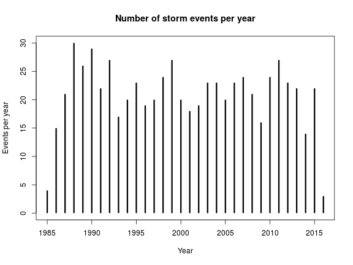
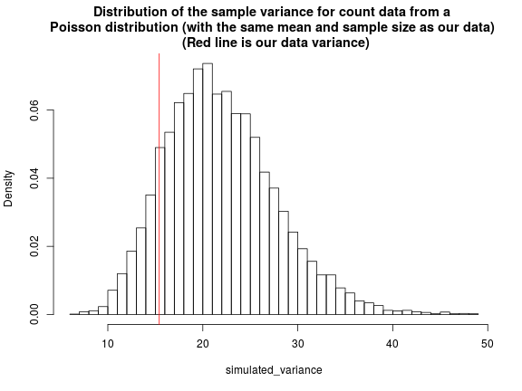

# **Statistical modelling of the storm event dataset: Storm event timings**
-------------------------------------------------------------

*Gareth Davies, Geoscience Australia 2017*

# Introduction
------------------

This document follows on from
[../preprocessing/extract_storm_events.md](../preprocessing/extract_storm_events.md)
in describing our statistical analysis of storm waves at Old Bar. 

It illustrates the process of fitting the storm event timing statistical model to the data.

It is essential that the scripts in [../preprocessing](../preprocessing) have
alread been run, and produced an
RDS file *'../preprocessing/Derived_data/event_statistics.RDS'*. **To make sure, the
code below throws an error if the latter file does not exist.**

```r
# If running via knitr, ensure knitr halts on error [do not use this command if
# copy-pasting the code]
opts_knit$set(stop_on_error=2L)

# Check that the pre-requisites exist
if(!file.exists('../preprocessing/Derived_data/event_statistics.RDS')){
    stop('It appears you have not yet run all codes in ../preprocessing. They must be run before continuing')
}
```

Supposing the above did not generate any errors, and you have R installed,
along with all the packages required to run this code, and a copy of the
*stormwavecluster* git repository, then you should be able to re-run the
analysis here by simply copy-pasting the code. Alternatively, it can be run
with the `knit` command in the *knitr* package: 

```r
library(knitr)
knit('statistical_model_storm_timings.Rmd')
```

To use the code in `tie-breaking` mode, see
[../statistical_model_fit_perturbed_data/README.md](../statistical_model_fit_perturbed_data/README.md)


The basic approach followed here is to:
* **Step 1: Get the preprocessed data and optionally break ties in the data**
* **Step 2: Compute the wave steepness**
* **Step 3: Exploration of the annual number of storms**
* **Step 4: Modelling the storm event timings as a non-homogeneous Poisson process**

Later we will use the statistical model to simulate synthetic storm event
time-series.

# **Step 1: Get the preprocessed data and optionally break ties in the data**
----------------------------------------------------------------------


**Below we read the data from earlier steps of the analysis**

```r
# Get the data_utilities functions (in their own environment to keep the
# namespace clean)
DU = new.env()
source('../preprocessing/data_utilities.R', local=DU) 

# Read data produced by pre-processing scripts
event_statistics_list = readRDS('../preprocessing/Derived_data/event_statistics.RDS')

# Extract variables that we need from previous analysis
for(varname in names(event_statistics_list)){
    assign(varname, event_statistics_list[[varname]])
}

# No need to keep event statistics_list, as we have extracted all required
# variables
rm(event_statistics_list)

# Useful number to convert from years to hours (ignoring details of leap-years)
year2hours = 365.25*24

# Optionally remove ties in the event statistics by jittering.
# To do this, a commandline argument matching 'break_ties' must
# have been passed to R before running. Otherwise no jittering is applied. 
# We design this way to facilitate running many random jobs with scripts, using
# the same code.
if( length(grep('break_ties', commandArgs(trailingOnly=TRUE))) > 0){
    # Apply jittering
    break_ties_with_jitter = TRUE
}else{
    # No jittering -- use the raw data
    break_ties_with_jitter = FALSE
}

# Look at the variables we have
ls()
```

```
##  [1] "break_ties_with_jitter"           "CI_annual_fun"                   
##  [3] "data_duration_years"              "DU"                              
##  [5] "duration_gap_hours"               "duration_offset_hours"           
##  [7] "duration_threshold_hours"         "event_statistics"                
##  [9] "hsig_threshold"                   "obs_start_time_strptime"         
## [11] "smooth_tideResid_fun_stl_monthly" "soi_SL_lm"                       
## [13] "varname"                          "year2hours"
```

```r
# Record whether or not we are breaking ties
print(break_ties_with_jitter)
```

```
## [1] FALSE
```

If our event statistics are subject to rounding (introducing 'ties' or repeated
values into the data), then some statistical methods designed for continuous
data may perform badly. For instance, our storm duration data is always in
multiples of one hour (because we use hourly data), and so there are many
storms with durations of 1, 2, 3... hours. These 'ties' can sometimes result in
poor performance for statistical methods which assume continuous data, because
for continuous data, ties have probability zero. This is not always a problem,
but needs to be checked.


Therefore, **below we optionally perturb the `event_statistics` to remove
ties**. To do this, we must choose the perturbation size. Although `hsig`
values are reported to 1mm, the perturbation size for `hsig` is taken as 10cm.
It is hard to know what the actual accuracy of Hsig measurements is, since it
involves averageing over the upper third of waves observed during the hour. As
an order of magnitude estimate, supposing the wave period is around 10 seconds,
approximately 100 waves would be in the upper third. Supposing their heights
have a standard deviation on the order of 1m, we expect a standard error of the
mean of around 10 cm (1/sqrt(100)). We use a perturbation of 1/2 hour for
`duration` and `startyear`, and 1/2 degree for `dir`, as these represent half of
the bin-width of the data we have (averaged to 1 hour / 1 degree increments).
For `tp1` (which has the most ties, and only 40 unique values), the bins are
irregularly spaced without an obvious pattern. The median distance between
unique `tp1` values after sorting is 0.25, with a maximum of 1.06, and a
minimum of 0.01.  Therefore, below a uniform perturbation of plus/minus 0.1
second is applied to `tp1`. 

```r
#' Make a function which will return a jittered version of the original
#' event_statistics
#'
#' See comments above regarding default jitter variables and amounts
#'
#' @param event_statistics_orig data.frame with the 'raw' event statistics
#' @param default_jitter_vars character vector with names of variables to
#' jitter. 'duration' will lead to both 'duration' and 'startyear' being
#' changed, with care to ensure consistency
#' @param default_jitter_amounts numeric vector with jitter amounts for each variable
#' @return function which generates jittered event statistics
#'
make_jitter_event_statistics_function<-function(
    event_statistics_orig,
    default_jitter_vars,
    default_jitter_amounts){

    # Bring arguments into this environment
    event_statistics_orig = event_statistics_orig
    default_jitter_vars = default_jitter_vars
    default_jitter_amounts = as.numeric(default_jitter_amounts) # Strip names if provided

    # Function that will jitter the original event_statistics
    jitter_event_statistics_function<-function(
        jitter_vars = default_jitter_vars,
        jitter_amounts = default_jitter_amounts
        ){

        event_statistics = event_statistics_orig

        # Jitter
        for(i in 1:length(jitter_vars)){ 

            # Duration/startyear require special treatment
            if(jitter_vars[i] == 'duration'){

                # We must jitter both startyear and duration, while ensuring
                # that 'event start time' + (duration + duration_gap_hours -
                # duration_offset_hours) does not overtake the next event start
                # time -- since that was a key feature of our event definition,
                # which is used in fitting the storm timing model [i.e. we know
                # that events were merged if the 'gap' was less than
                # duration_gap_hours, and must preserve that]
                #
                # For our data, such invalid jitter values are rare, but it can
                # happen with an unlucky jitter. In that case we just generate
                # a new random jitter until there are no invalid cases.
                #
                # Since it is such a rare event with our data, we do not expect
                # bias with this approach [as only a few values will be affected]
                #
                is_not_consistent = TRUE
                n = length(event_statistics[,1]) 
                jittered_duration = event_statistics$duration * NA
                jittered_startyear = event_statistics$startyear * NA
                ci = 1:n # Indices to change
                while(is_not_consistent){

                    # Trial new values of duration, startyear, endyear
                    jittered_duration[ci] = jitter(event_statistics$duration[ci], 
                        amount=jitter_amounts[i])
                    jittered_startyear[ci] = jitter(event_statistics$startyear[ci], 
                        amount=jitter_amounts[i]/year2hours)

                    new_endyear = jittered_startyear + jittered_duration/year2hours
                  
                    # Find values where the jitter 
                    ci = which(new_endyear[1:(n-1)] + 
                        (duration_gap_hours - duration_offset_hours)/year2hours > 
                        jittered_startyear[2:n])

                    if(length(ci) == 0) is_not_consistent = FALSE
                }

                event_statistics$duration = jittered_duration
                event_statistics$startyear = jittered_startyear
                event_statistics$endyear = new_endyear

            }else{
                event_statistics[[jitter_vars[i]]] = 
                    jitter(event_statistics[[jitter_vars[i]]], 
                        amount = jitter_amounts[i])
            }
        }

        # # Force hsig to be above the threshold ?
        # kk = which(event_statistics$hsig <= hsig_threshold)
        # if(length(kk) > 0){
        #     event_statistics$hsig[kk] = event_statistics_orig$hsig[kk]
        # }

        return(event_statistics)
    }
    return(jitter_event_statistics_function)
}

# Function that will return a jitter of the original event_statistics
event_statistics_orig = event_statistics
# Jitter of variables described in the text above
default_jitter_vars = c('hsig', 'duration', 'dir', 'tp1')
default_jitter_amounts = c(0.10, 0.5, 0.5, 0.1)
# For clarity later, it helps to name the jitter amounts
names(default_jitter_amounts) = default_jitter_vars

# Make function which can return jitter event statistics
jitter_event_statistics_function = make_jitter_event_statistics_function(
    event_statistics_orig,
    default_jitter_vars,
    default_jitter_amounts
    )

if(break_ties_with_jitter){
    # Make a label for the perturbed event statistics. Includes _TRUE_, and a
    # numerical ID [which has no meaning, but distinguishes different
    # perturbations]
    run_title_id = paste0(break_ties_with_jitter, '_', 
        sum(as.numeric(DU$get_random_seed()))%%102341)
    # Jitter the event statistics
    event_statistics = jitter_event_statistics_function()
    summary(event_statistics)
}else{
    # Make a label for the un-perturbed event_statistics --> _FALSE_0
    run_title_id = paste0(break_ties_with_jitter, '_0')
}
print(c('run_title_id: ', run_title_id))
```

```
## [1] "run_title_id: " "FALSE_0"
```


# **Step 2: Compute the wave steepness**
----------------------------------------

In our analysis, we choose to model the wave steepness (a function of the wave
height and period) instead of working directly with wave period tp1 (since in
initial investigations, this led to better performance of later stages of the
statistical modelling). Below the wave steepness is computed using the Airy
wave dispersion relation, assuming the water depth is 80m (which is appropriate
for the MHL wave buoys).

```r
wavedisp = new.env()
source('../../R/wave_dispersion/wave_dispersion_relation.R', local=wavedisp)
buoy_depth = 80 # Depth in m. 
wavelengths = wavedisp$airy_wavelength(period=event_statistics$tp1, h=buoy_depth)
event_statistics$steepness = event_statistics$hsig/wavelengths
rm(wavelengths)
summary(event_statistics$steepness)
```

```
##     Min.  1st Qu.   Median     Mean  3rd Qu.     Max. 
## 0.008328 0.016110 0.019850 0.020770 0.024570 0.051790
```

```r
hist(event_statistics$steepness, main='Histogram of computed wave steepness values')
```


# **Step 3: Exploration of the annual number of storms, the time between storms, and seasonal patterns**
--------------------------------------------------------------------------------------------------------

**Here we plot the number of events each year in the data.** Notice
how there are few events in the first and last year. This reflects
that our data is incomplete during those years.

```r
events_per_year = table(format(event_statistics$time, '%Y'))
# Hack into numeric type
year = as.numeric(names(events_per_year))
events_per_year = as.numeric(events_per_year)

# Plot
plot(year, as.numeric(events_per_year), t='h', lwd=3, lend=1, 
    main='Number of storm events per year',
    xlab='Year',
    ylab='Events per year', 
    ylim=c(0, max(events_per_year)))
```



```r
# Clean up
rm(year)
```

Before considering detailed modelling of the time-series, we informally check
whether the annual counts behave like a Poisson distribution. This would
imply the annual count data has a mean that is equal to its variance (though
because of finite sampling, this is not expected to hold exactly). We check
this by simulating a large number of samples from a Poisson distribution with
the same mean as our data, and computing their variance. The first and last years
of the data are removed to avoid the artefacts mentioned above.

If the data were truely Poisson, then we would expect the data variance to fall
well within the samples from the simulation -- which it does. **The code below implements
this check.**

```r
l = length(events_per_year)
events_per_year_truncated = events_per_year[-c(1,l)]

# For Poisson, mean = variance (within sampling variability)
sample_mean = mean(events_per_year_truncated)
sample_mean
```

```
## [1] 22.36667
```

```r
sample_var = var(events_per_year_truncated)
sample_var
```

```
## [1] 16.37816
```

```r
# Simulate
n = length(events_per_year_truncated)
nsim = 10000
simulated_variance = replicate(nsim, var( rpois( n, lambda=sample_mean)))
empirical_distribution = ecdf(simulated_variance)

# What fraction of the empirical samples have a variance less than our data sample?
empirical_distribution(sample_var)
```

```
## [1] 0.1541
```

```r
hist(simulated_variance, breaks=60, freq=FALSE,
    main=paste0('Distribution of the sample variance for count data from a \n',
                'Poisson distribution (with the same mean and sample size as our data) \n',
                ' (Red line is our data variance)'))
abline(v=sample_var, col='red')
```



```r
# Clean up
rm(l, n, nsim, simulated_variance, sample_var, empirical_distribution)
```

The above graphical and statistical checks do not suggests any particularly
strong deviation from the Poisson model *for the annual count data*. **Below, we
examine the data on shorter time-scales by plotting the distribution of times
between events, and the number of events each season.**

```r
num_events = length(event_statistics$startyear)
time_between_events = event_statistics$startyear[2:num_events] - 
                      event_statistics$endyear[1:(num_events-1)]

par(mfrow=c(2,1))
hist(time_between_events, freq=FALSE, xlab='Time between events (years)', 
    breaks=40, main='Histogram of time between events', cex.main=1.5)

# Add an exponential decay curve with rate based on the mean (corresponding to
# ideal Poisson Process)
xs = seq(0,1,len=100)
points(xs, exp(-xs/mean(time_between_events))/mean(time_between_events), 
    t='l', col=2)
grid()

# Compute the fraction of events which occur in each month
events_per_month = aggregate(
    rep(1/num_events, num_events), 
    list(month=format(event_statistics$time, '%m')), 
    FUN=sum)

# Get month labels as Jan, Feb, Mar, ...
month_label = month.abb[as.numeric(events_per_month$month)]
barplot(events_per_month$x, names.arg = month_label, 
        main='Fraction of events occuring in each calendar month',
        cex.main=1.5)
grid()
```


```r
# Clean up
rm(time_between_events, xs, events_per_month, month_label, num_events)
```


# **Step 4: Modelling the storm event timings as a non-homogeneous Poisson process**
------------------------------------------------------------------------------------

Below we use the nhpoisp.R script to fit various non-homogeneous Poisson
process models to the storm event timings. The code below is somewhat complex,
since it automates the fit of a range of different models. **If you are trying
to learn to fit these models, it is strongly suggested you consult the tests
and introductory illustrations contained in the
folder[../../R/nhpoisp/](../../R/nhpoisp/), rather than starting with the code
below.**

```r
nhp = new.env()
source('../../R/nhpoisp/nhpoisp.R', local=nhp)

#
# Prepare the data for modelling
#

# Get event start time in years
event_time = event_statistics$startyear
# Get event duration in years 
#
# NOTE: Because we demand a 'gap' between events, it makes sense to add 
#       (duration_gap_hours - duration_offset_hours) to the
#       event duration, since **by our definitions** no other event is possible
#       in this time.
#       The term 'duration_offset_hours' occurs since we use inclusive counting
#       when deriving initial storm duratins [e.g. this is related to the fact
#       that if there are 2 hsig observations above the threshold, then the
#       storm duration is taken as 2 hours, whereas the time difference between
#       these observations is only 1 hour.]
#

event_duration_years = (
    event_statistics$duration + 
    duration_gap_hours - duration_offset_hours
    )/year2hours 
obs_start_time = DU$time_to_year(obs_start_time_strptime)


# We cannot use all the data for these fits which include SOI terms,
# because we don't have annual SOI for 2016+
bulk_fit_indices = which(event_time < 2016) 

#
# Define the 'annual' component of all equations we test. 
#
annual_rate_equations = list(
    # The most basic model. -- need to keep reference to 't' so it vectorises
    # Since there are about 22 events/year, a reasonable order-of-magnitude
    # starting guess for theta[1] is '30'. Using a value somewhat higher than
    # '22' also reduces the chance of lambda being negative (and clipped to zero)
    # at the starding parameters, which makes fitting numerically easier
    constant=list(eqn = 'theta[1] + 0*t', npar = 1, start_par = 30, par_scale=1),

    # A model where soi matters. Because we only have annual soi until end of
    # 2015, we make the function loop over values from 1985 - 2015 inclusive
    # (31 years inclusive).
    # No values are 'looped' for the actual model fit so the parameters are
    # unaffected - however, for plotting the loop helps, since we have to
    # simulate many values.
    #
    soi = list(
        eqn='theta[1] + theta[2]*CI_annual_fun$soi(floor((t - 1985)%%31 + 1985))',
        npar=2, start_par = c(30, 0.1), par_scale=c(1,1/10))
    #
    # NOTE: Later, if simulating a series with synthetic soiA data, we will
    # have to change this equation so it no-longer 'loops' over only 31 years.
    # But for fitting, this is most convenient.
)

#
# Define the 'seasonal' component of all equations we test. 
#
seasonal_rate_equations = list(
    # The most basic model,
    constant=list(eqn='0', npar=0, start_par=c(), par_scale=c()),

    # Simple sinusoid,
    single_freq = list(
        eqn='theta[n_annual_par + 1]*sin(2*pi*(t - theta[n_annual_par + 2]))', 
        npar=2, start_par=c(5, 0.1), par_scale = c(1, 1/10)),
        
    # Double sinusoid
    double_freq = list(eqn=paste0(
        'theta[n_annual_par + 1]*sin(2*pi*(t - theta[n_annual_par + 2])) + ',
        'theta[n_annual_par + 3]*sin(4*pi*(t - theta[n_annual_par + 4]))'),
        npar=4, start_par=c(5, 0.1, 1, 0.1), par_scale=c(1, 1/10, 1, 1/10)),

    # Sawtooth
    sawtooth = list(
        eqn='theta[n_annual_par + 1]*abs(2/pi*asin(cos(pi*(t-theta[n_annual_par+2]))))',
        npar=2, start_par=c(5, 0.5), par_scale=c(1, 1/10))
)

#
# Define the 'cluster' component of all equations we test
#
cluster_rate_equations = list(
    # The most basic model
    constant=list(eqn="0", npar=0, start_par=c(), par_scale=c()),

    # A clustering model
    # Note the cluster time-scale must be positive to keep it sensible
    cluster = list(
        eqn=paste0('theta[n_annual_par + n_seasonal_par + 1]*',
            'exp((tlast - t)*abs(theta[n_annual_par + n_seasonal_par + 2]))'),
        npar=2, start_par=c(1, 100), par_scale=c(1, 100))
)

# We will loop over all combinations of the above equations
annual_rate_names = names(annual_rate_equations)
seasonal_rate_names = names(seasonal_rate_equations)
cluster_rate_names = names(cluster_rate_equations)

# Prepare for loop -- use these variables to store results
counter = 0
exhaustive_lambda_model_fits = list()

# Options to control the loop over all models
print_info = TRUE 
fit_model = TRUE # If FALSE, just test we can construct the eqn's correctly
use_previous_fit_for_cluster_pars = FALSE # Trick to improve starting parameter guess for models with clustering

# Loop over all rate equations (representing all combinations of
# annual/seasona/cluster models)
for(ar_name in annual_rate_names){
    for(sr_name in seasonal_rate_names){
        for(cr_name in cluster_rate_names){

            counter = counter + 1
            # Make starting parameters
            if( (cr_name == 'constant') | 
                (!use_previous_fit_for_cluster_pars) | 
                !fit_model ){
                start_par = c(annual_rate_equations[[ar_name]]$start_par, 
                              seasonal_rate_equations[[sr_name]]$start_par,
                              cluster_rate_equations[[cr_name]]$start_par)
            }else{
                # Better to use the parameters from before
                start_par = c(local_fit$par, cluster_rate_equations[[cr_name]]$start_par)
            }

            # Make scaling parameters for model parameters -- having these a similar magnitude
            # to the true value of the model parameters can help with convergence.
            par_scale = c(annual_rate_equations[[ar_name]]$par_scale, 
                          seasonal_rate_equations[[sr_name]]$par_scale,
                          cluster_rate_equations[[cr_name]]$par_scale)

            # Make preliminary equation
            rate_equation = paste0(
                annual_rate_equations[[ar_name]]$eqn, '+', 
                seasonal_rate_equations[[sr_name]]$eqn, '+', 
                cluster_rate_equations[[cr_name]]$eqn)
            
            # Sub in the required parameters 
            rate_equation = gsub('n_annual_par', annual_rate_equations[[ar_name]]$npar, 
                rate_equation)
            rate_equation = gsub('n_seasonal_par', seasonal_rate_equations[[sr_name]]$npar, 
                rate_equation)
           
            # Print out information 
            if(print_info){
                print('')
                print('')
                print(c('Annual model: ', ar_name))
                print(c('Seasonal model: ', sr_name))
                print(c('Clustering model: ', cr_name))
                print(c('Rate equation: ', rate_equation))
                print(c('Starting par: ', start_par))
                print(c('parscale for optim: ', par_scale))
            }

            if(fit_model){

                # For all single parameter models, just use BFGS. For others,
                # do two Nelder-Mead fits, followed by BFGS
                if(length(start_par) == 1){
                    optim_method_sequence = 'BFGS'
                }else{
                    optim_method_sequence = c('Nelder-Mead', 'Nelder-Mead', 'BFGS')
                }
            
                # This is the main fitting routine    
                local_fit =  nhp$fit_nhpoisp(event_time[bulk_fit_indices],
                    rate_equation=rate_equation,
                    minimum_rate=0.0,
                    initial_theta=start_par,
                    x0 = obs_start_time,
                    event_durations = event_duration_years[bulk_fit_indices],
                    number_of_passes = length(optim_method_sequence),
                    optim_method=optim_method_sequence,
                    enforce_nonnegative_theta=FALSE,
                    optim_control=list(parscale = par_scale),
                    use_optim2=FALSE,
                    use_numDeriv_hessian=TRUE)

                # Store the result in a list
                exhaustive_lambda_model_fits[[counter]] = local_fit  
        
                
                if(print_info) {
                    print('...Fit...')
                    print(c('...parameters...:', local_fit$par))
                    print(c('...standard errors (approximate)...:', nhp$get_fit_standard_errors(local_fit)))
                    print(c('...convergence flag...:', local_fit$convergence))
                    print(c('...negative log likelihood...:', local_fit$value))
                }
            }
        }
    }
}
```

```
## [1] ""
## [1] ""
## [1] "Annual model: " "constant"      
## [1] "Seasonal model: " "constant"        
## [1] "Clustering model: " "constant"          
## [1] "Rate equation: "    "theta[1] + 0*t+0+0"
## [1] "Starting par: " "30"            
## [1] "parscale for optim: " "1"                   
## [1] "...Fit..."
## [1] "...parameters...:" "25.4126134706164" 
## [1] "...standard errors (approximate)...:"
## [2] "0.978131948538059"                   
## [1] "...convergence flag...:" "0"                      
## [1] "...negative log likelihood...:" "-1508.79316303125"             
## [1] ""
## [1] ""
## [1] "Annual model: " "constant"      
## [1] "Seasonal model: " "constant"        
## [1] "Clustering model: " "cluster"           
## [1] "Rate equation: "                                                         
## [2] "theta[1] + 0*t+0+theta[1 + 0 + 1]*exp((tlast - t)*abs(theta[1 + 0 + 2]))"
## [1] "Starting par: " "30"             "1"              "100"           
## [1] "parscale for optim: " "1"                    "1"                   
## [4] "100"                 
## [1] "...Fit..."
## [1] "...parameters...:" "25.2457658823945"  "2.38778696023765" 
## [4] "336.567423643142" 
## [1] "...standard errors (approximate)...:"
## [2] "1.08990285790144"                    
## [3] "6.75340461057513"                    
## [4] "1193.29930878004"                    
## [1] "...convergence flag...:" "0"                      
## [1] "...negative log likelihood...:" "-1508.88404566357"             
## [1] ""
## [1] ""
## [1] "Annual model: " "constant"      
## [1] "Seasonal model: " "single_freq"     
## [1] "Clustering model: " "constant"          
## [1] "Rate equation: "                                           
## [2] "theta[1] + 0*t+theta[1 + 1]*sin(2*pi*(t - theta[1 + 2]))+0"
## [1] "Starting par: " "30"             "5"              "0.1"           
## [1] "parscale for optim: " "1"                    "1"                   
## [4] "0.1"                 
## [1] "...Fit..."
## [1] "...parameters...:" "25.6204684568487"  "7.23047126456784" 
## [4] "0.241347088452189"
## [1] "...standard errors (approximate)...:"
## [2] "0.986904766885231"                   
## [3] "1.37680795828872"                    
## [4] "0.0302551070443899"                  
## [1] "...convergence flag...:" "0"                      
## [1] "...negative log likelihood...:" "-1522.6134384541"              
## [1] ""
## [1] ""
## [1] "Annual model: " "constant"      
## [1] "Seasonal model: " "single_freq"     
## [1] "Clustering model: " "cluster"           
## [1] "Rate equation: "                                                                                                 
## [2] "theta[1] + 0*t+theta[1 + 1]*sin(2*pi*(t - theta[1 + 2]))+theta[1 + 2 + 1]*exp((tlast - t)*abs(theta[1 + 2 + 2]))"
## [1] "Starting par: " "30"             "5"              "0.1"           
## [5] "1"              "100"           
## [1] "parscale for optim: " "1"                    "1"                   
## [4] "0.1"                  "1"                    "100"                 
## [1] "...Fit..."
## [1] "...parameters...:" "25.5963270332856"  "7.23023801060961" 
## [4] "0.241545606547928" "0.533984349928013" "604.652263525867" 
## [1] "...standard errors (approximate)...:"
## [2] "1.03200526067534"                    
## [3] "1.37873190482384"                    
## [4] "0.030364138511846"                   
## [5] "7.48623803183385"                    
## [6] "5316.13478950114"                    
## [1] "...convergence flag...:" "0"                      
## [1] "...negative log likelihood...:" "-1522.61701392162"             
## [1] ""
## [1] ""
## [1] "Annual model: " "constant"      
## [1] "Seasonal model: " "double_freq"     
## [1] "Clustering model: " "constant"          
## [1] "Rate equation: "                                                                                       
## [2] "theta[1] + 0*t+theta[1 + 1]*sin(2*pi*(t - theta[1 + 2])) + theta[1 + 3]*sin(4*pi*(t - theta[1 + 4]))+0"
## [1] "Starting par: " "30"             "5"              "0.1"           
## [5] "1"              "0.1"           
## [1] "parscale for optim: " "1"                    "1"                   
## [4] "0.1"                  "1"                    "0.1"                 
## [1] "...Fit..."
## [1] "...parameters...:" "25.6220580536406"  "7.33270246965563" 
## [4] "0.238619881703164" "0.714875377994122" "0.302787526636673"
## [1] "...standard errors (approximate)...:"
## [2] "0.987041659002741"                   
## [3] "1.4056755907401"                     
## [4] "0.0301730361731189"                  
## [5] "1.36387761444179"                    
## [6] "0.155301535375867"                   
## [1] "...convergence flag...:" "0"                      
## [1] "...negative log likelihood...:" "-1522.74953439798"             
## [1] ""
## [1] ""
## [1] "Annual model: " "constant"      
## [1] "Seasonal model: " "double_freq"     
## [1] "Clustering model: " "cluster"           
## [1] "Rate equation: "                                                                                                                                             
## [2] "theta[1] + 0*t+theta[1 + 1]*sin(2*pi*(t - theta[1 + 2])) + theta[1 + 3]*sin(4*pi*(t - theta[1 + 4]))+theta[1 + 4 + 1]*exp((tlast - t)*abs(theta[1 + 4 + 2]))"
## [1] "Starting par: " "30"             "5"              "0.1"           
## [5] "1"              "0.1"            "1"              "100"           
## [1] "parscale for optim: " "1"                    "1"                   
## [4] "0.1"                  "1"                    "0.1"                 
## [7] "1"                    "100"                 
## [1] "...Fit..."
## [1] "...parameters...:" "25.5983655847568"  "7.32370457751835" 
## [4] "0.238801386558937" "0.711529451679586" "0.302352464048534"
## [7] "0.538209328969094" "572.099720371106" 
## [1] "...standard errors (approximate)...:"
## [2] "1.03172466153364"                    
## [3] "1.40780230178313"                    
## [4] "0.0302906660018139"                  
## [5] "1.36388968551832"                    
## [6] "0.155916863172878"                   
## [7] "7.57069809615064"                    
## [8] "4489.74724459758"                    
## [1] "...convergence flag...:" "0"                      
## [1] "...negative log likelihood...:" "-1522.75329663462"             
## [1] ""
## [1] ""
## [1] "Annual model: " "constant"      
## [1] "Seasonal model: " "sawtooth"        
## [1] "Clustering model: " "constant"          
## [1] "Rate equation: "                                                     
## [2] "theta[1] + 0*t+theta[1 + 1]*abs(2/pi*asin(cos(pi*(t-theta[1+2]))))+0"
## [1] "Starting par: " "30"             "5"              "0.5"           
## [1] "parscale for optim: " "1"                    "1"                   
## [4] "0.1"                 
## [1] "...Fit..."
## [1] "...parameters...:" "16.5269123594315"  "18.1846513780242" 
## [4] "0.510701188306356"
## [1] "...standard errors (approximate)...:"
## [2] "1.73296090430575"                    
## [3] "3.37111229419707"                    
## [4] "0.0238753279447397"                  
## [1] "...convergence flag...:" "0"                      
## [1] "...negative log likelihood...:" "-1523.20271763915"             
## [1] ""
## [1] ""
## [1] "Annual model: " "constant"      
## [1] "Seasonal model: " "sawtooth"        
## [1] "Clustering model: " "cluster"           
## [1] "Rate equation: "                                                                                                           
## [2] "theta[1] + 0*t+theta[1 + 1]*abs(2/pi*asin(cos(pi*(t-theta[1+2]))))+theta[1 + 2 + 1]*exp((tlast - t)*abs(theta[1 + 2 + 2]))"
## [1] "Starting par: " "30"             "5"              "0.5"           
## [5] "1"              "100"           
## [1] "parscale for optim: " "1"                    "1"                   
## [4] "0.1"                  "1"                    "100"                 
## [1] "...Fit..."
## [1] "...parameters...:" "16.4867839212268"  "18.1802643465554" 
## [4] "0.510919343541124" "0.827661671399053" "543.235215036791" 
## [1] "...standard errors (approximate)...:"
## [2] "1.7509066356022"                     
## [3] "3.37388995893486"                    
## [4] "0.0241881753349101"                  
## [5] "7.15617073355381"                    
## [6] "3036.07253013493"                    
## [1] "...convergence flag...:" "0"                      
## [1] "...negative log likelihood...:" "-1523.21230612676"             
## [1] ""
## [1] ""
## [1] "Annual model: " "soi"           
## [1] "Seasonal model: " "constant"        
## [1] "Clustering model: " "constant"          
## [1] "Rate equation: "                                                        
## [2] "theta[1] + theta[2]*CI_annual_fun$soi(floor((t - 1985)%%31 + 1985))+0+0"
## [1] "Starting par: " "30"             "0.1"           
## [1] "parscale for optim: " "1"                    "0.1"                 
## [1] "...Fit..."
## [1] "...parameters...:" "25.7093659058391"  "0.248866168715995"
## [1] "...standard errors (approximate)...:"
## [2] "1.00201175931736"                    
## [3] "0.132261549741254"                   
## [1] "...convergence flag...:" "0"                      
## [1] "...negative log likelihood...:" "-1510.57137478722"             
## [1] ""
## [1] ""
## [1] "Annual model: " "soi"           
## [1] "Seasonal model: " "constant"        
## [1] "Clustering model: " "cluster"           
## [1] "Rate equation: "                                                                                                              
## [2] "theta[1] + theta[2]*CI_annual_fun$soi(floor((t - 1985)%%31 + 1985))+0+theta[2 + 0 + 1]*exp((tlast - t)*abs(theta[2 + 0 + 2]))"
## [1] "Starting par: " "30"             "0.1"            "1"             
## [5] "100"           
## [1] "parscale for optim: " "1"                    "0.1"                 
## [4] "1"                    "100"                 
## [1] "...Fit..."
## [1] "...parameters...:" "25.6181634353693"  "0.246237937806071"
## [4] "1.77886560126167"  "481.120849863941" 
## [1] "...standard errors (approximate)...:"
## [2] "1.07296810271364"                    
## [3] "0.13274784526459"                    
## [4] "7.28660995923819"                    
## [5] "1934.82420776527"                    
## [1] "...convergence flag...:" "0"                      
## [1] "...negative log likelihood...:" "-1510.60960233484"             
## [1] ""
## [1] ""
## [1] "Annual model: " "soi"           
## [1] "Seasonal model: " "single_freq"     
## [1] "Clustering model: " "constant"          
## [1] "Rate equation: "                                                                                                
## [2] "theta[1] + theta[2]*CI_annual_fun$soi(floor((t - 1985)%%31 + 1985))+theta[2 + 1]*sin(2*pi*(t - theta[2 + 2]))+0"
## [1] "Starting par: " "30"             "0.1"            "5"             
## [5] "0.1"           
## [1] "parscale for optim: " "1"                    "0.1"                 
## [4] "1"                    "0.1"                 
## [1] "...Fit..."
## [1] "...parameters...:" "25.8999715824558"  "0.236277498615435"
## [4] "7.22211056154529"  "0.24386537630469" 
## [1] "...standard errors (approximate)...:"
## [2] "1.00930914484647"                    
## [3] "0.129761333834282"                   
## [4] "1.38033474600837"                    
## [5] "0.0300876921597088"                  
## [1] "...convergence flag...:" "0"                      
## [1] "...negative log likelihood...:" "-1524.27954733098"             
## [1] ""
## [1] ""
## [1] "Annual model: " "soi"           
## [1] "Seasonal model: " "single_freq"     
## [1] "Clustering model: " "cluster"           
## [1] "Rate equation: "                                                                                                                                                      
## [2] "theta[1] + theta[2]*CI_annual_fun$soi(floor((t - 1985)%%31 + 1985))+theta[2 + 1]*sin(2*pi*(t - theta[2 + 2]))+theta[2 + 2 + 1]*exp((tlast - t)*abs(theta[2 + 2 + 2]))"
## [1] "Starting par: " "30"             "0.1"            "5"             
## [5] "0.1"            "1"              "100"           
## [1] "parscale for optim: " "1"                    "0.1"                 
## [4] "1"                    "0.1"                  "1"                   
## [7] "100"                 
## [1] "...Fit..."
## [1] "...parameters...:"  "26.1304887516389"   "0.239125739279541" 
## [4] "7.26394262567423"   "0.243375253733592"  "-0.987803367023371"
## [7] "-85.3316414195735" 
## [1] "...standard errors (approximate)...:"
## [2] "1.40820041676866"                    
## [3] "0.130045761102193"                   
## [4] "1.38894904212281"                    
## [5] "0.0299888235486118"                  
## [6] "3.57391352461971"                    
## [7] "360.333059521106"                    
## [1] "...convergence flag...:" "0"                      
## [1] "...negative log likelihood...:" "-1524.31850523611"             
## [1] ""
## [1] ""
## [1] "Annual model: " "soi"           
## [1] "Seasonal model: " "double_freq"     
## [1] "Clustering model: " "constant"          
## [1] "Rate equation: "                                                                                                                                            
## [2] "theta[1] + theta[2]*CI_annual_fun$soi(floor((t - 1985)%%31 + 1985))+theta[2 + 1]*sin(2*pi*(t - theta[2 + 2])) + theta[2 + 3]*sin(4*pi*(t - theta[2 + 4]))+0"
## [1] "Starting par: " "30"             "0.1"            "5"             
## [5] "0.1"            "1"              "0.1"           
## [1] "parscale for optim: " "1"                    "0.1"                 
## [4] "1"                    "0.1"                  "1"                   
## [7] "0.1"                 
## [1] "...Fit..."
## [1] "...parameters...:" "25.896571476792"   "0.233881401571951"
## [4] "7.28769640301814"  "0.24120696536932"  "0.571955926238656"
## [7] "0.279037207606618"
## [1] "...standard errors (approximate)...:"
## [2] "1.00923132749327"                    
## [3] "0.130318878521392"                   
## [4] "1.40268718810666"                    
## [5] "0.0303353316823812"                  
## [6] "1.36923689838986"                    
## [7] "0.192692087858527"                   
## [1] "...convergence flag...:" "0"                      
## [1] "...negative log likelihood...:" "-1524.36702496571"             
## [1] ""
## [1] ""
## [1] "Annual model: " "soi"           
## [1] "Seasonal model: " "double_freq"     
## [1] "Clustering model: " "cluster"           
## [1] "Rate equation: "                                                                                                                                                                                                  
## [2] "theta[1] + theta[2]*CI_annual_fun$soi(floor((t - 1985)%%31 + 1985))+theta[2 + 1]*sin(2*pi*(t - theta[2 + 2])) + theta[2 + 3]*sin(4*pi*(t - theta[2 + 4]))+theta[2 + 4 + 1]*exp((tlast - t)*abs(theta[2 + 4 + 2]))"
## [1] "Starting par: " "30"             "0.1"            "5"             
## [5] "0.1"            "1"              "0.1"            "1"             
## [9] "100"           
## [1] "parscale for optim: " "1"                    "0.1"                 
## [4] "1"                    "0.1"                  "1"                   
## [7] "0.1"                  "1"                    "100"                 
## [1] "...Fit..."
## [1] "...parameters...:"  "26.1190423629193"   "0.236874060388453" 
## [4] "7.3227559374364"    "0.24096410519471"   "0.561889325729896" 
## [7] "0.281611494553324"  "-0.928496969401429" "81.8681647424424"  
## [1] "...standard errors (approximate)...:"
## [2] "1.42240270292729"                    
## [3] "0.130588884557971"                   
## [4] "1.41198406704085"                    
## [5] "0.0302319990015253"                  
## [6] "1.3692694516873"                     
## [7] "0.195689616683904"                   
## [8] "3.54211078444433"                    
## [9] "365.930132026374"                    
## [1] "...convergence flag...:" "0"                      
## [1] "...negative log likelihood...:" "-1524.40468421741"             
## [1] ""
## [1] ""
## [1] "Annual model: " "soi"           
## [1] "Seasonal model: " "sawtooth"        
## [1] "Clustering model: " "constant"          
## [1] "Rate equation: "                                                                                                          
## [2] "theta[1] + theta[2]*CI_annual_fun$soi(floor((t - 1985)%%31 + 1985))+theta[2 + 1]*abs(2/pi*asin(cos(pi*(t-theta[2+2]))))+0"
## [1] "Starting par: " "30"             "0.1"            "5"             
## [5] "0.5"           
## [1] "parscale for optim: " "1"                    "0.1"                 
## [4] "1"                    "0.1"                 
## [1] "...Fit..."
## [1] "...parameters...:" "16.7987241671165"  "0.24129898236717" 
## [4] "18.2172476922817"  "0.512616786821024"
## [1] "...standard errors (approximate)...:"
## [2] "1.75011185115804"                    
## [3] "0.129446059825179"                   
## [4] "3.37683286723526"                    
## [5] "0.0283758379194838"                  
## [1] "...convergence flag...:" "0"                      
## [1] "...negative log likelihood...:" "-1524.94688821251"             
## [1] ""
## [1] ""
## [1] "Annual model: " "soi"           
## [1] "Seasonal model: " "sawtooth"        
## [1] "Clustering model: " "cluster"           
## [1] "Rate equation: "                                                                                                                                                                
## [2] "theta[1] + theta[2]*CI_annual_fun$soi(floor((t - 1985)%%31 + 1985))+theta[2 + 1]*abs(2/pi*asin(cos(pi*(t-theta[2+2]))))+theta[2 + 2 + 1]*exp((tlast - t)*abs(theta[2 + 2 + 2]))"
## [1] "Starting par: " "30"             "0.1"            "5"             
## [5] "0.5"            "1"              "100"           
## [1] "parscale for optim: " "1"                    "0.1"                 
## [4] "1"                    "0.1"                  "1"                   
## [7] "100"                 
## [1] "...Fit..."
## [1] "...parameters...:" "16.7755875498447"  "0.24145164279577" 
## [4] "18.2096737177379"  "0.512922780491359" "4.05486736621363" 
## [7] "3881.49058334826" 
## [1] "...standard errors (approximate)...:"
## [2] "1.75245511082218"                    
## [3] "0.129395826191196"                   
## [4] "3.37536265447577"                    
## [5] "0.0290605177426609"                  
## [6] "18.7342275218401"                    
## [7] "9926.68038528773"                    
## [1] "...convergence flag...:" "0"                      
## [1] "...negative log likelihood...:" "-1524.97525309922"
```
* For every model, the above print-outs show the best fit parameters, approximate
standard errors, convergence flags (0 indicates convergence), and other information.

* For our (unperturbed) data, all models should converge.

* For models with clustering, we should see that the clustering terms always
have approximate standard errors which are larger than the parameter estimates,
indicating that those parameters are not well constrained. More advanced methods
(e.g. profile likelihood) would be required to precicely quantify the uncertainties,
but for our purposes this is not required.

* With different data, it is possible for models not to converge. If that
happens, then it is necessary to try different starting values and/or different
optimization options. Even if the optimization algorithm reports a `convergence
flag` of `0` (which indicates successful convergence), it is possible that a
local (but not global) optimum was found. Graphical checks of the model fit
(such as diagnostics shown below) can help identify situations when the fit is
poor, in which case both numerical convergence and the suitability of the
lambda model itself should be checked.

* With other data, it is also possible for the model to appear to converge, but
for the numerically computed Hessian of the likelihood at the optimum to be
non-positive definite. The latter situation either means that the model has not
really converged, or that minor numerical errors in the computation of the
Hessian have made it non-positive-definite. In this instance the code will
print a warning, and compute approximate standard errors using a Hessian matrix
which is forced to be positive definite. However, it is highly advisable to
double check the fit if the model is to be used subsequently.

**Next we compute the AIC for each model fit above, in order to select the most
parsimonious model.** This provides a means of ranking the models, based on
their parsimony. We use the 'corrected AIC' which slightly adjusts the standard
AIC for sample size. This correction has no impact on the model rankings here
however, because we have a relatively large sample compared with the number of
model parameters, which means the correction is always small.

```r
# Quick check that we have results for every model [e.g. convergence failures could break this]
expected_num_models = length(annual_rate_names) * length(seasonal_rate_names) * length(cluster_rate_names)
if(counter != expected_num_models){
    print('WARNING: Some storm timing model fits failed')
}

# corrected AIC for every model trialled above 
exhaustive_AICs =  unlist(lapply(exhaustive_lambda_model_fits, 
    f<-function(x) nhp$compute_fit_AIC_BIC(x, correct_AIC=TRUE)$AIC))

# Choose most parsimonious (i.e. model having min AIC)
best_nhp_model = exhaustive_lambda_model_fits[[which.min(exhaustive_AICs)]]
# What is the equation of the best model?
print(best_nhp_model$rate_equation)
```

```
## [1] "theta[1] + theta[2]*CI_annual_fun$soi(floor((t - 1985)%%31 + 1985))+theta[2 + 1]*abs(2/pi*asin(cos(pi*(t-theta[2+2]))))+0"
```

```r
# Get lambda function from the best fit
lambda = nhp$get_lambda_function(
    best_nhp_model$par, 
    rate_equation=best_nhp_model$rate_equation, 
    minimum_rate=0.)

# Make a plot comparing the model and data -- integrating over all observed SOI
# The plot scripts also compare the empirical distribution of the data and 
# simulations from the fitted model, using a number of KS-test based statistics
nhp$plot_nhpoisson_diagnostics(event_time[bulk_fit_indices], 
    event_duration_years[bulk_fit_indices], lambda, nbins=25)
```

```
## Loading required package: Matching
```

```
## Loading required package: MASS
```

```
## ## 
## ##  Matching (Version 4.9-2, Build Date: 2015-12-25)
## ##  See http://sekhon.berkeley.edu/matching for additional documentation.
## ##  Please cite software as:
## ##   Jasjeet S. Sekhon. 2011. ``Multivariate and Propensity Score Matching
## ##   Software with Automated Balance Optimization: The Matching package for R.''
## ##   Journal of Statistical Software, 42(7): 1-52. 
## ##
```

```
## [1] "KS TEST OF THE EVENTS TIME-OF-YEAR"
## $ks.boot.pvalue
## [1] 0.763
## 
## $ks
## 
## 	Two-sample Kolmogorov-Smirnov test
## 
## data:  Tr and Co
## D = 0.024888, p-value = 0.8022
## alternative hypothesis: two-sided
## 
## 
## $nboots
## [1] 1000
## 
## attr(,"class")
## [1] "ks.boot"
```

```
## [1] "KS TEST OF THE TIME BETWEEN EVENTS"
## $ks.boot.pvalue
## [1] 0.797
## 
## $ks
## 
## 	Two-sample Kolmogorov-Smirnov test
## 
## data:  Tr and Co
## D = 0.024927, p-value = 0.8013
## alternative hypothesis: two-sided
## 
## 
## $nboots
## [1] 1000
## 
## attr(,"class")
## [1] "ks.boot"
## [1] "KS TEST OF THE NUMBER OF EVENTS EACH YEAR"
## $ks.boot.pvalue
## [1] 0.805
## 
## $ks
## 
## 	Two-sample Kolmogorov-Smirnov test
## 
## data:  Tr and Co
## D = 0.090088, p-value = 0.9646
## alternative hypothesis: two-sided
## 
## 
## $nboots
## [1] 1000
## 
## attr(,"class")
## [1] "ks.boot"
```


**Save output for use later**

```r
dir.create('Rimages', showWarnings=FALSE)
Rimage_title = paste0('Rimages/session_storm_timings_', run_title_id, '.Rdata')
save.image(Rimage_title)
```


## **Moving On**
The next steps of the vignette begin at
[statistical_model_univariate_distributions.md](statistical_model_univariate_distributions.md).
