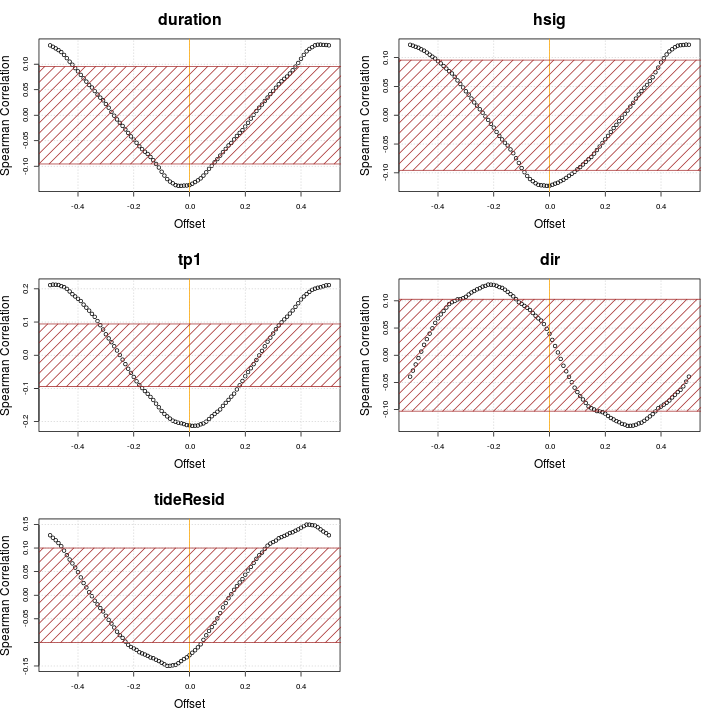
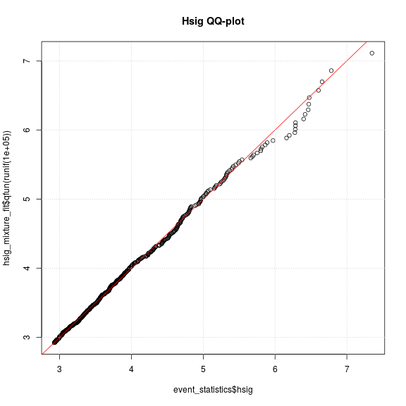

# **Modelling the distributions of storm event statistics**
--------------------------------------------------------------------------

*Gareth Davies, Geoscience Australia 2017*

# Introduction
------------------

This document follows on from
[statistical_model_storm_timings.md](statistical_model_storm_timings.md)
in describing our statistical analysis of storm waves at Old Bar. 

It illustrates the process of fitting probability distributions to the storm event summary statistics,
which are conditional on the time of year and ENSO.

It is essential that the code
[statistical_model_storm_timings.md](statistical_model_storm_timings.md) has
alread been run, and produced an Rdata file
*'Rimages/session_storm_timings_FALSE_0.Rdata'*. **To make sure, the code below
throws an error if the latter file does not exist.**

```r
# Check that the pre-requisites exist
if(!file.exists('Rimages/session_storm_timings_FALSE_0.Rdata')){
    stop('It appears you have not yet run the code in statistical_model_storm_timings.md. It must be run before continuing')
}
```
You might wonder why the filename ends in `_FALSE_0`. Here, `FALSE`
describes where or not we perturbed the storm summary statistics before running
the fitting code. In the `FALSE` case we didn't - we're using the raw data.
However, it can be desirable to re-run the fitting code on perturbed data, to
check the impact of data discretization on the model fit. One would usually do
many such runs, and so we include a number (`_0` in this case) to distinguish
them. So for example, if the filename ended with `_TRUE_543`, you could assume
it includes a run with the perturbed data (with 543 being a unique ID, that is
otherwise meaningless).

Supposing the above did not generate any errors, and you have R installed,
along with all the packages required to run this code, and a copy of the
*stormwavecluster* git repository, then you should be able to re-run the
analysis here by simply copy-pasting the code. Alternatively, it can be run
with the `knit` command in the *knitr* package: 

```r
library(knitr)
knit('statistical_model_univariate_distributions.Rmd')
```

The basic approach followed here is to:
* **Step 1: Load the previous session**
* **Step 2: Exploratory analysis of seasonal non-stationarity in event statistics**
* **Step 3: Model the distribution of each storm summary statistic, dependent on season (and mean annual SOI for wave direction)**

Later we will model the remaining joint dependence between these variables, and
simulate synthetic storm sequences. 

# **Step 1: Load the previous session**
Here we simply re-load the session from the previous stage of the modelling.

```r
    previous_R_session_file = 'Rimages/session_storm_timings_FALSE_0.Rdata'
    load(previous_R_session_file)
```

# **Step 2: Exploratory analysis of seasonal non-stationarity in event statistics**
----------------------------------------------------------------------

**Here we plot the distribution of each storm statistic by month.** This
highlights the seasonal non-stationarity. Below we will take some steps to
check the statistical significance of this, and later will use copula-based
techniques to make the modelled univariate distribution of each variable
conditional on the time of year.

```r
# Get month as 1, 2, ... 12
month_num = as.numeric(format(event_statistics$time, '%m'))
par(mfrow=c(3,2))
for(i in 1:5){
    boxplot(event_statistics[,i] ~ month_num, xlab='Month', 
        ylab=names(event_statistics)[i], names=month.abb,
        col='grey')
    title(main = names(event_statistics)[i], cex.main=2)
}

rm(month_num)
```


To model the seasonal non-stationarity illustrated above, we define a seasonal
variable periodic in time, of the form `cos(2*pi*(t - offset))` where the time
`t` is in years. The `offset` is a phase variable which can be optimised for
each storm summary statistic separately, to give the 'best' cosine seasonal
pattern matching the data. One way to do this is to find the value of `offset`
which maximises the rank-correlation between each storm variable and the seasonal
variable.

**Below we compute the offset for each storm summary statistic, and also assess
it's statistical significance using a permutation test.** The figure shows the
rank correlation between each variable and a seasonal variable, for each value
of `offset` in [-0.5, 0.5] (which represents all possible values). Note the
`offset` value with the strongest rank correlation may be interpreted as the
optimal offset (*here we choose the `offset` with largest negative rank
correlation, so many `offset`'s are close to zero*). 


```r
# Store some useful statistics
stat_store = data.frame(var = rep(NA, 5), phi=rep(NA,5), cor = rep(NA, 5), 
    p = rep(NA, 5), cor_05=rep(NA, 5))
stat_store$var = names(event_statistics)[1:5]

# Test these values of the 'offset' parameter
phi_vals = seq(-0.5, 0.5, by=0.01)
par(mfrow=c(3,2))
for(i in 1:5){

    # Compute spearman correlation for all values of phi, for variable i
    corrs = phi_vals*0
    for(j in 1:length(phi_vals)){
        corrs[j] =  cor(event_statistics[,i], 
            cos(2*pi*(event_statistics$startyear - phi_vals[j])),
            method='s', use='pairwise.complete.obs')
    }

    plot(phi_vals, corrs, xlab='Offset', ylab='Spearman Correlation', 
        main=names(event_statistics)[i], cex.main=2,
        cex.lab=1.5)
    grid()
    abline(v=0, col='orange')

    # Save the 'best' result
    stat_store$phi[i] = phi_vals[which.min(corrs)]
    stat_store$cor[i] = min(corrs)

    # Function to compute the 'best' correlation of season with
    # permuted data, which by definition has no significant correlation with
    # the season. We can use this to assess the statistical significance of the
    # observed correlation between each variable and the season.
    cor_phi_function<-function(i0=i){
        # Resample the data
        d0 = sample(event_statistics[,i0], size=length(event_statistics[,i0]), 
            replace=TRUE)
        # Correlation function
        g<-function(phi){ 
            cor(d0, cos(2*pi*(event_statistics$startyear - phi)), 
                method='s', use='pairwise.complete.obs')
        }
        # Find best 'phi'
        best_phi = optimize(g, c(-0.5, 0.5), tol=1.0e-06)$minimum

        return(g(best_phi))
    }
   
    # Let's get statistical significance 
    cor_boot = replicate(5000, cor_phi_function())

    # Because our optimizer minimises, the 'strongest' correlations
    # it finds are negative. Of course if 0.5 is added to phi this is equivalent
    # to a positive correlation. 
    
    qcb = quantile(cor_boot, 0.05, type=6)
    stat_store$cor_05[i] = qcb
    stat_store$p[i] = mean(cor_boot < min(corrs))

    polygon(rbind( c(-1, -qcb), c(-1, qcb), c(1, qcb), c(1, -qcb)),
        col='brown', density=10)
}

write.table(stat_store, file='seasonal_correlation_statistics.csv', sep="  &  ",
    quote=FALSE, row.names=FALSE)

rm(phi_vals, corrs)
```


In the above figure, the shaded region represents a 95% interval for the best
correlation expected of 'random' data (i.e. a random sample of the original
data with an optimized offset).  Correlations outside the shaded interval are
unlikely to occur at random, and are intepreted as reflecting true seasonal
non-stationarity. 

Below we will make each storm summary statistic dependent on the seasonal
variable. For wave direction, the mean annual SOI value will also be treated.
Recall that relationships between mean annual SOI and storm wave direction
were established earlier (
[../preprocessing/extract_storm_events.md](../preprocessing/extract_storm_events.md),
[statistical_model_storm_timings.md](statistical_model_storm_timings.md) ). We
also found relationships between mean annual SOI and the rate of storms, and
MSL, which were treated in those sections (using the non-homogeneous poisson
process model, and the STL decomposition, respectively). Therefore, the latter
relationships are not treated in the section below, but they are included in
the overall model.


# **Step 3: Model the distribution of each storm summary statistic, dependent on season (and mean annual SOI for wave direction)**

In this section we model the distribution of each storm summary statistic, and
then make it conditional on the seasonal variable (and on mean annual SOI in
the case of wave direction only). 

The distributions of `hsig`, `duration` and `tideResid` are initially modelled
as extreme value mixture distributions. The distributions of `dir` and
`steepness` are initially modelled using non-parametric smoothing (based on the
log-spline method).

## Hsig

**Below we fit an extreme value mixture model to Hsig, using maximum
likelihood.** The model has a GPD upper tail, and a gamma lower tail.

```r
# Get the exmix_fit routines in their own environment
evmix_fit = new.env()
source('../../R/evmix_fit/evmix_fit.R', local=evmix_fit, chdir=TRUE)

# Fit it
hsig_mixture_fit = evmix_fit$fit_gpd_mixture(data=event_statistics$hsig, 
    data_offset=as.numeric(hsig_threshold), phiu=TRUE, bulk='gamma')
```

```
## [1] "  evmix fit NLLH: " "530.237080056746"  
## [1] "  fit_optim NLLH: " "530.237080030477"  
## [1] "  Bulk par estimate0: " "0.842400448660163"     
## [3] "1.0204368965617"        "1.27267963923683"      
## [5] "-0.219878654410625"    
## [1] "           estimate1: " "0.842402977361388"     
## [3] "1.02042857261524"       "1.27268869445894"      
## [5] "-0.219876719484767"    
## [1] "  Difference: "        "-2.52870122496862e-06" "8.32394645855494e-06" 
## [4] "-9.05522210814524e-06" "-1.93492585820465e-06"
## [1] "PASS: checked qfun and pfun are inverse functions"
```

```r
DU$qqplot3(event_statistics$hsig, hsig_mixture_fit$qfun(runif(100000)), 
    main='Hsig QQ-plot')
abline(0, 1, col='red'); grid()
```



The above code leads to print-outs of the maximum likelihood parameter fits
achieved by different methods, and the differences between them (which are
only a few parts per million in this case). Because fitting extreme value
mixture models can be challenging, the code tries many different fits. 

During the fitting process, we also compute quantile and inverse quantile
functions for the fitted distribution. The code checks numerically that these
really are the inverse of each other, and will print information about whether
this was found to be true (*if not, there is a problem!*)

The quantile-quantile plot of the observed and fitted Hsig should fall close to
a straight line, if the fit worked. Poor fits are suggested by strong
deviations from the 1:1 line. While in this case the fit looks good, if the fit
is poor then further analysis is required. For example, it is possible that the
model fit did not converge, or that the statistical model is a poor choice for
the data.

Given that the above fit looks OK, **below we use Monte-Carlo-Markov-Chain
(MCMC) techniques to compute the Bayesian posterior distribution of the 4 model
parameters**. A few points about this process:
* The prior probability is uniform for each variable. Here we use
a very broad uniform distribution to represent an approximately
'non-informative' prior. The Gamma distribution parameters have uniform prior
over [0, 100 000 000]. The GPD threshold parameter prior is uniform
from zero to the 50th highest data point (to ensure that the tail
part of the model is fit using at least 50 data points). The GPD shape parameter
prior is uniform over [-1000 , 1000]. Note that for some other datasets, it
might be necessary to constrain the GPD shape parameter prior more strongly
than we do below, if it cannot be well estimated from the data (e.g. see the
literature for constraints are often imposed). Overall we are aiming to make
our priors reasonably 'non-informative', while still imposing pragmatic
constraints required to achieve a reasonable fit. 
* The routines update the object `hsig_mixture_fit`, so it contains
multiple chains, i.e. 'random walks' through the posterior parameter
distribution.
* Here we run 6 separate chains, with randomly chosen starting parameters, to
make it easier to detect non-convergence (i.e. to reduce the chance that a
single chain gets 'stuck' in part of the posterior distribution). The parameter
`mcmc_start_perturbation` defines the scale for that perturbation.
* It is possible that the randomly chosen start parameters are theoretically
impossible. In this case, the code will report that it had `Bad random start
parameters`, and will generate new ones.
* We use a burn-in of 1000 (i.e. the first 1000 entries in the chain are
discarded). This can assist with convergence.
* We make a simple diagnostic plot to check the MCMC convergence.
* The code runs in parallel, using 6 cores below. The parallel framework will
only work correctly on a shared memory linux machine.

```r
#' MCMC computations for later uncertainty characterisation
#' (hard to get convergence when phiu = FALSE)

# Prevent the threshold parameter from exceeding the highest 50th data point
# Note that inside the fitting routine, Hsig was transformed to have lower
# bound of zero before fitting, since the gamma distribution has a lower bound
# of zero. Hence we subtract hsig_threshold here
hsig_u_limit = sort(event_statistics$hsig, decreasing=TRUE)[50] - hsig_threshold

# Compute the MCMC chains in parallel
hsig_mixture_fit = evmix_fit$mcmc_gpd_mixture(
    fit_env=hsig_mixture_fit, 
    par_lower_limits=c(0, 0, 0, -1000.), 
    par_upper_limits=c(1e+08, 1.0e+08, hsig_u_limit, 1000),
    mcmc_start_perturbation=c(0.4, 0.4, 2., 0.2), 
    mcmc_length=mcmc_chain_length,
    mcmc_thin=mcmc_chain_thin,
    mcmc_burnin=1000,
    mcmc_nchains=6,
    mcmc_tune=c(1,1,1,1)*2,
    mc_cores=6,
    annual_event_rate=mean(events_per_year_truncated))

# Graphical convergence check of one of the chains. 
plot(hsig_mixture_fit$mcmc_chains[[1]])
```


**Below, we investigate the parameter estimates for each chain.** If all the
changes have converged, the quantiles of each parameter estimate should be
essentially the same (although if the underlying posterior distribution is
unbounded, then of course the min/max will not converge, although all other
quantiles eventually will). We also look at the 1/100 year event Hsig implied
by each chain, and make a return level plot.

```r
# Look at mcmc parameter estimates in each chain
lapply(hsig_mixture_fit$mcmc_chains, f<-function(x) summary(as.matrix(x)))
```

```
## [[1]]
##       var1             var2             var3              var4        
##  Min.   :0.6512   Min.   :0.7405   Min.   :0.03021   Min.   :-0.4307  
##  1st Qu.:0.8154   1st Qu.:0.9627   1st Qu.:1.08564   1st Qu.:-0.2533  
##  Median :0.8450   Median :1.0139   Median :1.34065   Median :-0.2063  
##  Mean   :0.8453   Mean   :1.0236   Mean   :1.32813   Mean   :-0.2030  
##  3rd Qu.:0.8749   3rd Qu.:1.0719   3rd Qu.:1.60331   3rd Qu.:-0.1556  
##  Max.   :1.0454   Max.   :2.0490   Max.   :2.17540   Max.   : 0.2076  
## 
## [[2]]
##       var1             var2             var3              var4        
##  Min.   :0.6429   Min.   :0.7460   Min.   :0.02024   Min.   :-0.4379  
##  1st Qu.:0.8154   1st Qu.:0.9626   1st Qu.:1.08026   1st Qu.:-0.2526  
##  Median :0.8449   Median :1.0140   Median :1.33499   Median :-0.2053  
##  Mean   :0.8451   Mean   :1.0249   Mean   :1.32285   Mean   :-0.2023  
##  3rd Qu.:0.8754   3rd Qu.:1.0720   3rd Qu.:1.59903   3rd Qu.:-0.1549  
##  Max.   :1.0238   Max.   :2.0756   Max.   :2.17541   Max.   : 0.1678  
## 
## [[3]]
##       var1             var2             var3              var4        
##  Min.   :0.6387   Min.   :0.7603   Min.   :0.04107   Min.   :-0.4453  
##  1st Qu.:0.8151   1st Qu.:0.9622   1st Qu.:1.08048   1st Qu.:-0.2523  
##  Median :0.8454   Median :1.0140   Median :1.33290   Median :-0.2052  
##  Mean   :0.8454   Mean   :1.0240   Mean   :1.32131   Mean   :-0.2021  
##  3rd Qu.:0.8757   3rd Qu.:1.0720   3rd Qu.:1.59425   3rd Qu.:-0.1548  
##  Max.   :1.0296   Max.   :1.8755   Max.   :2.17549   Max.   : 0.2225  
## 
## [[4]]
##       var1             var2             var3              var4        
##  Min.   :0.5872   Min.   :0.7547   Min.   :0.03517   Min.   :-0.4642  
##  1st Qu.:0.8152   1st Qu.:0.9626   1st Qu.:1.08835   1st Qu.:-0.2538  
##  Median :0.8452   Median :1.0138   Median :1.33984   Median :-0.2066  
##  Mean   :0.8455   Mean   :1.0236   Mean   :1.33126   Mean   :-0.2038  
##  3rd Qu.:0.8753   3rd Qu.:1.0717   3rd Qu.:1.60558   3rd Qu.:-0.1565  
##  Max.   :1.0844   Max.   :2.0336   Max.   :2.17548   Max.   : 0.1799  
## 
## [[5]]
##       var1             var2             var3              var4        
##  Min.   :0.6110   Min.   :0.7556   Min.   :0.01774   Min.   :-0.4483  
##  1st Qu.:0.8152   1st Qu.:0.9632   1st Qu.:1.07961   1st Qu.:-0.2530  
##  Median :0.8453   Median :1.0145   Median :1.33757   Median :-0.2060  
##  Mean   :0.8450   Mean   :1.0258   Mean   :1.32344   Mean   :-0.2026  
##  3rd Qu.:0.8749   3rd Qu.:1.0721   3rd Qu.:1.59677   3rd Qu.:-0.1547  
##  Max.   :1.0544   Max.   :2.2812   Max.   :2.17548   Max.   : 0.2198  
## 
## [[6]]
##       var1             var2             var3              var4        
##  Min.   :0.6155   Min.   :0.7017   Min.   :0.03639   Min.   :-0.4488  
##  1st Qu.:0.8154   1st Qu.:0.9623   1st Qu.:1.08518   1st Qu.:-0.2529  
##  Median :0.8452   Median :1.0135   Median :1.33801   Median :-0.2058  
##  Mean   :0.8454   Mean   :1.0238   Mean   :1.32675   Mean   :-0.2025  
##  3rd Qu.:0.8756   3rd Qu.:1.0713   3rd Qu.:1.60209   3rd Qu.:-0.1552  
##  Max.   :1.0496   Max.   :2.0620   Max.   :2.17535   Max.   : 0.2127
```

```r
# Look at ari 100 estimates
lapply(hsig_mixture_fit$ari_100_chains, 
    f<-function(x) quantile(x, p=c(0.025, 0.5, 0.975)))
```

```
## [[1]]
##     2.5%      50%    97.5% 
## 7.065510 7.539056 8.872848 
## 
## [[2]]
##     2.5%      50%    97.5% 
## 7.067740 7.542100 8.875341 
## 
## [[3]]
##     2.5%      50%    97.5% 
## 7.060835 7.540894 8.885028 
## 
## [[4]]
##     2.5%      50%    97.5% 
## 7.065614 7.536518 8.843365 
## 
## [[5]]
##     2.5%      50%    97.5% 
## 7.065125 7.541080 8.857061 
## 
## [[6]]
##     2.5%      50%    97.5% 
## 7.066654 7.541498 8.877871
```

```r
# Look at model prediction of the maximum observed value
# (supposing we observed the system for the same length of time as the data covers)
lapply(hsig_mixture_fit$ari_max_data_chains, 
    f<-function(x) quantile(x, p=c(0.025, 0.5, 0.975)))
```

```
## [[1]]
##     2.5%      50%    97.5% 
## 6.815454 7.186908 8.111498 
## 
## [[2]]
##     2.5%      50%    97.5% 
## 6.814414 7.189370 8.112900 
## 
## [[3]]
##     2.5%      50%    97.5% 
## 6.810629 7.188080 8.116178 
## 
## [[4]]
##     2.5%      50%    97.5% 
## 6.815152 7.186238 8.088597 
## 
## [[5]]
##     2.5%      50%    97.5% 
## 6.815238 7.188665 8.098504 
## 
## [[6]]
##     2.5%      50%    97.5% 
## 6.815817 7.190821 8.110742
```

```r
# If the chains are well behaved, we can combine all 
summary(hsig_mixture_fit$combined_chains)
```

```
##        V1               V2               V3                V4         
##  Min.   :0.5872   Min.   :0.7017   Min.   :0.01774   Min.   :-0.4642  
##  1st Qu.:0.8153   1st Qu.:0.9626   1st Qu.:1.08329   1st Qu.:-0.2530  
##  Median :0.8452   Median :1.0139   Median :1.33736   Median :-0.2059  
##  Mean   :0.8453   Mean   :1.0243   Mean   :1.32562   Mean   :-0.2027  
##  3rd Qu.:0.8753   3rd Qu.:1.0719   3rd Qu.:1.60018   3rd Qu.:-0.1553  
##  Max.   :1.0844   Max.   :2.2812   Max.   :2.17549   Max.   : 0.2225
```

```r
# If the chains are well behaved then we might want a merged 1/100 hsig
quantile(hsig_mixture_fit$combined_ari100, c(0.025, 0.5, 0.975))
```

```
##     2.5%      50%    97.5% 
## 7.065180 7.540166 8.868424
```

```r
# This is an alternative credible interval -- the 'highest posterior density' interval.
HPDinterval(as.mcmc(hsig_mixture_fit$combined_ari100))
```

```
##         lower    upper
## var1 6.980796 8.601214
## attr(,"Probability")
## [1] 0.95
```

```r
evmix_fit$mcmc_rl_plot(hsig_mixture_fit)
```


**Here we use a different technique to compute the 1/100 AEP Hsig, as a
cross-check on the above analysis.** A simple Generalised Extreme Value model
fit to annual maxima is undertaken. While this technique is based on limited
data (i.e. only one observation per year), it is not dependent on our storm
event definition or choice of wave height threshold. In this sense it is quite
different to our peaks-over-threshold method above -- and thus serves as a
useful cross-check on the former results. 

```r
# Here we do an annual maximum analysis with a gev
# This avoids issues with event definition
annual_max_hsig = aggregate(event_statistics$hsig, 
    list(year=floor(event_statistics$startyear)), max)
# Remove the first and last years with incomplete data
keep_years = which(annual_max_hsig$year %in% 1986:2015)
library(ismev)
gev_fit_annual_max = gev.fit(annual_max_hsig[keep_years,2])
```

```
## $conv
## [1] 0
## 
## $nllh
## [1] 31.04738
## 
## $mle
## [1]  5.4969947  0.6503065 -0.2118537
## 
## $se
## [1] 0.1365196 0.1016247 0.1591920
```

```r
gev.prof(gev_fit_annual_max, m=100, xlow=6.5, xup=12, conf=0.95)
```

```
## If routine fails, try changing plotting interval
```

```r
title(main='Profile likehood confidence interval for 1/100 AEP Hsig \n using a GEV fit to annual maxima')
# Add vertical lines at the limits of the 95% interval
abline(v=c(6.97, 10.4), col='red', lty='dashed')
# Add vertical line at ML estimate
abline(v=7.4, col='orange')
```


**Here we use copulas to determine a distribution for Hsig, conditional on the season**.
The computational details are wrapped up in a function that we source. Essentially, the code:
* Finds the optimal seasonal `offset` for the chosen variable (hsig), and uses
this to create a function to compute the season statistic (which is hsig
specific) from the event time of year.
* Automatically chooses a copula family (based on AIC) to model dependence
between the chosen variable and the season variable, and fits the copula.
* Uses the copula to create new quantile and inverse quantile functions, for
which the user can pass conditional variables (i.e. to get the distribution, given that the
season variable attains a particular value).
* Test that the quantile and inverse quantile functions really are inverses of each other (this
can help catch user input errors)
* Make quantile-quantile plots of the data and model for a number of time
periods (here the first, middle and last thirds of the calendar year). The top
row shows the model with the distribution varying by season, and the bottom row
shows the model without seasonal effects. It is not particularly easy to
visually detect seasonal non-stationarities in these plots [compared, say, with
using monthly boxplots].  Their main purpose is compare the model and data
distribution at different times of year, and so detect poor model fits.
However, you might notice that the top row of plots 'hug' the 1:1 line slightly
better than corresponding plots in the bottom row. This reflects the modelled
seasonal non-stationarities.

```r
# Get code to fit the conditional distribution
source('make_conditional_distribution.R')

# This returns an environment containing the conditional quantile and inverse
# quantile functions, among other information
hsig_fit_conditional = make_fit_conditional_on_season(
    event_statistics,
    var='hsig', 
    q_raw=hsig_mixture_fit$qfun, 
    p_raw=hsig_mixture_fit$pfun,
    startyear = 'startyear')
```

```
## [1] "Conditional p/q functions passed test: "
## [1] "  (Check plots to see if quantiles are ok)"
```


```r
# What kind of copula was selected?
print(hsig_fit_conditional$var_season_copula)
```

```
## Bivariate copula: Frank (par = -0.73, tau = -0.08)
```

