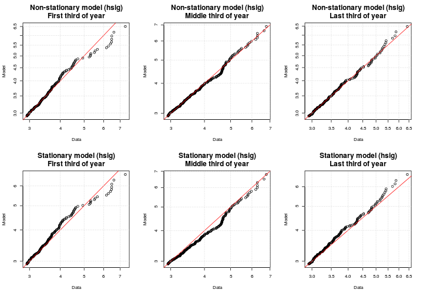
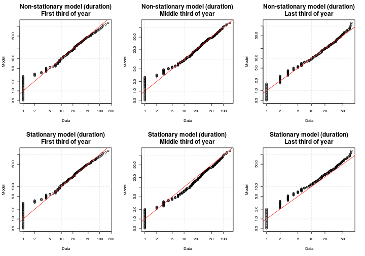
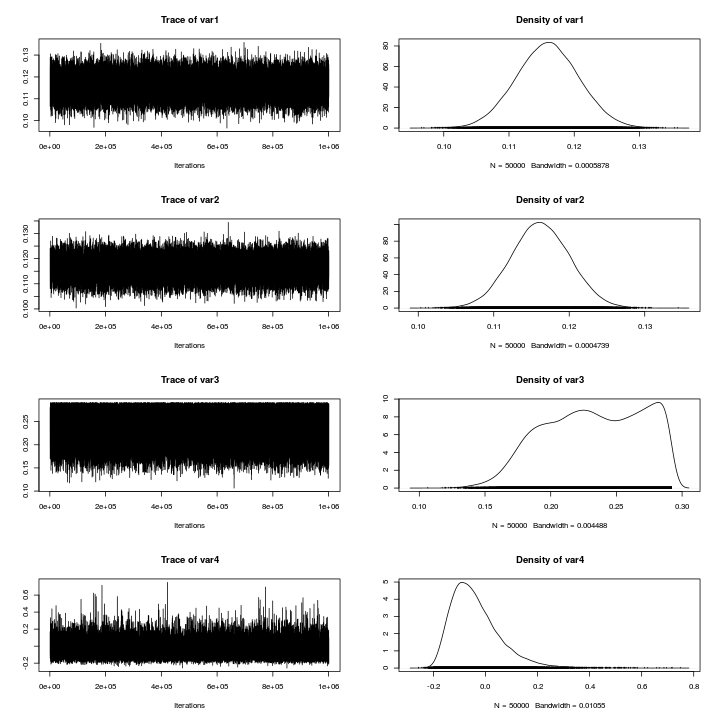

# **Modelling the univariate distributions of storm event statistics**
--------------------------------------------------------------------------

*Gareth Davies, Geoscience Australia 2017*

# Introduction
------------------

This document follows on from
[statistical_model_storm_timings.md](statistical_model_storm_timings.md)
in describing our statistical analysis of storm waves at Old Bar. 

It illustrates the process of fitting probability distributions to the storm event summary statistics,
which are conditional on the time of year and ENSO.

It is essential that the code
[statistical_model_storm_timings.md](statistical_model_storm_timings.md) has
alread been run, and produced an Rdata file
*'Rimages/session_storm_timings_FALSE_0.Rdata'*. **To make sure, the code below
throws an error if the latter file does not exist.**

```r
# If running via knitr, ensure knitr halts on error [do not use this command if
# copy-pasting the code]
opts_knit$set(stop_on_error=2L)

# Check that the pre-requisites exist
if(!file.exists('../statistical_model_fit/Rimages/session_storm_timings_FALSE_0.Rdata')){
    stop('It appears you have not yet run the code in statistical_model_storm_timings.md. It must be run before continuing')
}
```
You might wonder why the filename ends in `_FALSE_0`. Here, `FALSE`
describes where or not we perturbed the storm summary statistics before running
the fitting code. In the `FALSE` case we didn't - we're using the raw data.
However, it can be desirable to re-run the fitting code on perturbed data, to
check the impact of data discretization on the model fit. One would usually do
many such runs, and so we include a number (`_0` in this case) to distinguish
them. So for example, if the filename ended with `_TRUE_543`, you could assume
it includes a run with the perturbed data (with 543 being a unique ID, that is
otherwise meaningless).

Supposing the above did not generate any errors, and you have R installed,
along with all the packages required to run this code, and a copy of the
*stormwavecluster* git repository, then you should be able to re-run the
analysis here by simply copy-pasting the code. Alternatively, it can be run
with the `knit` command in the *knitr* package: 

```r
library(knitr)
knit('statistical_model_univariate_distributions.Rmd')
```

The basic approach followed here is to:
* **Step 1: Load the previous session**
* **Step 2: Exploratory analysis of seasonal non-stationarity in event statistics**
* **Step 3: Model the distribution of each storm summary statistic, dependent on season (and mean annual SOI for wave direction)**

Later we will model the remaining joint dependence between these variables, and
simulate synthetic storm sequences. 

# **Step 1: Load the previous session and set some key parameters**
Here we re-load the session from the previous stage of the modelling. We also
set some parameters controlling the Monte-Carlo Markov-Chain (MCMC) computations 
further in the document. 
* The default parameter values should be appropriate for the analysis
herein. To save computational effort (for testing purposes) users might reduce
the `mcmc_chain_length`. To reduce memory usage, users can increase the
`mcmc_chain_thin` parameter. If using other datasets, it may be necessary to
increase the `mcmc_chain_length` to get convergence.
* The code is also setup to run using a previous session with data ties broken
at random. See
[../statistical_model_fit_perturbed_data/README.md](../statistical_model_fit_perturbed_data/README.md)
for information on how to do this.


```r
# Here we support multiple runs with random tie-breaking of the data
# If R was passed a commandline argument 'break_ties n' on startup (with n = integer),
# then read the n'th R session matching 'Rimages/session_storm_timings_TRUE_*.Rdata'.
# That session will correspond to one of the tie-breaking sessions
if( length(grep('break_ties', commandArgs(trailingOnly=TRUE))) > 0 ){

    # Read one of the sessions with tie-breaking
    session_n = as.numeric(commandArgs(trailingOnly=TRUE)[2])
    previous_R_session_file = Sys.glob('Rimages/session_storm_timings_TRUE_*.Rdata')[session_n]

    # In this case, only run 1 mcmc chain on 1 core [since we will check many
    # tie-breaking sessions]
    mcmc_nchains = 1
    mcmc_ncores = 1

    mcmc_chain_length = 2e+06 # One long chain

}else{

    # Read the session that does not do any tie-breaking
    previous_R_session_file = 'Rimages/session_storm_timings_FALSE_0.Rdata'

    # In this case, run more chains in parallel.
    mcmc_nchains = 6
    mcmc_ncores = 6

    # However, the parallel framework used here does not work on windows,
    # so if running windows, only use 1 core
    if(.Platform$OS.type == 'windows') mcmc_ncores = 1

    # Length of each MCMC chain. Should be 'large' e.g 10^6, except for test runs 
    # We run multiple chains to enhance the likelihood of detecting non-convergence
    # since anyway this is cheap in parallel. These are pooled for final estimates,
    # but it is essential to manually check the convergence of the chains [e.g.
    # by comparing high return period confidence intervals].
    mcmc_chain_length = 1e+06 #1e+05 
}

load(previous_R_session_file)

# To reduce the data size, we can throw away all but a fraction of the mcmc
# chains. This has computational (memory) benefits if the MCMC samples are
# strongly autocorrelated, but no other advantages.
mcmc_chain_thin = 20 
```

# **Step 2: Exploratory analysis of seasonal non-stationarity in event statistics**
----------------------------------------------------------------------

**Here we plot the distribution of each storm statistic by month.** This
highlights the seasonal non-stationarity. Below we will take some steps to
check the statistical significance of this, and later will use copula-based
techniques to make the modelled univariate distribution of each variable
conditional on the time of year.

```r
# Get month as 1, 2, ... 12
month_num = as.numeric(format(event_statistics$time, '%m'))
par(mfrow=c(3,2))
for(i in 1:5){
    boxplot(event_statistics[,i] ~ month_num, xlab='Month', 
        ylab=names(event_statistics)[i], names=month.abb,
        col='grey')
    title(main = names(event_statistics)[i], cex.main=2)
}

rm(month_num)
```


To model the seasonal non-stationarity illustrated above, we define a seasonal
variable periodic in time, of the form `cos(2*pi*(t - offset))` where the time
`t` is in years. The `offset` is a phase variable which can be optimised for
each storm summary statistic separately, to give the 'best' cosine seasonal
pattern matching the data. One way to do this is to find the value of `offset`
which maximises the rank-correlation between each storm variable and the seasonal
variable.

**Below we compute the offset for each storm summary statistic, and also assess
it's statistical significance using a permutation test.** The figure shows the
rank correlation between each variable and a seasonal variable, for each value
of `offset` in [-0.5, 0.5] (which represents all possible values). Note the
`offset` value with the strongest rank correlation may be interpreted as the
optimal offset (*here we choose the `offset` with largest negative rank
correlation, so many `offset`'s are close to zero*). 


```r
# Store some useful statistics
stat_store = data.frame(var = rep(NA, 5), phi=rep(NA,5), cor = rep(NA, 5), 
    p = rep(NA, 5), cor_05=rep(NA, 5))
stat_store$var = names(event_statistics)[1:5]

# Test these values of the 'offset' parameter
phi_vals = seq(-0.5, 0.5, by=0.01)
par(mfrow=c(3,2))
for(i in 1:5){

    # Compute spearman correlation for all values of phi, for variable i
    corrs = phi_vals*0
    for(j in 1:length(phi_vals)){
        corrs[j] =  cor(event_statistics[,i], 
            cos(2*pi*(event_statistics$startyear - phi_vals[j])),
            method='s', use='pairwise.complete.obs')
    }

    plot(phi_vals, corrs, xlab='Offset', ylab='Spearman Correlation', 
        main=names(event_statistics)[i], cex.main=2,
        cex.lab=1.5)
    grid()
    abline(v=0, col='orange')

    # Save the 'best' result
    stat_store$phi[i] = phi_vals[which.min(corrs)]
    stat_store$cor[i] = min(corrs)

    # Function to compute the 'best' correlation of season with
    # permuted data, which by definition has no significant correlation with
    # the season. We can use this to assess the statistical significance of the
    # observed correlation between each variable and the season.
    cor_phi_function<-function(i0=i){
        # Resample the data
        d0 = sample(event_statistics[,i0], size=length(event_statistics[,i0]), 
            replace=TRUE)
        # Correlation function
        g<-function(phi){ 
            cor(d0, cos(2*pi*(event_statistics$startyear - phi)), 
                method='s', use='pairwise.complete.obs')
        }
        # Find best 'phi'
        best_phi = optimize(g, c(-0.5, 0.5), tol=1.0e-06)$minimum

        return(g(best_phi))
    }
   
    # Let's get statistical significance 
    cor_boot = replicate(5000, cor_phi_function())

    # Because our optimizer minimises, the 'strongest' correlations
    # it finds are negative. Of course if 0.5 is added to phi this is equivalent
    # to a positive correlation. 
    
    qcb = quantile(cor_boot, 0.05, type=6)
    stat_store$cor_05[i] = qcb
    stat_store$p[i] = mean(cor_boot < min(corrs))

    polygon(rbind( c(-1, -qcb), c(-1, qcb), c(1, qcb), c(1, -qcb)),
        col='brown', density=10)
}

write.table(stat_store, file='seasonal_correlation_statistics.csv', sep="  &  ",
    quote=FALSE, row.names=FALSE)

rm(phi_vals, corrs)
```


In the above figure, the shaded region represents a 95% interval for the best
correlation expected of 'random' data (i.e. a random sample of the original
data with an optimized offset).  Correlations outside the shaded interval are
unlikely to occur at random, and are intepreted as reflecting true seasonal
non-stationarity. 

Below we will make each storm summary statistic dependent on the seasonal
variable. For wave direction, the mean annual SOI value will also be treated.
Recall that relationships between mean annual SOI and storm wave direction
were established earlier (
[../preprocessing/extract_storm_events.md](../preprocessing/extract_storm_events.md),
[statistical_model_storm_timings.md](statistical_model_storm_timings.md) ). We
also found relationships between mean annual SOI and the rate of storms, and
MSL, which were treated in those sections (using the non-homogeneous poisson
process model, and the STL decomposition, respectively). Therefore, the latter
relationships are not treated in the section below, but they are included in
the overall model.


# **Step 3: Model the distribution of each storm summary statistic, dependent on season (and mean annual SOI for wave direction)**

In this section we model the distribution of each storm summary statistic, and
then make it conditional on the seasonal variable (and on mean annual SOI in
the case of wave direction only). 

The distributions of `hsig`, `duration` and `tideResid` are initially modelled
as extreme value mixture distributions. The distributions of `dir` and
`steepness` are initially modelled using non-parametric smoothing (based on the
log-spline method).

## Hsig

**Below we fit an extreme value mixture model to Hsig, using maximum
likelihood.** The model has a GPD upper tail, and a Gamma lower tail.

```r
# Get the exmix_fit routines in their own environment
evmix_fit = new.env()
source('../../R/evmix_fit/evmix_fit.R', local=evmix_fit, chdir=TRUE)

# Define the minimum possible value of hsig. The gamma distribution has a lower
# bound of 0, so we need to offset the data to match this. For the raw data we
# could subtract hsig_threshold -- however, if using perturbed data, there
# could be slightly lower values. Thus instead we just take a value slightly
# below the data minimum.
hsig_offset = min(event_statistics$hsig) - 1.0e-03

# Fit it
hsig_mixture_fit = evmix_fit$fit_gpd_mixture(
    data=event_statistics$hsig, 
    data_offset=hsig_offset, 
    bulk='gamma')
```

```
## [1] "  evmix fit NLLH: " "531.244039209002"  
## [1] "  fit_optim NLLH: " "531.244039202048"  
## [1] "  Bulk par estimate0: " "0.85003974398977"      
## [3] "1.01009446518527"       "1.29165275871625"      
## [5] "-0.21940960603698"     
## [1] "           estimate1: " "0.850038103804788"     
## [3] "1.01009712056226"       "1.29164914268469"      
## [5] "-0.219410423624441"    
## [1] "  Difference: "        "1.64018498260976e-06"  "-2.65537699295493e-06"
## [4] "3.61603155396573e-06"  "8.17587460927305e-07" 
## [1] "PASS: checked qfun and pfun are inverse functions"
```

```r
# Make a plot
DU$qqplot3(event_statistics$hsig, hsig_mixture_fit$qfun(runif(100000)), 
    main='Hsig QQ-plot')
abline(0, 1, col='red'); grid()
```


The above code leads to print-outs of the maximum likelihood parameter fits
achieved by different methods, and the differences between them (which are
only a few parts per million in this case). Because fitting extreme value
mixture models can be challenging, internally the code tries many different fits.

During the fitting process, we also compute quantile and inverse quantile
functions for the fitted distribution. The code checks numerically that these
really are the inverse of each other, and will print information about whether
this was found to be true (*if not, there is a problem!*)

The quantile-quantile plot of the observed and fitted Hsig should fall close to
a straight line, if the fit worked. Poor fits are suggested by strong
deviations from the 1:1 line. While in this case the fit looks good, if the fit
is poor then further analysis is required. For example, it is possible that the
model fit did not converge, or that the statistical model is a poor choice for
the data.

Given that the above fit looks OK, **below we use Monte-Carlo-Markov-Chain
(MCMC) techniques to compute the Bayesian posterior distribution of the 4 model
parameters**. A few points about this process:
* The prior probability is uniform for each variable. Here we use
a very broad uniform distribution to represent an approximately
'non-informative' prior. The Gamma distribution parameters have uniform prior
over [0, 100 000 000]. The GPD threshold parameter prior is uniform
from zero to the 50th highest data point (to ensure that the tail
part of the model is fit using at least 50 data points). The GPD shape parameter
prior is uniform over [-1000 , 1000]. Note that for some other datasets, it
might be necessary to constrain the GPD shape parameter prior more strongly
than we do below, if it cannot be well estimated from the data (e.g. see the
literature). Overall we are aiming to make our priors reasonably
'non-informative', while still imposing pragmatic constraints required to
achieve a reasonable fit. 
* The routines update the object `hsig_mixture_fit`, so it contains
multiple chains, i.e. 'random walks' through the posterior parameter
distribution.
* Here we run 6 separate chains, with randomly chosen starting parameters, to
make it easier to detect non-convergence (i.e. to reduce the chance that a
single chain gets 'stuck' in part of the posterior distribution). The parameter
`mcmc_start_perturbation` defines the scale for that perturbation.
* It is possible that the randomly chosen start parameters are theoretically
impossible. In this case, the code will report that it had `Bad random start
parameters`, and will generate new ones.
* We use a burn-in of 1000 (i.e. the first 1000 entries in the chain are
discarded). This can assist with convergence.
* We make a simple diagnostic plot to check the MCMC convergence.
* The code runs in parallel, using 6 cores below. The parallel framework will
only work correctly on a shared memory linux machine.

```r
#' MCMC computations for later uncertainty characterisation

# Prevent the threshold parameter from exceeding the highest 50th data point
# Note that inside the fitting routine, Hsig was transformed to have lower
# bound of slightly above zero before fitting, since the Gamma distribution has
# a lower bound of zero. Hence we subtract hsig_offset here.
hsig_u_limit = sort(event_statistics$hsig, decreasing=TRUE)[50] - hsig_offset

# Compute the MCMC chains in parallel
hsig_mixture_fit = evmix_fit$mcmc_gpd_mixture(
    fit_env=hsig_mixture_fit, 
    par_lower_limits=c(0, 0, 0, -1000.), 
    par_upper_limits=c(1e+08, 1.0e+08, hsig_u_limit, 1000),
    mcmc_start_perturbation=c(0.4, 0.4, 2., 0.2), 
    mcmc_length=mcmc_chain_length,
    mcmc_thin=mcmc_chain_thin,
    mcmc_burnin=1000,
    mcmc_nchains=mcmc_nchains,
    mcmc_tune=c(1,1,1,1)*1,
    mc_cores=mcmc_ncores,
    annual_event_rate=mean(events_per_year_truncated))
```

```
## [1] "Warning: Original fit was not optimal"
## [1] "Better parameters are:"
## [1]  0.8486226  1.0129586  1.2759234 -0.2185331
## [1] "Adjusting fit_optim to reflect this"
```

```r
# Graphical convergence check of one of the chains. 
plot(hsig_mixture_fit$mcmc_chains[[1]])
```


**Below, we investigate the parameter estimates for each chain.** If all the
changes have converged, the quantiles of each parameter estimate should be
essentially the same (although if the underlying posterior distribution is
unbounded, then of course the min/max will not converge, although all other
quantiles eventually will). We also look at the 1/100 year event Hsig implied
by each chain, and make a return level plot.

```r
# Look at mcmc parameter estimates in each chain
lapply(hsig_mixture_fit$mcmc_chains, f<-function(x) summary(as.matrix(x)))
```

```
## [[1]]
##       var1             var2             var3              var4        
##  Min.   :0.6547   Min.   :0.7528   Min.   :0.01324   Min.   :-0.4590  
##  1st Qu.:0.8224   1st Qu.:0.9539   1st Qu.:1.09804   1st Qu.:-0.2521  
##  Median :0.8524   Median :1.0040   Median :1.35170   Median :-0.2051  
##  Mean   :0.8526   Mean   :1.0138   Mean   :1.34182   Mean   :-0.2020  
##  3rd Qu.:0.8826   3rd Qu.:1.0604   3rd Qu.:1.61640   3rd Qu.:-0.1544  
##  Max.   :1.0525   Max.   :2.1180   Max.   :2.17599   Max.   : 0.2680  
## 
## [[2]]
##       var1             var2             var3              var4        
##  Min.   :0.6444   Min.   :0.7510   Min.   :0.03993   Min.   :-0.4387  
##  1st Qu.:0.8220   1st Qu.:0.9543   1st Qu.:1.09493   1st Qu.:-0.2518  
##  Median :0.8524   Median :1.0048   Median :1.34910   Median :-0.2050  
##  Mean   :0.8527   Mean   :1.0136   Mean   :1.33813   Mean   :-0.2017  
##  3rd Qu.:0.8830   3rd Qu.:1.0606   3rd Qu.:1.61323   3rd Qu.:-0.1539  
##  Max.   :1.0588   Max.   :1.9097   Max.   :2.17600   Max.   : 0.1964  
## 
## [[3]]
##       var1             var2             var3              var4        
##  Min.   :0.6318   Min.   :0.7358   Min.   :0.02506   Min.   :-0.4400  
##  1st Qu.:0.8223   1st Qu.:0.9535   1st Qu.:1.09162   1st Qu.:-0.2518  
##  Median :0.8526   Median :1.0041   Median :1.35023   Median :-0.2046  
##  Mean   :0.8528   Mean   :1.0138   Mean   :1.33923   Mean   :-0.2016  
##  3rd Qu.:0.8830   3rd Qu.:1.0610   3rd Qu.:1.61819   3rd Qu.:-0.1538  
##  Max.   :1.0512   Max.   :1.9853   Max.   :2.17596   Max.   : 0.2514  
## 
## [[4]]
##       var1             var2             var3              var4        
##  Min.   :0.6187   Min.   :0.7070   Min.   :0.03763   Min.   :-0.4415  
##  1st Qu.:0.8222   1st Qu.:0.9537   1st Qu.:1.09704   1st Qu.:-0.2514  
##  Median :0.8524   Median :1.0041   Median :1.34807   Median :-0.2043  
##  Mean   :0.8527   Mean   :1.0135   Mean   :1.33919   Mean   :-0.2013  
##  3rd Qu.:0.8829   3rd Qu.:1.0615   3rd Qu.:1.61632   3rd Qu.:-0.1537  
##  Max.   :1.0462   Max.   :1.9659   Max.   :2.17600   Max.   : 0.1647  
## 
## [[5]]
##       var1             var2             var3              var4        
##  Min.   :0.6539   Min.   :0.7374   Min.   :0.01186   Min.   :-0.4543  
##  1st Qu.:0.8226   1st Qu.:0.9543   1st Qu.:1.09660   1st Qu.:-0.2514  
##  Median :0.8521   Median :1.0047   Median :1.35181   Median :-0.2048  
##  Mean   :0.8526   Mean   :1.0138   Mean   :1.33914   Mean   :-0.2014  
##  3rd Qu.:0.8823   3rd Qu.:1.0602   3rd Qu.:1.61096   3rd Qu.:-0.1538  
##  Max.   :1.0476   Max.   :1.9554   Max.   :2.17595   Max.   : 0.1633  
## 
## [[6]]
##       var1             var2             var3              var4        
##  Min.   :0.6506   Min.   :0.7452   Min.   :0.01655   Min.   :-0.4479  
##  1st Qu.:0.8222   1st Qu.:0.9538   1st Qu.:1.09570   1st Qu.:-0.2513  
##  Median :0.8524   Median :1.0047   Median :1.34831   Median :-0.2040  
##  Mean   :0.8527   Mean   :1.0137   Mean   :1.33749   Mean   :-0.2010  
##  3rd Qu.:0.8828   3rd Qu.:1.0609   3rd Qu.:1.61144   3rd Qu.:-0.1533  
##  Max.   :1.0461   Max.   :1.8799   Max.   :2.17595   Max.   : 0.2327
```

```r
# Look at ari 100 estimates
lapply(hsig_mixture_fit$ari_100_chains, 
    f<-function(x) quantile(x, p=c(0.025, 0.5, 0.975)))
```

```
## [[1]]
##     2.5%      50%    97.5% 
## 7.062437 7.541344 8.860268 
## 
## [[2]]
##     2.5%      50%    97.5% 
## 7.068859 7.542117 8.884630 
## 
## [[3]]
##     2.5%      50%    97.5% 
## 7.066072 7.542492 8.862572 
## 
## [[4]]
##     2.5%      50%    97.5% 
## 7.068826 7.544390 8.879869 
## 
## [[5]]
##     2.5%      50%    97.5% 
## 7.067811 7.543243 8.868443 
## 
## [[6]]
##     2.5%      50%    97.5% 
## 7.069113 7.547357 8.896394
```

```r
# Look at model prediction of the maximum observed value
# (supposing we observed the system for the same length of time as the data covers)
lapply(hsig_mixture_fit$ari_max_data_chains, 
    f<-function(x) quantile(x, p=c(0.025, 0.5, 0.975)))
```

```
## [[1]]
##     2.5%      50%    97.5% 
## 6.812135 7.187388 8.097238 
## 
## [[2]]
##     2.5%      50%    97.5% 
## 6.815939 7.186941 8.117076 
## 
## [[3]]
##     2.5%      50%    97.5% 
## 6.813880 7.189004 8.095889 
## 
## [[4]]
##     2.5%      50%    97.5% 
## 6.815013 7.190362 8.115227 
## 
## [[5]]
##     2.5%      50%    97.5% 
## 6.816748 7.188712 8.105608 
## 
## [[6]]
##     2.5%      50%    97.5% 
## 6.815368 7.190906 8.123786
```

```r
# If the chains are well behaved, we can combine all 
summary(hsig_mixture_fit$combined_chains)
```

```
##        V1               V2               V3                V4         
##  Min.   :0.6187   Min.   :0.7070   Min.   :0.01186   Min.   :-0.4590  
##  1st Qu.:0.8223   1st Qu.:0.9539   1st Qu.:1.09571   1st Qu.:-0.2517  
##  Median :0.8524   Median :1.0044   Median :1.34989   Median :-0.2046  
##  Mean   :0.8527   Mean   :1.0137   Mean   :1.33917   Mean   :-0.2015  
##  3rd Qu.:0.8828   3rd Qu.:1.0608   3rd Qu.:1.61457   3rd Qu.:-0.1538  
##  Max.   :1.0588   Max.   :2.1180   Max.   :2.17600   Max.   : 0.2680
```

```r
# If the chains are well behaved then we might want a merged 1/100 hsig
quantile(hsig_mixture_fit$combined_ari100, c(0.025, 0.5, 0.975))
```

```
##     2.5%      50%    97.5% 
## 7.067129 7.543507 8.876147
```

```r
# This is an alternative credible interval -- the 'highest posterior density' interval.
HPDinterval(as.mcmc(hsig_mixture_fit$combined_ari100))
```

```
##         lower   upper
## var1 6.977168 8.60136
## attr(,"Probability")
## [1] 0.95
```

```r
evmix_fit$mcmc_rl_plot(hsig_mixture_fit)
```


**Here we use a different technique to compute the 1/100 AEP Hsig, as a
cross-check on the above analysis.** A simple Generalised Extreme Value model
fit to annual maxima is undertaken. While this technique is based on limited
data (i.e. only one observation per year), it is not dependent on our storm
event definition or choice of wave height threshold. In this sense it is quite
different to our peaks-over-threshold method above -- and thus serves as a
useful cross-check on the former results. 

```r
# Here we do an annual maximum analysis with a gev
# This avoids issues with event definition
annual_max_hsig = aggregate(event_statistics$hsig, 
    list(year=floor(event_statistics$startyear)), max)
# Remove the first and last years with incomplete data
keep_years = which(annual_max_hsig$year %in% 1986:2015)
library(ismev)
```

```
## Loading required package: mgcv
```

```
## Loading required package: nlme
```

```
## This is mgcv 1.8-12. For overview type 'help("mgcv-package")'.
```

```r
gev_fit_annual_max = gev.fit(annual_max_hsig[keep_years,2])
```

```
## $conv
## [1] 0
## 
## $nllh
## [1] 31.04738
## 
## $mle
## [1]  5.4969947  0.6503065 -0.2118537
## 
## $se
## [1] 0.1365196 0.1016247 0.1591920
```

```r
gev.prof(gev_fit_annual_max, m=100, xlow=6.5, xup=12, conf=0.95)
```

```
## If routine fails, try changing plotting interval
```

```r
title(main='Profile likehood confidence interval for 1/100 AEP Hsig \n using a GEV fit to annual maxima')
# Add vertical lines at the limits of the 95% interval
abline(v=c(6.97, 10.4), col='red', lty='dashed')
# Add vertical line at ML estimate
abline(v=7.4, col='orange')
```


**Here we use copulas to determine a distribution for Hsig, conditional on the season**.
The computational details are wrapped up in a function that we source.
Essentially, the code:
* Finds the optimal seasonal `offset` for the chosen variable (hsig), and uses
this to create a function to compute the season statistic (which is hsig
specific) from the event time of year.
* Automatically chooses a copula family (based on AIC) to model dependence
between the chosen variable and the season variable, and fits the copula.
* Uses the copula to create new quantile and inverse quantile functions, for
which the user can pass conditional variables (i.e. to get the distribution,
given that the season variable attains a particular value).
* Test that the quantile and inverse quantile functions really are inverses of
each other (this can help catch user input errors)
* Make quantile-quantile plots of the data and model for a number of time
periods (here the first, middle and last thirds of the calendar year). The top
row shows the model with the distribution varying by season, and the bottom row
shows the model without seasonal effects. It is not particularly easy to
visually detect seasonal non-stationarities in these plots [compared, say, with
using monthly boxplots].  Their main purpose is compare the model and data
distribution at different times of year, and so detect poor model fits.
However, you might notice that the top row of plots 'hug' the 1:1 line slightly
better than corresponding plots in the bottom row in the central data values.
This reflects the modelled seasonal non-stationarities. *Note the tail behaviour
can be erratic, since the 'model' result is actually a random sample from the model.*

```r
# Get code to fit the conditional distribution
# Give a path that will also work if run from another directory inside Analysis.
source('../../Analysis/statistical_model_fit/make_conditional_distribution.R')

# This returns an environment containing the conditional quantile and inverse
# quantile functions, among other information
hsig_fit_conditional = make_fit_conditional_on_season(
    event_statistics,
    var='hsig', 
    q_raw=hsig_mixture_fit$qfun, 
    p_raw=hsig_mixture_fit$pfun,
    startyear = 'startyear')
```

```
## [1] "Conditional p/q functions passed test: "
## [1] "  (Check plots to see if quantiles are ok)"
```



```r
# What kind of copula was selected to model dependence between season and hsig?
print(hsig_fit_conditional$var_season_copula)
```

```
## Bivariate copula: Frank (par = -0.73, tau = -0.08)
```


## Duration

Here we model storm duration, using techniques virtually identical to those applied above.
As before:
* We first fit the univariate extreme value mixture distribution with maximum
likelihood; 
* Next we compute the posterior distribution of each parameter; 
* Finally we make the duration distribution conditional on the time of year,
using a seasonal variable that has been optimised to capture seasonality in the
storm duration.

**Here is the extreme value mixture model maximum likelihood fit**

```r
# Do the maximum likelihood fit. 
#
# Set the lower limit of the tail model to just below the lower limit of the
# data, in the event we perturb it by half an hour. [Initial lower limit = 1hr]
# However, if working with the 'raw' data, then 0 seems a better lower limit that 1,
# since the latter is actually a data value. 
duration_offset = ifelse(break_ties_with_jitter, 0.5, 0.0) #min(event_statistics$duration) - 5.0e-04
duration_mixture_fit = evmix_fit$fit_gpd_mixture(
    data=event_statistics$duration, 
    data_offset=duration_offset, 
    bulk='gamma')
```

```
## Warning in FUN(X[[i]], ...): initial parameter values for threshold u = 1
## are invalid

## Warning in FUN(X[[i]], ...): initial parameter values for threshold u = 1
## are invalid
```

```
## [1] "  evmix fit NLLH: " "2833.26987097606"  
## [1] "  fit_optim NLLH: " "2833.26987067979"  
## [1] "  Bulk par estimate0: " "0.787694214155467"     
## [3] "31.8814888350954"       "51.3829005439937"      
## [5] "-0.139368918503533"    
## [1] "           estimate1: " "0.787676067347033"     
## [3] "31.8814876325492"       "51.3829001974599"      
## [5] "-0.139346757730819"    
## [1] "  Difference: "        "1.81468084338166e-05"  "1.20254618707349e-06" 
## [4] "3.46533859385545e-07"  "-2.21607727144135e-05"
## [1] "PASS: checked qfun and pfun are inverse functions"
```

```r
# Make a plot
DU$qqplot3(event_statistics$duration, duration_mixture_fit$qfun(runif(100000)), 
    main='Duration QQ-plot')
abline(0, 1, col='red'); grid()
```


**Here is the extreme value mixture model posterior probability computation, using MCMC**
As before, note that we run a number of MCMC chains with random starting values, and in 
the event that the random starting parameters are invalid the code will simply try new ones.

```r
# MCMC computations for later uncertainty characterisation
#
# Prevent the threshold parameter from exceeding the highest 50th data point
duration_u_limit = sort(event_statistics$duration, decreasing=TRUE)[50] - duration_offset

# Compute the MCMC chains in parallel.
duration_mixture_fit = evmix_fit$mcmc_gpd_mixture(
    fit_env=duration_mixture_fit, 
    par_lower_limits=c(0, 0, 0, -1000.), 
    par_upper_limits=c(1e+08, 1.0e+08, duration_u_limit, 1000),
    mcmc_start_perturbation=c(0.4, 0.4, 2., 0.2), 
    mcmc_length=mcmc_chain_length,
    mcmc_thin=mcmc_chain_thin,
    mcmc_burnin=1000,
    mcmc_nchains=mcmc_nchains,
    mcmc_tune=c(1,1,1,1)*1,
    mc_cores=mcmc_ncores,
    annual_event_rate=mean(events_per_year_truncated))

# Graphical convergence check of one of the chains. 
plot(duration_mixture_fit$mcmc_chains[[1]])
```


**Here we check the similarity of all the MCMC chains, and make a return-level plot for storm duration**

```r
# Look at mcmc parameter estimates in each chain
lapply(duration_mixture_fit$mcmc_chains, f<-function(x) summary(as.matrix(x)))
```

```
## [[1]]
##       var1             var2            var3             var4         
##  Min.   :0.6264   Min.   :23.75   Min.   : 2.607   Min.   :-0.33414  
##  1st Qu.:0.7617   1st Qu.:30.42   1st Qu.:40.513   1st Qu.:-0.15781  
##  Median :0.7876   Median :31.91   Median :51.302   Median :-0.10545  
##  Mean   :0.7883   Mean   :32.06   Mean   :49.344   Mean   :-0.09883  
##  3rd Qu.:0.8144   3rd Qu.:33.51   3rd Qu.:60.546   3rd Qu.:-0.04679  
##  Max.   :0.9589   Max.   :52.13   Max.   :70.999   Max.   : 0.52584  
## 
## [[2]]
##       var1             var2            var3             var4         
##  Min.   :0.6138   Min.   :23.97   Min.   : 3.151   Min.   :-0.32437  
##  1st Qu.:0.7616   1st Qu.:30.41   1st Qu.:40.405   1st Qu.:-0.15654  
##  Median :0.7877   Median :31.91   Median :51.321   Median :-0.10450  
##  Mean   :0.7883   Mean   :32.05   Mean   :49.344   Mean   :-0.09803  
##  3rd Qu.:0.8143   3rd Qu.:33.51   3rd Qu.:60.650   3rd Qu.:-0.04704  
##  Max.   :0.9512   Max.   :51.22   Max.   :71.000   Max.   : 0.61926  
## 
## [[3]]
##       var1             var2            var3             var4         
##  Min.   :0.6318   Min.   :22.00   Min.   : 2.928   Min.   :-0.34254  
##  1st Qu.:0.7613   1st Qu.:30.41   1st Qu.:40.490   1st Qu.:-0.15703  
##  Median :0.7876   Median :31.90   Median :51.340   Median :-0.10483  
##  Mean   :0.7882   Mean   :32.06   Mean   :49.347   Mean   :-0.09837  
##  3rd Qu.:0.8144   3rd Qu.:33.51   3rd Qu.:60.574   3rd Qu.:-0.04688  
##  Max.   :0.9567   Max.   :56.08   Max.   :71.000   Max.   : 0.36020  
## 
## [[4]]
##       var1             var2            var3             var4         
##  Min.   :0.6182   Min.   :23.63   Min.   : 4.152   Min.   :-0.33792  
##  1st Qu.:0.7616   1st Qu.:30.43   1st Qu.:40.403   1st Qu.:-0.15704  
##  Median :0.7877   Median :31.90   Median :51.405   Median :-0.10537  
##  Mean   :0.7884   Mean   :32.04   Mean   :49.378   Mean   :-0.09892  
##  3rd Qu.:0.8142   3rd Qu.:33.51   3rd Qu.:60.612   3rd Qu.:-0.04755  
##  Max.   :0.9564   Max.   :47.56   Max.   :70.999   Max.   : 0.36104  
## 
## [[5]]
##       var1             var2            var3             var4         
##  Min.   :0.6035   Min.   :23.61   Min.   : 2.971   Min.   :-0.32780  
##  1st Qu.:0.7613   1st Qu.:30.42   1st Qu.:40.181   1st Qu.:-0.15617  
##  Median :0.7877   Median :31.92   Median :51.185   Median :-0.10385  
##  Mean   :0.7881   Mean   :32.07   Mean   :49.163   Mean   :-0.09760  
##  3rd Qu.:0.8141   3rd Qu.:33.52   3rd Qu.:60.520   3rd Qu.:-0.04582  
##  Max.   :0.9581   Max.   :55.70   Max.   :71.000   Max.   : 0.57011  
## 
## [[6]]
##       var1             var2            var3             var4         
##  Min.   :0.6346   Min.   :24.40   Min.   : 3.075   Min.   :-0.33398  
##  1st Qu.:0.7617   1st Qu.:30.41   1st Qu.:40.209   1st Qu.:-0.15720  
##  Median :0.7877   Median :31.92   Median :51.201   Median :-0.10473  
##  Mean   :0.7883   Mean   :32.06   Mean   :49.256   Mean   :-0.09878  
##  3rd Qu.:0.8144   3rd Qu.:33.53   3rd Qu.:60.660   3rd Qu.:-0.04708  
##  Max.   :0.9594   Max.   :53.58   Max.   :71.000   Max.   : 0.38877
```

```r
# Look at ari 100 estimates
lapply(duration_mixture_fit$ari_100_chains, 
    f<-function(x) quantile(x, p=c(0.025, 0.5, 0.975)))
```

```
## [[1]]
##     2.5%      50%    97.5% 
## 150.3753 176.1258 254.6364 
## 
## [[2]]
##     2.5%      50%    97.5% 
## 150.4973 176.1902 255.6203 
## 
## [[3]]
##     2.5%      50%    97.5% 
## 150.4172 176.1514 254.3207 
## 
## [[4]]
##     2.5%      50%    97.5% 
## 150.4346 175.9208 252.8507 
## 
## [[5]]
##     2.5%      50%    97.5% 
## 150.2870 176.2798 255.4907 
## 
## [[6]]
##     2.5%      50%    97.5% 
## 150.3542 175.9482 254.0389
```

```r
# Look at model prediction of the maximum observed value
# (supposing we observed the system for the same length of time as the data covers)
lapply(duration_mixture_fit$ari_max_data_chains, 
    f<-function(x) quantile(x, p=c(0.025, 0.5, 0.975)))
```

```
## [[1]]
##     2.5%      50%    97.5% 
## 137.7492 156.1876 205.2417 
## 
## [[2]]
##     2.5%      50%    97.5% 
## 137.8005 156.2321 205.6236 
## 
## [[3]]
##     2.5%      50%    97.5% 
## 137.8002 156.1784 205.0028 
## 
## [[4]]
##     2.5%      50%    97.5% 
## 137.8115 156.0704 204.2751 
## 
## [[5]]
##     2.5%      50%    97.5% 
## 137.7358 156.2858 205.6442 
## 
## [[6]]
##     2.5%      50%    97.5% 
## 137.7418 156.0899 204.6207
```

```r
# If the chains seem ok, we can combine all 
summary(duration_mixture_fit$combined_chains)
```

```
##        V1               V2              V3               V4          
##  Min.   :0.6035   Min.   :22.00   Min.   : 2.607   Min.   :-0.34254  
##  1st Qu.:0.7616   1st Qu.:30.42   1st Qu.:40.362   1st Qu.:-0.15700  
##  Median :0.7877   Median :31.91   Median :51.295   Median :-0.10481  
##  Mean   :0.7883   Mean   :32.06   Mean   :49.305   Mean   :-0.09842  
##  3rd Qu.:0.8143   3rd Qu.:33.52   3rd Qu.:60.595   3rd Qu.:-0.04685  
##  Max.   :0.9594   Max.   :56.08   Max.   :71.000   Max.   : 0.61926
```

```r
# If the chains are well behaved then we might want a merged 1/100 hsig
quantile(duration_mixture_fit$combined_ari100, c(0.025, 0.5, 0.975))
```

```
##     2.5%      50%    97.5% 
## 150.3945 176.1091 254.4975
```

```r
HPDinterval(as.mcmc(duration_mixture_fit$combined_ari100))
```

```
##         lower    upper
## var1 145.3208 236.9316
## attr(,"Probability")
## [1] 0.95
```

```r
# Return level plot
evmix_fit$mcmc_rl_plot(duration_mixture_fit)
```


**Finally we make the duration fit conditional on the time of year, using a
seasonal variable.** The seasonal QQ-plots below highlight the hourly
discretization in the duration data, which is prominent at low quantiles. It
is important to check whether this effects the analysis through randomization
of the data, which we undertake in the section
[../statistical_model_fit_pertubed_data](../statistical_model_fit_perturbed_data).

```r
# This returns an environment containing the conditional quantile and inverse
# quantile functions, among other information
duration_fit_conditional = make_fit_conditional_on_season(
    event_statistics,
    var='duration', 
    q_raw=duration_mixture_fit$qfun, 
    p_raw=duration_mixture_fit$pfun,
    startyear = 'startyear')
```

```
## [1] "Conditional p/q functions passed test: "
## [1] "  (Check plots to see if quantiles are ok)"
```



```r
# What kind of copula was selected to model dependence between season and duration?
print(duration_fit_conditional$var_season_copula)
```

```
## Bivariate copula: Gaussian (par = -0.15, tau = -0.09)
```

## Tidal residual

Here we generally follow the steps implemented above for Hsig and duration. An
important change is that we fit an extreme value mixture model with a normal
lower tail (instead of a Gamma lower tail). This is done because unlike storm
Hsig and duration, there is no natural lower limit on the tidal residual [e.g.
it can even be negative on occasion].


```r
# Manually remove missing (NA) data before fitting
tideResid_mixture_fit = evmix_fit$fit_gpd_mixture(
    data=na.omit(event_statistics$tideResid),  
    bulk='normal')
```

```
## [1] "  evmix fit NLLH: " "-443.491563137327" 
## [1] "  fit_optim NLLH: " "-443.491563173242" 
## [1] "  Bulk par estimate0: " "0.114681095472333"     
## [3] "0.1135725221079"        "0.185571006249087"     
## [5] "-0.125692215113564"    
## [1] "           estimate1: " "0.114681127821652"     
## [3] "0.113572500789905"      "0.185570939525485"     
## [5] "-0.125692214524754"    
## [1] "  Difference: "        "-3.23493184045676e-08" "2.13179948138631e-08" 
## [4] "6.67236016438366e-08"  "-5.88809556667513e-10"
## [1] "PASS: checked qfun and pfun are inverse functions"
```

```r
# Make a plot
DU$qqplot3(na.omit(event_statistics$tideResid), 
    tideResid_mixture_fit$qfun(runif(100000)))
abline(0, 1, col='red')
grid()
```


Below is the MCMC computation of the posterior probability distribution.
As before, bad random starting parameters are rejected, with a warning.

```r
#' MCMC computations for later uncertainty characterisation
min_tr = min(event_statistics$tideResid, na.rm=TRUE)
tideResid_u_limit = sort(event_statistics$tideResid, decreasing=TRUE)[50]

tideResid_mixture_fit = evmix_fit$mcmc_gpd_mixture(
    fit_env=tideResid_mixture_fit, 
    par_lower_limits=c(min_tr, 0, min_tr, -1000), 
    par_upper_limits=c(1e+08, 1e+08, tideResid_u_limit, 1000),
    mcmc_start_perturbation=c(0.2, 0.2, 0.2, 0.3), 
    mcmc_length=mcmc_chain_length,
    mcmc_thin=mcmc_chain_thin,
    mcmc_burnin=1000,
    mcmc_nchains=mcmc_nchains,
    mcmc_tune=c(1,1,1,1)*1.,
    mc_cores=mcmc_ncores,
    annual_event_rate=mean(events_per_year_truncated))

# Graphical convergence check
plot(tideResid_mixture_fit$mcmc_chains[[1]])
```



```r
# Clean up
rm(min_tr)
```

**Here we further investigate the behaviour of the MCMC chains for the tidal residual fit,
and make a return-level plot**

```r
# Look at mcmc parameter estimates in each chain
lapply(tideResid_mixture_fit$mcmc_chains, f<-function(x) summary(as.matrix(x)))
```

```
## [[1]]
##       var1              var2              var3             var4          
##  Min.   :0.09575   Min.   :0.09959   Min.   :0.1151   Min.   :-0.245653  
##  1st Qu.:0.11264   1st Qu.:0.11309   1st Qu.:0.1990   1st Qu.:-0.109417  
##  Median :0.11587   Median :0.11571   Median :0.2288   Median :-0.061037  
##  Mean   :0.11587   Mean   :0.11574   Mean   :0.2297   Mean   :-0.044355  
##  3rd Qu.:0.11910   3rd Qu.:0.11835   3rd Qu.:0.2627   3rd Qu.: 0.002723  
##  Max.   :0.13576   Max.   :0.13435   Max.   :0.2929   Max.   : 0.717063  
## 
## [[2]]
##       var1              var2              var3             var4          
##  Min.   :0.09673   Min.   :0.09805   Min.   :0.1094   Min.   :-0.233968  
##  1st Qu.:0.11261   1st Qu.:0.11310   1st Qu.:0.1995   1st Qu.:-0.108882  
##  Median :0.11584   Median :0.11574   Median :0.2289   Median :-0.060819  
##  Mean   :0.11584   Mean   :0.11573   Mean   :0.2299   Mean   :-0.044235  
##  3rd Qu.:0.11907   3rd Qu.:0.11834   3rd Qu.:0.2629   3rd Qu.: 0.002405  
##  Max.   :0.13422   Max.   :0.13193   Max.   :0.2929   Max.   : 0.764010  
## 
## [[3]]
##       var1              var2              var3             var4          
##  Min.   :0.09428   Min.   :0.09897   Min.   :0.1073   Min.   :-0.234503  
##  1st Qu.:0.11263   1st Qu.:0.11309   1st Qu.:0.1994   1st Qu.:-0.109108  
##  Median :0.11585   Median :0.11572   Median :0.2291   Median :-0.060881  
##  Mean   :0.11584   Mean   :0.11572   Mean   :0.2299   Mean   :-0.044462  
##  3rd Qu.:0.11906   3rd Qu.:0.11834   3rd Qu.:0.2630   3rd Qu.: 0.001756  
##  Max.   :0.13800   Max.   :0.13312   Max.   :0.2929   Max.   : 0.670454  
## 
## [[4]]
##       var1              var2             var3             var4          
##  Min.   :0.09551   Min.   :0.1006   Min.   :0.1186   Min.   :-0.230505  
##  1st Qu.:0.11258   1st Qu.:0.1131   1st Qu.:0.1988   1st Qu.:-0.110161  
##  Median :0.11583   Median :0.1157   Median :0.2284   Median :-0.061751  
##  Mean   :0.11582   Mean   :0.1157   Mean   :0.2294   Mean   :-0.044983  
##  3rd Qu.:0.11904   3rd Qu.:0.1183   3rd Qu.:0.2622   3rd Qu.: 0.001462  
##  Max.   :0.13648   Max.   :0.1336   Max.   :0.2929   Max.   : 0.792907  
## 
## [[5]]
##       var1             var2             var3             var4          
##  Min.   :0.0948   Min.   :0.1004   Min.   :0.1135   Min.   :-0.245803  
##  1st Qu.:0.1126   1st Qu.:0.1131   1st Qu.:0.1994   1st Qu.:-0.108964  
##  Median :0.1159   Median :0.1157   Median :0.2294   Median :-0.060441  
##  Mean   :0.1159   Mean   :0.1158   Mean   :0.2300   Mean   :-0.043401  
##  3rd Qu.:0.1191   3rd Qu.:0.1184   3rd Qu.:0.2630   3rd Qu.: 0.003749  
##  Max.   :0.1368   Max.   :0.1344   Max.   :0.2929   Max.   : 0.713625  
## 
## [[6]]
##       var1             var2              var3             var4          
##  Min.   :0.0952   Min.   :0.09903   Min.   :0.1147   Min.   :-0.240309  
##  1st Qu.:0.1126   1st Qu.:0.11309   1st Qu.:0.1990   1st Qu.:-0.109372  
##  Median :0.1159   Median :0.11571   Median :0.2281   Median :-0.061287  
##  Mean   :0.1159   Mean   :0.11572   Mean   :0.2294   Mean   :-0.044899  
##  3rd Qu.:0.1191   3rd Qu.:0.11834   3rd Qu.:0.2621   3rd Qu.: 0.001473  
##  Max.   :0.1370   Max.   :0.13168   Max.   :0.2929   Max.   : 0.735418
```

```r
# Look at ari 100 estimates
lapply(tideResid_mixture_fit$ari_100_chains, 
    f<-function(x) quantile(x, p=c(0.025, 0.5, 0.975)))
```

```
## [[1]]
##      2.5%       50%     97.5% 
## 0.5367854 0.6137253 0.8732966 
## 
## [[2]]
##      2.5%       50%     97.5% 
## 0.5365013 0.6132384 0.8765598 
## 
## [[3]]
##      2.5%       50%     97.5% 
## 0.5367688 0.6132258 0.8726593 
## 
## [[4]]
##      2.5%       50%     97.5% 
## 0.5364528 0.6134030 0.8699596 
## 
## [[5]]
##      2.5%       50%     97.5% 
## 0.5370228 0.6139435 0.8785639 
## 
## [[6]]
##      2.5%       50%     97.5% 
## 0.5369633 0.6140952 0.8713979
```

```r
# Look at model prediction of the maximum observed value
# (supposing we observed the system for the same length of time as the data covers)
lapply(tideResid_mixture_fit$ari_max_data_chains, 
    f<-function(x) quantile(x, p=c(0.025, 0.5, 0.975)))
```

```
## [[1]]
##      2.5%       50%     97.5% 
## 0.4875204 0.5427365 0.6845383 
## 
## [[2]]
##      2.5%       50%     97.5% 
## 0.4875540 0.5425014 0.6852240 
## 
## [[3]]
##      2.5%       50%     97.5% 
## 0.4875310 0.5425816 0.6848188 
## 
## [[4]]
##      2.5%       50%     97.5% 
## 0.4873294 0.5426191 0.6825016 
## 
## [[5]]
##      2.5%       50%     97.5% 
## 0.4875060 0.5428400 0.6863924 
## 
## [[6]]
##      2.5%       50%     97.5% 
## 0.4876467 0.5429590 0.6840411
```

```r
# If the chains seem ok, we can combine all 
summary(tideResid_mixture_fit$combined_chains)
```

```
##        V1                V2                V3               V4           
##  Min.   :0.09428   Min.   :0.09805   Min.   :0.1073   Min.   :-0.245803  
##  1st Qu.:0.11262   1st Qu.:0.11310   1st Qu.:0.1992   1st Qu.:-0.109291  
##  Median :0.11585   Median :0.11572   Median :0.2288   Median :-0.061049  
##  Mean   :0.11585   Mean   :0.11573   Mean   :0.2297   Mean   :-0.044389  
##  3rd Qu.:0.11907   3rd Qu.:0.11835   3rd Qu.:0.2626   3rd Qu.: 0.002266  
##  Max.   :0.13800   Max.   :0.13440   Max.   :0.2929   Max.   : 0.792907
```

```r
# If the chains are well behaved then we might want a merged 1/100 hsig
quantile(tideResid_mixture_fit$combined_ari100, c(0.025, 0.5, 0.975))
```

```
##      2.5%       50%     97.5% 
## 0.5367529 0.6135810 0.8738220
```

```r
HPDinterval(as.mcmc(tideResid_mixture_fit$combined_ari100))
```

```
##          lower     upper
## var1 0.5193686 0.8075651
## attr(,"Probability")
## [1] 0.95
```

```r
# Return level plot
evmix_fit$mcmc_rl_plot(tideResid_mixture_fit)
```


Below we make the tidal residual distribution conditional on the time of year,
via a seasonal variable with phase optimized to model tidal residual seasonality.

```r
# This returns an environment containing the conditional quantile and inverse
# quantile functions, among other information
tideResid_fit_conditional = make_fit_conditional_on_season(
    event_statistics,
    var='tideResid', 
    q_raw=tideResid_mixture_fit$qfun, 
    p_raw=tideResid_mixture_fit$pfun,
    startyear = 'startyear')
```

```
## [1] "Conditional p/q functions passed test: "
## [1] "  (Check plots to see if quantiles are ok)"
```


```r
# What kind of copula was selected to model dependence between season and
# tidal residual?
print(tideResid_fit_conditional$var_season_copula)
```

```
## Bivariate copula: Gaussian (par = -0.16, tau = -0.1)
```

## Steepness

**Here we model the distribution of wave steepness conditional on the time of
year.** The approach differs from that used above in that the density is
modelled with non-parametric techniques. This was done because for wave
steepness we are not so interested in extrapolating beyond the range of the
data, whereas such extrapolation is necessary for the significant wave height,
duration, and tidal residual. 

**The non-parametric fit of wave steepness is implemented here**

```r
library(logspline)

# Use the 'old' logspline density estimator
qsteepness0 = logspline::oldlogspline(
    na.omit(event_statistics$steepness), 
    lbound=min(event_statistics$steepness, na.rm=TRUE)-1.0e-04, 
    ubound=max(event_statistics$steepness, na.rm=TRUE)+1.0e-03)

# Make 'raw' quantile and inverse quantile functions
# With linear approximation we can be sure they are inverses of each other
ptmp = seq(0, 1, len=1000)
qtmp = logspline::qoldlogspline(ptmp, qsteepness0)
# Quantile function
qsteepness_raw = approxfun(ptmp, qtmp)
# Inverse quantile function
psteepness_raw = approxfun(qtmp, ptmp)  

rm(ptmp, qtmp, qsteepness0)

# Plot it
par(mfrow=c(1,2))
plot(ecdf(event_statistics$steepness), 
    main = 'Wave steepness empirical cumulative distribution',
    xlab='Steepness')
points(qsteepness_raw(seq(0,1,len=200)), seq(0,1,len=200), t='l', 
    col='red', lwd=2, lty='dashed')
legend('topleft', c('Data', 'Model'), col=c('black', 'red'), 
    lty=c('solid', 'dashed'), pch=c(19,NA), lwd=c(1,2))

x = seq(0,1,len=200)
hist(na.omit(event_statistics$steepness), freq=FALSE, breaks=30,
    main = 'Wave steepness density', xlab='Steepness')
points(qsteepness_raw(x),
    c(0, diff(x)/diff(qsteepness_raw(x))), t='l', col='red')
legend('topright', c('Model'), lty=1, col='red')
```


**The conditional modelling is implemented here**. It follows the same
approach as used above.

```r
# This returns an environment containing the conditional quantile and inverse
# quantile functions, among other information
steepness_fit_conditional = make_fit_conditional_on_season(
    event_statistics,
    var='steepness', 
    q_raw=qsteepness_raw, 
    p_raw=psteepness_raw,
    startyear = 'startyear')
```

```
## [1] "Conditional p/q functions passed test: "
## [1] "  (Check plots to see if quantiles are ok)"
```


```r
# What kind of copula was selected to model dependence between season and
# steepness?
print(steepness_fit_conditional$var_season_copula)
```

```
## Bivariate copula: Rotated Clayton 270 degrees (par = -0.18, tau = -0.08)
```

## Wave direction

Here we model the distribution of wave direction, dependent on both the season,
and the mean annual SOI. The latter was not treated above. 


**Below the density of wave direction is estimated with a logspline smoother**

```r
# Fit logspline to direction distribution
# Deliberately extend the range slightly beyond the data range
qdir0 = logspline::oldlogspline(
    na.omit(event_statistics$dir), 
    lbound=min(event_statistics$dir, na.rm=TRUE)-0.5, 
    ubound=max(event_statistics$dir, na.rm=TRUE)+0.5)

# Make 'raw' quantile and inverse quantile functions
# With linear approximation we can be sure they are inverses of each other
ptmp = seq(0, 1, len=1000)
qtmp = logspline::qoldlogspline(seq(0, 1, len=1000), qdir0)
# Quantile
qdir_raw = approxfun(ptmp, qtmp)
# Inverse quantile
pdir_raw = approxfun(qtmp, ptmp)  
# Cleanup
rm(ptmp, qtmp, qdir0)

# Plot it
par(mfrow=c(1,2))
plot(ecdf(event_statistics$dir), 
    main = 'Wave direction empirical cumulative distribution',
    xlab='Direction (degrees)')
points(qdir_raw(seq(0,1,len=200)), seq(0,1,len=200), t='l', 
    col='red', lwd=2, lty='dashed')
legend('topleft', c('Data', 'Model'), col=c('black', 'red'), 
    lty=c('solid', 'dashed'), pch=c(19,NA), lwd=c(1,2))

x = seq(0,1,len=200)
hist(na.omit(event_statistics$dir), freq=FALSE, breaks=30,
    main = 'Wave direction density', xlab='Direction (degrees)')
points(qdir_raw(x),
    c(0, diff(x)/diff(qdir_raw(x))), t='l', col='red')
legend('topleft', c('Model'), lty=1, col='red')
```


**Below we derive the distribution of wave direction, conditional
on the mean annual SOI, and season**


```r
dir_fit_conditional = make_fit_conditional_on_soiA_and_season(
    event_statistics,
    var='dir', 
    q_raw=qdir_raw, 
    p_raw=pdir_raw,
    startyear = 'startyear',
    soiA = 'soiA')
```

```
## [1] "Conditional p/q functions passed test: Check quantiles are ok"
```


```r
# What kind of copula was selected to model dependence between soiA and
# direction?
print(dir_fit_conditional$var_soiA_copula)
```

```
## Bivariate copula: Frank (par = -0.81, tau = -0.09)
```

```r
# What kind of copula was selected to model dependence between season and
# 'direction given soiA'?
print(dir_fit_conditional$vargivensoiA_season_copula)
```

```
## Bivariate copula: Frank (par = -0.79, tau = -0.09)
```

## Collating all the univariate distributions

For convenience later on, here we make a function to help generate random storm
properties conditional on the time of year and soiA. The function takes as
input a set of parameter percentiles in (0-1) (one for each storm statistic),
and a set of known values for the conditional variables (time of year and
soiA). The function uses this to generate values of the storm summary
statistics, conditional on the provided values of the conditional variables
(time of year and soiA). If the parameter percentiles are drawn from a uniform
distribution, then the random storm properties will correspond to the
distributions fit above.

```r
make_stormVarFun<-function(qduration=NULL, qhsig=NULL, qtideResid=NULL, qdir=NULL,
    qsteepness=NULL){

    qduration = qduration
    qhsig = qhsig
    qtideResid = qtideResid
    qdir = qdir
    qsteepness = qsteepness

    #' 
    #' Compute storm variables from inputs vector, which are all of the same length and
    #' in (0-1).
    #'
    #' The input vectors give the percentiles of values in the distribution of each
    #' variable.
    #' 
    #' @param duration The duration percentile, in (0-1)
    #' @param hsig The hsig percentile, in (0-1)
    #' @param steepness the steepness percentile, in (0,1)
    #' @param tideResid the tideResid percentile, in (0,1)
    #' @param conditional_variables list containing other variables required to evaluate
    #' the quantile functions (for example, complex models might use the time of
    #' year, or the soiA value)
    #'
    stormVarFun<-function(duration, hsig, dir, steepness, tideResid, 
        conditional_variables=NULL){

        # duration
        duration_vals = qduration(duration, conditional_variables)

        # hsig
        hsig_vals = qhsig(hsig, conditional_variables)

        # tidal residual
        tr_vals = qtideResid(tideResid, conditional_variables)

        # direction 
        dir_vals = qdir(dir, conditional_variables)

        # steepness
        steepness_vals = qsteepness(steepness, conditional_variables)
        stopifnot(all(steepness_vals > 0.))

        return(data.frame(duration=duration_vals, hsig=hsig_vals, 
            tideResid=tr_vals, dir=dir_vals, steepness = steepness_vals))
    }

    return(stormVarFun)
}

#' Get a function which transforms vectors in [0,1] to model quantiles
stormVarFun = make_stormVarFun(
    qduration = duration_fit_conditional$qfun,
    qhsig = hsig_fit_conditional$qfun,
    qtideResid = tideResid_fit_conditional$qfun,
    qdir = dir_fit_conditional$qfun,
    qsteepness = steepness_fit_conditional$qfun)
```


**Save output for use later.** 

We use the same `run_title_id` as was computed in the previous section
([statistical_model_storm_timings.md](statistical_model_storm_timings.md)).

```r
dir.create('Rimages', showWarnings=FALSE)
Rimage_title = paste0('Rimages/session_univariate_distributions_', run_title_id, '.Rdata')
save.image(Rimage_title)
```


## **Moving On**
The next part of this vignette begins at
[statistical_model_vine_copula.md](statistical_model_vine_copula.md).
