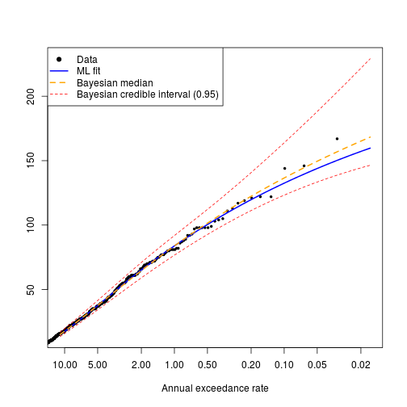
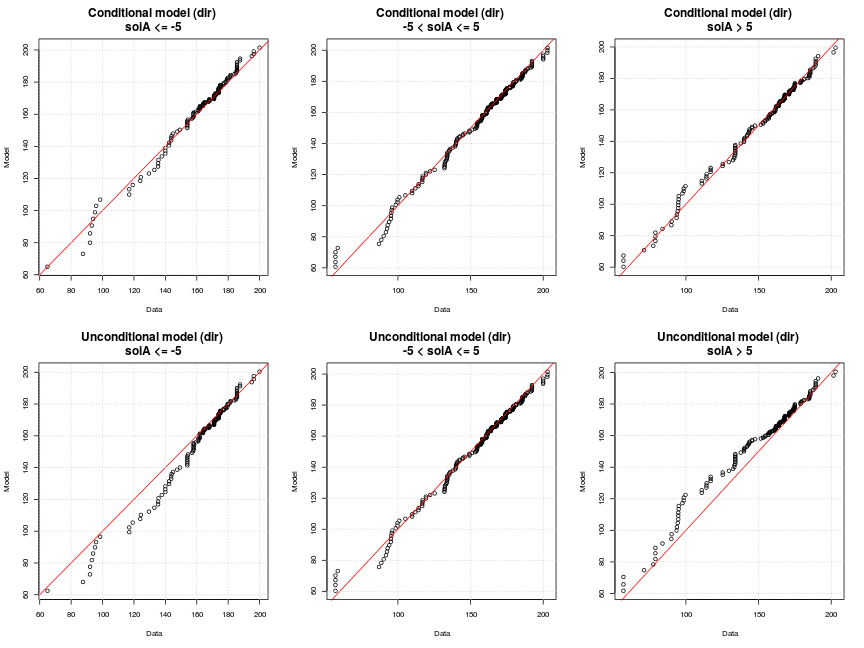

# **Modelling the univariate distributions of storm event statistics**
--------------------------------------------------------------------------

*Gareth Davies, Geoscience Australia 2017*

# Introduction
------------------

This document follows on from
[statistical_model_storm_timings.md](statistical_model_storm_timings.md)
in describing our statistical analysis of storm waves at Old Bar. 

It illustrates the process of fitting probability distributions to the storm event summary statistics,
which are conditional on the time of year and ENSO.

It is essential that the code
[statistical_model_storm_timings.md](statistical_model_storm_timings.md) has
alread been run, and produced an Rdata file
*'Rimages/session_storm_timings_XXXX.Rdata'*, where XXXX contains information on 
whether data perturbation was applied.


Supposing the prerequisites have been run, and you have R installed,
along with all the packages required to run this code, and a copy of the
*stormwavecluster* git repository, then you should be able to re-run the
analysis here by simply copy-pasting the code. Alternatively, it can be run
with the `knit` command in the *knitr* package: 

```r
library(knitr)
knit('statistical_model_univariate_distributions.Rmd')
```

To run the code in tie-breaking mode, be sure to pass the a command-line
argument matching `break_ties` to R when starting, followed by an integer ID > 0,
e.g.

    R --args --break_ties 1234

or

    Rscript script_name_here.R --break_ties 1234

Running the above commands many times is facilitated by scripts in
[../statistical_model_fit_perturbed_data/README.md](../statistical_model_fit_perturbed_data/README.md)

The basic approach followed here is to:
* **Step 1: Load the previous session**
* **Step 2: Exploratory analysis of seasonal non-stationarity in event statistics**
* **Step 3: Model the distribution of each storm summary statistic, dependent on season (and mean annual SOI for wave direction)**

Later we will model the remaining joint dependence between these variables, and
simulate synthetic storm sequences. 

# **Step 1: Load the previous session and set some key parameters**

Here we re-load the session from the previous stage of the modelling. We also
set some parameters controlling the Monte-Carlo Markov-Chain (MCMC) computations 
further in the document. 
* The default parameter values should be appropriate for the analysis
herein. To save computational effort (for testing purposes) users might reduce
the `mcmc_chain_length`. To reduce memory usage, users can increase the
`mcmc_chain_thin` parameter. If using other datasets, it may be necessary to
increase the `mcmc_chain_length` to get convergence.
* The code is also setup to run using a previous session with data ties broken
at random. See
[../statistical_model_fit_perturbed_data/README.md](../statistical_model_fit_perturbed_data/README.md)
for information on how to do this.


```r
# Here we support multiple runs with random tie-breaking of the data
# If R was passed a commandline argument 'break_ties n' on startup (with n = integer),
# then read the n'th R session matching 'Rimages/session_storm_timings_TRUE_*.Rdata'.
# That session will correspond to one of the tie-breaking sessions
if( length(grep('break_ties', commandArgs(trailingOnly=TRUE))) > 0 ){
    # Found --break_ties command line argument

    break_ties_with_jitter = TRUE

    # Read one of the sessions with tie-breaking
    session_n = as.numeric(commandArgs(trailingOnly=TRUE)[2])

    if(session_n < 1) stop('Invalid run ID')

    # In this case, only run 1 mcmc chain on 1 core [since we will check many
    # tie-breaking sessions]
    mcmc_nchains = 1
    mcmc_ncores = 1

    mcmc_chain_length = 2e+06 # One long chain

}else{
    # No tie-breaking -- using 'raw' data

    break_ties_with_jitter = FALSE
    session_n = 0

    # In this case, run more chains in parallel.
    mcmc_nchains = 6
    mcmc_ncores = 6

    # However, the parallel framework used here does not work on windows,
    # so if running windows, only use 1 core
    if(.Platform$OS.type == 'windows') mcmc_ncores = 1

    # Length of each MCMC chain. Should be 'large' e.g 10^6, except for test runs 
    # We run multiple chains to enhance the likelihood of detecting non-convergence
    # since anyway this is cheap in parallel. These are pooled for final estimates,
    # but it is essential to manually check the convergence of the chains [e.g.
    # by comparing high return period confidence intervals].
    mcmc_chain_length = 1e+06 #1e+05 

}

# Make a 'title' which can appear in filenames to identify this run
run_title_id = paste0(break_ties_with_jitter, '_', session_n)

previous_R_session_file = paste0('Rimages/session_storm_timings_', run_title_id, 
    '.Rdata')
load(previous_R_session_file)

# To reduce the data size, we can throw away all but a fraction of the mcmc
# chains. This has computational (memory) benefits if the MCMC samples are
# strongly autocorrelated, but no other advantages.
mcmc_chain_thin = 20 
```

# **Step 2: Exploratory analysis of seasonal non-stationarity in event statistics**
----------------------------------------------------------------------

**Here we plot the distribution of each storm statistic by month.** This
highlights the seasonal non-stationarity. Below we will take some steps to
check the statistical significance of this, and later will use copula-based
techniques to make the modelled univariate distribution of each variable
conditional on the time of year.

```r
# Get month as 1, 2, ... 12
month_num = as.numeric(format(event_statistics$time, '%m'))
par(mfrow=c(3,2))
for(i in 1:5){
    boxplot(event_statistics[,i] ~ month_num, xlab='Month', 
        ylab=names(event_statistics)[i], names=month.abb,
        col='grey')
    title(main = names(event_statistics)[i], cex.main=2)
}

rm(month_num)
```


To model the seasonal non-stationarity illustrated above, we define a seasonal
variable periodic in time, of the form `cos(2*pi*(t - offset))` where the time
`t` is in years. The `offset` is a phase variable which can be optimised for
each storm summary statistic separately, to give the 'best' cosine seasonal
pattern matching the data. One way to do this is to find the value of `offset`
which maximises the rank-correlation between each storm variable and the seasonal
variable.

**Below we compute the offset for each storm summary statistic, and also assess
it's statistical significance using a permutation test.** The figure shows the
rank correlation between each variable and a seasonal variable, for each value
of `offset` in [-0.5, 0.5] (which represents all possible values). Note the
`offset` value with the strongest rank correlation may be interpreted as the
optimal offset (*here we choose the `offset` with largest negative rank
correlation, so many `offset`'s are close to zero*). 


```r
# Store some useful statistics
stat_store = data.frame(var = rep(NA, 5), phi=rep(NA,5), cor = rep(NA, 5), 
    p = rep(NA, 5), cor_05=rep(NA, 5))
stat_store$var = names(event_statistics)[1:5]

# Test these values of the 'offset' parameter
phi_vals = seq(-0.5, 0.5, by=0.01)
par(mfrow=c(3,2))
for(i in 1:5){

    # Compute spearman correlation for all values of phi, for variable i
    corrs = phi_vals*0
    for(j in 1:length(phi_vals)){
        corrs[j] =  cor(event_statistics[,i], 
            cos(2*pi*(event_statistics$startyear - phi_vals[j])),
            method='s', use='pairwise.complete.obs')
    }

    plot(phi_vals, corrs, xlab='Offset', ylab='Spearman Correlation', 
        main=names(event_statistics)[i], cex.main=2,
        cex.lab=1.5)
    grid()
    abline(v=0, col='orange')

    # Save the 'best' result
    stat_store$phi[i] = phi_vals[which.min(corrs)]
    stat_store$cor[i] = min(corrs)

    # Function to compute the 'best' correlation of season with
    # permuted data, which by definition has no significant correlation with
    # the season. We can use this to assess the statistical significance of the
    # observed correlation between each variable and the season.
    cor_phi_function<-function(i0=i){
        # Resample the data
        d0 = sample(event_statistics[,i0], size=length(event_statistics[,i0]), 
            replace=TRUE)
        # Correlation function
        g<-function(phi){ 
            cor(d0, cos(2*pi*(event_statistics$startyear - phi)), 
                method='s', use='pairwise.complete.obs')
        }
        # Find best 'phi'
        best_phi = optimize(g, c(-0.5, 0.5), tol=1.0e-06)$minimum

        return(g(best_phi))
    }
   
    # Let's get statistical significance 
    cor_boot = replicate(5000, cor_phi_function())

    # Because our optimizer minimises, the 'strongest' correlations
    # it finds are negative. Of course if 0.5 is added to phi this is equivalent
    # to a positive correlation. 
    
    qcb = quantile(cor_boot, 0.05, type=6)
    stat_store$cor_05[i] = qcb
    stat_store$p[i] = mean(cor_boot < min(corrs))

    polygon(rbind( c(-1, -qcb), c(-1, qcb), c(1, qcb), c(1, -qcb)),
        col='brown', density=10)
}

dir.create('stat_store', showWarnings=FALSE)
write.table(stat_store, 
    file=paste0('stat_store/seasonal_correlation_statistics_', run_title_id, '.csv'), 
    sep="  &  ",
    quote=FALSE, row.names=FALSE)

rm(phi_vals, corrs)
```


In the above figure, the shaded region represents a 95% interval for the best
correlation expected of 'random' data (i.e. a random sample of the original
data with an optimized offset).  Correlations outside the shaded interval are
unlikely to occur at random, and are intepreted as reflecting true seasonal
non-stationarity. 

Below we will make each storm summary statistic dependent on the seasonal
variable. For wave direction, the mean annual SOI value will also be treated.
Recall that relationships between mean annual SOI and storm wave direction
were established earlier (
[../preprocessing/extract_storm_events.md](../preprocessing/extract_storm_events.md),
[statistical_model_storm_timings.md](statistical_model_storm_timings.md) ). We
also found relationships between mean annual SOI and the rate of storms, and
MSL, which were treated in those sections (using the non-homogeneous poisson
process model, and the STL decomposition, respectively). Therefore, the latter
relationships are not treated in the section below, but they are included in
the overall model.


# **Step 3: Model the distribution of each storm summary statistic, dependent on season (and mean annual SOI for wave direction)**

In this section we model the distribution of each storm summary statistic, and
then make it conditional on the seasonal variable (and on mean annual SOI in
the case of wave direction only). 

The distributions of `hsig`, `duration` and `tideResid` are initially modelled
as extreme value mixture distributions. The distributions of `dir` and
`steepness` are initially modelled using non-parametric smoothing (based on the
log-spline method).

## Hsig

**Below we fit an extreme value mixture model to Hsig, using maximum
likelihood.** The model has a GPD upper tail, and a Gamma lower tail.

```r
# Get the exmix_fit routines in their own environment
evmix_fit = new.env()
source('../../R/evmix_fit/evmix_fit.R', local=evmix_fit, chdir=TRUE)

# Define the minimum possible value of hsig. The gamma distribution has a lower
# bound of 0, so we need to offset the data to match this. Note that even if hsig
# was perturbed, we account for that in defining hsig_threshold
hsig_offset = hsig_threshold

# Fit it
hsig_mixture_fit = evmix_fit$fit_gpd_mixture(
    data=event_statistics$hsig, 
    data_offset=hsig_offset, 
    bulk='gamma')
```

```
## [1] "  evmix fit NLLH: " "518.713140710555"  
## [1] "Warning: all iterations used"
## [1] "  fit_optim NLLH: " "518.713140596953"  
## [1] "  Bulk par estimate0: " "0.842162501418341"     
## [3] "1.01609622350921"       "1.27053769881576"      
## [5] "-0.214369193836053"    
## [1] "           estimate1: " "0.842159241658271"     
## [3] "1.01609240686169"       "1.27050586311419"      
## [5] "-0.214364006061649"    
## [1] "  Difference: "        "3.25976006920747e-06"  "3.81664751314403e-06" 
## [4] "3.18357015749449e-05"  "-5.18777440447482e-06"
## [1] "PASS: checked qfun and pfun are inverse functions"
```

```r
#
# Make sure parameters are within constraints
#
# Prevent the threshold parameter from exceeding the highest 50th data point
# Note that inside the fitting routine, Hsig was transformed to have lower
# bound of slightly above zero before fitting, since the Gamma distribution has
# a lower bound of zero. Hence we subtract hsig_offset here.
hsig_u_upper_limit = sort(event_statistics$hsig, decreasing=TRUE)[50] - hsig_offset
hsig_u_lower_limit = hsig_threshold - hsig_offset # Should be 0
# Lower /upper bounds of parameter ranges
lb = c(0, 0, hsig_u_lower_limit, -Inf)
ub = c(Inf, Inf, hsig_u_upper_limit, Inf)
# Starting parameters
start_par = hsig_mixture_fit$fit_optim$par
if( (start_par[3] > hsig_u_upper_limit) | (start_par[3] < hsig_u_lower_limit)){
    start_par[3] = 0.5*(hsig_u_lower_limit + hsig_u_upper_limit)
}
# Do the constrained fit, and update the key information in hsig_mixture_fit with this
evmix_fit$constrained_fit_gpd_mixture(hsig_mixture_fit, 
    lower_bounds = lb, 
    upper_bounds= ub, 
    start_par = start_par, 
    replace_quantile_and_inverse_quantile_functions=TRUE)
```

```
## [1] "PASS: checked qfun and pfun are inverse functions"
```

```r
print(hsig_mixture_fit$fit_optim)
```

```
## $par
## [1]  0.8421592  1.0160924  1.2705059 -0.2143640
## 
## $value
## [1] 518.7131
## 
## $counts
## function gradient 
##       85       NA 
## 
## $convergence
## [1] 0
## 
## $message
## NULL
```

```r
# Make a plot
DU$qqplot3(event_statistics$hsig, hsig_mixture_fit$qfun(runif(100000)), 
    main='Hsig QQ-plot')
abline(0, 1, col='red'); grid()
```


The above code leads to print-outs of the maximum likelihood parameter fits
achieved by different methods, and the differences between them (which are only
a few parts per million in this case). Because fitting extreme value mixture
models can be challenging, internally the code tries many different fits.

During the fitting process, we also compute quantile and inverse quantile
functions for the fitted distribution. The code checks numerically that these
really are the inverse of each other, and will print information about whether
this was found to be true (*if not, there is a problem!*)

The quantile-quantile plot of the observed and fitted Hsig should fall close to
a straight line, if the fit worked. Poor fits are suggested by strong
deviations from the 1:1 line. While in this case the fit looks good, if the fit
is poor then further analysis is required. For example, it is possible that the
model fit did not converge, or that the statistical model is a poor choice for
the data.

Given that the above fit looks OK, **below we use Monte-Carlo-Markov-Chain
(MCMC) techniques to compute the Bayesian posterior distribution of the 4 model
parameters**. A few points about this process:
* The prior probability is uniform for each variable. Here we use
a very broad uniform distribution to represent an approximately
'non-informative' prior. The Gamma distribution parameters have uniform prior
over [0, 100 000 000]. The GPD threshold parameter prior is uniform
from zero to the 50th highest data point (to ensure that the tail
part of the model is fit using at least 50 data points). The GPD shape parameter
prior is uniform over [-1000 , 1000]. Note that for some other datasets, it
might be necessary to constrain the GPD shape parameter prior more strongly
than we do below, if it cannot be well estimated from the data (e.g. see the
literature). Overall we are aiming to make our priors reasonably
'non-informative', while still imposing pragmatic constraints required to
achieve a reasonable fit. 
* The routines update the object `hsig_mixture_fit`, so it contains
multiple chains, i.e. 'random walks' through the posterior parameter
distribution.
* Here we run 6 separate chains, with randomly chosen starting parameters, to
make it easier to detect non-convergence (i.e. to reduce the chance that a
single chain gets 'stuck' in part of the posterior distribution). The parameter
`mcmc_start_perturbation` defines the scale for that perturbation.
* It is possible that the randomly chosen start parameters are theoretically
impossible. In this case, the code will report that it had `Bad random start
parameters`, and will generate new ones.
* We use a burn-in of 1000 (i.e. the first 1000 entries in the chain are
discarded). This can assist with convergence.
* We make a simple diagnostic plot to check the MCMC convergence.
* The code runs in parallel, using 6 cores below. The parallel framework will
only work correctly on a shared memory linux machine.

```r
#' MCMC computations for later uncertainty characterisation

# Compute the MCMC chains in parallel
hsig_mixture_fit = evmix_fit$mcmc_gpd_mixture(
    fit_env=hsig_mixture_fit, 
    par_lower_limits=c(0, 0, hsig_u_lower_limit, -1000.), 
    par_upper_limits=c(1e+08, 1.0e+08, hsig_u_upper_limit, 1000),
    mcmc_start_perturbation=c(0.4, 0.4, 2., 0.2), 
    mcmc_length=mcmc_chain_length,
    mcmc_thin=mcmc_chain_thin,
    mcmc_burnin=1000,
    mcmc_nchains=mcmc_nchains,
    mcmc_tune=c(1,1,1,1)*1,
    mc_cores=mcmc_ncores,
    annual_event_rate=mean(events_per_year_truncated))

# Graphical convergence check of one of the chains. 
plot(hsig_mixture_fit$mcmc_chains[[1]])
```


**Below, we investigate the parameter estimates for each chain.** If all the
changes have converged, the quantiles of each parameter estimate should be
essentially the same (although if the underlying posterior distribution is
unbounded, then of course the min/max will not converge, although all other
quantiles eventually will). We also look at the 1/100 year event Hsig implied
by each chain, and make a return level plot.

```r
# Look at mcmc parameter estimates in each chain
lapply(hsig_mixture_fit$mcmc_chains, f<-function(x) summary(as.matrix(x)))
```

```
## [[1]]
##       var1             var2             var3              var4        
##  Min.   :0.6345   Min.   :0.7249   Min.   :0.03396   Min.   :-0.4473  
##  1st Qu.:0.8149   1st Qu.:0.9577   1st Qu.:1.07680   1st Qu.:-0.2499  
##  Median :0.8449   Median :1.0095   Median :1.34481   Median :-0.2008  
##  Mean   :0.8449   Mean   :1.0199   Mean   :1.33276   Mean   :-0.1977  
##  3rd Qu.:0.8749   3rd Qu.:1.0679   3rd Qu.:1.62711   3rd Qu.:-0.1476  
##  Max.   :1.0699   Max.   :2.0194   Max.   :2.14750   Max.   : 0.1806  
## 
## [[2]]
##       var1             var2             var3              var4        
##  Min.   :0.6312   Min.   :0.7331   Min.   :0.05327   Min.   :-0.4632  
##  1st Qu.:0.8152   1st Qu.:0.9580   1st Qu.:1.08927   1st Qu.:-0.2513  
##  Median :0.8451   Median :1.0088   Median :1.35105   Median :-0.2017  
##  Mean   :0.8454   Mean   :1.0180   Mean   :1.34153   Mean   :-0.1988  
##  3rd Qu.:0.8752   3rd Qu.:1.0658   3rd Qu.:1.63389   3rd Qu.:-0.1491  
##  Max.   :1.0548   Max.   :1.8240   Max.   :2.14740   Max.   : 0.3751  
## 
## [[3]]
##       var1             var2             var3              var4        
##  Min.   :0.6538   Min.   :0.7458   Min.   :0.04235   Min.   :-0.4672  
##  1st Qu.:0.8149   1st Qu.:0.9578   1st Qu.:1.08178   1st Qu.:-0.2499  
##  Median :0.8451   Median :1.0086   Median :1.34846   Median :-0.2014  
##  Mean   :0.8453   Mean   :1.0185   Mean   :1.33651   Mean   :-0.1982  
##  3rd Qu.:0.8755   3rd Qu.:1.0661   3rd Qu.:1.62951   3rd Qu.:-0.1488  
##  Max.   :1.0433   Max.   :1.9448   Max.   :2.14748   Max.   : 0.2266  
## 
## [[4]]
##       var1             var2             var3               var4        
##  Min.   :0.6208   Min.   :0.7274   Min.   :0.006049   Min.   :-0.4427  
##  1st Qu.:0.8148   1st Qu.:0.9577   1st Qu.:1.077910   1st Qu.:-0.2494  
##  Median :0.8451   Median :1.0088   Median :1.345139   Median :-0.2005  
##  Mean   :0.8450   Mean   :1.0198   Mean   :1.332114   Mean   :-0.1976  
##  3rd Qu.:0.8754   3rd Qu.:1.0670   3rd Qu.:1.626746   3rd Qu.:-0.1482  
##  Max.   :1.0365   Max.   :2.0397   Max.   :2.147451   Max.   : 0.3508  
## 
## [[5]]
##       var1             var2             var3              var4        
##  Min.   :0.6657   Min.   :0.7543   Min.   :0.02511   Min.   :-0.4412  
##  1st Qu.:0.8154   1st Qu.:0.9581   1st Qu.:1.08518   1st Qu.:-0.2502  
##  Median :0.8451   Median :1.0083   Median :1.34752   Median :-0.2014  
##  Mean   :0.8454   Mean   :1.0180   Mean   :1.33838   Mean   :-0.1985  
##  3rd Qu.:0.8752   3rd Qu.:1.0659   3rd Qu.:1.62995   3rd Qu.:-0.1490  
##  Max.   :1.0419   Max.   :1.7232   Max.   :2.14743   Max.   : 0.3661  
## 
## [[6]]
##       var1             var2             var3               var4        
##  Min.   :0.6122   Min.   :0.7245   Min.   :0.008775   Min.   :-0.4485  
##  1st Qu.:0.8145   1st Qu.:0.9578   1st Qu.:1.081616   1st Qu.:-0.2501  
##  Median :0.8449   Median :1.0093   Median :1.343468   Median :-0.2011  
##  Mean   :0.8448   Mean   :1.0207   Mean   :1.331804   Mean   :-0.1981  
##  3rd Qu.:0.8752   3rd Qu.:1.0676   3rd Qu.:1.626445   3rd Qu.:-0.1487  
##  Max.   :1.0669   Max.   :2.2381   Max.   :2.147455   Max.   : 0.2542
```

```r
# Look at ari 100 estimates
lapply(hsig_mixture_fit$ari_100_chains, 
    f<-function(x) quantile(x, p=c(0.025, 0.5, 0.975)))
```

```
## [[1]]
##     2.5%      50%    97.5% 
## 7.071843 7.568026 8.974433 
## 
## [[2]]
##     2.5%      50%    97.5% 
## 7.071621 7.564434 8.954013 
## 
## [[3]]
##     2.5%      50%    97.5% 
## 7.072912 7.565049 8.953236 
## 
## [[4]]
##     2.5%      50%    97.5% 
## 7.071677 7.568229 8.994882 
## 
## [[5]]
##     2.5%      50%    97.5% 
## 7.072614 7.562859 8.970660 
## 
## [[6]]
##     2.5%      50%    97.5% 
## 7.072499 7.565251 8.970493
```

```r
# Look at model prediction of the maximum observed value
# (supposing we observed the system for the same length of time as the data covers)
lapply(hsig_mixture_fit$ari_max_data_chains, 
    f<-function(x) quantile(x, p=c(0.025, 0.5, 0.975)))
```

```
## [[1]]
##     2.5%      50%    97.5% 
## 6.819278 7.203278 8.177789 
## 
## [[2]]
##     2.5%      50%    97.5% 
## 6.818861 7.202177 8.156634 
## 
## [[3]]
##     2.5%      50%    97.5% 
## 6.817704 7.202738 8.151112 
## 
## [[4]]
##     2.5%      50%    97.5% 
## 6.818004 7.203262 8.185996 
## 
## [[5]]
##     2.5%      50%    97.5% 
## 6.817758 7.201088 8.165061 
## 
## [[6]]
##     2.5%      50%    97.5% 
## 6.818411 7.202330 8.173064
```

```r
# If the chains are well behaved, we can combine all 
summary(hsig_mixture_fit$combined_chains)
```

```
##        V1               V2               V3                 V4         
##  Min.   :0.6122   Min.   :0.7245   Min.   :0.006049   Min.   :-0.4672  
##  1st Qu.:0.8149   1st Qu.:0.9579   1st Qu.:1.082160   1st Qu.:-0.2501  
##  Median :0.8450   Median :1.0089   Median :1.346587   Median :-0.2011  
##  Mean   :0.8451   Mean   :1.0192   Mean   :1.335518   Mean   :-0.1982  
##  3rd Qu.:0.8752   3rd Qu.:1.0667   3rd Qu.:1.628822   3rd Qu.:-0.1485  
##  Max.   :1.0699   Max.   :2.2381   Max.   :2.147498   Max.   : 0.3751
```

```r
# If the chains are well behaved then we might want a merged 1/100 hsig
quantile(hsig_mixture_fit$combined_ari100, c(0.025, 0.5, 0.975))
```

```
##     2.5%      50%    97.5% 
## 7.072214 7.565556 8.969881
```

```r
# This is an alternative credible interval -- the 'highest posterior density' interval.
HPDinterval(as.mcmc(hsig_mixture_fit$combined_ari100))
```

```
##         lower    upper
## var1 6.982652 8.677569
## attr(,"Probability")
## [1] 0.95
```

```r
evmix_fit$mcmc_rl_plot(hsig_mixture_fit)
```


**Here we use a different technique to compute the 1/100 AEP Hsig, as a
cross-check on the above analysis.** A simple Generalised Extreme Value model
fit to annual maxima is undertaken. While this technique is based on limited
data (i.e. only one observation per year), it is not dependent on our storm
event definition or choice of wave height threshold. In this sense it is quite
different to our peaks-over-threshold method above -- and thus serves as a
useful cross-check on the former results. 

```r
# Here we do an annual maximum analysis with a gev
# This avoids issues with event definition
annual_max_hsig = aggregate(event_statistics$hsig, 
    list(year=floor(event_statistics$startyear)), max)
# Remove the first and last years with incomplete data
keep_years = which(annual_max_hsig$year %in% 1986:2015)
library(ismev)
```

```
## Loading required package: mgcv
```

```
## Loading required package: nlme
```

```
## This is mgcv 1.8-12. For overview type 'help("mgcv-package")'.
```

```r
gev_fit_annual_max = gev.fit(annual_max_hsig[keep_years,2])
```

```
## $conv
## [1] 0
## 
## $nllh
## [1] 31.07656
## 
## $mle
## [1]  5.4962086  0.6511133 -0.2123074
## 
## $se
## [1] 0.1366988 0.1018133 0.1593190
```

```r
gev.prof(gev_fit_annual_max, m=100, xlow=6.5, xup=12, conf=0.95)
```

```
## If routine fails, try changing plotting interval
```

```r
title(main='Profile likehood confidence interval for 1/100 AEP Hsig \n using a GEV fit to annual maxima')
# Add vertical lines at the limits of the 95% interval
abline(v=c(6.97, 10.4), col='red', lty='dashed')
# Add vertical line at ML estimate
abline(v=7.4, col='orange')
```


**Here we use copulas to determine a distribution for Hsig, conditional on the season**.
The computational details are wrapped up in a function that we source.
Essentially, the code:
* Finds the optimal seasonal `offset` for the chosen variable (`hsig`), and uses
this to create a function to compute the season statistic (which is `hsig`
specific) from the event time of year.
* Automatically chooses a copula family (based on AIC) to model dependence
between the chosen variable and the season variable, and fits the copula.
* Uses the copula to create new quantile and inverse quantile functions, for
which the user can pass conditional variables (i.e. to get the distribution,
given that the season variable attains a particular value).
* Test that the quantile and inverse quantile functions really are inverses of
each other (this can help catch user input errors)
* Make quantile-quantile plots of the data and model for a number of time
periods (here the first, middle and last thirds of the calendar year). The top
row shows the model with the distribution varying by season, and the bottom row
shows the model without seasonal effects. It is not particularly easy to
visually detect seasonal non-stationarities in these plots [compared, say, with
using monthly boxplots].  Their main purpose is compare the model and data
distribution at different times of year, and so detect poor model fits.
However, you might notice that the top row of plots 'hug' the 1:1 line slightly
better than corresponding plots in the bottom row in the central data values.
This reflects the modelled seasonal non-stationarities. *Note the tail behaviour
can be erratic, since the 'model' result is actually a random sample from the model.*

```r
# Get code to fit the conditional distribution
# Give a path that will also work if run from another directory inside Analysis.
source('../../Analysis/statistical_model_fit/make_conditional_distribution.R', chdir=TRUE)

# This returns an environment containing the conditional quantile and inverse
# quantile functions, among other information
hsig_fit_conditional = make_fit_conditional_on_season(
    event_statistics,
    var='hsig', 
    q_raw=hsig_mixture_fit$qfun, 
    p_raw=hsig_mixture_fit$pfun,
    startyear = 'startyear')
```

```
## [1] "Conditional p/q functions passed test: "
## [1] "  (Check plots to see if quantiles are ok)"
```


```r
# What kind of copula was selected to model dependence between season and hsig?
print(hsig_fit_conditional$var_season_copula)
```

```
## Bivariate copula: Gaussian (par = -0.13, tau = -0.08)
```


## Duration

Here we model storm `duration`, using techniques virtually identical to those applied above.
As before:
* We first fit the univariate extreme value mixture distribution with maximum
likelihood; 
* Next we compute the posterior distribution of each parameter; 
* Finally we make the `duration` distribution conditional on the time of year,
using a seasonal variable that has been optimised to capture seasonality in the
storm `duration`.

**Here is the extreme value mixture model maximum likelihood fit**

```r
# Do the maximum likelihood fit. 
#
# Set the lower limit of the tail model to just below the lower limit of the
# data, in the event we perturb it by half an hour. [Initial lower limit = 1hr]
# However, if working with the 'raw' data, we should not set the lower limit to 1hr,
# since the latter is actually a data value, so some lower bound must be selected.
duration_offset = ifelse(break_ties_with_jitter, 
    1 - as.numeric(default_jitter_amounts['duration']), 
    0.5) 

duration_mixture_fit = evmix_fit$fit_gpd_mixture(
    data=event_statistics$duration, 
    data_offset=duration_offset, 
    bulk='gamma')
```

```
## Warning in FUN(X[[i]], ...): initial parameter values for threshold u = 0.5
## are invalid

## Warning in FUN(X[[i]], ...): initial parameter values for threshold u = 0.5
## are invalid
```

```
## [1] "  evmix fit NLLH: " "2752.84379433546"  
## [1] "  fit_optim NLLH: " "2752.84379427367"  
## [1] "  Bulk par estimate0: " "0.693823596763882"     
## [3] "35.9454038109696"       "48.0295299401044"      
## [5] "-0.163363982336055"    
## [1] "           estimate1: " "0.693829686546937"     
## [3] "35.9454043148681"       "48.0295307213169"      
## [5] "-0.163372906989212"    
## [1] "  Difference: "        "-6.08978305538521e-06" "-5.03898476722497e-07"
## [4] "-7.81212513345508e-07" "8.92465315702196e-06" 
## [1] "PASS: checked qfun and pfun are inverse functions"
```

```r
#
# Make sure parameters are within constraints
#
# Prevent the threshold parameter from exceeding the highest 50th data point
duration_u_upper_limit = sort(event_statistics$duration, decreasing=TRUE)[50] - duration_offset
duration_u_lower_limit = 0

# Lower /upper bounds of parameter ranges
lb = c(0, 0, duration_u_lower_limit, -Inf)
ub = c(Inf, Inf, duration_u_upper_limit, Inf)
# Starting parameters
start_par = duration_mixture_fit$fit_optim$par
if( (start_par[3] > duration_u_upper_limit) | (start_par[3] < duration_u_lower_limit)){
    start_par[3] = 0.5*(duration_u_lower_limit + duration_u_upper_limit)
    start_par[4] = 0
}
# Do the constrained fit, and update the key information in duration_mixture_fit with this
evmix_fit$constrained_fit_gpd_mixture(duration_mixture_fit, 
    lower_bounds = lb, 
    upper_bounds= ub, 
    start_par = start_par, 
    replace_quantile_and_inverse_quantile_functions=TRUE)
```

```
## [1] "PASS: checked qfun and pfun are inverse functions"
```

```r
print(duration_mixture_fit$fit_optim)
```

```
## $par
## [1]  0.6938297 35.9454043 48.0295307 -0.1633729
## 
## $value
## [1] 2752.844
## 
## $counts
## function gradient 
##       95       NA 
## 
## $convergence
## [1] 0
## 
## $message
## NULL
```

```r
# Make a plot
DU$qqplot3(event_statistics$duration, duration_mixture_fit$qfun(runif(100000)), 
    main='Duration QQ-plot')
abline(0, 1, col='red'); grid()
```


**Here is the extreme value mixture model posterior probability computation, using MCMC**
As before, note that we run a number of MCMC chains with random starting values, and in 
the event that the random starting parameters are invalid the code will simply try new ones.

```r
# MCMC computations for later uncertainty characterisation

# Compute the MCMC chains in parallel.
duration_mixture_fit = evmix_fit$mcmc_gpd_mixture(
    fit_env=duration_mixture_fit, 
    par_lower_limits=c(0, 0, duration_u_lower_limit, -1000.), 
    par_upper_limits=c(1e+08, 1.0e+08, duration_u_upper_limit, 1000),
    mcmc_start_perturbation=c(0.4, 0.4, 2., 0.2), 
    mcmc_length=mcmc_chain_length,
    mcmc_thin=mcmc_chain_thin,
    mcmc_burnin=1000,
    mcmc_nchains=mcmc_nchains,
    mcmc_tune=c(1,1,1,1)*1,
    mc_cores=mcmc_ncores,
    annual_event_rate=mean(events_per_year_truncated))

# Graphical convergence check of one of the chains. 
plot(duration_mixture_fit$mcmc_chains[[1]])
```


**Here we check the similarity of all the MCMC chains, and make a return-level
plot for storm `duration`**

```r
# Look at mcmc parameter estimates in each chain
lapply(duration_mixture_fit$mcmc_chains, f<-function(x) summary(as.matrix(x)))
```

```
## [[1]]
##       var1             var2            var3             var4         
##  Min.   :0.5116   Min.   :26.56   Min.   : 3.389   Min.   :-0.37281  
##  1st Qu.:0.6650   1st Qu.:34.56   1st Qu.:30.129   1st Qu.:-0.17391  
##  Median :0.6891   Median :36.48   Median :44.972   Median :-0.11945  
##  Mean   :0.6890   Mean   :37.10   Mean   :42.470   Mean   :-0.11497  
##  3rd Qu.:0.7136   3rd Qu.:38.82   3rd Qu.:55.795   3rd Qu.:-0.06027  
##  Max.   :0.8434   Max.   :68.97   Max.   :70.500   Max.   : 0.30237  
## 
## [[2]]
##       var1             var2            var3             var4         
##  Min.   :0.5379   Min.   :26.04   Min.   : 3.298   Min.   :-0.35162  
##  1st Qu.:0.6650   1st Qu.:34.50   1st Qu.:30.712   1st Qu.:-0.17483  
##  Median :0.6896   Median :36.43   Median :45.216   Median :-0.11891  
##  Mean   :0.6894   Mean   :37.01   Mean   :42.724   Mean   :-0.11527  
##  3rd Qu.:0.7143   3rd Qu.:38.76   3rd Qu.:55.914   3rd Qu.:-0.06059  
##  Max.   :0.8535   Max.   :64.19   Max.   :70.500   Max.   : 0.39020  
## 
## [[3]]
##       var1             var2            var3            var4         
##  Min.   :0.5032   Min.   :26.96   Min.   : 3.31   Min.   :-0.35819  
##  1st Qu.:0.6649   1st Qu.:34.51   1st Qu.:30.57   1st Qu.:-0.17484  
##  Median :0.6896   Median :36.46   Median :45.29   Median :-0.11943  
##  Mean   :0.6892   Mean   :37.07   Mean   :42.70   Mean   :-0.11544  
##  3rd Qu.:0.7141   3rd Qu.:38.79   3rd Qu.:55.98   3rd Qu.:-0.06149  
##  Max.   :0.8430   Max.   :71.79   Max.   :70.50   Max.   : 0.45229  
## 
## [[4]]
##       var1             var2            var3            var4         
##  Min.   :0.5288   Min.   :26.50   Min.   : 3.64   Min.   :-0.35466  
##  1st Qu.:0.6648   1st Qu.:34.52   1st Qu.:30.63   1st Qu.:-0.17401  
##  Median :0.6895   Median :36.47   Median :45.01   Median :-0.11963  
##  Mean   :0.6893   Mean   :37.04   Mean   :42.62   Mean   :-0.11513  
##  3rd Qu.:0.7140   3rd Qu.:38.80   3rd Qu.:55.66   3rd Qu.:-0.06035  
##  Max.   :0.8540   Max.   :70.81   Max.   :70.50   Max.   : 0.56413  
## 
## [[5]]
##       var1             var2            var3             var4         
##  Min.   :0.5103   Min.   :26.79   Min.   : 3.132   Min.   :-0.34809  
##  1st Qu.:0.6647   1st Qu.:34.51   1st Qu.:30.299   1st Qu.:-0.17341  
##  Median :0.6893   Median :36.46   Median :45.020   Median :-0.11896  
##  Mean   :0.6888   Mean   :37.15   Mean   :42.464   Mean   :-0.11461  
##  3rd Qu.:0.7140   3rd Qu.:38.82   3rd Qu.:55.736   3rd Qu.:-0.05931  
##  Max.   :0.8481   Max.   :74.98   Max.   :70.498   Max.   : 0.34922  
## 
## [[6]]
##       var1             var2            var3             var4         
##  Min.   :0.5175   Min.   :26.97   Min.   : 3.465   Min.   :-0.36616  
##  1st Qu.:0.6651   1st Qu.:34.51   1st Qu.:30.596   1st Qu.:-0.17392  
##  Median :0.6895   Median :36.44   Median :45.198   Median :-0.11898  
##  Mean   :0.6893   Mean   :37.04   Mean   :42.698   Mean   :-0.11515  
##  3rd Qu.:0.7141   3rd Qu.:38.78   3rd Qu.:55.930   3rd Qu.:-0.06072  
##  Max.   :0.8457   Max.   :65.52   Max.   :70.497   Max.   : 0.38701
```

```r
# Look at ari 100 estimates
lapply(duration_mixture_fit$ari_100_chains, 
    f<-function(x) quantile(x, p=c(0.025, 0.5, 0.975)))
```

```
## [[1]]
##     2.5%      50%    97.5% 
## 151.3099 175.9107 248.3765 
## 
## [[2]]
##     2.5%      50%    97.5% 
## 151.0978 175.9700 248.1684 
## 
## [[3]]
##     2.5%      50%    97.5% 
## 151.0801 175.8886 248.6064 
## 
## [[4]]
##     2.5%      50%    97.5% 
## 151.2353 175.9091 248.3888 
## 
## [[5]]
##     2.5%      50%    97.5% 
## 151.2101 176.0127 248.0075 
## 
## [[6]]
##     2.5%      50%    97.5% 
## 151.1103 176.0477 247.6326
```

```r
# Look at model prediction of the maximum observed value
# (supposing we observed the system for the same length of time as the data covers)
lapply(duration_mixture_fit$ari_max_data_chains, 
    f<-function(x) quantile(x, p=c(0.025, 0.5, 0.975)))
```

```
## [[1]]
##     2.5%      50%    97.5% 
## 138.8206 156.8744 203.3792 
## 
## [[2]]
##     2.5%      50%    97.5% 
## 138.7355 156.9062 203.1099 
## 
## [[3]]
##     2.5%      50%    97.5% 
## 138.7335 156.8936 203.5422 
## 
## [[4]]
##     2.5%      50%    97.5% 
## 138.8151 156.8434 203.3431 
## 
## [[5]]
##     2.5%      50%    97.5% 
## 138.8228 156.8880 203.4148 
## 
## [[6]]
##     2.5%      50%    97.5% 
## 138.6952 156.9160 202.8402
```

```r
# If the chains seem ok, we can combine all 
summary(duration_mixture_fit$combined_chains)
```

```
##        V1               V2              V3               V4          
##  Min.   :0.5032   Min.   :26.04   Min.   : 3.132   Min.   :-0.37281  
##  1st Qu.:0.6649   1st Qu.:34.52   1st Qu.:30.483   1st Qu.:-0.17417  
##  Median :0.6894   Median :36.46   Median :45.118   Median :-0.11921  
##  Mean   :0.6892   Mean   :37.07   Mean   :42.613   Mean   :-0.11509  
##  3rd Qu.:0.7140   3rd Qu.:38.80   3rd Qu.:55.831   3rd Qu.:-0.06046  
##  Max.   :0.8540   Max.   :74.98   Max.   :70.500   Max.   : 0.56413
```

```r
# If the chains are well behaved then we might want a merged 1/100 duration
quantile(duration_mixture_fit$combined_ari100, c(0.025, 0.5, 0.975))
```

```
##     2.5%      50%    97.5% 
## 151.1723 175.9546 248.2398
```

```r
HPDinterval(as.mcmc(duration_mixture_fit$combined_ari100))
```

```
##         lower    upper
## var1 146.7875 233.0103
## attr(,"Probability")
## [1] 0.95
```

```r
# Return level plot
evmix_fit$mcmc_rl_plot(duration_mixture_fit)
```



**Finally we make the `duration` fit conditional on the time of year, using a
seasonal variable.** The seasonal QQ-plots below highlight the hourly
discretization in the `duration` data, which is prominent at low quantiles. It
is important to check whether this effects the analysis through randomization
of the data, which we undertake in the section
[../statistical_model_fit_pertubed_data](../statistical_model_fit_perturbed_data).

```r
# This returns an environment containing the conditional quantile and inverse
# quantile functions, among other information
duration_fit_conditional = make_fit_conditional_on_season(
    event_statistics,
    var='duration', 
    q_raw=duration_mixture_fit$qfun, 
    p_raw=duration_mixture_fit$pfun,
    startyear = 'startyear')
```

```
## [1] "Conditional p/q functions passed test: "
## [1] "  (Check plots to see if quantiles are ok)"
```


```r
# What kind of copula was selected to model dependence between season and duration?
print(duration_fit_conditional$var_season_copula)
```

```
## Bivariate copula: Gaussian (par = -0.15, tau = -0.1)
```

## Tidal residual

Here we generally follow the steps implemented above for `hsig` and `duration`,
for modelling the tidal residual `tideResid`. An important change is that we
fit an extreme value mixture model with a normal lower tail (instead of a Gamma
lower tail). This is done because unlike storm `hsig` and `duration`, there is
no natural lower limit on the `tideResid` [e.g.  it can even be negative on
occasion].


```r
# Manually remove missing (NA) data before fitting
tideResid_mixture_fit = evmix_fit$fit_gpd_mixture(
    data=na.omit(event_statistics$tideResid),  
    bulk='normal'
    )
```

```
## [1] "  evmix fit NLLH: " "-434.015589347918" 
## [1] "  fit_optim NLLH: " "-434.015589347918" 
## [1] "  Bulk par estimate0: " "0.117567196837009"     
## [3] "0.118302393045006"      "0.362604108928224"     
## [5] "0.344879093765551"     
## [1] "           estimate1: " "0.117567196837008"     
## [3] "0.118302393045007"      "0.362604108928237"     
## [5] "0.344879093765551"     
## [1] "  Difference: "        "1.59594559789866e-15"  "-4.44089209850063e-16"
## [4] "-1.2490009027033e-14"  "0"                    
## [1] "PASS: checked qfun and pfun are inverse functions"
```

```r
# Limit the threshold
tideResid_u_upper_limit = sort(event_statistics$tideResid, decreasing=TRUE)[50]
min_tr = min(event_statistics$tideResid, na.rm=TRUE)
tideResid_u_lower_limit = min_tr

# Lower /upper bounds of parameter ranges
lb = c(0, 0, tideResid_u_lower_limit, -Inf)
ub = c(Inf, Inf, tideResid_u_upper_limit, Inf)
# Starting parameters
start_par = tideResid_mixture_fit$fit_optim$par
if( (start_par[3] > tideResid_u_upper_limit) | (start_par[3] < tideResid_u_lower_limit)){
    start_par[3] = 0.5*(tideResid_u_lower_limit + tideResid_u_upper_limit)
    start_par[4] = 0
}
# Do the constrained fit, and update the key information in tideResid_mixture_fit with this
evmix_fit$constrained_fit_gpd_mixture(tideResid_mixture_fit, 
    lower_bounds = lb, 
    upper_bounds= ub, 
    start_par = start_par, 
    replace_quantile_and_inverse_quantile_functions=TRUE)
```

```
## [1] "PASS: checked qfun and pfun are inverse functions"
```

```r
print(tideResid_mixture_fit$fit_optim)
```

```
## $par
## [1]  0.11597829  0.11563793  0.21724881 -0.08796659
## 
## $value
## [1] -433.2304
## 
## $counts
## function gradient 
##      101       NA 
## 
## $convergence
## [1] 0
## 
## $message
## NULL
```

```r
# Make a plot
DU$qqplot3(na.omit(event_statistics$tideResid), 
    tideResid_mixture_fit$qfun(runif(100000)))
abline(0, 1, col='red')
grid()
```


Below is the MCMC computation of the posterior probability distribution.
As before, bad random starting parameters are rejected, with a warning.

```r
#' MCMC computations for later uncertainty characterisation
tideResid_mixture_fit = evmix_fit$mcmc_gpd_mixture(
    fit_env=tideResid_mixture_fit, 
    par_lower_limits=c(min_tr, 0, tideResid_u_lower_limit, -1000), 
    par_upper_limits=c(1e+08, 1e+08, tideResid_u_upper_limit, 1000),
    mcmc_start_perturbation=c(0.2, 0.2, 0.2, 0.3), 
    mcmc_length=mcmc_chain_length,
    mcmc_thin=mcmc_chain_thin,
    mcmc_burnin=1000,
    mcmc_nchains=mcmc_nchains,
    mcmc_tune=c(1,1,1,1)*1.,
    mc_cores=mcmc_ncores,
    annual_event_rate=mean(events_per_year_truncated))
```

```
## [1] "Warning: Original fit was not optimal"
## [1] "Better parameters are:"
## [1]  0.1154248  0.1144187  0.1973124 -0.1100628
## [1] "Adjusting fit_optim to reflect this"
## [1] "... and also updating fit_constrained, which assumes this Bayesian fit has the same constraints"
```

```r
# Graphical convergence check
plot(tideResid_mixture_fit$mcmc_chains[[1]])
```


```r
# Clean up
rm(min_tr)
```

**Here we further investigate the behaviour of the MCMC chains for the tidal
residual fit, and make a return-level plot**

```r
# Look at mcmc parameter estimates in each chain
lapply(tideResid_mixture_fit$mcmc_chains, f<-function(x) summary(as.matrix(x)))
```

```
## [[1]]
##       var1              var2             var3             var4         
##  Min.   :0.09661   Min.   :0.1003   Min.   :0.1065   Min.   :-0.25777  
##  1st Qu.:0.11269   1st Qu.:0.1136   1st Qu.:0.2036   1st Qu.:-0.10528  
##  Median :0.11593   Median :0.1162   Median :0.2335   Median :-0.05464  
##  Mean   :0.11594   Mean   :0.1162   Mean   :0.2329   Mean   :-0.03754  
##  3rd Qu.:0.11917   3rd Qu.:0.1188   3rd Qu.:0.2655   3rd Qu.: 0.01081  
##  Max.   :0.13581   Max.   :0.1344   Max.   :0.2917   Max.   : 0.74981  
## 
## [[2]]
##       var1              var2             var3             var4         
##  Min.   :0.09551   Min.   :0.1009   Min.   :0.1208   Min.   :-0.25179  
##  1st Qu.:0.11269   1st Qu.:0.1136   1st Qu.:0.2040   1st Qu.:-0.10498  
##  Median :0.11598   Median :0.1162   Median :0.2340   Median :-0.05456  
##  Mean   :0.11600   Mean   :0.1162   Mean   :0.2333   Mean   :-0.03689  
##  3rd Qu.:0.11926   3rd Qu.:0.1188   3rd Qu.:0.2660   3rd Qu.: 0.01184  
##  Max.   :0.13694   Max.   :0.1328   Max.   :0.2917   Max.   : 0.62250  
## 
## [[3]]
##       var1              var2              var3             var4         
##  Min.   :0.09467   Min.   :0.09993   Min.   :0.1137   Min.   :-0.24127  
##  1st Qu.:0.11267   1st Qu.:0.11357   1st Qu.:0.2037   1st Qu.:-0.10539  
##  Median :0.11593   Median :0.11614   Median :0.2338   Median :-0.05491  
##  Mean   :0.11595   Mean   :0.11616   Mean   :0.2331   Mean   :-0.03762  
##  3rd Qu.:0.11923   3rd Qu.:0.11876   3rd Qu.:0.2658   3rd Qu.: 0.01148  
##  Max.   :0.13770   Max.   :0.13188   Max.   :0.2917   Max.   : 0.66773  
## 
## [[4]]
##       var1              var2             var3             var4         
##  Min.   :0.09593   Min.   :0.1008   Min.   :0.1116   Min.   :-0.23447  
##  1st Qu.:0.11268   1st Qu.:0.1135   1st Qu.:0.2040   1st Qu.:-0.10471  
##  Median :0.11595   Median :0.1162   Median :0.2336   Median :-0.05434  
##  Mean   :0.11595   Mean   :0.1162   Mean   :0.2331   Mean   :-0.03732  
##  3rd Qu.:0.11922   3rd Qu.:0.1188   3rd Qu.:0.2657   3rd Qu.: 0.01118  
##  Max.   :0.13732   Max.   :0.1316   Max.   :0.2917   Max.   : 0.92623  
## 
## [[5]]
##       var1              var2             var3             var4         
##  Min.   :0.09668   Min.   :0.1005   Min.   :0.1086   Min.   :-0.23605  
##  1st Qu.:0.11270   1st Qu.:0.1136   1st Qu.:0.2034   1st Qu.:-0.10543  
##  Median :0.11592   Median :0.1162   Median :0.2334   Median :-0.05454  
##  Mean   :0.11595   Mean   :0.1162   Mean   :0.2328   Mean   :-0.03774  
##  3rd Qu.:0.11923   3rd Qu.:0.1188   3rd Qu.:0.2655   3rd Qu.: 0.01137  
##  Max.   :0.13796   Max.   :0.1319   Max.   :0.2917   Max.   : 0.60972  
## 
## [[6]]
##       var1             var2             var3             var4         
##  Min.   :0.0938   Min.   :0.1006   Min.   :0.1175   Min.   :-0.23513  
##  1st Qu.:0.1127   1st Qu.:0.1136   1st Qu.:0.2042   1st Qu.:-0.10455  
##  Median :0.1160   Median :0.1162   Median :0.2338   Median :-0.05437  
##  Mean   :0.1160   Mean   :0.1162   Mean   :0.2332   Mean   :-0.03768  
##  3rd Qu.:0.1192   3rd Qu.:0.1188   3rd Qu.:0.2656   3rd Qu.: 0.01016  
##  Max.   :0.1367   Max.   :0.1329   Max.   :0.2917   Max.   : 0.80295
```

```r
# Look at ari 100 estimates
lapply(tideResid_mixture_fit$ari_100_chains, 
    f<-function(x) quantile(x, p=c(0.025, 0.5, 0.975)))
```

```
## [[1]]
##      2.5%       50%     97.5% 
## 0.5371929 0.6163213 0.8986268 
## 
## [[2]]
##      2.5%       50%     97.5% 
## 0.5370583 0.6163404 0.9071855 
## 
## [[3]]
##      2.5%       50%     97.5% 
## 0.5366980 0.6168590 0.8933266 
## 
## [[4]]
##      2.5%       50%     97.5% 
## 0.5375545 0.6166659 0.8990609 
## 
## [[5]]
##      2.5%       50%     97.5% 
## 0.5367973 0.6166926 0.8994635 
## 
## [[6]]
##      2.5%       50%     97.5% 
## 0.5367683 0.6165735 0.8931694
```

```r
# Look at model prediction of the maximum observed value
# (supposing we observed the system for the same length of time as the data covers)
lapply(tideResid_mixture_fit$ari_max_data_chains, 
    f<-function(x) quantile(x, p=c(0.025, 0.5, 0.975)))
```

```
## [[1]]
##      2.5%       50%     97.5% 
## 0.4874991 0.5436387 0.6952402 
## 
## [[2]]
##      2.5%       50%     97.5% 
## 0.4872511 0.5436590 0.6984747 
## 
## [[3]]
##      2.5%       50%     97.5% 
## 0.4871878 0.5436140 0.6929408 
## 
## [[4]]
##      2.5%       50%     97.5% 
## 0.4876899 0.5436061 0.6948623 
## 
## [[5]]
##      2.5%       50%     97.5% 
## 0.4873266 0.5439147 0.6948329 
## 
## [[6]]
##      2.5%       50%     97.5% 
## 0.4872389 0.5435538 0.6926046
```

```r
# If the chains seem ok, we can combine all 
summary(tideResid_mixture_fit$combined_chains)
```

```
##        V1               V2                V3               V4          
##  Min.   :0.0938   Min.   :0.09993   Min.   :0.1065   Min.   :-0.25777  
##  1st Qu.:0.1127   1st Qu.:0.11357   1st Qu.:0.2038   1st Qu.:-0.10507  
##  Median :0.1159   Median :0.11618   Median :0.2337   Median :-0.05456  
##  Mean   :0.1160   Mean   :0.11619   Mean   :0.2330   Mean   :-0.03746  
##  3rd Qu.:0.1192   3rd Qu.:0.11880   3rd Qu.:0.2657   3rd Qu.: 0.01112  
##  Max.   :0.1380   Max.   :0.13443   Max.   :0.2917   Max.   : 0.92623
```

```r
# If the chains are well behaved then we might want a merged 1/100 hsig
quantile(tideResid_mixture_fit$combined_ari100, c(0.025, 0.5, 0.975))
```

```
##      2.5%       50%     97.5% 
## 0.5370230 0.6165778 0.8984087
```

```r
HPDinterval(as.mcmc(tideResid_mixture_fit$combined_ari100))
```

```
##          lower     upper
## var1 0.5179659 0.8233908
## attr(,"Probability")
## [1] 0.95
```

```r
# Return level plot
evmix_fit$mcmc_rl_plot(tideResid_mixture_fit)
```


Below we make the tidal residual distribution conditional on the time of year,
via a seasonal variable with phase optimized to model tidal residual seasonality.

```r
# This returns an environment containing the conditional quantile and inverse
# quantile functions, among other information
tideResid_fit_conditional = make_fit_conditional_on_season(
    event_statistics,
    var='tideResid', 
    q_raw=tideResid_mixture_fit$qfun, 
    p_raw=tideResid_mixture_fit$pfun,
    startyear = 'startyear')
```

```
## [1] "Conditional p/q functions passed test: "
## [1] "  (Check plots to see if quantiles are ok)"
```


```r
# What kind of copula was selected to model dependence between season and
# tidal residual?
print(tideResid_fit_conditional$var_season_copula)
```

```
## Bivariate copula: Gaussian (par = -0.16, tau = -0.1)
```

## Steepness

**Here we model the distribution of wave `steepness` conditional on the time of
year.** The approach differs from that used above in that the density is
modelled with non-parametric techniques. This was done because for wave
`steepness` we are not so interested in extrapolating beyond the range of the
data, whereas such extrapolation is necessary for `hsig`, `duration`, and
`tideResid`. 

**The non-parametric fit of wave steepness is implemented here**

```r
library(logspline)

# Use the 'old' logspline density estimator
qsteepness0 = logspline::oldlogspline(
    na.omit(event_statistics$steepness), 
    lbound=min(event_statistics$steepness, na.rm=TRUE)-1.0e-04, 
    ubound=max(event_statistics$steepness, na.rm=TRUE)+1.0e-03)

# Make 'raw' quantile and inverse quantile functions
# With linear approximation we can be sure they are inverses of each other
ptmp = seq(0, 1, len=1000)
qtmp = logspline::qoldlogspline(ptmp, qsteepness0)
# Quantile function
qsteepness_raw = approxfun(ptmp, qtmp)
# Inverse quantile function
psteepness_raw = approxfun(qtmp, ptmp)  

rm(ptmp, qtmp, qsteepness0)

# Plot it
par(mfrow=c(1,2))
plot(ecdf(event_statistics$steepness), 
    main = 'Wave steepness empirical cumulative distribution',
    xlab='Steepness')
points(qsteepness_raw(seq(0,1,len=200)), seq(0,1,len=200), t='l', 
    col='red', lwd=2, lty='dashed')
legend('topleft', c('Data', 'Model'), col=c('black', 'red'), 
    lty=c('solid', 'dashed'), pch=c(19,NA), lwd=c(1,2))

x = seq(0,1,len=200)
hist(na.omit(event_statistics$steepness), freq=FALSE, breaks=30,
    main = 'Wave steepness density', xlab='Steepness')
points(qsteepness_raw(x),
    c(0, diff(x)/diff(qsteepness_raw(x))), t='l', col='red')
legend('topright', c('Model'), lty=1, col='red')
```


**The conditional modelling is implemented here**. It follows the same
approach as used above.

```r
# This returns an environment containing the conditional quantile and inverse
# quantile functions, among other information
steepness_fit_conditional = make_fit_conditional_on_season(
    event_statistics,
    var='steepness', 
    q_raw=qsteepness_raw, 
    p_raw=psteepness_raw,
    startyear = 'startyear')
```

```
## [1] "Conditional p/q functions passed test: "
## [1] "  (Check plots to see if quantiles are ok)"
```


```r
# What kind of copula was selected to model dependence between season and
# steepness?
print(steepness_fit_conditional$var_season_copula)
```

```
## Bivariate copula: Rotated Clayton 270 degrees (par = -0.19, tau = -0.09)
```

## Wave direction

Here we model the distribution of wave direction `dir`, dependent on both the
season, and the mean annual SOI. The latter was not treated above. 

**Below the density of `dir` is estimated with a logspline smoother**

```r
# Fit logspline to direction distribution
# Deliberately extend the range slightly beyond the data range
qdir0 = logspline::oldlogspline(
    na.omit(event_statistics$dir), 
    lbound=min(event_statistics$dir, na.rm=TRUE)-0.5, 
    ubound=max(event_statistics$dir, na.rm=TRUE)+0.5)

# Make 'raw' quantile and inverse quantile functions
# With linear approximation we can be sure they are inverses of each other
ptmp = seq(0, 1, len=1000)
qtmp = logspline::qoldlogspline(seq(0, 1, len=1000), qdir0)
# Quantile
qdir_raw = approxfun(ptmp, qtmp)
# Inverse quantile
pdir_raw = approxfun(qtmp, ptmp)  
# Cleanup
rm(ptmp, qtmp, qdir0)

# Plot it
par(mfrow=c(1,2))
plot(ecdf(event_statistics$dir), 
    main = 'Wave direction empirical cumulative distribution',
    xlab='Direction (degrees)')
points(qdir_raw(seq(0,1,len=200)), seq(0,1,len=200), t='l', 
    col='red', lwd=2, lty='dashed')
legend('topleft', c('Data', 'Model'), col=c('black', 'red'), 
    lty=c('solid', 'dashed'), pch=c(19,NA), lwd=c(1,2))

x = seq(0,1,len=200)
hist(na.omit(event_statistics$dir), freq=FALSE, breaks=30,
    main = 'Wave direction density', xlab='Direction (degrees)')
points(qdir_raw(x),
    c(0, diff(x)/diff(qdir_raw(x))), t='l', col='red')
legend('topleft', c('Model'), lty=1, col='red')
```


**Below we derive the distribution of wave direction, conditional
on the mean annual SOI, and season**


```r
dir_fit_conditional = make_fit_conditional_on_soiA_and_season(
    event_statistics,
    var='dir', 
    q_raw=qdir_raw, 
    p_raw=pdir_raw,
    startyear = 'startyear',
    soiA = 'soiA')
```

```
## [1] "Conditional p/q functions passed test: Check quantiles are ok"
```



```r
# What kind of copula was selected to model dependence between soiA and
# direction?
print(dir_fit_conditional$var_soiA_copula)
```

```
## Bivariate copula: Frank (par = -0.81, tau = -0.09)
```

```r
# What kind of copula was selected to model dependence between season and
# 'direction given soiA'?
print(dir_fit_conditional$vargivensoiA_season_copula)
```

```
## Bivariate copula: Frank (par = -0.74, tau = -0.08)
```

## Collating all the univariate distributions

For convenience later on, here we make a function to help generate random storm
properties conditional on the time of year and soiA. The function takes as
input a set of parameter percentiles in (0-1) (one for each storm statistic),
and a set of known values for the conditional variables (time of year and
soiA). The function uses this to generate values of the storm summary
statistics, conditional on the provided values of the conditional variables
(time of year and soiA). If the parameter percentiles are drawn from a uniform
distribution, then the random storm properties will correspond to the
distributions fit above.

```r
make_stormVarFun<-function(qduration=NULL, qhsig=NULL, qtideResid=NULL, qdir=NULL,
    qsteepness=NULL){

    qduration = qduration
    qhsig = qhsig
    qtideResid = qtideResid
    qdir = qdir
    qsteepness = qsteepness

    #' 
    #' Compute storm variables from inputs vector, which are all of the same length and
    #' in (0-1).
    #'
    #' The input vectors give the percentiles of values in the distribution of each
    #' variable.
    #' 
    #' @param duration The duration percentile, in (0-1)
    #' @param hsig The hsig percentile, in (0-1)
    #' @param steepness the steepness percentile, in (0,1)
    #' @param tideResid the tideResid percentile, in (0,1)
    #' @param conditional_variables list containing other variables required to evaluate
    #' the quantile functions (for example, complex models might use the time of
    #' year, or the soiA value)
    #'
    stormVarFun<-function(duration, hsig, dir, steepness, tideResid, 
        conditional_variables=NULL){

        # duration
        duration_vals = qduration(duration, conditional_variables)

        # hsig
        hsig_vals = qhsig(hsig, conditional_variables)

        # tidal residual
        tr_vals = qtideResid(tideResid, conditional_variables)

        # direction 
        dir_vals = qdir(dir, conditional_variables)

        # steepness
        steepness_vals = qsteepness(steepness, conditional_variables)
        stopifnot(all(steepness_vals > 0.))

        return(data.frame(duration=duration_vals, hsig=hsig_vals, 
            tideResid=tr_vals, dir=dir_vals, steepness = steepness_vals))
    }

    return(stormVarFun)
}

#' Get a function which transforms vectors in [0,1] to model quantiles
stormVarFun = make_stormVarFun(
    qduration = duration_fit_conditional$qfun,
    qhsig = hsig_fit_conditional$qfun,
    qtideResid = tideResid_fit_conditional$qfun,
    qdir = dir_fit_conditional$qfun,
    qsteepness = steepness_fit_conditional$qfun)
```


**Save output for use later.** 

We use the same `run_title_id` as was computed in the previous section
([statistical_model_storm_timings.md](statistical_model_storm_timings.md)).

```r
dir.create('Rimages', showWarnings=FALSE)
Rimage_title = paste0('Rimages/session_univariate_distributions_', run_title_id, '.Rdata')
save.image(Rimage_title)
```


## **Moving On**
The next part of this vignette begins at
[statistical_model_vine_copula.md](statistical_model_vine_copula.md).
