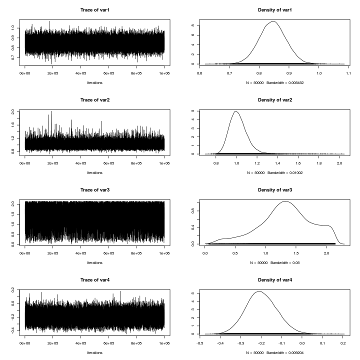
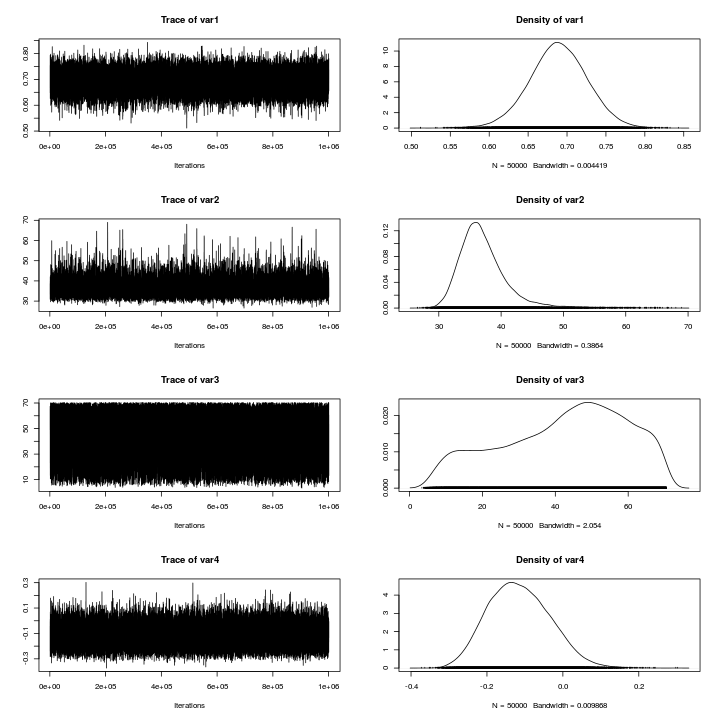
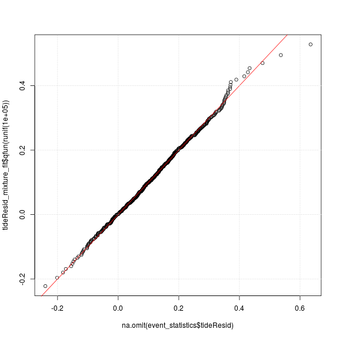
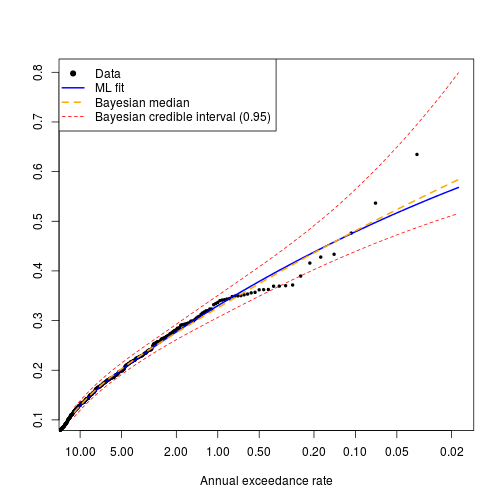

# **Modelling the univariate distributions of storm event statistics**
--------------------------------------------------------------------------

*Gareth Davies, Geoscience Australia 2017*

# Introduction
------------------

This document follows on from
[statistical_model_storm_timings.md](statistical_model_storm_timings.md)
in describing our statistical analysis of storm waves at Old Bar. 

It illustrates the process of fitting probability distributions to the storm event summary statistics,
which are conditional on the time of year and ENSO.

It is essential that the code
[statistical_model_storm_timings.md](statistical_model_storm_timings.md) has
alread been run, and produced an Rdata file
*'Rimages/session_storm_timings_FALSE_0.Rdata'*. **To make sure, the code below
throws an error if the latter file does not exist.**

```r
# Check that the pre-requisites exist
if(!file.exists('../statistical_model_fit/Rimages/session_storm_timings_FALSE_0.Rdata')){
    stop('It appears you have not yet run the code in statistical_model_storm_timings.md. It must be run before continuing')
}
```
You might wonder why the filename ends in `_FALSE_0`. Here, `FALSE`
describes where or not we perturbed the storm summary statistics before running
the fitting code. In the `FALSE` case we didn't - we're using the raw data.
However, it can be desirable to re-run the fitting code on perturbed data, to
check the impact of data discretization on the model fit. One would usually do
many such runs, and so we include a number (`_0` in this case) to distinguish
them. So for example, if the filename ended with `_TRUE_543`, you could assume
it includes a run with the perturbed data (with 543 being a unique ID, that is
otherwise meaningless).

Supposing the above did not generate any errors, and you have R installed,
along with all the packages required to run this code, and a copy of the
*stormwavecluster* git repository, then you should be able to re-run the
analysis here by simply copy-pasting the code. Alternatively, it can be run
with the `knit` command in the *knitr* package: 

```r
library(knitr)
knit('statistical_model_univariate_distributions.Rmd')
```

The basic approach followed here is to:
* **Step 1: Load the previous session**
* **Step 2: Exploratory analysis of seasonal non-stationarity in event statistics**
* **Step 3: Model the distribution of each storm summary statistic, dependent on season (and mean annual SOI for wave direction)**

Later we will model the remaining joint dependence between these variables, and
simulate synthetic storm sequences. 

# **Step 1: Load the previous session and set some key parameters**
Here we re-load the session from the previous stage of the modelling. We also
set some parameters controlling the Monte-Carlo Markov-Chain (MCMC) computations 
further in the document. 
* The default parameter values should be appropriate for the analysis
herein. To save computational effort (for testing purposes) users might reduce
the `mcmc_chain_length`. To reduce memory usage, users can increase the
`mcmc_chain_thin` parameter. If using other datasets, it may be necessary to
increase the `mcmc_chain_length` to get convergence.
* The code is also setup to run using a previous session with data ties broken
at random. See
[../statistical_model_fit_perturbed_data/README.md](../statistical_model_fit_perturbed_data/README.md)
for information on how to do this.


```r
# Here we support multiple runs with random tie-breaking of the data
# If R was passed a commandline argument 'break_ties n' on startup (with n = integer),
# then read the n'th R session matching 'Rimages/session_storm_timings_TRUE_*.Rdata'.
# That session will correspond to one of the tie-breaking sessions
if( length(grep('break_ties', commandArgs(trailingOnly=TRUE))) > 0 ){

    # Read one of the sessions with tie-breaking
    session_n = as.numeric(commandArgs(trailingOnly=TRUE)[2])
    previous_R_session_file = Sys.glob('Rimages/session_storm_timings_TRUE_*.Rdata')[session_n]

    # In this case, only run 1 mcmc chain on 1 core [since we will check many
    # tie-breaking sessions]
    mcmc_nchains = 1
    mcmc_ncores = 1

}else{

    # Read the session that does not do any tie-breaking
    previous_R_session_file = 'Rimages/session_storm_timings_FALSE_0.Rdata'

    # In this case, run more chains in parallel.
    mcmc_nchains = 6
    mcmc_ncores = 6

    # However, the parallel framework used here does not work on windows,
    # so if running windows, only use 1 core
    if(.Platform$OS.type == 'windows') mcmc_ncores = 1
}

load(previous_R_session_file)

# Length of each MCMC chain. Should be 'large' e.g 10^6, except for test runs 
# We run multiple chains to enhance the likelihood of detecting non-convergence
# since anyway this is cheap in parallel. These are pooled for final estimates,
# but it is essential to manually check the convergence of the chains [e.g.
# by comparing high return period confidence intervals].
mcmc_chain_length = 1e+06 #1e+05 
# To reduce the data size, we can throw away all but a fraction of the mcmc
# chains. This has computational (memory) benefits if the MCMC samples are
# strongly autocorrelated, but no other advantages.
mcmc_chain_thin = 20 
```

# **Step 2: Exploratory analysis of seasonal non-stationarity in event statistics**
----------------------------------------------------------------------

**Here we plot the distribution of each storm statistic by month.** This
highlights the seasonal non-stationarity. Below we will take some steps to
check the statistical significance of this, and later will use copula-based
techniques to make the modelled univariate distribution of each variable
conditional on the time of year.

```r
# Get month as 1, 2, ... 12
month_num = as.numeric(format(event_statistics$time, '%m'))
par(mfrow=c(3,2))
for(i in 1:5){
    boxplot(event_statistics[,i] ~ month_num, xlab='Month', 
        ylab=names(event_statistics)[i], names=month.abb,
        col='grey')
    title(main = names(event_statistics)[i], cex.main=2)
}

rm(month_num)
```


To model the seasonal non-stationarity illustrated above, we define a seasonal
variable periodic in time, of the form `cos(2*pi*(t - offset))` where the time
`t` is in years. The `offset` is a phase variable which can be optimised for
each storm summary statistic separately, to give the 'best' cosine seasonal
pattern matching the data. One way to do this is to find the value of `offset`
which maximises the rank-correlation between each storm variable and the seasonal
variable.

**Below we compute the offset for each storm summary statistic, and also assess
it's statistical significance using a permutation test.** The figure shows the
rank correlation between each variable and a seasonal variable, for each value
of `offset` in [-0.5, 0.5] (which represents all possible values). Note the
`offset` value with the strongest rank correlation may be interpreted as the
optimal offset (*here we choose the `offset` with largest negative rank
correlation, so many `offset`'s are close to zero*). 


```r
# Store some useful statistics
stat_store = data.frame(var = rep(NA, 5), phi=rep(NA,5), cor = rep(NA, 5), 
    p = rep(NA, 5), cor_05=rep(NA, 5))
stat_store$var = names(event_statistics)[1:5]

# Test these values of the 'offset' parameter
phi_vals = seq(-0.5, 0.5, by=0.01)
par(mfrow=c(3,2))
for(i in 1:5){

    # Compute spearman correlation for all values of phi, for variable i
    corrs = phi_vals*0
    for(j in 1:length(phi_vals)){
        corrs[j] =  cor(event_statistics[,i], 
            cos(2*pi*(event_statistics$startyear - phi_vals[j])),
            method='s', use='pairwise.complete.obs')
    }

    plot(phi_vals, corrs, xlab='Offset', ylab='Spearman Correlation', 
        main=names(event_statistics)[i], cex.main=2,
        cex.lab=1.5)
    grid()
    abline(v=0, col='orange')

    # Save the 'best' result
    stat_store$phi[i] = phi_vals[which.min(corrs)]
    stat_store$cor[i] = min(corrs)

    # Function to compute the 'best' correlation of season with
    # permuted data, which by definition has no significant correlation with
    # the season. We can use this to assess the statistical significance of the
    # observed correlation between each variable and the season.
    cor_phi_function<-function(i0=i){
        # Resample the data
        d0 = sample(event_statistics[,i0], size=length(event_statistics[,i0]), 
            replace=TRUE)
        # Correlation function
        g<-function(phi){ 
            cor(d0, cos(2*pi*(event_statistics$startyear - phi)), 
                method='s', use='pairwise.complete.obs')
        }
        # Find best 'phi'
        best_phi = optimize(g, c(-0.5, 0.5), tol=1.0e-06)$minimum

        return(g(best_phi))
    }
   
    # Let's get statistical significance 
    cor_boot = replicate(5000, cor_phi_function())

    # Because our optimizer minimises, the 'strongest' correlations
    # it finds are negative. Of course if 0.5 is added to phi this is equivalent
    # to a positive correlation. 
    
    qcb = quantile(cor_boot, 0.05, type=6)
    stat_store$cor_05[i] = qcb
    stat_store$p[i] = mean(cor_boot < min(corrs))

    polygon(rbind( c(-1, -qcb), c(-1, qcb), c(1, qcb), c(1, -qcb)),
        col='brown', density=10)
}

write.table(stat_store, file='seasonal_correlation_statistics.csv', sep="  &  ",
    quote=FALSE, row.names=FALSE)

rm(phi_vals, corrs)
```


In the above figure, the shaded region represents a 95% interval for the best
correlation expected of 'random' data (i.e. a random sample of the original
data with an optimized offset).  Correlations outside the shaded interval are
unlikely to occur at random, and are intepreted as reflecting true seasonal
non-stationarity. 

Below we will make each storm summary statistic dependent on the seasonal
variable. For wave direction, the mean annual SOI value will also be treated.
Recall that relationships between mean annual SOI and storm wave direction
were established earlier (
[../preprocessing/extract_storm_events.md](../preprocessing/extract_storm_events.md),
[statistical_model_storm_timings.md](statistical_model_storm_timings.md) ). We
also found relationships between mean annual SOI and the rate of storms, and
MSL, which were treated in those sections (using the non-homogeneous poisson
process model, and the STL decomposition, respectively). Therefore, the latter
relationships are not treated in the section below, but they are included in
the overall model.


# **Step 3: Model the distribution of each storm summary statistic, dependent on season (and mean annual SOI for wave direction)**

In this section we model the distribution of each storm summary statistic, and
then make it conditional on the seasonal variable (and on mean annual SOI in
the case of wave direction only). 

The distributions of `hsig`, `duration` and `tideResid` are initially modelled
as extreme value mixture distributions. The distributions of `dir` and
`steepness` are initially modelled using non-parametric smoothing (based on the
log-spline method).

## Hsig

**Below we fit an extreme value mixture model to Hsig, using maximum
likelihood.** The model has a GPD upper tail, and a Gamma lower tail.

```r
# Get the exmix_fit routines in their own environment
evmix_fit = new.env()
source('../../R/evmix_fit/evmix_fit.R', local=evmix_fit, chdir=TRUE)

hsig_offset = min(event_statistics$hsig) - 1.0e-03

# Fit it
hsig_mixture_fit = evmix_fit$fit_gpd_mixture(
    data=event_statistics$hsig, 
    data_offset=hsig_offset, 
    bulk='gamma')
```

```
## [1] "  evmix fit NLLH: " "531.244039209002"  
## [1] "  fit_optim NLLH: " "531.244039202048"  
## [1] "  Bulk par estimate0: " "0.85003974398977"      
## [3] "1.01009446518527"       "1.29165275871625"      
## [5] "-0.21940960603698"     
## [1] "           estimate1: " "0.850038103804788"     
## [3] "1.01009712056226"       "1.29164914268469"      
## [5] "-0.219410423624441"    
## [1] "  Difference: "        "1.64018498260976e-06"  "-2.65537699295493e-06"
## [4] "3.61603155396573e-06"  "8.17587460927305e-07" 
## [1] "PASS: checked qfun and pfun are inverse functions"
```

```r
# Make a plot
DU$qqplot3(event_statistics$hsig, hsig_mixture_fit$qfun(runif(100000)), 
    main='Hsig QQ-plot')
abline(0, 1, col='red'); grid()
```


The above code leads to print-outs of the maximum likelihood parameter fits
achieved by different methods, and the differences between them (which are
only a few parts per million in this case). Because fitting extreme value
mixture models can be challenging, internally the code tries many different fits.

During the fitting process, we also compute quantile and inverse quantile
functions for the fitted distribution. The code checks numerically that these
really are the inverse of each other, and will print information about whether
this was found to be true (*if not, there is a problem!*)

The quantile-quantile plot of the observed and fitted Hsig should fall close to
a straight line, if the fit worked. Poor fits are suggested by strong
deviations from the 1:1 line. While in this case the fit looks good, if the fit
is poor then further analysis is required. For example, it is possible that the
model fit did not converge, or that the statistical model is a poor choice for
the data.

Given that the above fit looks OK, **below we use Monte-Carlo-Markov-Chain
(MCMC) techniques to compute the Bayesian posterior distribution of the 4 model
parameters**. A few points about this process:
* The prior probability is uniform for each variable. Here we use
a very broad uniform distribution to represent an approximately
'non-informative' prior. The Gamma distribution parameters have uniform prior
over [0, 100 000 000]. The GPD threshold parameter prior is uniform
from zero to the 50th highest data point (to ensure that the tail
part of the model is fit using at least 50 data points). The GPD shape parameter
prior is uniform over [-1000 , 1000]. Note that for some other datasets, it
might be necessary to constrain the GPD shape parameter prior more strongly
than we do below, if it cannot be well estimated from the data (e.g. see the
literature). Overall we are aiming to make our priors reasonably
'non-informative', while still imposing pragmatic constraints required to
achieve a reasonable fit. 
* The routines update the object `hsig_mixture_fit`, so it contains
multiple chains, i.e. 'random walks' through the posterior parameter
distribution.
* Here we run 6 separate chains, with randomly chosen starting parameters, to
make it easier to detect non-convergence (i.e. to reduce the chance that a
single chain gets 'stuck' in part of the posterior distribution). The parameter
`mcmc_start_perturbation` defines the scale for that perturbation.
* It is possible that the randomly chosen start parameters are theoretically
impossible. In this case, the code will report that it had `Bad random start
parameters`, and will generate new ones.
* We use a burn-in of 1000 (i.e. the first 1000 entries in the chain are
discarded). This can assist with convergence.
* We make a simple diagnostic plot to check the MCMC convergence.
* The code runs in parallel, using 6 cores below. The parallel framework will
only work correctly on a shared memory linux machine.

```r
#' MCMC computations for later uncertainty characterisation

# Prevent the threshold parameter from exceeding the highest 50th data point
# Note that inside the fitting routine, Hsig was transformed to have lower
# bound of slightly above zero before fitting, since the Gamma distribution has
# a lower bound of zero. Hence we subtract hsig_offset here.
hsig_u_limit = sort(event_statistics$hsig, decreasing=TRUE)[50] - hsig_offset

# Compute the MCMC chains in parallel
hsig_mixture_fit = evmix_fit$mcmc_gpd_mixture(
    fit_env=hsig_mixture_fit, 
    par_lower_limits=c(0, 0, 0, -1000.), 
    par_upper_limits=c(1e+08, 1.0e+08, hsig_u_limit, 1000),
    mcmc_start_perturbation=c(0.4, 0.4, 2., 0.2), 
    mcmc_length=mcmc_chain_length,
    mcmc_thin=mcmc_chain_thin,
    mcmc_burnin=1000,
    mcmc_nchains=mcmc_nchains,
    mcmc_tune=c(1,1,1,1)*1,
    mc_cores=mcmc_ncores,
    annual_event_rate=mean(events_per_year_truncated))

# Graphical convergence check of one of the chains. 
plot(hsig_mixture_fit$mcmc_chains[[1]])
```



**Below, we investigate the parameter estimates for each chain.** If all the
changes have converged, the quantiles of each parameter estimate should be
essentially the same (although if the underlying posterior distribution is
unbounded, then of course the min/max will not converge, although all other
quantiles eventually will). We also look at the 1/100 year event Hsig implied
by each chain, and make a return level plot.

```r
# Look at mcmc parameter estimates in each chain
lapply(hsig_mixture_fit$mcmc_chains, f<-function(x) summary(as.matrix(x)))
```

```
## [[1]]
##       var1             var2             var3              var4        
##  Min.   :0.6496   Min.   :0.6583   Min.   :0.02436   Min.   :-0.4379  
##  1st Qu.:0.8228   1st Qu.:0.9534   1st Qu.:1.10052   1st Qu.:-0.2516  
##  Median :0.8530   Median :1.0038   Median :1.35290   Median :-0.2053  
##  Mean   :0.8531   Mean   :1.0129   Mean   :1.34078   Mean   :-0.2015  
##  3rd Qu.:0.8832   3rd Qu.:1.0598   3rd Qu.:1.61696   3rd Qu.:-0.1539  
##  Max.   :1.1058   Max.   :1.8279   Max.   :2.17599   Max.   : 0.2059  
## 
## [[2]]
##       var1             var2             var3               var4        
##  Min.   :0.6385   Min.   :0.7350   Min.   :0.009277   Min.   :-0.4672  
##  1st Qu.:0.8225   1st Qu.:0.9534   1st Qu.:1.096333   1st Qu.:-0.2513  
##  Median :0.8529   Median :1.0039   Median :1.350928   Median :-0.2048  
##  Mean   :0.8530   Mean   :1.0128   Mean   :1.341966   Mean   :-0.2016  
##  3rd Qu.:0.8830   3rd Qu.:1.0607   3rd Qu.:1.617214   3rd Qu.:-0.1538  
##  Max.   :1.0533   Max.   :1.8075   Max.   :2.175998   Max.   : 0.1992  
## 
## [[3]]
##       var1             var2             var3             var4        
##  Min.   :0.6317   Min.   :0.7447   Min.   :0.0471   Min.   :-0.4500  
##  1st Qu.:0.8224   1st Qu.:0.9538   1st Qu.:1.0953   1st Qu.:-0.2511  
##  Median :0.8522   Median :1.0046   Median :1.3473   Median :-0.2041  
##  Mean   :0.8525   Mean   :1.0143   Mean   :1.3354   Mean   :-0.2009  
##  3rd Qu.:0.8827   3rd Qu.:1.0613   3rd Qu.:1.6121   3rd Qu.:-0.1533  
##  Max.   :1.0395   Max.   :1.9824   Max.   :2.1758   Max.   : 0.1912  
## 
## [[4]]
##       var1             var2            var3              var4        
##  Min.   :0.6627   Min.   :0.739   Min.   :0.01937   Min.   :-0.4572  
##  1st Qu.:0.8223   1st Qu.:0.954   1st Qu.:1.09553   1st Qu.:-0.2520  
##  Median :0.8527   Median :1.004   Median :1.35214   Median :-0.2046  
##  Mean   :0.8528   Mean   :1.013   Mean   :1.33992   Mean   :-0.2015  
##  3rd Qu.:0.8828   3rd Qu.:1.061   3rd Qu.:1.61486   3rd Qu.:-0.1540  
##  Max.   :1.0526   Max.   :1.748   Max.   :2.17597   Max.   : 0.2138  
## 
## [[5]]
##       var1             var2             var3              var4        
##  Min.   :0.6574   Min.   :0.7377   Min.   :0.02542   Min.   :-0.4394  
##  1st Qu.:0.8224   1st Qu.:0.9541   1st Qu.:1.09645   1st Qu.:-0.2516  
##  Median :0.8526   Median :1.0044   Median :1.34862   Median :-0.2042  
##  Mean   :0.8527   Mean   :1.0139   Mean   :1.33874   Mean   :-0.2012  
##  3rd Qu.:0.8828   3rd Qu.:1.0602   3rd Qu.:1.61454   3rd Qu.:-0.1531  
##  Max.   :1.0590   Max.   :1.8795   Max.   :2.17598   Max.   : 0.1696  
## 
## [[6]]
##       var1             var2             var3              var4        
##  Min.   :0.6331   Min.   :0.7414   Min.   :0.01263   Min.   :-0.4432  
##  1st Qu.:0.8220   1st Qu.:0.9541   1st Qu.:1.09108   1st Qu.:-0.2514  
##  Median :0.8523   Median :1.0043   Median :1.34915   Median :-0.2043  
##  Mean   :0.8524   Mean   :1.0151   Mean   :1.33487   Mean   :-0.2013  
##  3rd Qu.:0.8827   3rd Qu.:1.0618   3rd Qu.:1.61449   3rd Qu.:-0.1535  
##  Max.   :1.0545   Max.   :2.0826   Max.   :2.17599   Max.   : 0.1979
```

```r
# Look at ari 100 estimates
lapply(hsig_mixture_fit$ari_100_chains, 
    f<-function(x) quantile(x, p=c(0.025, 0.5, 0.975)))
```

```
## [[1]]
##     2.5%      50%    97.5% 
## 7.065118 7.542084 8.873103 
## 
## [[2]]
##     2.5%      50%    97.5% 
## 7.067565 7.542372 8.881262 
## 
## [[3]]
##     2.5%      50%    97.5% 
## 7.067150 7.545144 8.875680 
## 
## [[4]]
##     2.5%      50%    97.5% 
## 7.066567 7.545808 8.854120 
## 
## [[5]]
##     2.5%      50%    97.5% 
## 7.068527 7.547122 8.886581 
## 
## [[6]]
##     2.5%      50%    97.5% 
## 7.067705 7.542800 8.877061
```

```r
# Look at model prediction of the maximum observed value
# (supposing we observed the system for the same length of time as the data covers)
lapply(hsig_mixture_fit$ari_max_data_chains, 
    f<-function(x) quantile(x, p=c(0.025, 0.5, 0.975)))
```

```
## [[1]]
##     2.5%      50%    97.5% 
## 6.813822 7.188931 8.114254 
## 
## [[2]]
##     2.5%      50%    97.5% 
## 6.815476 7.188773 8.114590 
## 
## [[3]]
##     2.5%      50%    97.5% 
## 6.814657 7.189912 8.112067 
## 
## [[4]]
##     2.5%      50%    97.5% 
## 6.814665 7.190646 8.100359 
## 
## [[5]]
##     2.5%      50%    97.5% 
## 6.816328 7.192005 8.114472 
## 
## [[6]]
##     2.5%      50%    97.5% 
## 6.816330 7.189398 8.110218
```

```r
# If the chains are well behaved, we can combine all 
summary(hsig_mixture_fit$combined_chains)
```

```
##        V1               V2               V3                 V4         
##  Min.   :0.6317   Min.   :0.6583   Min.   :0.009277   Min.   :-0.4672  
##  1st Qu.:0.8224   1st Qu.:0.9538   1st Qu.:1.095853   1st Qu.:-0.2515  
##  Median :0.8526   Median :1.0042   Median :1.350135   Median :-0.2046  
##  Mean   :0.8527   Mean   :1.0137   Mean   :1.338608   Mean   :-0.2013  
##  3rd Qu.:0.8829   3rd Qu.:1.0608   3rd Qu.:1.615090   3rd Qu.:-0.1536  
##  Max.   :1.1058   Max.   :2.0826   Max.   :2.175998   Max.   : 0.2138
```

```r
# If the chains are well behaved then we might want a merged 1/100 hsig
quantile(hsig_mixture_fit$combined_ari100, c(0.025, 0.5, 0.975))
```

```
##     2.5%      50%    97.5% 
## 7.067080 7.544186 8.875813
```

```r
# This is an alternative credible interval -- the 'highest posterior density' interval.
HPDinterval(as.mcmc(hsig_mixture_fit$combined_ari100))
```

```
##       lower    upper
## var1 6.9835 8.611353
## attr(,"Probability")
## [1] 0.95
```

```r
evmix_fit$mcmc_rl_plot(hsig_mixture_fit)
```


**Here we use a different technique to compute the 1/100 AEP Hsig, as a
cross-check on the above analysis.** A simple Generalised Extreme Value model
fit to annual maxima is undertaken. While this technique is based on limited
data (i.e. only one observation per year), it is not dependent on our storm
event definition or choice of wave height threshold. In this sense it is quite
different to our peaks-over-threshold method above -- and thus serves as a
useful cross-check on the former results. 

```r
# Here we do an annual maximum analysis with a gev
# This avoids issues with event definition
annual_max_hsig = aggregate(event_statistics$hsig, 
    list(year=floor(event_statistics$startyear)), max)
# Remove the first and last years with incomplete data
keep_years = which(annual_max_hsig$year %in% 1986:2015)
library(ismev)
```

```
## Loading required package: mgcv
```

```
## Loading required package: nlme
```

```
## This is mgcv 1.8-12. For overview type 'help("mgcv-package")'.
```

```r
gev_fit_annual_max = gev.fit(annual_max_hsig[keep_years,2])
```

```
## $conv
## [1] 0
## 
## $nllh
## [1] 31.04738
## 
## $mle
## [1]  5.4969947  0.6503065 -0.2118537
## 
## $se
## [1] 0.1365196 0.1016247 0.1591920
```

```r
gev.prof(gev_fit_annual_max, m=100, xlow=6.5, xup=12, conf=0.95)
```

```
## If routine fails, try changing plotting interval
```

```r
title(main='Profile likehood confidence interval for 1/100 AEP Hsig \n using a GEV fit to annual maxima')
# Add vertical lines at the limits of the 95% interval
abline(v=c(6.97, 10.4), col='red', lty='dashed')
# Add vertical line at ML estimate
abline(v=7.4, col='orange')
```


**Here we use copulas to determine a distribution for Hsig, conditional on the season**.
The computational details are wrapped up in a function that we source.
Essentially, the code:
* Finds the optimal seasonal `offset` for the chosen variable (hsig), and uses
this to create a function to compute the season statistic (which is hsig
specific) from the event time of year.
* Automatically chooses a copula family (based on AIC) to model dependence
between the chosen variable and the season variable, and fits the copula.
* Uses the copula to create new quantile and inverse quantile functions, for
which the user can pass conditional variables (i.e. to get the distribution,
given that the season variable attains a particular value).
* Test that the quantile and inverse quantile functions really are inverses of
each other (this can help catch user input errors)
* Make quantile-quantile plots of the data and model for a number of time
periods (here the first, middle and last thirds of the calendar year). The top
row shows the model with the distribution varying by season, and the bottom row
shows the model without seasonal effects. It is not particularly easy to
visually detect seasonal non-stationarities in these plots [compared, say, with
using monthly boxplots].  Their main purpose is compare the model and data
distribution at different times of year, and so detect poor model fits.
However, you might notice that the top row of plots 'hug' the 1:1 line slightly
better than corresponding plots in the bottom row in the central data values.
This reflects the modelled seasonal non-stationarities. *Note the tail behaviour
can be erratic, since the 'model' result is actually a random sample from the model.*

```r
# Get code to fit the conditional distribution
# Give a path that will also work if run from another directory inside Analysis.
source('../../Analysis/statistical_model_fit/make_conditional_distribution.R')

# This returns an environment containing the conditional quantile and inverse
# quantile functions, among other information
hsig_fit_conditional = make_fit_conditional_on_season(
    event_statistics,
    var='hsig', 
    q_raw=hsig_mixture_fit$qfun, 
    p_raw=hsig_mixture_fit$pfun,
    startyear = 'startyear')
```

```
## [1] "Conditional p/q functions passed test: "
## [1] "  (Check plots to see if quantiles are ok)"
```


```r
# What kind of copula was selected to model dependence between season and hsig?
print(hsig_fit_conditional$var_season_copula)
```

```
## Bivariate copula: Frank (par = -0.73, tau = -0.08)
```


## Duration

Here we model storm duration, using techniques virtually identical to those applied above.
As before:
* We first fit the univariate extreme value mixture distribution with maximum
likelihood; 
* Next we compute the posterior distribution of each parameter; 
* Finally we make the duration distribution conditional on the time of year,
using a seasonal variable that has been optimised to capture seasonality in the
storm duration.

**Here is the extreme value mixture model maximum likelihood fit**

```r
# Do the maximum likelihood fit. 
#
# Set the lower limit of the tail model to just below the lower limit of the
# data, in the event we perturb it by half an hour. [Initial lower limit = 1hr]
# However, if working with the 'raw' data, then 0 seems a better lower limit that 1,
# since the latter is actually a data value. 
duration_offset = ifelse(break_ties_with_jitter, 0.5, 0.0) #min(event_statistics$duration) - 5.0e-04
duration_mixture_fit = evmix_fit$fit_gpd_mixture(
    data=event_statistics$duration, 
    data_offset=duration_offset, 
    bulk='gamma')
```

```
## Warning in FUN(X[[i]], ...): initial parameter values for threshold u = 1
## are invalid

## Warning in FUN(X[[i]], ...): initial parameter values for threshold u = 1
## are invalid
```

```
## [1] "  evmix fit NLLH: " "2833.26987097606"  
## [1] "  fit_optim NLLH: " "2833.26987067979"  
## [1] "  Bulk par estimate0: " "0.787694214155467"     
## [3] "31.8814888350954"       "51.3829005439937"      
## [5] "-0.139368918503533"    
## [1] "           estimate1: " "0.787676067347033"     
## [3] "31.8814876325492"       "51.3829001974599"      
## [5] "-0.139346757730819"    
## [1] "  Difference: "        "1.81468084338166e-05"  "1.20254618707349e-06" 
## [4] "3.46533859385545e-07"  "-2.21607727144135e-05"
## [1] "PASS: checked qfun and pfun are inverse functions"
```

```r
# Make a plot
DU$qqplot3(event_statistics$duration, duration_mixture_fit$qfun(runif(100000)), 
    main='Duration QQ-plot')
abline(0, 1, col='red'); grid()
```


**Here is the extreme value mixture model posterior probability computation, using MCMC**
As before, note that we run a number of MCMC chains with random starting values, and in 
the event that the random starting parameters are invalid the code will simply try new ones.

```r
# MCMC computations for later uncertainty characterisation
#
# Prevent the threshold parameter from exceeding the highest 50th data point
duration_u_limit = sort(event_statistics$duration, decreasing=TRUE)[50] - duration_offset

# Compute the MCMC chains in parallel.
duration_mixture_fit = evmix_fit$mcmc_gpd_mixture(
    fit_env=duration_mixture_fit, 
    par_lower_limits=c(0, 0, 0, -1000.), 
    par_upper_limits=c(1e+08, 1.0e+08, duration_u_limit, 1000),
    mcmc_start_perturbation=c(0.4, 0.4, 2., 0.2), 
    mcmc_length=mcmc_chain_length,
    mcmc_thin=mcmc_chain_thin,
    mcmc_burnin=1000,
    mcmc_nchains=mcmc_nchains,
    mcmc_tune=c(1,1,1,1)*1,
    mc_cores=mcmc_ncores,
    annual_event_rate=mean(events_per_year_truncated))

# Graphical convergence check of one of the chains. 
plot(duration_mixture_fit$mcmc_chains[[1]])
```



**Here we check the similarity of all the MCMC chains, and make a return-level plot for storm duration**

```r
# Look at mcmc parameter estimates in each chain
lapply(duration_mixture_fit$mcmc_chains, f<-function(x) summary(as.matrix(x)))
```

```
## [[1]]
##       var1             var2            var3             var4         
##  Min.   :0.6298   Min.   :23.90   Min.   : 3.427   Min.   :-0.33599  
##  1st Qu.:0.7616   1st Qu.:30.42   1st Qu.:40.358   1st Qu.:-0.15715  
##  Median :0.7875   Median :31.90   Median :51.244   Median :-0.10543  
##  Mean   :0.7883   Mean   :32.06   Mean   :49.311   Mean   :-0.09870  
##  3rd Qu.:0.8143   3rd Qu.:33.53   3rd Qu.:60.641   3rd Qu.:-0.04669  
##  Max.   :0.9542   Max.   :53.88   Max.   :71.000   Max.   : 0.43754  
## 
## [[2]]
##       var1             var2            var3             var4         
##  Min.   :0.6423   Min.   :23.94   Min.   : 2.139   Min.   :-0.33654  
##  1st Qu.:0.7614   1st Qu.:30.43   1st Qu.:40.333   1st Qu.:-0.15727  
##  Median :0.7876   Median :31.92   Median :51.144   Median :-0.10464  
##  Mean   :0.7882   Mean   :32.06   Mean   :49.269   Mean   :-0.09837  
##  3rd Qu.:0.8142   3rd Qu.:33.53   3rd Qu.:60.544   3rd Qu.:-0.04651  
##  Max.   :0.9598   Max.   :51.35   Max.   :70.998   Max.   : 0.37407  
## 
## [[3]]
##       var1             var2            var3             var4         
##  Min.   :0.6367   Min.   :22.60   Min.   : 3.283   Min.   :-0.34247  
##  1st Qu.:0.7613   1st Qu.:30.44   1st Qu.:40.259   1st Qu.:-0.15681  
##  Median :0.7875   Median :31.93   Median :51.162   Median :-0.10464  
##  Mean   :0.7880   Mean   :32.08   Mean   :49.199   Mean   :-0.09837  
##  3rd Qu.:0.8139   3rd Qu.:33.54   3rd Qu.:60.521   3rd Qu.:-0.04701  
##  Max.   :0.9574   Max.   :51.35   Max.   :70.999   Max.   : 0.66362  
## 
## [[4]]
##       var1             var2            var3             var4         
##  Min.   :0.6349   Min.   :23.60   Min.   : 3.227   Min.   :-0.32206  
##  1st Qu.:0.7617   1st Qu.:30.43   1st Qu.:40.214   1st Qu.:-0.15643  
##  Median :0.7877   Median :31.91   Median :51.297   Median :-0.10420  
##  Mean   :0.7883   Mean   :32.06   Mean   :49.248   Mean   :-0.09771  
##  3rd Qu.:0.8142   3rd Qu.:33.53   3rd Qu.:60.522   3rd Qu.:-0.04616  
##  Max.   :1.0075   Max.   :46.42   Max.   :70.999   Max.   : 0.44563  
## 
## [[5]]
##       var1             var2            var3             var4         
##  Min.   :0.6404   Min.   :24.28   Min.   : 2.751   Min.   :-0.33374  
##  1st Qu.:0.7619   1st Qu.:30.41   1st Qu.:40.131   1st Qu.:-0.15646  
##  Median :0.7880   Median :31.89   Median :51.159   Median :-0.10460  
##  Mean   :0.7884   Mean   :32.06   Mean   :49.143   Mean   :-0.09795  
##  3rd Qu.:0.8144   3rd Qu.:33.53   3rd Qu.:60.525   3rd Qu.:-0.04581  
##  Max.   :0.9555   Max.   :48.96   Max.   :70.999   Max.   : 0.52157  
## 
## [[6]]
##       var1             var2            var3             var4         
##  Min.   :0.6156   Min.   :23.49   Min.   : 2.788   Min.   :-0.32679  
##  1st Qu.:0.7616   1st Qu.:30.42   1st Qu.:40.302   1st Qu.:-0.15711  
##  Median :0.7876   Median :31.91   Median :51.087   Median :-0.10494  
##  Mean   :0.7883   Mean   :32.06   Mean   :49.221   Mean   :-0.09829  
##  3rd Qu.:0.8143   3rd Qu.:33.52   3rd Qu.:60.509   3rd Qu.:-0.04626  
##  Max.   :0.9603   Max.   :50.57   Max.   :70.998   Max.   : 0.36021
```

```r
# Look at ari 100 estimates
lapply(duration_mixture_fit$ari_100_chains, 
    f<-function(x) quantile(x, p=c(0.025, 0.5, 0.975)))
```

```
## [[1]]
##     2.5%      50%    97.5% 
## 150.3744 176.0753 254.6232 
## 
## [[2]]
##     2.5%      50%    97.5% 
## 150.4406 176.0244 254.8990 
## 
## [[3]]
##     2.5%      50%    97.5% 
## 150.4335 176.1284 254.6308 
## 
## [[4]]
##     2.5%      50%    97.5% 
## 150.4604 176.2229 255.6735 
## 
## [[5]]
##     2.5%      50%    97.5% 
## 150.4820 176.2423 254.7479 
## 
## [[6]]
##     2.5%      50%    97.5% 
## 150.3807 176.0433 253.5559
```

```r
# Look at model prediction of the maximum observed value
# (supposing we observed the system for the same length of time as the data covers)
lapply(duration_mixture_fit$ari_max_data_chains, 
    f<-function(x) quantile(x, p=c(0.025, 0.5, 0.975)))
```

```
## [[1]]
##     2.5%      50%    97.5% 
## 137.7975 156.1704 205.1751 
## 
## [[2]]
##     2.5%      50%    97.5% 
## 137.8060 156.1591 205.4701 
## 
## [[3]]
##     2.5%      50%    97.5% 
## 137.8064 156.2048 205.4660 
## 
## [[4]]
##     2.5%      50%    97.5% 
## 137.8000 156.2131 205.8209 
## 
## [[5]]
##     2.5%      50%    97.5% 
## 137.8287 156.2337 205.3865 
## 
## [[6]]
##     2.5%      50%    97.5% 
## 137.7285 156.0912 204.5997
```

```r
# If the chains seem ok, we can combine all 
summary(duration_mixture_fit$combined_chains)
```

```
##        V1               V2              V3               V4          
##  Min.   :0.6156   Min.   :22.60   Min.   : 2.139   Min.   :-0.34247  
##  1st Qu.:0.7616   1st Qu.:30.43   1st Qu.:40.267   1st Qu.:-0.15688  
##  Median :0.7877   Median :31.91   Median :51.186   Median :-0.10473  
##  Mean   :0.7883   Mean   :32.06   Mean   :49.232   Mean   :-0.09823  
##  3rd Qu.:0.8142   3rd Qu.:33.53   3rd Qu.:60.541   3rd Qu.:-0.04640  
##  Max.   :1.0075   Max.   :53.88   Max.   :71.000   Max.   : 0.66362
```

```r
# If the chains are well behaved then we might want a merged 1/100 hsig
quantile(duration_mixture_fit$combined_ari100, c(0.025, 0.5, 0.975))
```

```
##     2.5%      50%    97.5% 
## 150.4263 176.1224 254.6384
```

```r
HPDinterval(as.mcmc(duration_mixture_fit$combined_ari100))
```

```
##         lower    upper
## var1 145.4866 237.0081
## attr(,"Probability")
## [1] 0.95
```

```r
# Return level plot
evmix_fit$mcmc_rl_plot(duration_mixture_fit)
```


**Finally we make the duration fit conditional on the time of year, using a seasonal variable.**

```r
# This returns an environment containing the conditional quantile and inverse
# quantile functions, among other information
duration_fit_conditional = make_fit_conditional_on_season(
    event_statistics,
    var='duration', 
    q_raw=duration_mixture_fit$qfun, 
    p_raw=duration_mixture_fit$pfun,
    startyear = 'startyear')
```

```
## [1] "Conditional p/q functions passed test: "
## [1] "  (Check plots to see if quantiles are ok)"
```


```r
# What kind of copula was selected to model dependence between season and duration?
print(duration_fit_conditional$var_season_copula)
```

```
## Bivariate copula: Gaussian (par = -0.15, tau = -0.09)
```

## Tidal residual

Here we generally follow the steps implemented above for Hsig and duration. An
important change is that we fit an extreme value mixture model with a normal
lower tail (instead of a Gamma lower tail). This is done because unlike storm
Hsig and duration, there is no natural lower limit on the tidal residual [e.g.
it can even be negative on occasion].


```r
# Manually remove missing (NA) data before fitting
tideResid_mixture_fit = evmix_fit$fit_gpd_mixture(
    data=na.omit(event_statistics$tideResid),  
    bulk='normal')
```

```
## [1] "  evmix fit NLLH: " "-443.491563137327" 
## [1] "  fit_optim NLLH: " "-443.491563173242" 
## [1] "  Bulk par estimate0: " "0.114681095472333"     
## [3] "0.1135725221079"        "0.185571006249087"     
## [5] "-0.125692215113564"    
## [1] "           estimate1: " "0.114681127821652"     
## [3] "0.113572500789905"      "0.185570939525485"     
## [5] "-0.125692214524754"    
## [1] "  Difference: "        "-3.23493184045676e-08" "2.13179948138631e-08" 
## [4] "6.67236016438366e-08"  "-5.88809556667513e-10"
## [1] "PASS: checked qfun and pfun are inverse functions"
```

```r
# Make a plot
DU$qqplot3(na.omit(event_statistics$tideResid), 
    tideResid_mixture_fit$qfun(runif(100000)))
abline(0, 1, col='red')
grid()
```



Below is the MCMC computation of the posterior probability distribution.
As before, bad random starting parameters are rejected, with a warning.

```r
#' MCMC computations for later uncertainty characterisation
min_tr = min(event_statistics$tideResid, na.rm=TRUE)
tideResid_u_limit = sort(event_statistics$tideResid, decreasing=TRUE)[50]

tideResid_mixture_fit = evmix_fit$mcmc_gpd_mixture(
    fit_env=tideResid_mixture_fit, 
    par_lower_limits=c(min_tr, 0, min_tr, -1000), 
    par_upper_limits=c(1e+08, 1e+08, tideResid_u_limit, 1000),
    mcmc_start_perturbation=c(0.2, 0.2, 0.2, 0.3), 
    mcmc_length=mcmc_chain_length,
    mcmc_thin=mcmc_chain_thin,
    mcmc_burnin=1000,
    mcmc_nchains=mcmc_nchains,
    mcmc_tune=c(1,1,1,1)*1.,
    mc_cores=mcmc_ncores,
    annual_event_rate=mean(events_per_year_truncated))

# Graphical convergence check
plot(tideResid_mixture_fit$mcmc_chains[[1]])
```


```r
# Clean up
rm(min_tr)
```

**Here we further investigate the behaviour of the MCMC chains for the tidal residual fit,
and make a return-level plot**

```r
# Look at mcmc parameter estimates in each chain
lapply(tideResid_mixture_fit$mcmc_chains, f<-function(x) summary(as.matrix(x)))
```

```
## [[1]]
##       var1              var2             var3             var4          
##  Min.   :0.09612   Min.   :0.0998   Min.   :0.1083   Min.   :-0.235883  
##  1st Qu.:0.11261   1st Qu.:0.1131   1st Qu.:0.1994   1st Qu.:-0.109275  
##  Median :0.11583   Median :0.1158   Median :0.2294   Median :-0.060238  
##  Mean   :0.11586   Mean   :0.1157   Mean   :0.2300   Mean   :-0.044154  
##  3rd Qu.:0.11908   3rd Qu.:0.1184   3rd Qu.:0.2630   3rd Qu.: 0.002975  
##  Max.   :0.13665   Max.   :0.1319   Max.   :0.2929   Max.   : 0.853803  
## 
## [[2]]
##       var1              var2              var3             var4          
##  Min.   :0.09353   Min.   :0.09896   Min.   :0.1110   Min.   :-0.258945  
##  1st Qu.:0.11260   1st Qu.:0.11311   1st Qu.:0.1990   1st Qu.:-0.109248  
##  Median :0.11583   Median :0.11572   Median :0.2294   Median :-0.060170  
##  Mean   :0.11583   Mean   :0.11573   Mean   :0.2300   Mean   :-0.043448  
##  3rd Qu.:0.11905   3rd Qu.:0.11836   3rd Qu.:0.2636   3rd Qu.: 0.003751  
##  Max.   :0.13790   Max.   :0.13233   Max.   :0.2929   Max.   : 0.731319  
## 
## [[3]]
##       var1              var2             var3             var4          
##  Min.   :0.09637   Min.   :0.1001   Min.   :0.1054   Min.   :-0.251473  
##  1st Qu.:0.11261   1st Qu.:0.1131   1st Qu.:0.1994   1st Qu.:-0.109428  
##  Median :0.11584   Median :0.1157   Median :0.2291   Median :-0.060327  
##  Mean   :0.11588   Mean   :0.1157   Mean   :0.2300   Mean   :-0.043909  
##  3rd Qu.:0.11914   3rd Qu.:0.1183   3rd Qu.:0.2632   3rd Qu.: 0.003047  
##  Max.   :0.13682   Max.   :0.1341   Max.   :0.2929   Max.   : 0.775292  
## 
## [[4]]
##       var1              var2              var3             var4          
##  Min.   :0.09553   Min.   :0.09925   Min.   :0.1192   Min.   :-0.266663  
##  1st Qu.:0.11263   1st Qu.:0.11313   1st Qu.:0.1990   1st Qu.:-0.109762  
##  Median :0.11584   Median :0.11576   Median :0.2289   Median :-0.061233  
##  Mean   :0.11586   Mean   :0.11575   Mean   :0.2297   Mean   :-0.044556  
##  3rd Qu.:0.11909   3rd Qu.:0.11835   3rd Qu.:0.2629   3rd Qu.: 0.002373  
##  Max.   :0.13617   Max.   :0.13210   Max.   :0.2929   Max.   : 0.613366  
## 
## [[5]]
##       var1              var2              var3             var4          
##  Min.   :0.09663   Min.   :0.09977   Min.   :0.1123   Min.   :-0.239027  
##  1st Qu.:0.11256   1st Qu.:0.11311   1st Qu.:0.1991   1st Qu.:-0.109415  
##  Median :0.11584   Median :0.11572   Median :0.2288   Median :-0.061211  
##  Mean   :0.11584   Mean   :0.11574   Mean   :0.2296   Mean   :-0.044014  
##  3rd Qu.:0.11910   3rd Qu.:0.11837   3rd Qu.:0.2624   3rd Qu.: 0.002618  
##  Max.   :0.13706   Max.   :0.13462   Max.   :0.2929   Max.   : 0.797952  
## 
## [[6]]
##       var1              var2              var3             var4          
##  Min.   :0.09596   Min.   :0.09789   Min.   :0.1139   Min.   :-0.252157  
##  1st Qu.:0.11260   1st Qu.:0.11309   1st Qu.:0.1997   1st Qu.:-0.108302  
##  Median :0.11583   Median :0.11574   Median :0.2294   Median :-0.059599  
##  Mean   :0.11585   Mean   :0.11576   Mean   :0.2302   Mean   :-0.043300  
##  3rd Qu.:0.11913   3rd Qu.:0.11840   3rd Qu.:0.2633   3rd Qu.: 0.003512  
##  Max.   :0.13587   Max.   :0.13436   Max.   :0.2929   Max.   : 0.827076
```

```r
# Look at ari 100 estimates
lapply(tideResid_mixture_fit$ari_100_chains, 
    f<-function(x) quantile(x, p=c(0.025, 0.5, 0.975)))
```

```
## [[1]]
##      2.5%       50%     97.5% 
## 0.5364496 0.6135161 0.8729860 
## 
## [[2]]
##      2.5%       50%     97.5% 
## 0.5366837 0.6137553 0.8809387 
## 
## [[3]]
##      2.5%       50%     97.5% 
## 0.5366419 0.6137073 0.8749397 
## 
## [[4]]
##      2.5%       50%     97.5% 
## 0.5367540 0.6135339 0.8748596 
## 
## [[5]]
##      2.5%       50%     97.5% 
## 0.5368741 0.6138535 0.8799400 
## 
## [[6]]
##      2.5%       50%     97.5% 
## 0.5366360 0.6145780 0.8797438
```

```r
# Look at model prediction of the maximum observed value
# (supposing we observed the system for the same length of time as the data covers)
lapply(tideResid_mixture_fit$ari_max_data_chains, 
    f<-function(x) quantile(x, p=c(0.025, 0.5, 0.975)))
```

```
## [[1]]
##      2.5%       50%     97.5% 
## 0.4870947 0.5427712 0.6826923 
## 
## [[2]]
##      2.5%       50%     97.5% 
## 0.4875994 0.5426926 0.6861859 
## 
## [[3]]
##      2.5%       50%     97.5% 
## 0.4872115 0.5427987 0.6835349 
## 
## [[4]]
##      2.5%       50%     97.5% 
## 0.4873859 0.5426247 0.6848744 
## 
## [[5]]
##      2.5%       50%     97.5% 
## 0.4877129 0.5428650 0.6867432 
## 
## [[6]]
##      2.5%       50%     97.5% 
## 0.4873623 0.5431332 0.6867360
```

```r
# If the chains seem ok, we can combine all 
summary(tideResid_mixture_fit$combined_chains)
```

```
##        V1                V2                V3               V4           
##  Min.   :0.09353   Min.   :0.09789   Min.   :0.1054   Min.   :-0.266663  
##  1st Qu.:0.11260   1st Qu.:0.11311   1st Qu.:0.1992   1st Qu.:-0.109239  
##  Median :0.11583   Median :0.11574   Median :0.2291   Median :-0.060463  
##  Mean   :0.11585   Mean   :0.11574   Mean   :0.2299   Mean   :-0.043897  
##  3rd Qu.:0.11910   3rd Qu.:0.11837   3rd Qu.:0.2631   3rd Qu.: 0.003054  
##  Max.   :0.13790   Max.   :0.13462   Max.   :0.2929   Max.   : 0.853803
```

```r
# If the chains are well behaved then we might want a merged 1/100 hsig
quantile(tideResid_mixture_fit$combined_ari100, c(0.025, 0.5, 0.975))
```

```
##      2.5%       50%     97.5% 
## 0.5366839 0.6138185 0.8768237
```

```r
HPDinterval(as.mcmc(tideResid_mixture_fit$combined_ari100))
```

```
##          lower     upper
## var1 0.5185659 0.8082735
## attr(,"Probability")
## [1] 0.95
```

```r
# Return level plot
evmix_fit$mcmc_rl_plot(tideResid_mixture_fit)
```



Below we make the tidal residual distribution conditional on the time of year,
via a seasonal variable with phase optimized to model tidal residual seasonality.

```r
# This returns an environment containing the conditional quantile and inverse
# quantile functions, among other information
tideResid_fit_conditional = make_fit_conditional_on_season(
    event_statistics,
    var='tideResid', 
    q_raw=tideResid_mixture_fit$qfun, 
    p_raw=tideResid_mixture_fit$pfun,
    startyear = 'startyear')
```

```
## [1] "Conditional p/q functions passed test: "
## [1] "  (Check plots to see if quantiles are ok)"
```


```r
# What kind of copula was selected to model dependence between season and
# tidal residual?
print(tideResid_fit_conditional$var_season_copula)
```

```
## Bivariate copula: Gaussian (par = -0.16, tau = -0.1)
```

## Steepness

**Here we model the distribution of wave steepness conditional on the time of
year.** The approach differs from that used above in that the density is
modelled with non-parametric techniques. This was done because for wave
steepness we are not so interested in extrapolating beyond the range of the
data, whereas such extrapolation is necessary for the significant wave height,
duration, and tidal residual. 

**The non-parametric fit of wave steepness is implemented here**

```r
library(logspline)

# Use the 'old' logspline density estimator
qsteepness0 = logspline::oldlogspline(
    na.omit(event_statistics$steepness), 
    lbound=min(event_statistics$steepness, na.rm=TRUE)-1.0e-04, 
    ubound=max(event_statistics$steepness, na.rm=TRUE)+1.0e-03)

# Make 'raw' quantile and inverse quantile functions
# With linear approximation we can be sure they are inverses of each other
ptmp = seq(0, 1, len=1000)
qtmp = logspline::qoldlogspline(ptmp, qsteepness0)
# Quantile function
qsteepness_raw = approxfun(ptmp, qtmp)
# Inverse quantile function
psteepness_raw = approxfun(qtmp, ptmp)  

rm(ptmp, qtmp, qsteepness0)

# Plot it
par(mfrow=c(1,2))
plot(ecdf(event_statistics$steepness), 
    main = 'Wave steepness empirical cumulative distribution',
    xlab='Steepness')
points(qsteepness_raw(seq(0,1,len=200)), seq(0,1,len=200), t='l', 
    col='red', lwd=2, lty='dashed')
legend('topleft', c('Data', 'Model'), col=c('black', 'red'), 
    lty=c('solid', 'dashed'), pch=c(19,NA), lwd=c(1,2))

x = seq(0,1,len=200)
hist(na.omit(event_statistics$steepness), freq=FALSE, breaks=30,
    main = 'Wave steepness density', xlab='Steepness')
points(qsteepness_raw(x),
    c(0, diff(x)/diff(qsteepness_raw(x))), t='l', col='red')
legend('topright', c('Model'), lty=1, col='red')
```


**The conditional modelling is implemented here**. It follows the same
approach as used above.

```r
# This returns an environment containing the conditional quantile and inverse
# quantile functions, among other information
steepness_fit_conditional = make_fit_conditional_on_season(
    event_statistics,
    var='steepness', 
    q_raw=qsteepness_raw, 
    p_raw=psteepness_raw,
    startyear = 'startyear')
```

```
## [1] "Conditional p/q functions passed test: "
## [1] "  (Check plots to see if quantiles are ok)"
```


```r
# What kind of copula was selected to model dependence between season and
# steepness?
print(steepness_fit_conditional$var_season_copula)
```

```
## Bivariate copula: Rotated Clayton 270 degrees (par = -0.18, tau = -0.08)
```

## Wave direction

Here we model the distribution of wave direction, dependent on both the season,
and the mean annual SOI. The latter was not treated above. 


**Below the density of wave direction is estimated with a logspline smoother**

```r
# Fit logspline to direction distribution
# Deliberately extend the range slightly beyond the data range
qdir0 = logspline::oldlogspline(
    na.omit(event_statistics$dir), 
    lbound=min(event_statistics$dir, na.rm=TRUE)-0.5, 
    ubound=max(event_statistics$dir, na.rm=TRUE)+0.5)

# Make 'raw' quantile and inverse quantile functions
# With linear approximation we can be sure they are inverses of each other
ptmp = seq(0, 1, len=1000)
qtmp = logspline::qoldlogspline(seq(0, 1, len=1000), qdir0)
# Quantile
qdir_raw = approxfun(ptmp, qtmp)
# Inverse quantile
pdir_raw = approxfun(qtmp, ptmp)  
# Cleanup
rm(ptmp, qtmp, qdir0)

# Plot it
par(mfrow=c(1,2))
plot(ecdf(event_statistics$dir), 
    main = 'Wave direction empirical cumulative distribution',
    xlab='Direction (degrees)')
points(qdir_raw(seq(0,1,len=200)), seq(0,1,len=200), t='l', 
    col='red', lwd=2, lty='dashed')
legend('topleft', c('Data', 'Model'), col=c('black', 'red'), 
    lty=c('solid', 'dashed'), pch=c(19,NA), lwd=c(1,2))

x = seq(0,1,len=200)
hist(na.omit(event_statistics$dir), freq=FALSE, breaks=30,
    main = 'Wave direction density', xlab='Direction (degrees)')
points(qdir_raw(x),
    c(0, diff(x)/diff(qdir_raw(x))), t='l', col='red')
legend('topleft', c('Model'), lty=1, col='red')
```


**Below we derive the distribution of wave direction, conditional
on the mean annual SOI, and season**


```r
dir_fit_conditional = make_fit_conditional_on_soiA_and_season(
    event_statistics,
    var='dir', 
    q_raw=qdir_raw, 
    p_raw=pdir_raw,
    startyear = 'startyear',
    soiA = 'soiA')
```

```
## [1] "Conditional p/q functions passed test: Check quantiles are ok"
```


```r
# What kind of copula was selected to model dependence between soiA and
# direction?
print(dir_fit_conditional$var_soiA_copula)
```

```
## Bivariate copula: Frank (par = -0.81, tau = -0.09)
```

```r
# What kind of copula was selected to model dependence between season and
# 'direction given soiA'?
print(dir_fit_conditional$vargivensoiA_season_copula)
```

```
## Bivariate copula: Frank (par = -0.79, tau = -0.09)
```

## Collating all the univariate distributions

For convenience later on, here we make a function to help generate random storm
properties conditional on the time of year and soiA. The function takes as
input a set of parameter percentiles in (0-1) (one for each storm statistic),
and a set of known values for the conditional variables (time of year and
soiA). The function uses this to generate values of the storm summary
statistics, conditional on the provided values of the conditional variables
(time of year and soiA). If the parameter percentiles are drawn from a uniform
distribution, then the random storm properties will correspond to the
distributions fit above.

```r
make_stormVarFun<-function(qduration=NULL, qhsig=NULL, qtideResid=NULL, qdir=NULL,
    qsteepness=NULL){

    qduration = qduration
    qhsig = qhsig
    qtideResid = qtideResid
    qdir = qdir
    qsteepness = qsteepness

    #' 
    #' Compute storm variables from inputs vector, which are all of the same length and
    #' in (0-1).
    #'
    #' The input vectors give the percentiles of values in the distribution of each
    #' variable.
    #' 
    #' @param duration The duration percentile, in (0-1)
    #' @param hsig The hsig percentile, in (0-1)
    #' @param steepness the steepness percentile, in (0,1)
    #' @param tideResid the tideResid percentile, in (0,1)
    #' @param conditional_variables list containing other variables required to evaluate
    #' the quantile functions (for example, complex models might use the time of
    #' year, or the soiA value)
    #'
    stormVarFun<-function(duration, hsig, dir, steepness, tideResid, 
        conditional_variables=NULL){

        # duration
        duration_vals = qduration(duration, conditional_variables)

        # hsig
        hsig_vals = qhsig(hsig, conditional_variables)

        # tidal residual
        tr_vals = qtideResid(tideResid, conditional_variables)

        # direction 
        dir_vals = qdir(dir, conditional_variables)

        # steepness
        steepness_vals = qsteepness(steepness, conditional_variables)
        stopifnot(all(steepness_vals > 0.))

        return(data.frame(duration=duration_vals, hsig=hsig_vals, 
            tideResid=tr_vals, dir=dir_vals, steepness = steepness_vals))
    }

    return(stormVarFun)
}

#' Get a function which transforms vectors in [0,1] to model quantiles
stormVarFun = make_stormVarFun(
    qduration = duration_fit_conditional$qfun,
    qhsig = hsig_fit_conditional$qfun,
    qtideResid = tideResid_fit_conditional$qfun,
    qdir = dir_fit_conditional$qfun,
    qsteepness = steepness_fit_conditional$qfun)
```


**Save output for use later.** 

We use the same `run_title_id` as was computed in the previous section
([statistical_model_storm_timings.md](statistical_model_storm_timings.md)).

```r
dir.create('Rimages', showWarnings=FALSE)
Rimage_title = paste0('Rimages/session_univariate_distributions_', run_title_id, '.Rdata')
save.image(Rimage_title)
```


## **Moving On**
The next part of this vignette begins at
[statistical_model_vine_copula.md](statistical_model_vine_copula.md).
