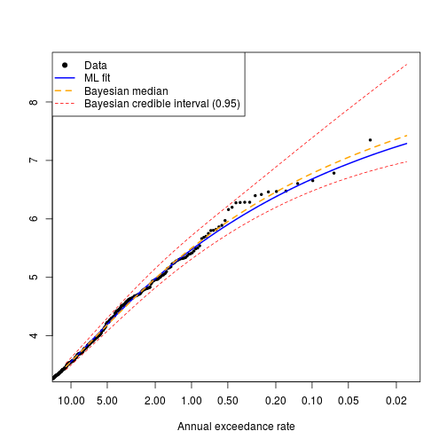
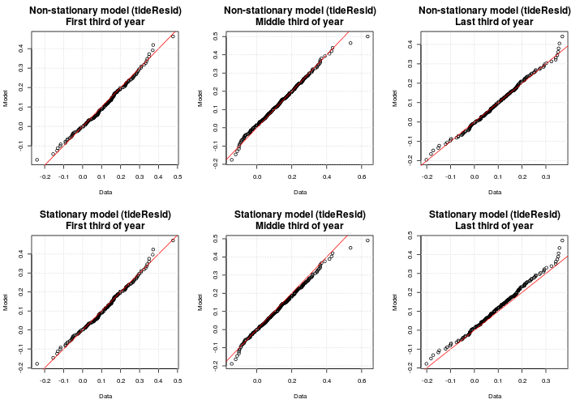

# **Modelling the univariate distributions of storm event statistics**
--------------------------------------------------------------------------

*Gareth Davies, Geoscience Australia 2017*

# Introduction
------------------

This document follows on from
[statistical_model_storm_timings.md](statistical_model_storm_timings.md)
in describing our statistical analysis of storm waves at Old Bar. 

It illustrates the process of fitting probability distributions to the storm event summary statistics,
which are conditional on the time of year and ENSO.

It is essential that the code
[statistical_model_storm_timings.md](statistical_model_storm_timings.md) has
alread been run, and produced an Rdata file
*'Rimages/session_storm_timings_XXXX.Rdata'*, where XXXX contains information on 
whether data perturbation was applied.


Supposing the prerequisites have been run, and you have R installed,
along with all the packages required to run this code, and a copy of the
*stormwavecluster* git repository, then you should be able to re-run the
analysis here by simply copy-pasting the code. Alternatively, it can be run
with the `knit` command in the *knitr* package: 

```r
library(knitr)
knit('statistical_model_univariate_distributions.Rmd')
```

To run the code in tie-breaking mode, be sure to pass the a command-line
argument matching `break_ties` to R when starting, followed by an integer ID > 0,
e.g.

    R --args --break_ties 1234

or

    Rscript script_name_here.R --break_ties 1234

Running the above commands many times is facilitated by scripts in
[../statistical_model_fit_perturbed_data/README.md](../statistical_model_fit_perturbed_data/README.md)

The basic approach followed here is to:
* **Step 1: Load the previous session**
* **Step 2: Exploratory analysis of seasonal non-stationarity in event statistics**
* **Step 3: Model the distribution of each storm summary statistic, dependent on season (and mean annual SOI for wave direction)**

Later we will model the remaining joint dependence between these variables, and
simulate synthetic storm sequences. 

# **Step 1: Load the previous session and set some key parameters**
Here we re-load the session from the previous stage of the modelling. We also
set some parameters controlling the Monte-Carlo Markov-Chain (MCMC) computations 
further in the document. 
* The default parameter values should be appropriate for the analysis
herein. To save computational effort (for testing purposes) users might reduce
the `mcmc_chain_length`. To reduce memory usage, users can increase the
`mcmc_chain_thin` parameter. If using other datasets, it may be necessary to
increase the `mcmc_chain_length` to get convergence.
* The code is also setup to run using a previous session with data ties broken
at random. See
[../statistical_model_fit_perturbed_data/README.md](../statistical_model_fit_perturbed_data/README.md)
for information on how to do this.


```r
# Here we support multiple runs with random tie-breaking of the data
# If R was passed a commandline argument 'break_ties n' on startup (with n = integer),
# then read the n'th R session matching 'Rimages/session_storm_timings_TRUE_*.Rdata'.
# That session will correspond to one of the tie-breaking sessions
if( length(grep('break_ties', commandArgs(trailingOnly=TRUE))) > 0 ){

    break_ties_with_jitter = TRUE

    # Read one of the sessions with tie-breaking
    session_n = as.numeric(commandArgs(trailingOnly=TRUE)[2])

    if(session_n < 1) stop('Invalid run ID')

    # In this case, only run 1 mcmc chain on 1 core [since we will check many
    # tie-breaking sessions]
    mcmc_nchains = 1
    mcmc_ncores = 1

    mcmc_chain_length = 2e+06 # One long chain

}else{

    break_ties_with_jitter = FALSE
    session_n = 0

    # In this case, run more chains in parallel.
    mcmc_nchains = 6
    mcmc_ncores = 6

    # However, the parallel framework used here does not work on windows,
    # so if running windows, only use 1 core
    if(.Platform$OS.type == 'windows') mcmc_ncores = 1

    # Length of each MCMC chain. Should be 'large' e.g 10^6, except for test runs 
    # We run multiple chains to enhance the likelihood of detecting non-convergence
    # since anyway this is cheap in parallel. These are pooled for final estimates,
    # but it is essential to manually check the convergence of the chains [e.g.
    # by comparing high return period confidence intervals].
    mcmc_chain_length = 1e+06 #1e+05 

}

# Make a 'title' which can appear in filenames to identify this run
run_title_id = paste0(break_ties_with_jitter, '_', session_n)

previous_R_session_file = paste0('Rimages/session_storm_timings_', run_title_id, '.Rdata')
load(previous_R_session_file)

# To reduce the data size, we can throw away all but a fraction of the mcmc
# chains. This has computational (memory) benefits if the MCMC samples are
# strongly autocorrelated, but no other advantages.
mcmc_chain_thin = 20 
```

# **Step 2: Exploratory analysis of seasonal non-stationarity in event statistics**
----------------------------------------------------------------------

**Here we plot the distribution of each storm statistic by month.** This
highlights the seasonal non-stationarity. Below we will take some steps to
check the statistical significance of this, and later will use copula-based
techniques to make the modelled univariate distribution of each variable
conditional on the time of year.

```r
# Get month as 1, 2, ... 12
month_num = as.numeric(format(event_statistics$time, '%m'))
par(mfrow=c(3,2))
for(i in 1:5){
    boxplot(event_statistics[,i] ~ month_num, xlab='Month', 
        ylab=names(event_statistics)[i], names=month.abb,
        col='grey')
    title(main = names(event_statistics)[i], cex.main=2)
}

rm(month_num)
```


To model the seasonal non-stationarity illustrated above, we define a seasonal
variable periodic in time, of the form `cos(2*pi*(t - offset))` where the time
`t` is in years. The `offset` is a phase variable which can be optimised for
each storm summary statistic separately, to give the 'best' cosine seasonal
pattern matching the data. One way to do this is to find the value of `offset`
which maximises the rank-correlation between each storm variable and the seasonal
variable.

**Below we compute the offset for each storm summary statistic, and also assess
it's statistical significance using a permutation test.** The figure shows the
rank correlation between each variable and a seasonal variable, for each value
of `offset` in [-0.5, 0.5] (which represents all possible values). Note the
`offset` value with the strongest rank correlation may be interpreted as the
optimal offset (*here we choose the `offset` with largest negative rank
correlation, so many `offset`'s are close to zero*). 


```r
# Store some useful statistics
stat_store = data.frame(var = rep(NA, 5), phi=rep(NA,5), cor = rep(NA, 5), 
    p = rep(NA, 5), cor_05=rep(NA, 5))
stat_store$var = names(event_statistics)[1:5]

# Test these values of the 'offset' parameter
phi_vals = seq(-0.5, 0.5, by=0.01)
par(mfrow=c(3,2))
for(i in 1:5){

    # Compute spearman correlation for all values of phi, for variable i
    corrs = phi_vals*0
    for(j in 1:length(phi_vals)){
        corrs[j] =  cor(event_statistics[,i], 
            cos(2*pi*(event_statistics$startyear - phi_vals[j])),
            method='s', use='pairwise.complete.obs')
    }

    plot(phi_vals, corrs, xlab='Offset', ylab='Spearman Correlation', 
        main=names(event_statistics)[i], cex.main=2,
        cex.lab=1.5)
    grid()
    abline(v=0, col='orange')

    # Save the 'best' result
    stat_store$phi[i] = phi_vals[which.min(corrs)]
    stat_store$cor[i] = min(corrs)

    # Function to compute the 'best' correlation of season with
    # permuted data, which by definition has no significant correlation with
    # the season. We can use this to assess the statistical significance of the
    # observed correlation between each variable and the season.
    cor_phi_function<-function(i0=i){
        # Resample the data
        d0 = sample(event_statistics[,i0], size=length(event_statistics[,i0]), 
            replace=TRUE)
        # Correlation function
        g<-function(phi){ 
            cor(d0, cos(2*pi*(event_statistics$startyear - phi)), 
                method='s', use='pairwise.complete.obs')
        }
        # Find best 'phi'
        best_phi = optimize(g, c(-0.5, 0.5), tol=1.0e-06)$minimum

        return(g(best_phi))
    }
   
    # Let's get statistical significance 
    cor_boot = replicate(5000, cor_phi_function())

    # Because our optimizer minimises, the 'strongest' correlations
    # it finds are negative. Of course if 0.5 is added to phi this is equivalent
    # to a positive correlation. 
    
    qcb = quantile(cor_boot, 0.05, type=6)
    stat_store$cor_05[i] = qcb
    stat_store$p[i] = mean(cor_boot < min(corrs))

    polygon(rbind( c(-1, -qcb), c(-1, qcb), c(1, qcb), c(1, -qcb)),
        col='brown', density=10)
}

dir.create('stat_store', showWarnings=FALSE)
write.table(stat_store, 
    file=paste0('stat_store/seasonal_correlation_statistics_', run_title_id, '.csv'), 
    sep="  &  ",
    quote=FALSE, row.names=FALSE)

rm(phi_vals, corrs)
```


In the above figure, the shaded region represents a 95% interval for the best
correlation expected of 'random' data (i.e. a random sample of the original
data with an optimized offset).  Correlations outside the shaded interval are
unlikely to occur at random, and are intepreted as reflecting true seasonal
non-stationarity. 

Below we will make each storm summary statistic dependent on the seasonal
variable. For wave direction, the mean annual SOI value will also be treated.
Recall that relationships between mean annual SOI and storm wave direction
were established earlier (
[../preprocessing/extract_storm_events.md](../preprocessing/extract_storm_events.md),
[statistical_model_storm_timings.md](statistical_model_storm_timings.md) ). We
also found relationships between mean annual SOI and the rate of storms, and
MSL, which were treated in those sections (using the non-homogeneous poisson
process model, and the STL decomposition, respectively). Therefore, the latter
relationships are not treated in the section below, but they are included in
the overall model.


# **Step 3: Model the distribution of each storm summary statistic, dependent on season (and mean annual SOI for wave direction)**

In this section we model the distribution of each storm summary statistic, and
then make it conditional on the seasonal variable (and on mean annual SOI in
the case of wave direction only). 

The distributions of `hsig`, `duration` and `tideResid` are initially modelled
as extreme value mixture distributions. The distributions of `dir` and
`steepness` are initially modelled using non-parametric smoothing (based on the
log-spline method).

## Hsig

**Below we fit an extreme value mixture model to Hsig, using maximum
likelihood.** The model has a GPD upper tail, and a Gamma lower tail.

```r
# Get the exmix_fit routines in their own environment
evmix_fit = new.env()
source('../../R/evmix_fit/evmix_fit.R', local=evmix_fit, chdir=TRUE)

# Define the minimum possible value of hsig. The gamma distribution has a lower
# bound of 0, so we need to offset the data to match this. Note that even if hsig
# was perturbed, we account for that in defining hsig_threshold
hsig_offset = hsig_threshold

# Fit it
hsig_mixture_fit = evmix_fit$fit_gpd_mixture(
    data=event_statistics$hsig, 
    data_offset=hsig_offset, 
    bulk='gamma')
```

```
## [1] "  evmix fit NLLH: " "530.237080056746"  
## [1] "  fit_optim NLLH: " "530.237080030477"  
## [1] "  Bulk par estimate0: " "0.842400448660163"     
## [3] "1.0204368965617"        "1.27267963923683"      
## [5] "-0.219878654410625"    
## [1] "           estimate1: " "0.842402977361388"     
## [3] "1.02042857261524"       "1.27268869445894"      
## [5] "-0.219876719484767"    
## [1] "  Difference: "        "-2.52870122496862e-06" "8.32394645855494e-06" 
## [4] "-9.05522210814524e-06" "-1.93492585820465e-06"
## [1] "PASS: checked qfun and pfun are inverse functions"
```

```r
# Make a plot
DU$qqplot3(event_statistics$hsig, hsig_mixture_fit$qfun(runif(100000)), 
    main='Hsig QQ-plot')
abline(0, 1, col='red'); grid()
```


The above code leads to print-outs of the maximum likelihood parameter fits
achieved by different methods, and the differences between them (which are only
a few parts per million in this case). Because fitting extreme value mixture
models can be challenging, internally the code tries many different fits.

During the fitting process, we also compute quantile and inverse quantile
functions for the fitted distribution. The code checks numerically that these
really are the inverse of each other, and will print information about whether
this was found to be true (*if not, there is a problem!*)

The quantile-quantile plot of the observed and fitted Hsig should fall close to
a straight line, if the fit worked. Poor fits are suggested by strong
deviations from the 1:1 line. While in this case the fit looks good, if the fit
is poor then further analysis is required. For example, it is possible that the
model fit did not converge, or that the statistical model is a poor choice for
the data.

Given that the above fit looks OK, **below we use Monte-Carlo-Markov-Chain
(MCMC) techniques to compute the Bayesian posterior distribution of the 4 model
parameters**. A few points about this process:
* The prior probability is uniform for each variable. Here we use
a very broad uniform distribution to represent an approximately
'non-informative' prior. The Gamma distribution parameters have uniform prior
over [0, 100 000 000]. The GPD threshold parameter prior is uniform
from zero to the 50th highest data point (to ensure that the tail
part of the model is fit using at least 50 data points). The GPD shape parameter
prior is uniform over [-1000 , 1000]. Note that for some other datasets, it
might be necessary to constrain the GPD shape parameter prior more strongly
than we do below, if it cannot be well estimated from the data (e.g. see the
literature). Overall we are aiming to make our priors reasonably
'non-informative', while still imposing pragmatic constraints required to
achieve a reasonable fit. 
* The routines update the object `hsig_mixture_fit`, so it contains
multiple chains, i.e. 'random walks' through the posterior parameter
distribution.
* Here we run 6 separate chains, with randomly chosen starting parameters, to
make it easier to detect non-convergence (i.e. to reduce the chance that a
single chain gets 'stuck' in part of the posterior distribution). The parameter
`mcmc_start_perturbation` defines the scale for that perturbation.
* It is possible that the randomly chosen start parameters are theoretically
impossible. In this case, the code will report that it had `Bad random start
parameters`, and will generate new ones.
* We use a burn-in of 1000 (i.e. the first 1000 entries in the chain are
discarded). This can assist with convergence.
* We make a simple diagnostic plot to check the MCMC convergence.
* The code runs in parallel, using 6 cores below. The parallel framework will
only work correctly on a shared memory linux machine.

```r
#' MCMC computations for later uncertainty characterisation

# Prevent the threshold parameter from exceeding the highest 50th data point
# Note that inside the fitting routine, Hsig was transformed to have lower
# bound of slightly above zero before fitting, since the Gamma distribution has
# a lower bound of zero. Hence we subtract hsig_offset here.
hsig_u_upper_limit = sort(event_statistics$hsig, decreasing=TRUE)[50] - hsig_offset
hsig_u_lower_limit = hsig_threshold - hsig_offset # Should be 0

# Compute the MCMC chains in parallel
hsig_mixture_fit = evmix_fit$mcmc_gpd_mixture(
    fit_env=hsig_mixture_fit, 
    par_lower_limits=c(0, 0, hsig_u_lower_limit, -1000.), 
    par_upper_limits=c(1e+08, 1.0e+08, hsig_u_upper_limit, 1000),
    mcmc_start_perturbation=c(0.4, 0.4, 2., 0.2), 
    mcmc_length=mcmc_chain_length,
    mcmc_thin=mcmc_chain_thin,
    mcmc_burnin=1000,
    mcmc_nchains=mcmc_nchains,
    mcmc_tune=c(1,1,1,1)*1,
    mc_cores=mcmc_ncores,
    annual_event_rate=mean(events_per_year_truncated))

# Graphical convergence check of one of the chains. 
plot(hsig_mixture_fit$mcmc_chains[[1]])
```


**Below, we investigate the parameter estimates for each chain.** If all the
changes have converged, the quantiles of each parameter estimate should be
essentially the same (although if the underlying posterior distribution is
unbounded, then of course the min/max will not converge, although all other
quantiles eventually will). We also look at the 1/100 year event Hsig implied
by each chain, and make a return level plot.

```r
# Look at mcmc parameter estimates in each chain
lapply(hsig_mixture_fit$mcmc_chains, f<-function(x) summary(as.matrix(x)))
```

```
## [[1]]
##       var1             var2             var3              var4        
##  Min.   :0.6248   Min.   :0.7556   Min.   :0.01487   Min.   :-0.4744  
##  1st Qu.:0.8146   1st Qu.:0.9630   1st Qu.:1.07208   1st Qu.:-0.2522  
##  Median :0.8448   Median :1.0146   Median :1.33101   Median :-0.2049  
##  Mean   :0.8447   Mean   :1.0263   Mean   :1.31537   Mean   :-0.2015  
##  3rd Qu.:0.8750   3rd Qu.:1.0739   3rd Qu.:1.59343   3rd Qu.:-0.1530  
##  Max.   :1.0428   Max.   :2.1317   Max.   :2.17537   Max.   : 0.1542  
## 
## [[2]]
##       var1             var2             var3              var4        
##  Min.   :0.6381   Min.   :0.7307   Min.   :0.02793   Min.   :-0.4580  
##  1st Qu.:0.8149   1st Qu.:0.9630   1st Qu.:1.07488   1st Qu.:-0.2522  
##  Median :0.8450   Median :1.0143   Median :1.33355   Median :-0.2056  
##  Mean   :0.8449   Mean   :1.0248   Mean   :1.32001   Mean   :-0.2020  
##  3rd Qu.:0.8748   3rd Qu.:1.0728   3rd Qu.:1.59244   3rd Qu.:-0.1544  
##  Max.   :1.0356   Max.   :1.9344   Max.   :2.17549   Max.   : 0.3544  
## 
## [[3]]
##       var1             var2             var3              var4        
##  Min.   :0.6414   Min.   :0.7415   Min.   :0.03549   Min.   :-0.4589  
##  1st Qu.:0.8151   1st Qu.:0.9633   1st Qu.:1.07810   1st Qu.:-0.2524  
##  Median :0.8448   Median :1.0144   Median :1.33385   Median :-0.2058  
##  Mean   :0.8449   Mean   :1.0248   Mean   :1.32110   Mean   :-0.2025  
##  3rd Qu.:0.8750   3rd Qu.:1.0723   3rd Qu.:1.59512   3rd Qu.:-0.1550  
##  Max.   :1.0432   Max.   :1.8674   Max.   :2.17542   Max.   : 0.1364  
## 
## [[4]]
##       var1             var2             var3              var4        
##  Min.   :0.6066   Min.   :0.7493   Min.   :0.04039   Min.   :-0.4704  
##  1st Qu.:0.8149   1st Qu.:0.9630   1st Qu.:1.08066   1st Qu.:-0.2521  
##  Median :0.8450   Median :1.0137   Median :1.33291   Median :-0.2054  
##  Mean   :0.8452   Mean   :1.0240   Mean   :1.32239   Mean   :-0.2021  
##  3rd Qu.:0.8749   3rd Qu.:1.0723   3rd Qu.:1.59413   3rd Qu.:-0.1542  
##  Max.   :1.0544   Max.   :2.1070   Max.   :2.17544   Max.   : 0.2449  
## 
## [[5]]
##       var1             var2             var3              var4        
##  Min.   :0.6370   Min.   :0.7596   Min.   :0.02182   Min.   :-0.4473  
##  1st Qu.:0.8145   1st Qu.:0.9635   1st Qu.:1.07650   1st Qu.:-0.2524  
##  Median :0.8446   Median :1.0150   Median :1.33302   Median :-0.2048  
##  Mean   :0.8445   Mean   :1.0264   Mean   :1.31877   Mean   :-0.2018  
##  3rd Qu.:0.8749   3rd Qu.:1.0737   3rd Qu.:1.59146   3rd Qu.:-0.1542  
##  Max.   :1.0260   Max.   :1.9586   Max.   :2.17547   Max.   : 0.2071  
## 
## [[6]]
##       var1             var2             var3              var4        
##  Min.   :0.6517   Min.   :0.7488   Min.   :0.03448   Min.   :-0.4540  
##  1st Qu.:0.8151   1st Qu.:0.9630   1st Qu.:1.07655   1st Qu.:-0.2528  
##  Median :0.8448   Median :1.0144   Median :1.33639   Median :-0.2057  
##  Mean   :0.8450   Mean   :1.0248   Mean   :1.32288   Mean   :-0.2026  
##  3rd Qu.:0.8750   3rd Qu.:1.0720   3rd Qu.:1.59964   3rd Qu.:-0.1548  
##  Max.   :1.0468   Max.   :1.8190   Max.   :2.17526   Max.   : 0.1194
```

```r
# Look at ari 100 estimates
lapply(hsig_mixture_fit$ari_100_chains, 
    f<-function(x) quantile(x, p=c(0.025, 0.5, 0.975)))
```

```
## [[1]]
##     2.5%      50%    97.5% 
## 7.067410 7.542892 8.883444 
## 
## [[2]]
##     2.5%      50%    97.5% 
## 7.068379 7.542097 8.895494 
## 
## [[3]]
##     2.5%      50%    97.5% 
## 7.068076 7.541363 8.851834 
## 
## [[4]]
##     2.5%      50%    97.5% 
## 7.066965 7.542307 8.869714 
## 
## [[5]]
##     2.5%      50%    97.5% 
## 7.067397 7.546843 8.888480 
## 
## [[6]]
##     2.5%      50%    97.5% 
## 7.065658 7.542447 8.859819
```

```r
# Look at model prediction of the maximum observed value
# (supposing we observed the system for the same length of time as the data covers)
lapply(hsig_mixture_fit$ari_max_data_chains, 
    f<-function(x) quantile(x, p=c(0.025, 0.5, 0.975)))
```

```
## [[1]]
##     2.5%      50%    97.5% 
## 6.814282 7.190518 8.116170 
## 
## [[2]]
##     2.5%      50%    97.5% 
## 6.816842 7.189615 8.121737 
## 
## [[3]]
##     2.5%      50%    97.5% 
## 6.816784 7.189273 8.093659 
## 
## [[4]]
##     2.5%      50%    97.5% 
## 6.816673 7.189199 8.108271 
## 
## [[5]]
##     2.5%      50%    97.5% 
## 6.816311 7.193278 8.120669 
## 
## [[6]]
##     2.5%      50%    97.5% 
## 6.814281 7.190390 8.098815
```

```r
# If the chains are well behaved, we can combine all 
summary(hsig_mixture_fit$combined_chains)
```

```
##        V1               V2               V3                V4         
##  Min.   :0.6066   Min.   :0.7307   Min.   :0.01487   Min.   :-0.4744  
##  1st Qu.:0.8149   1st Qu.:0.9631   1st Qu.:1.07636   1st Qu.:-0.2523  
##  Median :0.8448   Median :1.0144   Median :1.33341   Median :-0.2054  
##  Mean   :0.8449   Mean   :1.0252   Mean   :1.32009   Mean   :-0.2021  
##  3rd Qu.:0.8749   3rd Qu.:1.0728   3rd Qu.:1.59441   3rd Qu.:-0.1543  
##  Max.   :1.0544   Max.   :2.1317   Max.   :2.17549   Max.   : 0.3544
```

```r
# If the chains are well behaved then we might want a merged 1/100 hsig
quantile(hsig_mixture_fit$combined_ari100, c(0.025, 0.5, 0.975))
```

```
##     2.5%      50%    97.5% 
## 7.067309 7.543024 8.875498
```

```r
# This is an alternative credible interval -- the 'highest posterior density' interval.
HPDinterval(as.mcmc(hsig_mixture_fit$combined_ari100))
```

```
##         lower    upper
## var1 6.978277 8.604446
## attr(,"Probability")
## [1] 0.95
```

```r
evmix_fit$mcmc_rl_plot(hsig_mixture_fit)
```



**Here we use a different technique to compute the 1/100 AEP Hsig, as a
cross-check on the above analysis.** A simple Generalised Extreme Value model
fit to annual maxima is undertaken. While this technique is based on limited
data (i.e. only one observation per year), it is not dependent on our storm
event definition or choice of wave height threshold. In this sense it is quite
different to our peaks-over-threshold method above -- and thus serves as a
useful cross-check on the former results. 

```r
# Here we do an annual maximum analysis with a gev
# This avoids issues with event definition
annual_max_hsig = aggregate(event_statistics$hsig, 
    list(year=floor(event_statistics$startyear)), max)
# Remove the first and last years with incomplete data
keep_years = which(annual_max_hsig$year %in% 1986:2015)
library(ismev)
```

```
## Loading required package: mgcv
```

```
## Loading required package: nlme
```

```
## This is mgcv 1.8-12. For overview type 'help("mgcv-package")'.
```

```r
gev_fit_annual_max = gev.fit(annual_max_hsig[keep_years,2])
```

```
## $conv
## [1] 0
## 
## $nllh
## [1] 31.04738
## 
## $mle
## [1]  5.4969947  0.6503065 -0.2118537
## 
## $se
## [1] 0.1365196 0.1016247 0.1591920
```

```r
gev.prof(gev_fit_annual_max, m=100, xlow=6.5, xup=12, conf=0.95)
```

```
## If routine fails, try changing plotting interval
```

```r
title(main='Profile likehood confidence interval for 1/100 AEP Hsig \n using a GEV fit to annual maxima')
# Add vertical lines at the limits of the 95% interval
abline(v=c(6.97, 10.4), col='red', lty='dashed')
# Add vertical line at ML estimate
abline(v=7.4, col='orange')
```


**Here we use copulas to determine a distribution for Hsig, conditional on the season**.
The computational details are wrapped up in a function that we source.
Essentially, the code:
* Finds the optimal seasonal `offset` for the chosen variable (`hsig`), and uses
this to create a function to compute the season statistic (which is `hsig`
specific) from the event time of year.
* Automatically chooses a copula family (based on AIC) to model dependence
between the chosen variable and the season variable, and fits the copula.
* Uses the copula to create new quantile and inverse quantile functions, for
which the user can pass conditional variables (i.e. to get the distribution,
given that the season variable attains a particular value).
* Test that the quantile and inverse quantile functions really are inverses of
each other (this can help catch user input errors)
* Make quantile-quantile plots of the data and model for a number of time
periods (here the first, middle and last thirds of the calendar year). The top
row shows the model with the distribution varying by season, and the bottom row
shows the model without seasonal effects. It is not particularly easy to
visually detect seasonal non-stationarities in these plots [compared, say, with
using monthly boxplots].  Their main purpose is compare the model and data
distribution at different times of year, and so detect poor model fits.
However, you might notice that the top row of plots 'hug' the 1:1 line slightly
better than corresponding plots in the bottom row in the central data values.
This reflects the modelled seasonal non-stationarities. *Note the tail behaviour
can be erratic, since the 'model' result is actually a random sample from the model.*

```r
# Get code to fit the conditional distribution
# Give a path that will also work if run from another directory inside Analysis.
source('../../Analysis/statistical_model_fit/make_conditional_distribution.R', chdir=TRUE)

# This returns an environment containing the conditional quantile and inverse
# quantile functions, among other information
hsig_fit_conditional = make_fit_conditional_on_season(
    event_statistics,
    var='hsig', 
    q_raw=hsig_mixture_fit$qfun, 
    p_raw=hsig_mixture_fit$pfun,
    startyear = 'startyear')
```

```
## [1] "Conditional p/q functions passed test: "
## [1] "  (Check plots to see if quantiles are ok)"
```


```r
# What kind of copula was selected to model dependence between season and hsig?
print(hsig_fit_conditional$var_season_copula)
```

```
## Bivariate copula: Frank (par = -0.73, tau = -0.08)
```


## Duration

Here we model storm `duration`, using techniques virtually identical to those applied above.
As before:
* We first fit the univariate extreme value mixture distribution with maximum
likelihood; 
* Next we compute the posterior distribution of each parameter; 
* Finally we make the `duration` distribution conditional on the time of year,
using a seasonal variable that has been optimised to capture seasonality in the
storm `duration`.

**Here is the extreme value mixture model maximum likelihood fit**

```r
# Do the maximum likelihood fit. 
#
# Set the lower limit of the tail model to just below the lower limit of the
# data, in the event we perturb it by half an hour. [Initial lower limit = 1hr]
# However, if working with the 'raw' data, we should not set the lower limit to 1hr,
# since the latter is actually a data value, so some lower bound must be selected.
duration_offset = ifelse(break_ties_with_jitter, 
    1 - as.numeric(default_jitter_amounts['duration']), 
    0.5) 

duration_mixture_fit = evmix_fit$fit_gpd_mixture(
    data=event_statistics$duration, 
    data_offset=duration_offset, 
    bulk='gamma')
```

```
## Warning in FUN(X[[i]], ...): initial parameter values for threshold u = 0.5
## are invalid

## Warning in FUN(X[[i]], ...): initial parameter values for threshold u = 0.5
## are invalid
```

```
## [1] "  evmix fit NLLH: " "2796.86414960323"  
## [1] "  fit_optim NLLH: " "2796.86414960321"  
## [1] "  Bulk par estimate0: " "0.681252267165738"     
## [3] "36.5813148249192"       "47.3420092947302"      
## [5] "-0.167530742114676"    
## [1] "           estimate1: " "0.68125249331858"      
## [3] "36.5813149127856"       "47.3420092964143"      
## [5] "-0.167530255054506"    
## [1] "  Difference: "        "-2.26152842563998e-07" "-8.78664252468297e-08"
## [4] "-1.6840928651618e-09"  "-4.87060169696019e-07"
## [1] "PASS: checked qfun and pfun are inverse functions"
```

```r
# Make a plot
DU$qqplot3(event_statistics$duration, duration_mixture_fit$qfun(runif(100000)), 
    main='Duration QQ-plot')
abline(0, 1, col='red'); grid()
```


**Here is the extreme value mixture model posterior probability computation, using MCMC**
As before, note that we run a number of MCMC chains with random starting values, and in 
the event that the random starting parameters are invalid the code will simply try new ones.

```r
# MCMC computations for later uncertainty characterisation
#
# Prevent the threshold parameter from exceeding the highest 50th data point
duration_u_upper_limit = sort(event_statistics$duration, decreasing=TRUE)[50] - duration_offset
duration_u_lower_limit = 0

# Compute the MCMC chains in parallel.
duration_mixture_fit = evmix_fit$mcmc_gpd_mixture(
    fit_env=duration_mixture_fit, 
    par_lower_limits=c(0, 0, duration_u_lower_limit, -1000.), 
    par_upper_limits=c(1e+08, 1.0e+08, duration_u_upper_limit, 1000),
    mcmc_start_perturbation=c(0.4, 0.4, 2., 0.2), 
    mcmc_length=mcmc_chain_length,
    mcmc_thin=mcmc_chain_thin,
    mcmc_burnin=1000,
    mcmc_nchains=mcmc_nchains,
    mcmc_tune=c(1,1,1,1)*1,
    mc_cores=mcmc_ncores,
    annual_event_rate=mean(events_per_year_truncated))

# Graphical convergence check of one of the chains. 
plot(duration_mixture_fit$mcmc_chains[[1]])
```


**Here we check the similarity of all the MCMC chains, and make a return-level
plot for storm `duration`**

```r
# Look at mcmc parameter estimates in each chain
lapply(duration_mixture_fit$mcmc_chains, f<-function(x) summary(as.matrix(x)))
```

```
## [[1]]
##       var1             var2            var3             var4        
##  Min.   :0.5041   Min.   :27.10   Min.   : 3.626   Min.   :-0.3707  
##  1st Qu.:0.6527   1st Qu.:35.20   1st Qu.:29.955   1st Qu.:-0.1758  
##  Median :0.6765   Median :37.18   Median :43.459   Median :-0.1235  
##  Mean   :0.6761   Mean   :37.83   Mean   :41.552   Mean   :-0.1195  
##  3rd Qu.:0.7002   3rd Qu.:39.60   3rd Qu.:54.112   3rd Qu.:-0.0674  
##  Max.   :0.8202   Max.   :78.93   Max.   :70.499   Max.   : 0.4137  
## 
## [[2]]
##       var1             var2            var3             var4        
##  Min.   :0.5271   Min.   :27.11   Min.   : 3.504   Min.   :-0.3716  
##  1st Qu.:0.6524   1st Qu.:35.21   1st Qu.:29.890   1st Qu.:-0.1763  
##  Median :0.6762   Median :37.19   Median :43.400   Median :-0.1239  
##  Mean   :0.6760   Mean   :37.82   Mean   :41.517   Mean   :-0.1196  
##  3rd Qu.:0.7001   3rd Qu.:39.60   3rd Qu.:54.013   3rd Qu.:-0.0670  
##  Max.   :0.8477   Max.   :66.94   Max.   :70.495   Max.   : 0.3550  
## 
## [[3]]
##       var1             var2            var3             var4         
##  Min.   :0.5262   Min.   :26.94   Min.   : 3.765   Min.   :-0.35618  
##  1st Qu.:0.6522   1st Qu.:35.21   1st Qu.:29.864   1st Qu.:-0.17677  
##  Median :0.6763   Median :37.21   Median :43.419   Median :-0.12353  
##  Mean   :0.6760   Mean   :37.83   Mean   :41.510   Mean   :-0.11959  
##  3rd Qu.:0.6999   3rd Qu.:39.64   3rd Qu.:54.112   3rd Qu.:-0.06696  
##  Max.   :0.8224   Max.   :70.07   Max.   :70.500   Max.   : 0.30439  
## 
## [[4]]
##       var1             var2            var3             var4        
##  Min.   :0.5087   Min.   :27.43   Min.   : 3.154   Min.   :-0.3772  
##  1st Qu.:0.6523   1st Qu.:35.20   1st Qu.:30.065   1st Qu.:-0.1767  
##  Median :0.6764   Median :37.17   Median :43.567   Median :-0.1242  
##  Mean   :0.6760   Mean   :37.82   Mean   :41.672   Mean   :-0.1198  
##  3rd Qu.:0.7002   3rd Qu.:39.59   3rd Qu.:54.276   3rd Qu.:-0.0676  
##  Max.   :0.8263   Max.   :72.70   Max.   :70.499   Max.   : 0.2731  
## 
## [[5]]
##       var1             var2            var3             var4         
##  Min.   :0.5143   Min.   :27.14   Min.   : 3.161   Min.   :-0.36316  
##  1st Qu.:0.6525   1st Qu.:35.20   1st Qu.:30.175   1st Qu.:-0.17672  
##  Median :0.6762   Median :37.19   Median :43.543   Median :-0.12397  
##  Mean   :0.6760   Mean   :37.81   Mean   :41.652   Mean   :-0.11983  
##  3rd Qu.:0.7000   3rd Qu.:39.57   3rd Qu.:54.164   3rd Qu.:-0.06768  
##  Max.   :0.8306   Max.   :74.46   Max.   :70.500   Max.   : 0.27459  
## 
## [[6]]
##       var1             var2            var3             var4         
##  Min.   :0.5203   Min.   :26.99   Min.   : 3.078   Min.   :-0.35734  
##  1st Qu.:0.6528   1st Qu.:35.19   1st Qu.:30.101   1st Qu.:-0.17633  
##  Median :0.6764   Median :37.17   Median :43.476   Median :-0.12391  
##  Mean   :0.6763   Mean   :37.76   Mean   :41.673   Mean   :-0.11970  
##  3rd Qu.:0.7002   3rd Qu.:39.57   3rd Qu.:54.233   3rd Qu.:-0.06718  
##  Max.   :0.8214   Max.   :68.05   Max.   :70.500   Max.   : 0.37942
```

```r
# Look at ari 100 estimates
lapply(duration_mixture_fit$ari_100_chains, 
    f<-function(x) quantile(x, p=c(0.025, 0.5, 0.975)))
```

```
## [[1]]
##     2.5%      50%    97.5% 
## 151.0629 175.3093 242.9498 
## 
## [[2]]
##     2.5%      50%    97.5% 
## 151.1094 175.1505 243.3463 
## 
## [[3]]
##     2.5%      50%    97.5% 
## 151.0849 175.2138 244.0766 
## 
## [[4]]
##     2.5%      50%    97.5% 
## 150.9283 175.2011 243.7403 
## 
## [[5]]
##     2.5%      50%    97.5% 
## 150.9947 175.2706 243.7375 
## 
## [[6]]
##     2.5%      50%    97.5% 
## 151.0339 175.2279 243.8298
```

```r
# Look at model prediction of the maximum observed value
# (supposing we observed the system for the same length of time as the data covers)
lapply(duration_mixture_fit$ari_max_data_chains, 
    f<-function(x) quantile(x, p=c(0.025, 0.5, 0.975)))
```

```
## [[1]]
##     2.5%      50%    97.5% 
## 138.6974 156.5982 200.5860 
## 
## [[2]]
##     2.5%      50%    97.5% 
## 138.8322 156.5525 200.4102 
## 
## [[3]]
##     2.5%      50%    97.5% 
## 138.7518 156.5373 201.3407 
## 
## [[4]]
##     2.5%      50%    97.5% 
## 138.6557 156.5857 200.7634 
## 
## [[5]]
##     2.5%      50%    97.5% 
## 138.6769 156.6006 201.0096 
## 
## [[6]]
##     2.5%      50%    97.5% 
## 138.7679 156.5727 201.0198
```

```r
# If the chains seem ok, we can combine all 
summary(duration_mixture_fit$combined_chains)
```

```
##        V1               V2              V3               V4         
##  Min.   :0.5041   Min.   :26.94   Min.   : 3.078   Min.   :-0.3772  
##  1st Qu.:0.6525   1st Qu.:35.20   1st Qu.:30.010   1st Qu.:-0.1764  
##  Median :0.6764   Median :37.19   Median :43.476   Median :-0.1238  
##  Mean   :0.6761   Mean   :37.81   Mean   :41.596   Mean   :-0.1197  
##  3rd Qu.:0.7001   3rd Qu.:39.59   3rd Qu.:54.147   3rd Qu.:-0.0673  
##  Max.   :0.8477   Max.   :78.93   Max.   :70.500   Max.   : 0.4137
```

```r
# If the chains are well behaved then we might want a merged 1/100 duration
quantile(duration_mixture_fit$combined_ari100, c(0.025, 0.5, 0.975))
```

```
##     2.5%      50%    97.5% 
## 151.0397 175.2287 243.5962
```

```r
HPDinterval(as.mcmc(duration_mixture_fit$combined_ari100))
```

```
##         lower    upper
## var1 146.9178 229.7685
## attr(,"Probability")
## [1] 0.95
```

```r
# Return level plot
evmix_fit$mcmc_rl_plot(duration_mixture_fit)
```


**Finally we make the `duration` fit conditional on the time of year, using a
seasonal variable.** The seasonal QQ-plots below highlight the hourly
discretization in the `duration` data, which is prominent at low quantiles. It
is important to check whether this effects the analysis through randomization
of the data, which we undertake in the section
[../statistical_model_fit_pertubed_data](../statistical_model_fit_perturbed_data).

```r
# This returns an environment containing the conditional quantile and inverse
# quantile functions, among other information
duration_fit_conditional = make_fit_conditional_on_season(
    event_statistics,
    var='duration', 
    q_raw=duration_mixture_fit$qfun, 
    p_raw=duration_mixture_fit$pfun,
    startyear = 'startyear')
```

```
## [1] "Conditional p/q functions passed test: "
## [1] "  (Check plots to see if quantiles are ok)"
```


```r
# What kind of copula was selected to model dependence between season and duration?
print(duration_fit_conditional$var_season_copula)
```

```
## Bivariate copula: Gaussian (par = -0.15, tau = -0.09)
```

## Tidal residual

Here we generally follow the steps implemented above for `hsig` and `duration`,
for modelling the tidal residual `tideResid`. An important change is that we
fit an extreme value mixture model with a normal lower tail (instead of a Gamma
lower tail). This is done because unlike storm `hsig` and `duration`, there is
no natural lower limit on the `tideResid` [e.g.  it can even be negative on
occasion].


```r
# Manually remove missing (NA) data before fitting
tideResid_mixture_fit = evmix_fit$fit_gpd_mixture(
    data=na.omit(event_statistics$tideResid),  
    bulk='normal')
```

```
## [1] "  evmix fit NLLH: " "-443.491563137327" 
## [1] "  fit_optim NLLH: " "-443.491563173242" 
## [1] "  Bulk par estimate0: " "0.114681095472333"     
## [3] "0.1135725221079"        "0.185571006249087"     
## [5] "-0.125692215113564"    
## [1] "           estimate1: " "0.114681127821652"     
## [3] "0.113572500789905"      "0.185570939525485"     
## [5] "-0.125692214524754"    
## [1] "  Difference: "        "-3.23493184045676e-08" "2.13179948138631e-08" 
## [4] "6.67236016438366e-08"  "-5.88809556667513e-10"
## [1] "PASS: checked qfun and pfun are inverse functions"
```

```r
# Make a plot
DU$qqplot3(na.omit(event_statistics$tideResid), 
    tideResid_mixture_fit$qfun(runif(100000)))
abline(0, 1, col='red')
grid()
```


Below is the MCMC computation of the posterior probability distribution.
As before, bad random starting parameters are rejected, with a warning.

```r
#' MCMC computations for later uncertainty characterisation
min_tr = min(event_statistics$tideResid, na.rm=TRUE)

tideResid_u_upper_limit = sort(event_statistics$tideResid, decreasing=TRUE)[50]
tideResid_u_lower_limit = min_tr

tideResid_mixture_fit = evmix_fit$mcmc_gpd_mixture(
    fit_env=tideResid_mixture_fit, 
    par_lower_limits=c(min_tr, 0, tideResid_u_lower_limit, -1000), 
    par_upper_limits=c(1e+08, 1e+08, tideResid_u_upper_limit, 1000),
    mcmc_start_perturbation=c(0.2, 0.2, 0.2, 0.3), 
    mcmc_length=mcmc_chain_length,
    mcmc_thin=mcmc_chain_thin,
    mcmc_burnin=1000,
    mcmc_nchains=mcmc_nchains,
    mcmc_tune=c(1,1,1,1)*1.,
    mc_cores=mcmc_ncores,
    annual_event_rate=mean(events_per_year_truncated))

# Graphical convergence check
plot(tideResid_mixture_fit$mcmc_chains[[1]])
```


```r
# Clean up
rm(min_tr)
```

**Here we further investigate the behaviour of the MCMC chains for the tidal
residual fit, and make a return-level plot**

```r
# Look at mcmc parameter estimates in each chain
lapply(tideResid_mixture_fit$mcmc_chains, f<-function(x) summary(as.matrix(x)))
```

```
## [[1]]
##       var1              var2             var3             var4          
##  Min.   :0.09468   Min.   :0.1001   Min.   :0.1054   Min.   :-0.233530  
##  1st Qu.:0.11254   1st Qu.:0.1131   1st Qu.:0.1989   1st Qu.:-0.110292  
##  Median :0.11580   Median :0.1157   Median :0.2284   Median :-0.061202  
##  Mean   :0.11581   Mean   :0.1157   Mean   :0.2296   Mean   :-0.044217  
##  3rd Qu.:0.11905   3rd Qu.:0.1184   3rd Qu.:0.2628   3rd Qu.: 0.002538  
##  Max.   :0.13530   Max.   :0.1343   Max.   :0.2929   Max.   : 0.679033  
## 
## [[2]]
##       var1              var2              var3             var4          
##  Min.   :0.09477   Min.   :0.09914   Min.   :0.1138   Min.   :-0.242961  
##  1st Qu.:0.11258   1st Qu.:0.11310   1st Qu.:0.1988   1st Qu.:-0.109631  
##  Median :0.11581   Median :0.11573   Median :0.2289   Median :-0.060692  
##  Mean   :0.11582   Mean   :0.11572   Mean   :0.2297   Mean   :-0.044201  
##  3rd Qu.:0.11906   3rd Qu.:0.11835   3rd Qu.:0.2631   3rd Qu.: 0.003536  
##  Max.   :0.13555   Max.   :0.13133   Max.   :0.2929   Max.   : 0.633467  
## 
## [[3]]
##       var1              var2             var3             var4          
##  Min.   :0.09655   Min.   :0.1002   Min.   :0.1131   Min.   :-0.235754  
##  1st Qu.:0.11258   1st Qu.:0.1131   1st Qu.:0.1986   1st Qu.:-0.110190  
##  Median :0.11583   Median :0.1157   Median :0.2283   Median :-0.061327  
##  Mean   :0.11582   Mean   :0.1157   Mean   :0.2293   Mean   :-0.045565  
##  3rd Qu.:0.11905   3rd Qu.:0.1183   3rd Qu.:0.2622   3rd Qu.: 0.001528  
##  Max.   :0.13654   Max.   :0.1306   Max.   :0.2929   Max.   : 0.563758  
## 
## [[4]]
##       var1              var2             var3             var4          
##  Min.   :0.09454   Min.   :0.0992   Min.   :0.1018   Min.   :-0.238567  
##  1st Qu.:0.11261   1st Qu.:0.1131   1st Qu.:0.1994   1st Qu.:-0.109213  
##  Median :0.11585   Median :0.1157   Median :0.2290   Median :-0.061049  
##  Mean   :0.11585   Mean   :0.1158   Mean   :0.2299   Mean   :-0.044016  
##  3rd Qu.:0.11907   3rd Qu.:0.1184   3rd Qu.:0.2629   3rd Qu.: 0.002652  
##  Max.   :0.13706   Max.   :0.1319   Max.   :0.2929   Max.   : 0.686756  
## 
## [[5]]
##       var1              var2             var3             var4          
##  Min.   :0.09555   Min.   :0.0997   Min.   :0.1061   Min.   :-0.243693  
##  1st Qu.:0.11262   1st Qu.:0.1131   1st Qu.:0.1994   1st Qu.:-0.109109  
##  Median :0.11584   Median :0.1158   Median :0.2291   Median :-0.060234  
##  Mean   :0.11586   Mean   :0.1157   Mean   :0.2301   Mean   :-0.043641  
##  3rd Qu.:0.11908   3rd Qu.:0.1184   3rd Qu.:0.2636   3rd Qu.: 0.003581  
##  Max.   :0.13577   Max.   :0.1334   Max.   :0.2929   Max.   : 0.704895  
## 
## [[6]]
##       var1             var2              var3             var4          
##  Min.   :0.0946   Min.   :0.09835   Min.   :0.1023   Min.   :-0.236934  
##  1st Qu.:0.1125   1st Qu.:0.11310   1st Qu.:0.1989   1st Qu.:-0.109625  
##  Median :0.1158   Median :0.11572   Median :0.2289   Median :-0.060308  
##  Mean   :0.1158   Mean   :0.11572   Mean   :0.2296   Mean   :-0.044013  
##  3rd Qu.:0.1191   3rd Qu.:0.11837   3rd Qu.:0.2628   3rd Qu.: 0.002278  
##  Max.   :0.1364   Max.   :0.13290   Max.   :0.2929   Max.   : 0.893990
```

```r
# Look at ari 100 estimates
lapply(tideResid_mixture_fit$ari_100_chains, 
    f<-function(x) quantile(x, p=c(0.025, 0.5, 0.975)))
```

```
## [[1]]
##      2.5%       50%     97.5% 
## 0.5359670 0.6137307 0.8814275 
## 
## [[2]]
##      2.5%       50%     97.5% 
## 0.5365100 0.6143176 0.8723462 
## 
## [[3]]
##      2.5%       50%     97.5% 
## 0.5365538 0.6134692 0.8648476 
## 
## [[4]]
##      2.5%       50%     97.5% 
## 0.5365041 0.6138254 0.8742583 
## 
## [[5]]
##      2.5%       50%     97.5% 
## 0.5366309 0.6139927 0.8743116 
## 
## [[6]]
##      2.5%       50%     97.5% 
## 0.5364590 0.6137784 0.8753738
```

```r
# Look at model prediction of the maximum observed value
# (supposing we observed the system for the same length of time as the data covers)
lapply(tideResid_mixture_fit$ari_max_data_chains, 
    f<-function(x) quantile(x, p=c(0.025, 0.5, 0.975)))
```

```
## [[1]]
##      2.5%       50%     97.5% 
## 0.4870736 0.5426513 0.6880130 
## 
## [[2]]
##      2.5%       50%     97.5% 
## 0.4875590 0.5430073 0.6831731 
## 
## [[3]]
##      2.5%       50%     97.5% 
## 0.4874933 0.5427497 0.6798195 
## 
## [[4]]
##      2.5%       50%     97.5% 
## 0.4874390 0.5428467 0.6837982 
## 
## [[5]]
##      2.5%       50%     97.5% 
## 0.4875275 0.5426745 0.6851720 
## 
## [[6]]
##      2.5%       50%     97.5% 
## 0.4874683 0.5428085 0.6852168
```

```r
# If the chains seem ok, we can combine all 
summary(tideResid_mixture_fit$combined_chains)
```

```
##        V1                V2                V3               V4           
##  Min.   :0.09454   Min.   :0.09835   Min.   :0.1018   Min.   :-0.243693  
##  1st Qu.:0.11258   1st Qu.:0.11310   1st Qu.:0.1990   1st Qu.:-0.109668  
##  Median :0.11582   Median :0.11573   Median :0.2288   Median :-0.060795  
##  Mean   :0.11583   Mean   :0.11573   Mean   :0.2297   Mean   :-0.044276  
##  3rd Qu.:0.11907   3rd Qu.:0.11836   3rd Qu.:0.2629   3rd Qu.: 0.002645  
##  Max.   :0.13706   Max.   :0.13434   Max.   :0.2929   Max.   : 0.893990
```

```r
# If the chains are well behaved then we might want a merged 1/100 hsig
quantile(tideResid_mixture_fit$combined_ari100, c(0.025, 0.5, 0.975))
```

```
##      2.5%       50%     97.5% 
## 0.5364314 0.6138436 0.8734605
```

```r
HPDinterval(as.mcmc(tideResid_mixture_fit$combined_ari100))
```

```
##          lower     upper
## var1 0.5195189 0.8075014
## attr(,"Probability")
## [1] 0.95
```

```r
# Return level plot
evmix_fit$mcmc_rl_plot(tideResid_mixture_fit)
```


Below we make the tidal residual distribution conditional on the time of year,
via a seasonal variable with phase optimized to model tidal residual seasonality.

```r
# This returns an environment containing the conditional quantile and inverse
# quantile functions, among other information
tideResid_fit_conditional = make_fit_conditional_on_season(
    event_statistics,
    var='tideResid', 
    q_raw=tideResid_mixture_fit$qfun, 
    p_raw=tideResid_mixture_fit$pfun,
    startyear = 'startyear')
```

```
## [1] "Conditional p/q functions passed test: "
## [1] "  (Check plots to see if quantiles are ok)"
```



```r
# What kind of copula was selected to model dependence between season and
# tidal residual?
print(tideResid_fit_conditional$var_season_copula)
```

```
## Bivariate copula: Gaussian (par = -0.16, tau = -0.1)
```

## Steepness

**Here we model the distribution of wave `steepness` conditional on the time of
year.** The approach differs from that used above in that the density is
modelled with non-parametric techniques. This was done because for wave
`steepness` we are not so interested in extrapolating beyond the range of the
data, whereas such extrapolation is necessary for `hsig`, `duration`, and
`tideResid`. 

**The non-parametric fit of wave steepness is implemented here**

```r
library(logspline)

# Use the 'old' logspline density estimator
qsteepness0 = logspline::oldlogspline(
    na.omit(event_statistics$steepness), 
    lbound=min(event_statistics$steepness, na.rm=TRUE)-1.0e-04, 
    ubound=max(event_statistics$steepness, na.rm=TRUE)+1.0e-03)

# Make 'raw' quantile and inverse quantile functions
# With linear approximation we can be sure they are inverses of each other
ptmp = seq(0, 1, len=1000)
qtmp = logspline::qoldlogspline(ptmp, qsteepness0)
# Quantile function
qsteepness_raw = approxfun(ptmp, qtmp)
# Inverse quantile function
psteepness_raw = approxfun(qtmp, ptmp)  

rm(ptmp, qtmp, qsteepness0)

# Plot it
par(mfrow=c(1,2))
plot(ecdf(event_statistics$steepness), 
    main = 'Wave steepness empirical cumulative distribution',
    xlab='Steepness')
points(qsteepness_raw(seq(0,1,len=200)), seq(0,1,len=200), t='l', 
    col='red', lwd=2, lty='dashed')
legend('topleft', c('Data', 'Model'), col=c('black', 'red'), 
    lty=c('solid', 'dashed'), pch=c(19,NA), lwd=c(1,2))

x = seq(0,1,len=200)
hist(na.omit(event_statistics$steepness), freq=FALSE, breaks=30,
    main = 'Wave steepness density', xlab='Steepness')
points(qsteepness_raw(x),
    c(0, diff(x)/diff(qsteepness_raw(x))), t='l', col='red')
legend('topright', c('Model'), lty=1, col='red')
```


**The conditional modelling is implemented here**. It follows the same
approach as used above.

```r
# This returns an environment containing the conditional quantile and inverse
# quantile functions, among other information
steepness_fit_conditional = make_fit_conditional_on_season(
    event_statistics,
    var='steepness', 
    q_raw=qsteepness_raw, 
    p_raw=psteepness_raw,
    startyear = 'startyear')
```

```
## [1] "Conditional p/q functions passed test: "
## [1] "  (Check plots to see if quantiles are ok)"
```


```r
# What kind of copula was selected to model dependence between season and
# steepness?
print(steepness_fit_conditional$var_season_copula)
```

```
## Bivariate copula: Rotated Clayton 270 degrees (par = -0.18, tau = -0.08)
```

## Wave direction

Here we model the distribution of wave direction `dir`, dependent on both the
season, and the mean annual SOI. The latter was not treated above. 

**Below the density of `dir` is estimated with a logspline smoother**

```r
# Fit logspline to direction distribution
# Deliberately extend the range slightly beyond the data range
qdir0 = logspline::oldlogspline(
    na.omit(event_statistics$dir), 
    lbound=min(event_statistics$dir, na.rm=TRUE)-0.5, 
    ubound=max(event_statistics$dir, na.rm=TRUE)+0.5)

# Make 'raw' quantile and inverse quantile functions
# With linear approximation we can be sure they are inverses of each other
ptmp = seq(0, 1, len=1000)
qtmp = logspline::qoldlogspline(seq(0, 1, len=1000), qdir0)
# Quantile
qdir_raw = approxfun(ptmp, qtmp)
# Inverse quantile
pdir_raw = approxfun(qtmp, ptmp)  
# Cleanup
rm(ptmp, qtmp, qdir0)

# Plot it
par(mfrow=c(1,2))
plot(ecdf(event_statistics$dir), 
    main = 'Wave direction empirical cumulative distribution',
    xlab='Direction (degrees)')
points(qdir_raw(seq(0,1,len=200)), seq(0,1,len=200), t='l', 
    col='red', lwd=2, lty='dashed')
legend('topleft', c('Data', 'Model'), col=c('black', 'red'), 
    lty=c('solid', 'dashed'), pch=c(19,NA), lwd=c(1,2))

x = seq(0,1,len=200)
hist(na.omit(event_statistics$dir), freq=FALSE, breaks=30,
    main = 'Wave direction density', xlab='Direction (degrees)')
points(qdir_raw(x),
    c(0, diff(x)/diff(qdir_raw(x))), t='l', col='red')
legend('topleft', c('Model'), lty=1, col='red')
```


**Below we derive the distribution of wave direction, conditional
on the mean annual SOI, and season**


```r
dir_fit_conditional = make_fit_conditional_on_soiA_and_season(
    event_statistics,
    var='dir', 
    q_raw=qdir_raw, 
    p_raw=pdir_raw,
    startyear = 'startyear',
    soiA = 'soiA')
```

```
## [1] "Conditional p/q functions passed test: Check quantiles are ok"
```


```r
# What kind of copula was selected to model dependence between soiA and
# direction?
print(dir_fit_conditional$var_soiA_copula)
```

```
## Bivariate copula: Frank (par = -0.81, tau = -0.09)
```

```r
# What kind of copula was selected to model dependence between season and
# 'direction given soiA'?
print(dir_fit_conditional$vargivensoiA_season_copula)
```

```
## Bivariate copula: Frank (par = -0.79, tau = -0.09)
```

## Collating all the univariate distributions

For convenience later on, here we make a function to help generate random storm
properties conditional on the time of year and soiA. The function takes as
input a set of parameter percentiles in (0-1) (one for each storm statistic),
and a set of known values for the conditional variables (time of year and
soiA). The function uses this to generate values of the storm summary
statistics, conditional on the provided values of the conditional variables
(time of year and soiA). If the parameter percentiles are drawn from a uniform
distribution, then the random storm properties will correspond to the
distributions fit above.

```r
make_stormVarFun<-function(qduration=NULL, qhsig=NULL, qtideResid=NULL, qdir=NULL,
    qsteepness=NULL){

    qduration = qduration
    qhsig = qhsig
    qtideResid = qtideResid
    qdir = qdir
    qsteepness = qsteepness

    #' 
    #' Compute storm variables from inputs vector, which are all of the same length and
    #' in (0-1).
    #'
    #' The input vectors give the percentiles of values in the distribution of each
    #' variable.
    #' 
    #' @param duration The duration percentile, in (0-1)
    #' @param hsig The hsig percentile, in (0-1)
    #' @param steepness the steepness percentile, in (0,1)
    #' @param tideResid the tideResid percentile, in (0,1)
    #' @param conditional_variables list containing other variables required to evaluate
    #' the quantile functions (for example, complex models might use the time of
    #' year, or the soiA value)
    #'
    stormVarFun<-function(duration, hsig, dir, steepness, tideResid, 
        conditional_variables=NULL){

        # duration
        duration_vals = qduration(duration, conditional_variables)

        # hsig
        hsig_vals = qhsig(hsig, conditional_variables)

        # tidal residual
        tr_vals = qtideResid(tideResid, conditional_variables)

        # direction 
        dir_vals = qdir(dir, conditional_variables)

        # steepness
        steepness_vals = qsteepness(steepness, conditional_variables)
        stopifnot(all(steepness_vals > 0.))

        return(data.frame(duration=duration_vals, hsig=hsig_vals, 
            tideResid=tr_vals, dir=dir_vals, steepness = steepness_vals))
    }

    return(stormVarFun)
}

#' Get a function which transforms vectors in [0,1] to model quantiles
stormVarFun = make_stormVarFun(
    qduration = duration_fit_conditional$qfun,
    qhsig = hsig_fit_conditional$qfun,
    qtideResid = tideResid_fit_conditional$qfun,
    qdir = dir_fit_conditional$qfun,
    qsteepness = steepness_fit_conditional$qfun)
```


**Save output for use later.** 

We use the same `run_title_id` as was computed in the previous section
([statistical_model_storm_timings.md](statistical_model_storm_timings.md)).

```r
dir.create('Rimages', showWarnings=FALSE)
Rimage_title = paste0('Rimages/session_univariate_distributions_', run_title_id, '.Rdata')
save.image(Rimage_title)
```


## **Moving On**
The next part of this vignette begins at
[statistical_model_vine_copula.md](statistical_model_vine_copula.md).
