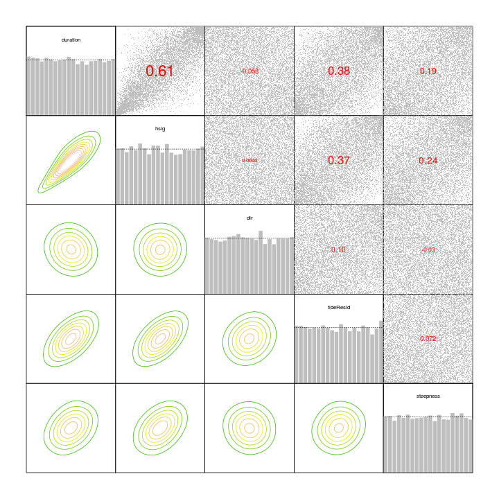

# **Statistical modelling of multivariate dependence in the storm event dataset**
------------------------------------------------------------------------------------

*Gareth Davies, Geoscience Australia 2017*

# Introduction
------------------

This document follows on from
[statistical_model_univariate_distributions.md](statistical_model_univariate_distributions.md)
in describing our statistical analysis of storm waves at Old Bar. 

It illustrates the process of modelling the joint distribution of all storm
variables, after their univariate distributions have already been fit. Recall
from the previous section that the univariate distributions are themselves
conditional on the event time of year, and mean annual SOI value. 

It is essential that the code in
[statistical_model_univariate_distributions.md](statistical_model_univariate_distributions.md)
has alread been run, and produced an Rdata file
*'Rimages/session_univariate_distributions_FALSE_0.Rdata'*. **To make sure, the
code below throws an error if the latter file does not exist.**

```r
# Check that the pre-requisites exist
if(!file.exists('Rimages/session_univariate_distributions_FALSE_0.Rdata')){
    stop('It appears you have not yet run the code in statistical_model_univariate_distributions.Rmd. That must be run before continuing')
}
```

Supposing the above did not generate any errors, and you have R installed,
along with all the packages required to run this code, and a copy of the
*stormwavecluster* git repository, then you should be able to re-run the
analysis here by simply copy-pasting the code. Alternatively, it can be run
with the `knit` command in the *knitr* package: 

```r
library(knitr)
knit('statistical_model_vine_copula.Rmd')
```

The basic approach followed here is to:
* **Step 1: Load the previous session**

Later we will **FIXME:POINT TO SUBSEQUENT STEPS**

# **Step 1: Load the previous session**
---------------------------------------

Here we load the session previously derived by 
[statistical_model_univariate_distributions.Rmd](statistical_model_univariate_distributions.Rmd).
As before, the code is adjusted to optionally use an analysis with random
perturbations to the data, to check the impact of ties and data discretization.


```r
# Need to re-load packages, as R does not automatically do this when re-loading
# a session
library(evmix)
library(logspline)
library(VineCopula)

# Here we support multiple runs with random tie-breaking of the data
# If R was passed a commandline argument 'break_ties n' on startup (with n = integer),
# then read the n'th R session matching 'Rimages/session_storm_timings_TRUE_*.Rdata'.
# That session will correspond to one of the tie-breaking sessions
if( length(grep('break_ties', commandArgs(trailingOnly=TRUE))) > 0 ){

    # Read one of the sessions with tie-breaking
    session_n = as.numeric(commandArgs(trailingOnly=TRUE)[2])
    previous_R_session_file = Sys.glob(
        'Rimages/session_univariate_distributions_TRUE_*.Rdata')[session_n]

}else{

    # Read the session that does not do any tie-breaking
    previous_R_session_file = 'Rimages/session_univariate_distributions_FALSE_0.Rdata'

}

load(previous_R_session_file)

# Definitions controlling the number of years in the synthetic series
nyears_synthetic_series = 1e+06 

print(previous_R_session_file)
```

```
## [1] "Rimages/session_storm_timings_FALSE_0.Rdata"
```

# **Step 2: Fit a copula to the remaining dependencies in the multivariate storm data**

Here we use a copula to model the remaining dependencies in the storm data. The
first step, implemented below, is to **convert our data to inverse quantile
values, conditional on the event time of year (`startyear`) and the `soiA`
value**. We only use rows which do not containing missing observations. Note
how the conditional inverse quantile values are defined using the previously
derived conditional distribution fits.


```r
# Extract observations which will be used in the copula. Ignore observations
# with any missing value, since the code cannot treat these.
skip = which(rowSums(is.na(
    event_statistics[c('duration', 'hsig', 'dir', 'tideResid', 'steepness', 'soiA')])) > 0)

# Transform the data into uniformly distributed margins, accounting
# for the value of any conditional variables
conditional_variables = list(startyear=event_statistics$startyear[-skip], 
    soiA=event_statistics$soiA[-skip])

events_conditional_copuladata = data.frame( 
    duration=duration_fit_conditional$pfun(
        event_statistics$duration[-skip], conditional_variables),
    hsig=hsig_fit_conditional$pfun(event_statistics$hsig[-skip], 
        conditional_variables),
    dir=dir_fit_conditional$pfun(event_statistics$dir[-skip], 
        conditional_variables),
    tideResid=tideResid_fit_conditional$pfun(event_statistics$tideResid[-skip], 
        conditional_variables),
    steepness=steepness_fit_conditional$pfun(event_statistics$steepness[-skip],
        conditional_variables)
    )

rm(skip, conditional_variables)


# Plot the transformed data
DU$nice_pairs(events_conditional_copuladata)
```


We can also plot contours of the empirical copula. **The following plot depicts in a
non-parametric way the sorts of relationships that we will be modelling with
copulas.**

```r
# Convert our data to an object of type 'copuladata', to use the VineCopula
# functions
es_cop = as.copuladata(events_conditional_copuladata)
pairs(es_cop)
```


**Here we repeat an earlier plot showing the dependencies in the full dataset**. This
is the most useful reference against which to compare the model, which is fit subsequently.

```r
# Sort the variables for easy comparison with the plot of the simulated data 
DU$nice_pairs(event_statistics[,c('hsig', 'duration', 'tideResid', 'steepness', 'dir')])
```


**Below, we fit a C-Vine copula to the data, and plot the simulated results**.
The black points are the data, and the green points are the model. 

```r
# Try C Vine with most strongly correlated nodes fit first:
c_vine_node_order=c('hsig', 'duration', 'tideResid', 'steepness', 'dir')
c_vine_order = match(c_vine_node_order, names(es_cop))
es_cop_reorder = es_cop[,c_vine_order]

#
# Make a function which does the fit and provides a function to randomly
# sample from the copula, including transforming the modelled [0,1] values
# to the storm variable scales
#
make_Rvine_random_sampler<-function(es_cop_reorder, copula_fit=NULL, 
    plot=FALSE){
    # Fit an RVine copula to es_cop_reorder
    #
    # Restricting the familyset seems to help with the hsig/duration relation
    # (it can become too scattered otherwise)
    #
    # Optionally we can provide a fitted copula (must be of CVine type based 
    # on RVineStructureSelect). In this case the copula parameters will be
    # re-estimated with MLE to produce copula_fit_mle. This is useful for 
    # bootstrapping

    if(is.null(copula_fit)){
        copula_fit = RVineStructureSelect(es_cop_reorder, indeptest=TRUE, 
            type='CVine', 
            familyset=1:6, 
            rotations=TRUE)
    }else{
        copula_fit = copula_fit
    }

    copula_fit_mle = RVineMLE(es_cop_reorder, copula_fit)

    if(plot){
        simdata2 = RVineSim(1e+04, RVM=copula_fit_mle$RVM)
        colnames(simdata2) = names(es_cop_reorder)
        simdata2 = as.data.frame(simdata2)
        sim_full2 = with(simdata2, 
            stormVarFun(duration, hsig, dir, steepness, tideResid))
       
        # Plot it 
        DU$nice_pairs(sim_full2[1:6000, names(es_cop_reorder)], 
            extra_data=event_statistics[names(es_cop_reorder)])
    }

    # Convenience function to sample randomly from the copula
    random_copula_samples<-function(n){
        out = RVineSim(n, RVM=copula_fit_mle$RVM)
        return(out)
    }

    return(environment())
}


copula_model = make_Rvine_random_sampler(es_cop_reorder, plot=TRUE)
```

```
## iter   10 value -473.835777
## iter   20 value -474.125827
## final  value -474.126538 
## converged
```


```r
random_copula_samples = copula_model$random_copula_samples 
```

**Below, we plot the empirical contours of the randomly simulated points, for
comparison with a similar plot of the data given earlier**

```r
pairs(as.copuladata(copula_model$simdata2[,names(events_conditional_copuladata)]))
```


