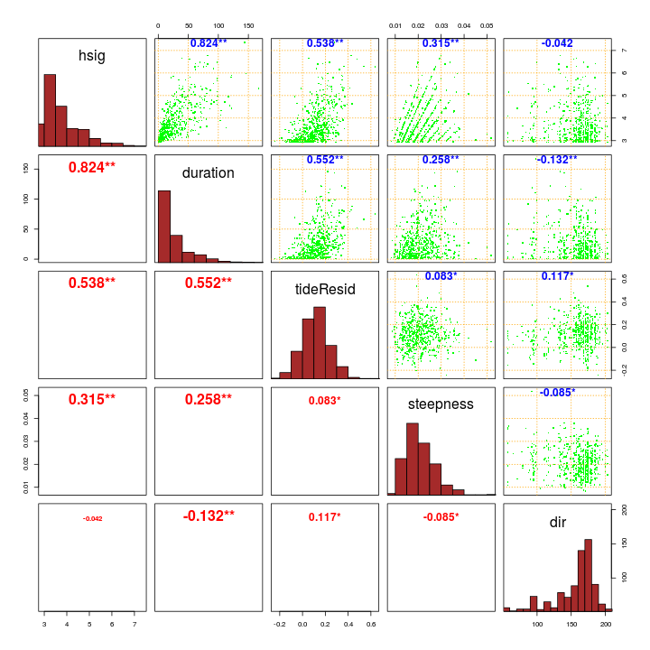

# **Statistical modelling of multivariate dependence in the storm event dataset**
------------------------------------------------------------------------------------

*Gareth Davies, Geoscience Australia 2017*

# Introduction
------------------

This document follows on from
[statistical_model_univariate_distributions.md](statistical_model_univariate_distributions.md)
in describing our statistical analysis of storm waves at Old Bar. 

It illustrates the process of modelling the joint distribution of all storm
variables, after their univariate distributions have already been fit. Recall
from the previous section that the univariate distributions are themselves
conditional on the event time of year, and mean annual SOI value. 

It is essential that the code in
[statistical_model_univariate_distributions.md](statistical_model_univariate_distributions.md)
has alread been run, and produced an Rdata file
*'Rimages/session_univariate_distributions_XXXX.Rdata'*. Here XXXX is a flag related to
whether or not perturbations were applied to the data.


Supposing the above did not generate any errors, and you have R installed,
along with all the packages required to run this code, and a copy of the
*stormwavecluster* git repository, then you should be able to re-run the
analysis here by simply copy-pasting the code. Alternatively, it can be run
with the `knit` command in the *knitr* package: 

```r
library(knitr)
knit('statistical_model_vine_copula.Rmd')
```
The above command produces a .md file with the same name for viewing, which includes
updated figures and print-outs.

To run the code in tie-breaking mode, be sure to pass the a command-line
argument matching `break_ties` to R when starting, followed by an integer ID > 0,
e.g.

    R --args --break_ties 1234

or

    Rscript script_name_here.R --break_ties 1234

Running the above commands many times is facilitated by scripts in
[../statistical_model_fit_perturbed_data/README.md](../statistical_model_fit_perturbed_data/README.md)

The basic approach followed here is to:
* **Step 1: Load the previous session**
* **Step 2: Fit a copula to the remaining dependencies in the multivariate storm data**
* **Step 3: Use the fitted model to simulate a long synthetic storm time-series**

# **Step 1: Load the previous session**
---------------------------------------

Here we load the session previously derived by 
[statistical_model_univariate_distributions.Rmd](statistical_model_univariate_distributions.Rmd).
As before, the code is adjusted to optionally use an analysis with random
perturbations to the data, to check the impact of ties and data discretization.


```r
# Need to re-load packages, as R does not automatically do this when re-loading
# a session
library(evmix)
```

```
## Loading required package: MASS
```

```
## Loading required package: splines
```

```
## Loading required package: gsl
```

```
## Loading required package: SparseM
```

```
## 
## Attaching package: 'SparseM'
```

```
## The following object is masked from 'package:base':
## 
##     backsolve
```

```r
library(logspline)
library(CDVine) # Used to set structure of C-Vine copula
```

```
## The CDVine package is no longer developed actively.
## Please consider using the more general VineCopula package
## (see https://CRAN.R-project.org/package=VineCopula),
## which extends and improves the functionality of CDVine.
```

```r
library(VineCopula) # Main copula fitting routine. 
```

```
## 
## Attaching package: 'VineCopula'
```

```
## The following objects are masked from 'package:CDVine':
## 
##     BiCopCDF, BiCopChiPlot, BiCopEst, BiCopHfunc, BiCopIndTest,
##     BiCopKPlot, BiCopLambda, BiCopMetaContour, BiCopName,
##     BiCopPar2TailDep, BiCopPar2Tau, BiCopPDF, BiCopSelect,
##     BiCopSim, BiCopTau2Par, BiCopVuongClarke
```

```r
# Here we support multiple runs with random tie-breaking of the data
# If R was passed a commandline argument 'break_ties n' on startup (with n = integer),
# then read the n'th R session matching 'Rimages/session_storm_timings_TRUE_*.Rdata'.
# That session will correspond to one of the tie-breaking sessions
if( length(grep('break_ties', commandArgs(trailingOnly=TRUE))) > 0 ){

    break_ties_with_jitter = TRUE

    # Read one of the sessions with tie-breaking
    session_n = as.numeric(commandArgs(trailingOnly=TRUE)[2])
    if(session_n < 1) stop('Invalid input ID')

}else{
    break_ties_with_jitter = FALSE
    session_n = 0
}

# Make a 'title' which can appear in filenames to identify this run
run_title_id = paste0(break_ties_with_jitter, '_', session_n)

previous_R_session_file = paste0('Rimages/session_univariate_distributions_', run_title_id, '.Rdata')

load(previous_R_session_file)

print(previous_R_session_file)
```

```
## [1] "Rimages/session_storm_timings_FALSE_0.Rdata"
```

# **Step 2: Fit a copula to the remaining dependencies in the multivariate storm data**

Here we use a copula to model the remaining dependencies in the storm data. The
first step, implemented below, is to **convert our data to inverse quantile
values, conditional on the event time of year (`startyear`) and the `soiA`
value**. We only use rows which do not containing missing observations. Note
how the conditional inverse quantile values are defined using the previously
derived conditional distribution fits.


```r
# Extract observations which will be used in the copula. Ignore observations
# with any missing value, since the code cannot treat these.
skip = which(rowSums(is.na(
    event_statistics[c('duration', 'hsig', 'dir', 'tideResid', 'steepness', 'soiA')])) > 0)

# Transform the data into uniformly distributed margins, accounting
# for the value of any conditional variables
conditional_variables = list(startyear=event_statistics$startyear[-skip], 
    soiA=event_statistics$soiA[-skip])

events_conditional_copuladata = data.frame( 
    duration=duration_fit_conditional$pfun(
        event_statistics$duration[-skip], conditional_variables),
    hsig=hsig_fit_conditional$pfun(event_statistics$hsig[-skip], 
        conditional_variables),
    dir=dir_fit_conditional$pfun(event_statistics$dir[-skip], 
        conditional_variables),
    tideResid=tideResid_fit_conditional$pfun(event_statistics$tideResid[-skip], 
        conditional_variables),
    steepness=steepness_fit_conditional$pfun(event_statistics$steepness[-skip],
        conditional_variables)
    )

rm(skip, conditional_variables)


# Plot the transformed data
DU$nice_pairs(events_conditional_copuladata)
```


We can also plot contours of the empirical copula. **The following plot depicts in a
non-parametric way the sorts of relationships that we will be modelling with
copulas.**

```r
# Convert our data to an object of type 'copuladata', to use the VineCopula
# functions
es_cop = as.copuladata(events_conditional_copuladata)
pairs(es_cop)
```


**Here we repeat an earlier plot showing the dependencies in the full dataset**. This
is the most useful reference against which to compare the model, which is fit subsequently.

```r
# Sort the variables for easy comparison with the plot of the simulated data 
DU$nice_pairs(event_statistics[,c('hsig', 'duration', 'tideResid', 'steepness', 'dir')])
```



**Below, we fit a C-Vine copula to the data, and plot the simulated results**.
The black points are the data, and the green points are the model. 

```r
# Try C Vine with most strongly correlated nodes fit first:
c_vine_node_order=c('hsig', 'duration', 'tideResid', 'steepness', 'dir')
c_vine_order = match(c_vine_node_order, names(es_cop))
es_cop_reorder = es_cop[,c_vine_order]

#' Function to fit the copula
#'
#' Fit a copula to the psuedo-observations, and provides a function to randomly
#' sample from the copula (including transforming the modelled [0,1] values
#' to the storm variable scales)
#
#' @param es_cop_reorder copuladata.
#' @param copula_fit an existing copula fit, which will be updated using MLE on
#' es_cop_reorder. If NULL, then the copula structure is selected algorithmically
#' @param plot logical. Make a plot?
#' @param cvine_with_fixed_variable_order logical. If copula_fit = NULL, then if
#' this variable is TRUE, we select a C-Vine copula structure, with the variables
#' treated in the order they appear in es_cop_reorder, and a limited available set of
#' bivariate copula families. Otherwise, we use a (more generic) R-Vine copula.
#' @return the function environment
#'
make_Rvine_random_sampler<-function(es_cop_reorder, copula_fit=NULL, 
    plot=FALSE, cvine_with_fixed_variable_order=TRUE){
    # Fit an RVine copula to es_cop_reorder
    #
    # Restricting the familyset seems to help with the hsig/duration relation
    # (it can become too scattered otherwise)
    #
    # Optionally we can provide a fitted copula (must be of CVine type based 
    # on RVineStructureSelect). In this case the copula parameters will be
    # re-estimated with MLE to produce copula_fit_mle. This is useful for 
    # bootstrapping

    if(is.null(copula_fit)){
        # The copula structure was not provided. 
        # So choose the structure of the copula

        if(!cvine_with_fixed_variable_order){

            # Use a full 'RVine' copula to model the data
            #
            # This approach is more general than the CVine, but this also means
            # that more is demanded of the automated techniques to find the
            # best copula. 
            
            # Codes for all one-parameter copulas
            one_par_copulas = c(1, 3:6, 13:14, 16, 23:24, 26, 33:34, 36) 

            # Let VineCopula select the order of variables
            copula_fit = RVineStructureSelect(
                es_cop_reorder, 
                indeptest=TRUE, 
                type='RVine', 
                familyset=one_par_copulas, 
                selectioncrit='AIC')

        }else{

            #
            # Use a restricted 'CVine' approach. 
            #
            # We specify the order of the variables [same order as columns in
            # es_cop_reorder]. We also only use a subset of the available
            # copula families. 
            #

            # Codes for all one-parameter copulas
            one_par_copulas = c(1, 3:6, 13:14, 16, 23:24, 26, 33:34, 36) 
            simple_copula_families =  c(1, 3:6) #= all 1 parameter families, without rotations

            # Copula selection using the package CDVine.
            # Order the variables the same as our input data
            copula_fit = CDVineCopSelect(
                es_cop_reorder, 
                familyset=one_par_copulas, #simple_copula_families
                type='CVine', 
                indeptest=TRUE,
                selectioncrit="AIC")

            # Convert to an object of type 'RVine', so we can use functions from
            # VineCopula
            copula_fit = C2RVine(1:5, copula_fit$family, copula_fit$par, 
                copula_fit$par2)

        }

    }else{
        # In this case the copula structure was already provided
        copula_fit = copula_fit
    }

    # Update parameters using maximum likelihood At the time of writing
    # (14/03/2017), the CRAN version of VineCopula has a bug in this routine,
    # but that is fixed in the current github version, which can be obtained using
    # the command:
    # devtools::install_github("tnagler/VineCopula")
    copula_fit_mle = RVineMLE(es_cop_reorder, copula_fit)

    if(plot){
        simdata2 = RVineSim(1e+04, RVM=copula_fit_mle$RVM)
        colnames(simdata2) = names(es_cop_reorder)
        simdata2 = as.data.frame(simdata2)
        sim_full2 = with(simdata2, 
            stormVarFun(duration, hsig, dir, steepness, tideResid))
       
        # Plot it 
        DU$nice_pairs(sim_full2[1:6000, names(es_cop_reorder)], 
            extra_data=event_statistics[names(es_cop_reorder)])
    }

    # Convenience function to sample randomly from the copula
    random_copula_samples<-function(n){
        out = RVineSim(n, RVM=copula_fit_mle$RVM)
        colnames(out) = names(es_cop_reorder) # Helps to have names
        return(out)
    }

    return(environment())
}


copula_model = make_Rvine_random_sampler(es_cop_reorder, plot=TRUE)
```

```
## iter   10 value -476.932849
## final  value -476.933014 
## converged
```


```r
random_copula_samples = copula_model$random_copula_samples 

# Print information
print(copula_model$copula_fit_mle)
```

```
## $value
## [1] 476.933
## 
## $convergence
## [1] 0
## 
## $message
## [1] "CONVERGENCE: REL_REDUCTION_OF_F <= FACTR*EPSMCH"
## 
## $counts
## function gradient 
##       15       15 
## 
## $RVM
## C-vine copula with the following pair-copulas:
## Tree 1:
## 1,5  Independence 
## 1,4  Frank (par = 2.18, tau = 0.23) 
## 1,3  Gaussian (par = 0.54, tau = 0.36) 
## 1,2  Survival Gumbel (par = 2.51, tau = 0.6) 
## 
## Tree 2:
## 2,5;1  Frank (par = -1.02, tau = -0.11) 
## 2,4;1  Independence 
## 2,3;1  Gaussian (par = 0.23, tau = 0.15) 
## 
## Tree 3:
## 3,5;2,1  Frank (par = 1.45, tau = 0.16) 
## 3,4;2,1  Frank (par = -0.6, tau = -0.07) 
## 
## Tree 4:
## 4,5;3,2,1  Independence
```

**Below, we plot the empirical contours of the randomly simulated points, for
comparison with a similar plot of the data given earlier**

```r
# Order the plot to match names(events_conditional_copuladata
pairs(as.copuladata(
    copula_model$simdata2[,names(events_conditional_copuladata)]
    ))
```


**Here we plot the Vine structure of the copula**

```r
par(mfrow=c(2,3))
plot(copula_model$copula_fit_mle$RVM, type=2, edge.labels='family')
```


**Here we statistically test for equality between a sample from the data
and a random sample from the model**. The computational demands of this
test grow rapidly with sample size (e.g. taking 1.3s for n=50, 20 s for n=100, 368 s for
n=200, ...), so here we only use a sample size of 100.

```r
# Find rows of event_statistics with no NA values, since we can't have NA's for this test
non_na_es = apply(!is.na(event_statistics[,c_vine_node_order]), 1, f<-function(x) all(x))
non_na_es = which(non_na_es)

library(TwoCop)
test_data_size = 1:100
if(!break_ties_with_jitter){
    # We must break ties in the data, if not already done, since otherwise the test
    # does not work [it's based on ranks]
    twocopula_test = TwoCop( 
        jitter(as.matrix(event_statistics[non_na_es[test_data_size], c_vine_node_order]), amount=1e-05),
        as.matrix(copula_model$sim_full2[test_data_size, c_vine_node_order]))
}else{
    # There are no ties
    twocopula_test = TwoCop( 
        as.matrix(event_statistics[non_na_es[test_data_size], c_vine_node_order]),
        as.matrix(copula_model$sim_full2[test_data_size, c_vine_node_order]))
}

# Print it out
print(twocopula_test)
```

```
## $pvalue
## [1] 0.21
## 
## $cvm
## [1] 0.03434728
## 
## $VaR
##        95% 
## 0.04983971 
## 
## $cvmsim
##   [1] 0.02471069 0.01335222 0.02448015 0.03294728 0.02502535 0.02049881
##   [7] 0.02279329 0.02881559 0.01654261 0.02642540 0.04728589 0.03916327
##  [13] 0.04963402 0.02654462 0.03247923 0.02276588 0.03522810 0.09681779
##  [19] 0.02494593 0.04221594 0.02127315 0.01771390 0.03011466 0.03388097
##  [25] 0.02630259 0.02029751 0.01791389 0.04660283 0.02139503 0.01889146
##  [31] 0.03782091 0.01545277 0.01729871 0.02616809 0.02883517 0.02880727
##  [37] 0.02789759 0.01927620 0.03281929 0.03627295 0.02468135 0.02276939
##  [43] 0.01773571 0.01900664 0.02202987 0.01724513 0.02637903 0.02426782
##  [49] 0.01927349 0.02460602 0.03259527 0.01509034 0.01714739 0.02184531
##  [55] 0.02562916 0.02608078 0.01961913 0.03862310 0.01250992 0.02120396
##  [61] 0.01391827 0.02259110 0.02450949 0.02367242 0.03627184 0.02568646
##  [67] 0.02306092 0.05425177 0.02560405 0.02337156 0.03931876 0.05953036
##  [73] 0.02737458 0.02297165 0.03269001 0.01968842 0.01448256 0.03623414
##  [79] 0.02827609 0.01883122 0.03881452 0.01286488 0.02152016 0.02785399
##  [85] 0.02392265 0.04857733 0.01745369 0.03639505 0.01496977 0.01748624
##  [91] 0.02318303 0.02384275 0.01180883 0.03199016 0.01609224 0.09033935
##  [97] 0.02423481 0.01768886 0.05374771 0.03849555
```

```r
if(twocopula_test$pvalue > 0.05){
    print('two-copula test DOES NOT REJECT null hypothesis at 5% level')
}else{
    print('two-copula test REJECTS null hypothesis at 5% level')
}
```

```
## [1] "two-copula test DOES NOT REJECT null hypothesis at 5% level"
```

**Here we fit a more complex copula**. This one does not use a pre-specified
order, and allows for more copula families. *It requires use of the github
version of the `VineCopula` package, to work-around a bug in `VineCopula`*
This can be installed from github after the `devtools` package in installed.

```r
# You only need to do this once
devtools::install_github("tnagler/VineCopula")
library(VineCopula)
```


```r
copula_model2 = make_Rvine_random_sampler(es_cop_reorder, plot=TRUE, 
    cvine_with_fixed_variable_order=FALSE)
```

```
## iter   10 value -473.406832
## iter   20 value -473.485180
## iter   30 value -473.505041
## final  value -473.505050 
## converged
```


```r
# Print information on the fit
print(copula_model2$copula_fit_mle)
```

```
## $value
## [1] 473.505
## 
## $convergence
## [1] 0
## 
## $message
## [1] "CONVERGENCE: REL_REDUCTION_OF_F <= FACTR*EPSMCH"
## 
## $counts
## function gradient 
##       36       36 
## 
## $RVM
## D-vine copula with the following pair-copulas:
## Tree 1:
## 1,4  Frank (par = 2.19, tau = 0.23) 
## 2,1  Survival Gumbel (par = 2.51, tau = 0.6) 
## 3,2  Gaussian (par = 0.54, tau = 0.36) 
## 5,3  Clayton (par = 0.16, tau = 0.07) 
## 
## Tree 2:
## 2,4;1  Independence 
## 3,1;2  Gumbel (par = 1.13, tau = 0.12) 
## 5,2;3  Frank (par = -1.43, tau = -0.16) 
## 
## Tree 3:
## 3,4;2,1  Frank (par = -0.64, tau = -0.07) 
## 5,1;3,2  Independence 
## 
## Tree 4:
## 5,4;3,2,1  Independence 
## 
## ---
## 1 <-> hsig,   2 <-> duration,
## 3 <-> tideResid,   4 <-> steepness,
## 5 <-> dir
```

As above, here we plot contours of psuedo-observations generated by the more
complex model.

```r
# Order the plot to match names(events_conditional_copuladata
pairs(as.copuladata(
    copula_model2$simdata2[,names(events_conditional_copuladata)]
    ))
```


**Here we plot the Vine structure of the more complex copula.**

```r
par(mfrow=c(2,3))
plot(copula_model2$copula_fit_mle$RVM, type=2, edge.labels='family')
```


**Here we do the test above**

```r
if(!break_ties_with_jitter){
    # We must break ties in the data, if not already done, since otherwise the test
    # does not work (it's based on ranks)
    twocopula_testB = TwoCop( 
        jitter(as.matrix(event_statistics[non_na_es[test_data_size], c_vine_node_order]), 
            amount=1e-05),
        as.matrix(copula_model2$sim_full2[test_data_size, c_vine_node_order]))
}else{
    # There are no ties
    twocopula_testB = TwoCop(
        as.matrix(event_statistics[non_na_es[test_data_size], c_vine_node_order]),
        as.matrix(copula_model2$sim_full2[test_data_size, c_vine_node_order]))
}

# Print it out
print(twocopula_testB)
```

```
## $pvalue
## [1] 0.23
## 
## $cvm
## [1] 0.03462157
## 
## $VaR
##        95% 
## 0.05098691 
## 
## $cvmsim
##   [1] 0.02801676 0.01927549 0.02147663 0.01649845 0.02524284 0.02845075
##   [7] 0.03434723 0.03011077 0.01736622 0.02151179 0.02640315 0.01021822
##  [13] 0.02907304 0.03017870 0.02487221 0.02478037 0.02694875 0.01653479
##  [19] 0.01668156 0.02051307 0.05466048 0.02452347 0.01784042 0.01861952
##  [25] 0.02845774 0.02543208 0.04790424 0.03679678 0.01421849 0.01842000
##  [31] 0.02147866 0.02531056 0.03654734 0.02711973 0.03300290 0.04971115
##  [37] 0.02916554 0.02829677 0.05167654 0.01987880 0.02933625 0.02188916
##  [43] 0.04223722 0.05095062 0.02383226 0.01398442 0.02044292 0.01560291
##  [49] 0.01709963 0.04063302 0.01912258 0.01797062 0.01706920 0.02439183
##  [55] 0.03204587 0.01647040 0.03072663 0.01454830 0.02321222 0.04146716
##  [61] 0.02640134 0.02430117 0.02175581 0.04382270 0.01816168 0.02427454
##  [67] 0.02619557 0.02649933 0.02826765 0.02786957 0.01964087 0.03966064
##  [73] 0.01729317 0.04419781 0.04462182 0.02870789 0.01482648 0.01500350
##  [79] 0.03061344 0.04352744 0.04044533 0.04382285 0.02040253 0.04587167
##  [85] 0.02201532 0.01965683 0.02369188 0.02157692 0.03716563 0.02209188
##  [91] 0.02491286 0.01976158 0.06578218 0.04789684 0.07847798 0.05619451
##  [97] 0.02766241 0.01662860 0.01721155 0.01916780
```

```r
if(twocopula_testB$pvalue > 0.05){
    print('two-copula test DOES NOT REJECT null hypothesis at 5% level')
}else{
    print('two-copula test REJECTS null hypothesis at 5% level')
}
```

```
## [1] "two-copula test DOES NOT REJECT null hypothesis at 5% level"
```
## Save the Rimage for later use

We use the same `run_title_id` as was computed in the previous 2 sections
([statistical_model_storm_timings.md](statistical_model_storm_timings.md), and
[statistical_model_univariate_distributions.md](statistical_model_univariate_distributions.md)).

```r
dir.create('Rimages', showWarnings=FALSE)
Rimage_title = paste0('Rimages/session_vine_copula_', run_title_id, '.Rdata')
save.image(Rimage_title)
```


