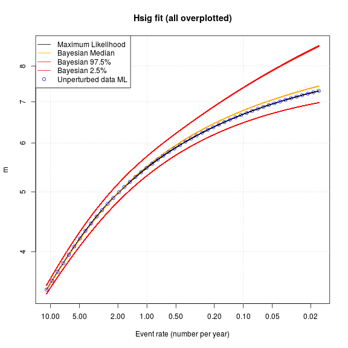
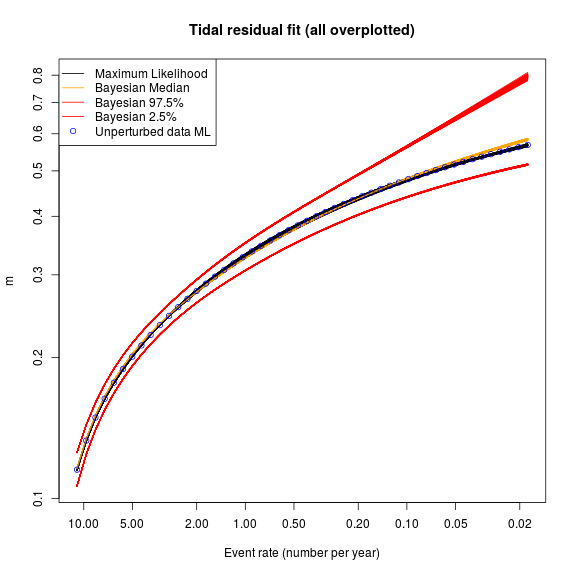
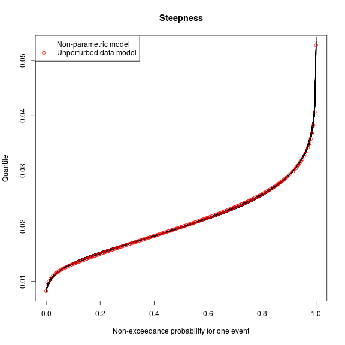
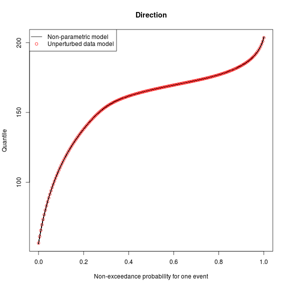

# Sensitivity of the fitted univariate distributions to random perturbations of the data
---------------------------------------------------------------------------------------

The code below investigates how fitted model parameters and AIC-based choice of
copula can change due to data perturbation.

**Read the model results, and do some basic checks**

```r
source('get_Rimage_data_univariate_distributions.R', local=TRUE)

# Read the summary statistics -- saved earlier for speed
store_var_list = readRDS('univariate_runs_summary_statistics.RDS')

# Read the original fit (based on un-perturbed data)
original_var_list = get_Rimage_data(
    '../statistical_model_fit/Rimages/session_univariate_distributions_FALSE_0.Rdata')
```

```
## Loading required package: MASS
```

```
## Loading required package: splines
```

```
## Loading required package: gsl
```

```
## Loading required package: SparseM
```

```
## 
## Attaching package: 'SparseM'
```

```
## The following object is masked from 'package:base':
## 
##     backsolve
```

```r
# Check that all the perturbed data sessions do jittering
stopifnot(all(sapply(store_var_list, f<-function(x) x$break_ties_with_jitter)))
# Check the original fit does not do jittering
stopifnot(original_var_list$break_ties_with_jitter == FALSE)

# Check that the event_statistics is unique in every session [i.e. the perturbed
# sessions really do randomly perturb event_statistics. We perturbed hsig, duration,
# tp1, and dir [tideResid was already unique].
#
# To do the check, compute the column sums of all event statistics. They should
# all be unique
#
max_es_vals = sapply(store_var_list, 
    f<-function(x) colSums(x$event_statistics[,1:4], na.rm=TRUE))
stopifnot(length(unique(max_es_vals)) == length(max_es_vals))


#
# Useful function
#
perturbed_summary<-function(variable_name){

    variable_vals = sapply(store_var_list,
        f<-function(x){
            num = x[[variable_name]] 
            denom = original_var_list[[variable_name]]
            # Handle errors gracefully
            if( (length(num) != length(denom)) || any(is.na(num)) || 
                (class(num) != class(denom))){
                num = denom*NA
            }
            return(num)
        }
    )

    variable_vals = t(variable_vals)
    print(summary(variable_vals))
    return(invisible())

}

relative_error_summary<-function(variable_name){
    variable_differences = sapply(store_var_list,
        f<-function(x){
            num = x[[variable_name]] - original_var_list[[variable_name]]
            denom = original_var_list[[variable_name]]
            # Handle errors gracefully
            if( (length(num) != length(denom)) || any(is.na(num)) || 
                (class(num) != class(denom))){
                num = denom*NA
            }
            return(num/abs(denom))
        }
    )

    variable_differences = t(variable_differences)
    print(summary(variable_differences))
    return(invisible())
}
```


**Hsig model checks**


```r
# Make a plot
plot_ylim = range(c(original_var_list$hsig_mixture_fit_bayes_lower_q,
    original_var_list$hsig_mixture_fit_bayes_upper_q))

xs = original_var_list$hsig_mixture_fit_bayes_rates
plot(xs, original_var_list$hsig_mixture_fit_ml, 
    t='l', ylim=plot_ylim, main='Hsig fit (all overplotted)', 
    xlim=c(max(xs), min(xs)),
    log='xy', xlab='Event rate (number per year)', ylab='m')
points(xs, original_var_list$hsig_mixture_fit_bayes_median_q, col='orange', t='l', lty='dotted')
points(xs, original_var_list$hsig_mixture_fit_bayes_upper_q, col='red', t='l', lty='dotted')
points(xs, original_var_list$hsig_mixture_fit_bayes_lower_q, col='red', t='l', lty='dotted')
for(i in 1:length(store_var_list)){
    xs = store_var_list[[i]]$hsig_mixture_fit_bayes_rates
    points(xs, store_var_list[[i]]$hsig_mixture_fit_ml, t='l')
    points(xs, store_var_list[[i]]$hsig_mixture_fit_bayes_median_q, col='orange', t='l')
    points(xs, store_var_list[[i]]$hsig_mixture_fit_bayes_upper_q, col='red', t='l')
    points(xs, store_var_list[[i]]$hsig_mixture_fit_bayes_lower_q, col='red', t='l')
}
points(xs, original_var_list$hsig_mixture_fit_ml, col='blue', t='p', pch=1, lty='dashed')
grid()
legend('topleft', 
    c('Maximum Likelihood', 'Bayesian Median', 'Bayesian 97.5%', 'Bayesian 2.5%', 
        'Unperturbed data ML'),
    col=c('black', 'orange', 'red', 'red', 'blue'), lwd=c(1,1,1,1,NA), 
    pch=c(NA, NA, NA, NA, 1))
```



```r
# Check how the hsig_mixture_fit parameters vary due to jittering
#
#
print(original_var_list$hsig_mixture_fit_par)
```

```
## [1]  0.8424030  1.0204286  1.2726887 -0.2198767
```

```r
#
perturbed_summary('hsig_mixture_fit_par')
```

```
##        V1               V2               V3              V4         
##  Min.   :0.8220   Min.   :0.8495   Min.   :1.256   Min.   :-0.7379  
##  1st Qu.:0.8815   1st Qu.:0.9304   1st Qu.:1.418   1st Qu.:-0.2245  
##  Median :0.9076   Median :0.9546   Median :1.474   Median :-0.2038  
##  Mean   :0.9066   Mean   :0.9531   Mean   :1.611   Mean   :-0.2366  
##  3rd Qu.:0.9242   3rd Qu.:0.9789   3rd Qu.:1.546   3rd Qu.:-0.1916  
##  Max.   :0.9948   Max.   :1.0552   Max.   :3.249   Max.   :-0.1541  
##  NA's   :1        NA's   :1        NA's   :1       NA's   :1
```

```r
relative_error_summary('hsig_mixture_fit_par')
```

```
##        V1                 V2                 V3          
##  Min.   :-0.02419   Min.   :-0.16749   Min.   :-0.01302  
##  1st Qu.: 0.04642   1st Qu.:-0.08824   1st Qu.: 0.11448  
##  Median : 0.07742   Median :-0.06451   Median : 0.15783  
##  Mean   : 0.07623   Mean   :-0.06600   Mean   : 0.26554  
##  3rd Qu.: 0.09710   3rd Qu.:-0.04071   3rd Qu.: 0.21451  
##  Max.   : 0.18090   Max.   : 0.03408   Max.   : 1.55305  
##  NA's   :1          NA's   :1          NA's   :1         
##        V4          
##  Min.   :-2.35581  
##  1st Qu.:-0.02100  
##  Median : 0.07333  
##  Mean   :-0.07607  
##  3rd Qu.: 0.12838  
##  Max.   : 0.29906  
##  NA's   :1
```

```r
#
print(original_var_list$hsig_aep100_quantiles)
```

```
##     2.5%      50%    97.5% 
## 7.067410 7.542892 8.883444
```

```r
perturbed_summary('hsig_aep100_quantiles')
```

```
##       2.5%            50%            97.5%       
##  Min.   :7.027   Min.   :7.447   Min.   : 8.746  
##  1st Qu.:7.162   1st Qu.:7.669   1st Qu.: 9.145  
##  Median :7.219   Median :7.751   Median : 9.330  
##  Mean   :7.232   Mean   :7.771   Mean   : 9.343  
##  3rd Qu.:7.293   3rd Qu.:7.873   3rd Qu.: 9.539  
##  Max.   :7.457   Max.   :8.134   Max.   :10.023  
##  NA's   :6       NA's   :6       NA's   :6
```

```r
# Errors typically O(1/10000)
relative_error_summary('hsig_aep100_quantiles')
```

```
##       2.5%                50%               97.5%         
##  Min.   :-0.005784   Min.   :-0.01270   Min.   :-0.01544  
##  1st Qu.: 0.013323   1st Qu.: 0.01672   1st Qu.: 0.02946  
##  Median : 0.021476   Median : 0.02759   Median : 0.05022  
##  Mean   : 0.023260   Mean   : 0.03024   Mean   : 0.05178  
##  3rd Qu.: 0.031889   3rd Qu.: 0.04383   3rd Qu.: 0.07375  
##  Max.   : 0.055176   Max.   : 0.07837   Max.   : 0.12822  
##  NA's   :6           NA's   :6          NA's   :6
```

```r
# Small errors in optimal season phi [units of years -- typical value O(1 day)]
hsig_season_phi_err = unlist(sapply(store_var_list, 
    f<-function(x) x$hsig_season_phi%%1 - original_var_list$hsig_season_phi%%1))
print(summary(hsig_season_phi_err))
```

```
##      Min.   1st Qu.    Median      Mean   3rd Qu.      Max. 
## -0.977700 -0.955200 -0.023020 -0.358500  0.008448  0.016220
```

```r
# Look at the automatically chosen copula family. Mostly Frank, with
# with occasional alternatives
print(original_var_list$hsig_season_copula$familyname)
```

```
## [1] "Frank"
```

```r
hsig_copula_type = sapply(store_var_list, f<-function(x) as.character(x$hsig_season_copula$familyname))
print(table(hsig_copula_type))
```

```
## Error in table(hsig_copula_type): all arguments must have the same length
```

**Duration model checks**


```r
# Make a plot
plot_ylim = range(c(original_var_list$duration_mixture_fit_bayes_lower_q,
    original_var_list$duration_mixture_fit_bayes_upper_q))

xs = original_var_list$duration_mixture_fit_bayes_rates
plot(xs, original_var_list$duration_mixture_fit_ml, 
    t='l', ylim=plot_ylim, main='Duration fit (all overplotted)', xlim=c(max(xs), min(xs)),
    log='xy', xlab='Event rate (number per year)', ylab='m')
points(xs, original_var_list$duration_mixture_fit_bayes_median_q, col='orange', t='l', lty='dotted')
points(xs, original_var_list$duration_mixture_fit_bayes_upper_q, col='red', t='l', lty='dotted')
points(xs, original_var_list$duration_mixture_fit_bayes_lower_q, col='red', t='l', lty='dotted')
for(i in 1:length(store_var_list)){
    xs = store_var_list[[i]]$duration_mixture_fit_bayes_rates
    points(xs, store_var_list[[i]]$duration_mixture_fit_ml, t='l')
    points(xs, store_var_list[[i]]$duration_mixture_fit_bayes_median_q, col='orange', t='l')
    points(xs, store_var_list[[i]]$duration_mixture_fit_bayes_upper_q, col='red', t='l')
    points(xs, store_var_list[[i]]$duration_mixture_fit_bayes_lower_q, col='red', t='l')
}
points(xs, original_var_list$duration_mixture_fit_ml, col='blue', pch=1)
grid()
legend('topleft', 
    c('Maximum Likelihood', 'Bayesian Median', 'Bayesian 97.5%', 'Bayesian 2.5%', 'Unperturbed data ML'),
    col=c('black', 'orange', 'red', 'red', 'blue'), lwd=c(1,1,1,1, NA), pch=c(NA, NA, NA, NA, 1))
```


```r
# Check how the duration_mixture_fit parameters vary due to jittering
#
print(original_var_list$duration_mixture_fit_par)
```

```
## [1]  0.6812525 36.5813149 47.3420093 -0.1675303
```

```r
#
# Errors 
perturbed_summary('duration_mixture_fit_par')
```

```
##        V1               V2              V3              V4           
##  Min.   :0.5312   Min.   :36.71   Min.   : 7.13   Min.   :-0.174744  
##  1st Qu.:0.5717   1st Qu.:45.68   1st Qu.: 9.43   1st Qu.:-0.042816  
##  Median :0.5988   Median :49.04   Median :11.25   Median :-0.032973  
##  Mean   :0.5999   Mean   :49.23   Mean   :16.18   Mean   :-0.043852  
##  3rd Qu.:0.6279   3rd Qu.:53.95   3rd Qu.:13.19   3rd Qu.:-0.021262  
##  Max.   :0.6882   Max.   :63.71   Max.   :53.72   Max.   : 0.006979
```

```r
relative_error_summary('duration_mixture_fit_par')
```

```
##        V1                 V2                 V3         
##  Min.   :-0.22022   Min.   :0.003629   Min.   :-0.8494  
##  1st Qu.:-0.16075   1st Qu.:0.248621   1st Qu.:-0.8008  
##  Median :-0.12107   Median :0.340617   Median :-0.7624  
##  Mean   :-0.11941   Mean   :0.345670   Mean   :-0.6583  
##  3rd Qu.:-0.07827   3rd Qu.:0.474762   3rd Qu.:-0.7214  
##  Max.   : 0.01016   Max.   :0.741540   Max.   : 0.1347  
##        V4          
##  Min.   :-0.04306  
##  1st Qu.: 0.74443  
##  Median : 0.80318  
##  Mean   : 0.73825  
##  3rd Qu.: 0.87309  
##  Max.   : 1.04166
```

```r
#
# Errors in 1/100 AEP are small
perturbed_summary('duration_aep100_quantiles')
```

```
##       2.5%            50%            97.5%      
##  Min.   :149.4   Min.   :171.1   Min.   :231.2  
##  1st Qu.:164.2   1st Qu.:195.3   1st Qu.:267.5  
##  Median :165.5   Median :197.5   Median :272.8  
##  Mean   :165.4   Mean   :197.6   Mean   :273.7  
##  3rd Qu.:166.7   3rd Qu.:200.4   3rd Qu.:278.5  
##  Max.   :173.1   Max.   :211.9   Max.   :310.6
```

```r
relative_error_summary('duration_aep100_quantiles')
```

```
##       2.5%               50%               97.5%         
##  Min.   :-0.01129   Min.   :-0.02421   Min.   :-0.04846  
##  1st Qu.: 0.08724   1st Qu.: 0.11425   1st Qu.: 0.10106  
##  Median : 0.09557   Median : 0.12634   Median : 0.12275  
##  Mean   : 0.09464   Mean   : 0.12699   Mean   : 0.12646  
##  3rd Qu.: 0.10319   3rd Qu.: 0.14304   3rd Qu.: 0.14650  
##  Max.   : 0.14565   Max.   : 0.20879   Max.   : 0.27837
```

```r
# Small errors in optimal season phi [units of years -- typical value O(1 day)]
duration_season_phi_err = unlist(sapply(store_var_list, 
    f<-function(x) x$duration_season_phi%%1 - original_var_list$duration_season_phi%%1))
print(summary(duration_season_phi_err))
```

```
##      Min.   1st Qu.    Median      Mean   3rd Qu.      Max. 
## -0.961100 -0.007454 -0.006185 -0.035240  0.013920  0.035980
```

```r
# Look at the automatically chosen copula family. Not very stable to
# perturbations. Both Frank and Gaussian come up, but Gaussian is most common. 
print(original_var_list$duration_season_copula$familyname)
```

```
## [1] "Gaussian"
```

```r
duration_copula_type = unlist(sapply(store_var_list, f<-function(x) x$duration_season_copula$familyname))
print(table(duration_copula_type))
```

```
## duration_copula_type
##                      Frank                   Gaussian 
##                         54                         40 
## Rotated Clayton 90 degrees  Rotated Gumbel 90 degrees 
##                          5                          1
```

**Tidal residual model checks**

No perturbation was applied to the tidal residual data, because there were no
ties. Therefore, any variation in the model fits *only* reflects the use of a
finite number of MCMC samples to characterise the Bayesian model (note only one
chain was used). The figure suggests that the MCMC related variations are
small, consistent with our earlier analysis. 

```r
# Make a plot
plot_ylim = range(c(original_var_list$tideResid_mixture_fit_bayes_lower_q,
    original_var_list$tideResid_mixture_fit_bayes_upper_q))

xs = original_var_list$tideResid_mixture_fit_bayes_rates
plot(xs, original_var_list$tideResid_mixture_fit_ml, 
    t='l', ylim=plot_ylim, main='Tidal residual fit (all overplotted)', xlim=c(max(xs), min(xs)),
    log='xy', xlab='Event rate (number per year)', ylab='m')
points(xs, original_var_list$tideResid_mixture_fit_bayes_median_q, col='orange', t='l', lty='dotted')
points(xs, original_var_list$tideResid_mixture_fit_bayes_upper_q, col='red', t='l', lty='dotted')
points(xs, original_var_list$tideResid_mixture_fit_bayes_lower_q, col='red', t='l', lty='dotted')
for(i in 1:length(store_var_list)){
    xs = store_var_list[[i]]$tideResid_mixture_fit_bayes_rates
    points(xs, store_var_list[[i]]$tideResid_mixture_fit_ml, t='l')
    points(xs, store_var_list[[i]]$tideResid_mixture_fit_bayes_median_q, col='orange', t='l')
    points(xs, store_var_list[[i]]$tideResid_mixture_fit_bayes_upper_q, col='red', t='l')
    points(xs, store_var_list[[i]]$tideResid_mixture_fit_bayes_lower_q, col='red', t='l')
}
points(xs, original_var_list$tideResid_mixture_fit_ml, col='blue', t='p', pch=1)
legend('topleft', 
    c('Maximum Likelihood', 'Bayesian Median', 'Bayesian 97.5%', 
        'Bayesian 2.5%', 'Unperturbed data ML'),
    col=c('black', 'orange', 'red', 'red', 'blue'), lwd=c(1,1,1,1,NA), 
    pch=c(NA, NA, NA, NA, 1))
```



```r
#
# These should not show error, because we didn't jitter tideResid.
# However, there can be small errors due to MCMC (since it uses random
# numbers)
#

# Check how the tideResid_mixture_fit parameters vary due to jittering
#
print(original_var_list$tideResid_mixture_fit_par)
```

```
## [1]  0.1146811  0.1135725  0.1855709 -0.1256922
```

```r
# No errors
relative_error_summary('tideResid_mixture_fit_par')
```

```
##        V1                  V2                   V3           
##  Min.   :-0.039567   Min.   :-0.0406436   Min.   :-0.061552  
##  1st Qu.:-0.020681   1st Qu.:-0.0148831   1st Qu.:-0.011212  
##  Median :-0.012167   Median :-0.0008336   Median : 0.006453  
##  Mean   :-0.010704   Mean   : 0.0005269   Mean   : 0.128123  
##  3rd Qu.: 0.001677   3rd Qu.: 0.0106257   3rd Qu.: 0.212660  
##  Max.   : 0.019355   Max.   : 0.0729283   Max.   : 0.987877  
##        V4          
##  Min.   :-0.05833  
##  1st Qu.: 0.03231  
##  Median : 0.09974  
##  Mean   : 0.43607  
##  3rd Qu.: 0.42248  
##  Max.   : 4.27792
```

```r
#
# Errors typically < 1/1000 -- this is purely due to MCMC
relative_error_summary('tideResid_aep100_quantiles')
```

```
##       2.5%                 50%                 97.5%           
##  Min.   :-0.0070361   Min.   :-0.0131163   Min.   :-0.0598564  
##  1st Qu.:-0.0017728   1st Qu.:-0.0047032   1st Qu.:-0.0248738  
##  Median :-0.0004119   Median :-0.0002970   Median :-0.0003341  
##  Mean   :-0.0000806   Mean   : 0.0003876   Mean   :-0.0005340  
##  3rd Qu.: 0.0014009   3rd Qu.: 0.0052775   3rd Qu.: 0.0201733  
##  Max.   : 0.0078892   Max.   : 0.0199485   Max.   : 0.0726655  
##  NA's   :3            NA's   :3            NA's   :3
```

```r
# No errors
tideResid_season_phi_err = sapply(store_var_list, 
    f<-function(x) x$tideResid_season_phi%%1 - original_var_list$tideResid_season_phi%%1)
print(summary(tideResid_season_phi_err))
```

```
##      Min.   1st Qu.    Median      Mean   3rd Qu.      Max. 
## -0.083480 -0.013090 -0.006097 -0.009713 -0.001431  0.016240
```

```r
# Look at the automatically chosen copula family. 
# Always Gaussian
print(original_var_list$tideResid_season_copula$familyname)
```

```
## [1] "Gaussian"
```

```r
tideResid_copula_type = sapply(store_var_list, f<-function(x) x$tideResid_season_copula$familyname)
print(table(tideResid_copula_type))
```

```
## tideResid_copula_type
##                      Frank                   Gaussian 
##                          6                         91 
## Rotated Clayton 90 degrees 
##                          3
```


**Steepness model checks**

Steepness is modelled non-parametrically. The non-parametric model shows only
slight variation due to data perturbation. 

```r
#
# We use a non-parametric distribution, so here just check the copula and
# seasonal phase
#
plot(seq(0,1,len=200), original_var_list$steepness_quantiles_seq, t='l',
    main='Steepness', xlab='Non-exceedance probability for one event', ylab='Quantile')
for(i in 1:length(store_var_list)){
    points(seq(0,1,len=200), store_var_list[[i]]$steepness_quantiles_seq, t='l')
}
points(seq(0,1,len=200), original_var_list$steepness_quantiles_seq, pch=1, col='red')

legend('topleft', c('Non-parametric model', 'Unperturbed data model'), col=c('black', 'red'), 
    lwd=c(1,NA), pch=c(NA,1))
```



```r
# Errors O(1 day)
steepness_season_phi_err = sapply(store_var_list, 
    f<-function(x) (x$steepness_season_phi%%1 - original_var_list$steepness_season_phi%%1))
print(summary(steepness_season_phi_err))
```

```
##       Min.    1st Qu.     Median       Mean    3rd Qu.       Max. 
## -1.527e-01 -4.233e-03 -1.987e-05 -4.994e-03  1.487e-03  7.844e-02
```

```r
# Mostly Clayton copula, like in the original data
print(original_var_list$steepness_season_copula$familyname)
```

```
## [1] "Rotated Clayton 270 degrees"
```

```r
steepness_copula_type = sapply(store_var_list, f<-function(x) x$steepness_season_copula$familyname)
print(table(steepness_copula_type))
```

```
## steepness_copula_type
##                       Frank                    Gaussian 
##                           8                          30 
## Rotated Clayton 270 degrees   Rotated Gumbel 90 degrees 
##                          57                           5
```

**Direction model checks**

Direction is modelled non-parametrically. The non-parametric model shows only
slight variation due to data perturbation. 

```r
#
# We use a non-parametric distribution, so here just check the copula (soiA +
# seasonal) and seasonal phase
#
plot(seq(0,1,len=200), original_var_list$dir_quantiles_seq, t='l',
    main='Direction', xlab='Non-exceedance probability for one event', ylab='Quantile')
for(i in 1:length(store_var_list)){
    points(seq(0,1,len=200), store_var_list[[i]]$dir_quantiles_seq, t='l')
}
points(seq(0,1,len=200), original_var_list$dir_quantiles_seq, pch=1, col='red')
legend('topleft', c('Non-parametric model', 'Unperturbed data model'), col=c('black', 'red'), 
    lwd=c(1,NA), pch=c(NA,1))
```



```r
# Error O(1 day) or less
dir_season_phi_err = sapply(store_var_list, 
    f<-function(x) (x$dir_season_phi%%1 - original_var_list$dir_season_phi%%1))
print(summary(dir_season_phi_err))
```

```
##      Min.   1st Qu.    Median      Mean   3rd Qu.      Max. 
## -0.115800 -0.016150  0.006389 -0.002279  0.016820  0.033260
```

```r
# Mostly Frank, like with the original data 
print(original_var_list$dir_season_copula$familyname)
```

```
## [1] "Frank"
```

```r
dir_copula_type = sapply(store_var_list, f<-function(x) x$dir_season_copula$familyname)
print(table(dir_copula_type))
```

```
## dir_copula_type
##                      Frank                   Gaussian 
##                         48                          2 
## Rotated Clayton 90 degrees Rotated Gumbel 270 degrees 
##                         38                         11 
##  Rotated Gumbel 90 degrees 
##                          1
```

```r
# Always Frank, like with the original data
print(original_var_list$dir_soiA_copula$familyname)
```

```
## [1] "Frank"
```

```r
dir_copula_type = sapply(store_var_list, f<-function(x) x$dir_soiA_copula$familyname)
print(table(dir_copula_type))
```

```
## dir_copula_type
##    Frank Gaussian 
##       99        1
```
