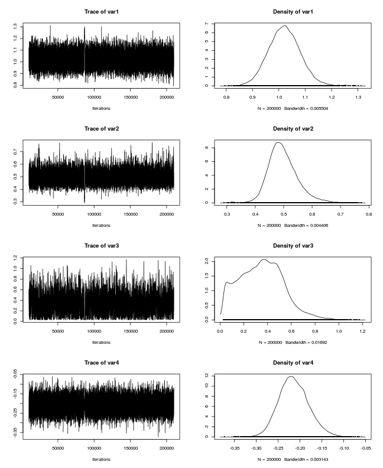

**evmix_fit**
-------------

This code is a simple interface for fitting and doing MCMC (Bayesian
estimation) on some extreme value mixture models that are provided by the
`evmix` R package. 

The `evmix` package is an R package for fitting extreme value mixture models,
which was developed by Carl Scarrott and Yang Hu, University of Canterbury. For
more information on the evmix package, see
https://CRAN.R-project.org/package=evmix and
http://www.math.canterbury.ac.nz/~c.scarrott/evmix/ .

The code here includes some fixes and speed-work-arounds to `evmix` routines
(thanks to evmix developer Carl Scarrot for assistence), as at the time of
writing the updates were not available on CRAN.

The code here only applies to fitting Gamma-GPD or Normal-GPD mixture models,
with a GPD upper tail. Other models found in the `evmix` package are not used
herein - simply because the latter models were sufficient for our application.

Beware that often extreme value mixture models are hard to fit (e.g. see
discussion in *Scarrot (2015) Univariate Extreme Value Mixture Modelling, in
the book 'Extreme Value Modeling and Risk Analysis: Methods and
Applications'*). Our wrapper routines attempt to make fitting easier by
trialling many fits, and by using simple Bayesian techniques to sample the
posterior parameter distribution (with uniform priors). While these techniques
worked well in our applications, in general care is required, and you should always
use graphical methods to check the fit.

In some applications, for a reasonable model fit it may be necessary to use
the Bayesian priors to restrict the model parameters. For example, for some
datasets the optimal (ML) GPD `threshold` parameter occurs at a very high data
quantile, meaning very little data is used to fit the upper tail model. In this
case ML can lead to an erratic fit. As a work-around, one may use Bayesian
priors to 'force' the threshold parameter to be below some data quantile, thus
ensuring that the upper tail model is fit with sufficient data. 


# **USAGE**
-----------

To install the code, you need to have the R packages `evmix` and `MCMCpack` installed.
If you don't have them already, this can be achieved by starting R and running
the following commands:
```r
    install.packages(c('evmix', 'MCMCpack'))
```

The codes in 'evmix_fit.R' include some inline doxygen documentation. See the
codes in '../../Analysis' for examples of their usage in our storm wave
clustering code. See the codes in [test_evmix_fit.R](test_evmix_fit.R) for
simpler examples.


## **Example use**

Here we illustrate the fit of a mixed gamma-gpd model to some peak storm wave
height data. First we read the data, which contains storm events with peak significant
wave height exceeding 1.038 m.

```r
event_statistics = read.csv('../../Data/Sample_event_statistics/event_statistics_out.csv')
head(event_statistics)
```

```
##   duration  hsig      tp1   dir    tideResid startyear  endyear
## 1       14 1.190 4.950495 243.9  0.244405742  1979.091 1979.093
## 2        9 1.198 4.901961 196.8 -0.003594258  1979.148 1979.148
## 3       16 1.624 5.681818 251.6  0.664905742  1979.253 1979.254
## 4        8 1.428 5.376344 253.1  0.274905742  1979.258 1979.259
## 5        3 1.138 4.504504 337.5  0.366405742  1979.290 1979.290
## 6       12 1.350 5.263158 251.8  0.483905742  1979.303 1979.305
##                  time
## 1 1979-02-03 08:30:00
## 2 1979-02-23 20:30:00
## 3 1979-04-03 04:30:00
## 4 1979-04-05 04:30:00
## 5 1979-04-16 18:30:00
## 6 1979-04-21 16:30:00
```

```r
set.seed(1) # Reproducible randomness
```
The `event_statistics` data contains:
* `duration` -- storm duration (hours)
* `hsig` -- peak significant wave height during storm (m)
* `tp1` -- wave period during storm peak (seconds)
* `dir` -- wave direction during storm peak (degrees)
* `tideResid` -- peak tidal residual during the storm (m)
* `startyear` -- the storm start time (decimal years)
* `endyear` -- the storm end time (decimal years)
* `time` -- storm start time in a different format

**Next, do a maximum likelihood fit of a mixed gamma-GPD model to the
significant wave height data**

```r
evmix_fit = new.env()
source('evmix_fit.R', local=evmix_fit, chdir=TRUE)

# Define the minimum possible value of hsig. This is known from the data
# construction step (which is not shown here, although a rough value can be
# inferred from the data itself). 
# The gamma distribution has a lower bound of 0, so we need to offset the data
# to match this. 
hsig_offset = 1.038

# Fit it
# In general the fit should be scrutinized, as it is easy to get stuck in local
# optima
hsig_mixture_fit = evmix_fit$fit_gpd_mixture(
    data=event_statistics$hsig, 
    data_offset=hsig_offset, 
    bulk='gamma')
```

```
## [1] "  evmix fit NLLH: " "168.913400246402"  
## [1] "  fit_optim NLLH: " "168.913400158047"  
## [1] "  Bulk par estimate0: " "1.02728752044157"      
## [3] "0.481950709764844"      "0.461937210155372"     
## [5] "-0.234629164720649"    
## [1] "           estimate1: " "1.02728475307474"      
## [3] "0.48195300313742"       "0.461942071128285"     
## [5] "-0.234632490007676"    
## [1] "  Difference: "        "2.76736683813006e-06"  "-2.29337257590112e-06"
## [4] "-4.86097291285681e-06" "3.325287027095e-06"   
## [1] "PASS: checked qfun and pfun are inverse functions"
```

```r
# Compute the Hsig quantile that 1 out of 100 storms should exceed
# This is NOT the AEP 1/100 event, because there are many storms each year.
hsig_mixture_fit$qfun(1-1/100)
```

```
## [1] 2.707422
```

```r
# Approximately 1/100 of the data should do this
mean(event_statistics$hsig > hsig_mixture_fit$qfun(1-1/100))
```

```
## [1] 0.007317073
```

```r
# Make a quantile-quantile plot of the data against a random sample from the
# distribution
qqplot(
    event_statistics$hsig, 
    hsig_mixture_fit$qfun(runif(length(event_statistics$hsig))),
    main='QQ-plot of data and a random sample from \n the fitted gamma-GPD model',
    xlab='Data quantile', ylab='Model quantile')
abline(0,1,col='red'); grid()
```


Here we use Bayesian methods with an approximately non-informative uniform
prior to estimate the uncertainty in the fit.

```r
# Limit the threshold parameter to be < the top 50th data point, and > bottom
# 50th data point, so there is enough data in the tail to fit the GPD.
hsig_u_upper_limit = sort(event_statistics$hsig, decreasing=TRUE)[50] - hsig_offset
hsig_u_lower_limit = sort(event_statistics$hsig, decreasing=FALSE)[50] - hsig_offset

# MCMC parameters
mcmc_chain_length = 200000 # Might need to increase this for convergence
mcmc_chain_thin = 1 # No thinning by default, but to save memory can increase this
mcmc_nchains = 1 # How many chains to run
mcmc_ncores = 1 # Can run multiple chains in parallel if desired (not on windows)
# Annual event rate -- estimate it from the data
annual_event_rate = length(event_statistics[,1])/(2014 - 1979)

# Do MCMC sampling of the model parameters, assuming uniform priors.
hsig_mixture_fit = evmix_fit$mcmc_gpd_mixture(
    fit_env=hsig_mixture_fit, 
    par_lower_limits=c(0, 0, hsig_u_lower_limit, -1000.), 
    par_upper_limits=c(1e+08, 1.0e+08, hsig_u_upper_limit, 1000),
    mcmc_start_perturbation=c(0.4, 0.4, 1., 0.2), # If multiple chains, randomly perturb their starting values
    mcmc_length=mcmc_chain_length,
    mcmc_thin=mcmc_chain_thin,
    mcmc_burnin=10000,
    mcmc_nchains=mcmc_nchains,
    mcmc_tune=c(1,1,1,1)*1,
    mc_cores=mcmc_ncores,
    annual_event_rate=annual_event_rate)
```

```
## 
## 
## @@@@@@@@@@@@@@@@@@@@@@@@@@@@@@@@@@@@@@@@@@@@@@@@@@@@@@@@@
## The Metropolis acceptance rate was 0.41247
## @@@@@@@@@@@@@@@@@@@@@@@@@@@@@@@@@@@@@@@@@@@@@@@@@@@@@@@@@
```

```r
# Graphical convergence check of one of the chains. 
plot(hsig_mixture_fit$mcmc_chains[[1]])
```



Here we examine some of the outputs, and make a return level plot for `hsig`.

```r
# Look at mcmc parameter estimates in each chain
lapply(hsig_mixture_fit$mcmc_chains, f<-function(x) summary(as.matrix(x)))
```

```
## [[1]]
##       var1             var2             var3              var4        
##  Min.   :0.7946   Min.   :0.2906   Min.   :0.02804   Min.   :-0.3727  
##  1st Qu.:0.9806   1st Qu.:0.4632   1st Qu.:0.20801   1st Qu.:-0.2375  
##  Median :1.0204   Median :0.4922   Median :0.34914   Median :-0.2157  
##  Mean   :1.0216   Mean   :0.4981   Mean   :0.34917   Mean   :-0.2140  
##  3rd Qu.:1.0605   3rd Qu.:0.5272   3rd Qu.:0.47434   3rd Qu.:-0.1919  
##  Max.   :1.3120   Max.   :0.7741   Max.   :1.17297   Max.   :-0.0598
```

```r
# Look at ari 100 estimates
lapply(hsig_mixture_fit$ari_100_chains, 
    f<-function(x) quantile(x, p=c(0.025, 0.5, 0.975)))
```

```
## [[1]]
##     2.5%      50%    97.5% 
## 3.064115 3.216005 3.524623
```

```r
# Make return level plot
evmix_fit$mcmc_rl_plot(hsig_mixture_fit)
```


# **TESTS**
-----------

To test the code, run
```r
    source('test_evmix_fit.R') 
```

from within R. It should print information on a number of tests with several PASS
statements, a few package startup messages, but no FAIL's or other errors. Some
figures are also produced.

Note that these tests take 10s of minutes on my multicore linux machine --
and will take longer on machines running windows, since they are not setup to
run in parallel with that OS. 
