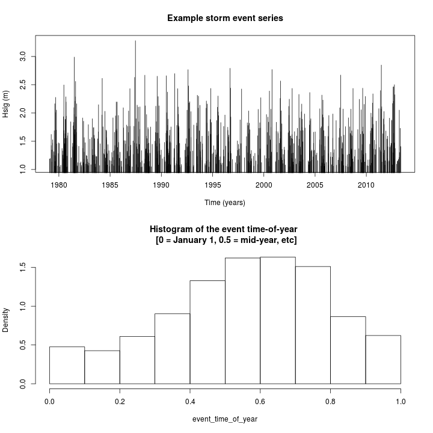

# **nhpoisp**
-----------

Code for fitting and simulating non-homogeneous Poisson processes using maximum
likelihood.

Series with gaps between events (e.g. to prevent storm overlap) are supported.
The event rate function can also depend on time and the time since the last event.

The main functions are `rnhpoisp` for simulating synthetic series, and
`fit_nhpoisp` for fitting models to data. 

# **Usage**
------------


## **Idealised example**
-------------------------

An example illustrating some features is provided below. It shows how to:
* Define an event rate function, consisting of a constant rate, a sinusoidal seasonal component, and an exponential clustering term.
* Simulate a random time-series from the rate function, here of 50 years duration
* Estimate the model parameters from data

For more details/options see the in-line documentation in
[nhpoisp.R](nhpoisp.R) (this follows the doxygen style), and look at the tests.

**Below, we make a rate function `lambda(t, tlast=-Inf)` which depends on the time of 
year `t` and the time since the last event `tlast`**. It has a sinusoidal
variation through the year, with a greatly enhanced rate of events just after
an event occurs (often termed 'clustering').

```r
nhp = new.env()
source('nhpoisp.R', local=nhp)

# Define the rate function 'lambda(t, tlast)'. 
#
# To specify lambda, we need a 'rate equation' with parameters 'theta'
#
rate_equation = 'theta[1] + theta[2]*sin(2*pi*(t+theta[3])) + theta[4]*exp(-(t-tlast)/theta[5])'
theta_par = c(1, 2, 0.1, 15.0, 1/50)
#
# Note that lambda must always be >= 0, which we enforce with the
# 'minimum_rate' argument. (By default this is 0)
#
lambda = nhp$get_lambda_function(theta_par, rate_equation, minimum_rate=0)

# Example rate computation
lambda(t=1.3) 
```

```
## [1] 2.175571
```

```r
# If 'tlast' is not provided, it is assumed to be -Inf
# In this example, the rate should increase if 'tlast' is close to 't'
lambda(t=1.3, tlast=1.29)
```

```
## [1] 11.27353
```

**Here we make a plot of the lambda function with and without clustering**

```r
# Create times at which lambda is evaluated for plot
t = seq(0, 1, len=1000)

# Split plot vertically in 2
par(mfrow=c(2,1))

# Plot panel 1
plot(t, lambda(t), main='lambda(t) ignoring the time since the last event',
    t='l', xlab='Time (years)', ylab = 'Rate function (events/year)', lwd=2)
grid(col='darkgrey')

# Make the 'time of the last event' = 0.1 for all events after t=0.1, and -Inf otherwise
tlasts = t
tlasts[ t > 0.1] = 0.1
tlasts[ t <= 0.1] = -Inf

# Plot panel 2
plot(t, lambda(t, tlast=tlasts), main='lambda(t) when event occurs at t = 0.1', 
    xlab='Time (years)', ylab = 'Rate function (events/year)', t='l', lwd=2)
points(t, lambda(t), t='l', col='blue', lty='dotted') # Add the previous curve
abline(v=0.1, col='red', lty='dashed', lwd=2) # Vertical line at time=0.1
grid(col='darkgrey') 
legend('topright', c('With clustering term', 'No clustering'), lwd=c(2,1),
    lty=c('solid', 'dotted'), col=c('black', 'blue'), bg='white')
```


**Next we simulate a random synthetic timeseries using the above lambda function.**
The main function for this is `rnhpoisp` (for more information see
documentation in the function header).


```r
set.seed(1) # Make the example reproducible

# 50 year series
series_duration = 50

synthetic_data = nhp$rnhpoisp(duration=series_duration, lambda = lambda)

#
# 'synthetic_data' is a vector of increasing times at which events occur. 
# Let's look at the first 6 entries
synthetic_data[1:6]
```

```
## [1] 0.1168604 0.1771514 0.8794946 2.2488395 2.2669781 4.1100736
```

```r
#
# The clustering in the series is manifest in the distribution of the time
# between events. A considerable fraction of event spacings are much smaller
# than the median value, indicating sequences of 'clustered' events.
#
quantile(diff(synthetic_data), p=c(0.01, 0.1, 0.5, 0.9, 0.99))
```

```
##          1%         10%         50%         90%         99% 
## 0.001318402 0.015139788 0.381288058 1.364453604 2.532100262
```

```r
#
# Plot the first 3 years
#
plot(synthetic_data, synthetic_data*0 + 1, t='h', 
    main='Synthetic event times: The first 3 years',
    xlim=c(0,3), xlab='Event time (year)', ylab="")
```


**Next we back-estimate the parameters of lambda from the synthetic_data series.**
Having good starting parameters is important for getting the fit to converge.
Note that if we were fitting real data, then `synthetic_data` would be read
from a file (e.g. using `scan` or `read.table`). However, here we fit to the
synthetic data simulated above, to show that we can back-estimate the known
paramters.

```r
model_fit = nhp$fit_nhpoisp(
    synthetic_data, 
    rate_equation=rate_equation,
    minimum_rate=0.,
    initial_theta=c(1., 0.2, 0., 10., 1/100),
    integration_dt = 1.0e-04,
    ##
    ## The arguments below control details of the optimization
    ## It can be difficult to fit these models with complex rate functions,
    ## so adjustment may be required.
    ## Consult the code documentation and see help on R's "optim"
    ## function for details.
    ##
    number_of_passes=1,
    enforce_nonnegative_theta=TRUE,
    optim_method=c('Nelder-Mead'),
    optim_control=list(maxit = 500, parscale=c(1, 1, 0.1, 1, 0.01)),
    verbose=FALSE)

# The fitted parameters should approximate the true ones,
# considering their standard errors
model_fit$par  
```

```
## [1] 1.17433808 2.51362821 0.11083784 8.44613070 0.01482651
```

```r
nhp$get_fit_standard_errors(model_fit)
```

```
## [1] 0.19456223 0.45338702 0.01351391 5.62600650 0.01261502
```

```r
# Note these standard errors are approximate only (based on inverting the
# hessian of the likelihood, so valid as the amount of data --> Inf). 

# For comparison, recall the true theta_par parameters were set above as
## theta_par = c(1, 2, 0.1, 15.0, 1/50)
```

**Here we show how to make a diagnostic plot and compute some statistics to
help determine if the model is a good fit**. The goodness of fit statistics are
based on a Kolmogorov-Smirnov test, which compare the distributions of several
statistics in the data and a sample from the fitted model. The statistics
include the time between storm events, the storm event start time (only
considering the sub-yearly component), and the number of events each year. It
should be noted that statistically, this test is biased because we have
estimated the model parameters using the data. Theoretically the test does not
account for this, which means the p-values will be biased high. However, for a
very poorly fitting model, the p-values should nevertheless be very low. In other words,
the tests are useful to detect particularly badly fitting models, which will have very
low p-values (i.e. much less than 0.1).

```r
# To make the plot we need to create the fitted lambda function
fitted_lambda_function = nhp$get_lambda_function(
    theta = model_fit$par, 
    rate_equation = model_fit$rate_equation)

# Plot
nhp$plot_nhpoisson_diagnostics(
    event_time = synthetic_data, 
    event_durations = 0*synthetic_data, # Here ignore finite durations, by setting duration=0
    fitted_lambda = fitted_lambda_function)
```

```
## Loading required package: Matching
```

```
## Loading required package: MASS
```

```
## ## 
## ##  Matching (Version 4.9-2, Build Date: 2015-12-25)
## ##  See http://sekhon.berkeley.edu/matching for additional documentation.
## ##  Please cite software as:
## ##   Jasjeet S. Sekhon. 2011. ``Multivariate and Propensity Score Matching
## ##   Software with Automated Balance Optimization: The Matching package for R.''
## ##   Journal of Statistical Software, 42(7): 1-52. 
## ##
```

```
## [1] "KS TEST OF THE EVENTS TIME-OF-YEAR"
## $ks.boot.pvalue
## [1] 0.583
## 
## $ks
## 
## 	Two-sample Kolmogorov-Smirnov test
## 
## data:  Tr and Co
## D = 0.08394, p-value = 0.6088
## alternative hypothesis: two-sided
## 
## 
## $nboots
## [1] 1000
## 
## attr(,"class")
## [1] "ks.boot"
```

```
## [1] "KS TEST OF THE TIME BETWEEN EVENTS"
## $ks.boot.pvalue
## [1] 0.89
## 
## $ks
## 
## 	Two-sample Kolmogorov-Smirnov test
## 
## data:  Tr and Co
## D = 0.062063, p-value = 0.9132
## alternative hypothesis: two-sided
## 
## 
## $nboots
## [1] 1000
## 
## attr(,"class")
## [1] "ks.boot"
## [1] "KS TEST OF THE NUMBER OF EVENTS EACH YEAR"
## $ks.boot.pvalue
## [1] 0.929
## 
## $ks
## 
## 	Two-sample Kolmogorov-Smirnov test
## 
## data:  Tr and Co
## D = 0.037665, p-value = 1
## alternative hypothesis: two-sided
## 
## 
## $nboots
## [1] 1000
## 
## attr(,"class")
## [1] "ks.boot"
```


## **Example with realistic storm wave data**
----------------------------------------------

Here we show an example of using the code on realistic storm wave data,
including accounting for the finite duration of events.

First we **read the sample data**. This is a table of storm event summary
statistics, derived from our Adelaide analysis.

```r
# Some sample data derived from a model for Adelaide
event_statistics = read.csv('../../Data/Sample_event_statistics/event_statistics_out.csv')

head(event_statistics)
```

```
##   duration  hsig      tp1   dir    tideResid startyear  endyear
## 1       14 1.190 4.950495 243.9  0.244405742  1979.091 1979.093
## 2        9 1.198 4.901961 196.8 -0.003594258  1979.148 1979.148
## 3       16 1.624 5.681818 251.6  0.664905742  1979.253 1979.254
## 4        8 1.428 5.376344 253.1  0.274905742  1979.258 1979.259
## 5        3 1.138 4.504504 337.5  0.366405742  1979.290 1979.290
## 6       12 1.350 5.263158 251.8  0.483905742  1979.303 1979.305
##                  time
## 1 1979-02-03 08:30:00
## 2 1979-02-23 20:30:00
## 3 1979-04-03 04:30:00
## 4 1979-04-05 04:30:00
## 5 1979-04-16 18:30:00
## 6 1979-04-21 16:30:00
```

The `event_statistics` data contains:
* `duration` -- storm duration (hours)
* `hsig` -- peak significant wave height during storm (m)
* `tp1` -- wave period during storm peak (seconds)
* `dir` -- wave direction during storm peak (degrees)
* `tideResid` -- peak tidal residual during the storm (m)
* `startyear` -- the storm start time (decimal years)
* `endyear` -- the storm end time (decimal years)
* `time` -- storm start time in a different format

We will not use all of these variables here: only `duration` and `startyear`
are required for fitting the storm timing model. 

We also need to know a few other things:
* *The observation start time*. Here the data from which the events were defined started
on January 1 1979
* *Any minimum gap between events due to the event definition*.  Here the
events were defined so that the minimum gap between consecutive storm events
was (23 hours + the event duration). If shorter gaps occurred, then the storms
were merged into a single storm. This means we cannot have events separated by
less than 23 hours, and the model needs to know this to correctly fit the data.

**Here we plot the storm times-of-year.** This suggests a possible sinusoidal pattern to the
event rate.

```r
par(mfrow=c(2,1))

plot(event_statistics$startyear, event_statistics$hsig, t='h', lend=1,
    main='Example storm event series', xlab='Time (years)', ylab='Hsig (m)')

# Plot the event time of year distribution.
event_time_of_year = event_statistics$startyear - floor(event_statistics$startyear)
hist(event_time_of_year, freq=FALSE, 
    main='Histogram of the event time-of-year \n [0 = January 1, 0.5 = mid-year, etc]')
```



**Here we fit a sinusoidal model to the above data, accounting for the finite time between
storm events.**

```r
# Choose the rate equation to fit -- sinusoidal model here
rate_equation = 'theta[1] + theta[2]*sin(2*pi*(t+theta[3]))'
start_par = c(30, 1, 0.5) # First guess of theta parameters, which the optimization will update

#
# Key info on the data
#
event_times = event_statistics$startyear
# event duration in the same units as event times
event_duration_years = event_statistics$duration / (365.25 * 24)
# time at which observations began
observation_start_time = 1979.0
# Minimum gap between events in the event definition. For this data
# it was defined to be (23 hours + the event duration).
# By definition we cannot have events more closely spaced than this
minimum_event_gap = 23 / (365.25*24)

# Fit the model
model_fit2 = nhp$fit_nhpoisp(
    event_times, 
    rate_equation=rate_equation,
    minimum_rate=0.,
    initial_theta=start_par,
    x0 = observation_start_time, 
    # The following argument allows us to account for the finite event duration
    # By definition it is impossible for events to be separated by less than the 
    # minimum_event_gap, so we add that to the duration [so the model knows shorter
    # gaps are impossible]
    event_durations = event_duration_years + minimum_event_gap,
    integration_dt = 1.0e-04,
    ##
    ## The arguments below control details of the optimization
    ## It can be difficult to fit these models with complex rate functions,
    ## so adjustment may be required.
    ## Consult the code documentation and see help on R's "optim"
    ## function for details.
    ##
    number_of_passes=2,
    enforce_nonnegative_theta=TRUE,
    optim_method=c('Nelder-Mead', 'BFGS'),
    optim_control=list(maxit = 500, parscale=c(1, 1, 0.1)),
    verbose=FALSE)
```

**Here we examine the fitted model with a diagnostic plot**

```r
# Print the fitted model information
model_fit2
```

```
## $par
## [1] 28.3009429 19.4052596  0.6424756
## 
## $value
## [1] -2004.259
## 
## $counts
## function gradient 
##        5        1 
## 
## $convergence
## [1] 0
## 
## $message
## NULL
## 
## $hessian
##            [,1]       [,2]         [,3]
## [1,]  1.5806876 -0.7473394    0.4299385
## [2,] -0.7473394  0.9953607   -0.4923871
## [3,]  0.4299385 -0.4923871 8702.3154894
## 
## $datalength
## [1] 820
## 
## $rate_equation
## [1] "theta[1] + theta[2]*sin(2*pi*(t+theta[3]))"
## 
## $optim_control
## $optim_control$maxit
## [1] 500
## 
## $optim_control$parscale
## [1] 1.0 1.0 0.1
```

```r
# Compute approximate standard errors for the 3 fitted parameters
nhp$get_fit_standard_errors(model_fit2)
```

```
## [1] 0.99035741 1.24803826 0.01071985
```

```r
# Diagnostic plot
fitted_lambda_model = nhp$get_lambda_function(model_fit2$par, model_fit2$rate_equation)
nhp$plot_nhpoisson_diagnostics(
    event_time = event_times, 
    event_durations = event_duration_years + minimum_event_gap, # Accounts for (event duration & storm definition)
    fitted_lambda = fitted_lambda_model)
```

```
## [1] "KS TEST OF THE EVENTS TIME-OF-YEAR"
## $ks.boot.pvalue
## [1] 0.712
## 
## $ks
## 
## 	Two-sample Kolmogorov-Smirnov test
## 
## data:  Tr and Co
## D = 0.024815, p-value = 0.6994
## alternative hypothesis: two-sided
## 
## 
## $nboots
## [1] 1000
## 
## attr(,"class")
## [1] "ks.boot"
```

```
## [1] "KS TEST OF THE TIME BETWEEN EVENTS"
## $ks.boot.pvalue
## [1] 0.856
## 
## $ks
## 
## 	Two-sample Kolmogorov-Smirnov test
## 
## data:  Tr and Co
## D = 0.021075, p-value = 0.8641
## alternative hypothesis: two-sided
## 
## 
## $nboots
## [1] 1000
## 
## attr(,"class")
## [1] "ks.boot"
## [1] "KS TEST OF THE NUMBER OF EVENTS EACH YEAR"
## $ks.boot.pvalue
## [1] 0.444
## 
## $ks
## 
## 	Two-sample Kolmogorov-Smirnov test
## 
## data:  Tr and Co
## D = 0.1176, p-value = 0.7241
## alternative hypothesis: two-sided
## 
## 
## $nboots
## [1] 1000
## 
## attr(,"class")
## [1] "ks.boot"
```


The above model seems to fit fairly well. In applications a range of models
would generally be tested.

Having fit a model, we can use it to simulate synthetic event time-series, like
we did in the first part of this README. **The code below shows how to generate
random storm event series from the fitted model, using simple resampling to
generate event properties**. Note that for realistic hazard applications the
event properties should probably be devised using statistical modelling (e.g.
extreme value type approaches), rather than using the empirical approach below.

```r
#
# Function to generate random event properties, given the event time t.
# Here we simply sample from the input data, however, this function
# can easily be modified to treat seasonally varying extreme value
# distributions (i.e. parameters dependent on t)
event_properties_function<-function(t){
   
    output = list()
    # Sample storm properties from the data. This can be replaced with e.g.
    # fitted parametric distributions
    output$duration = sample(event_duration_years, size=length(t), replace=TRUE)
    output$hsig = sample(event_statistics$hsig, size=length(t), replace=TRUE)
    output$tideResid = sample(event_statistics$tideResid, size=length(t), replace=TRUE)
    output$tp1 = sample(event_statistics$tp1, size=length(t), replace=TRUE)

    return(output)
}

# Make a synthetic series of 10 years duration
synthetic_data2 = nhp$rnhpoisp(
    duration=10,
    lambda = fitted_lambda_model,
    event_properties_function = event_properties_function,
    observation_start_time = observation_start_time,
    extra_duration_gap = minimum_event_gap)

# The synthetic data now has an attribute 'event_properties' with the random
# storm properties.
synthetic_series_df = attr(synthetic_data2, 'event_properties')
# Append the event time
synthetic_series_df = cbind(synthetic_series_df, 
    data.frame(startyear=synthetic_data2))

head(synthetic_series_df)
```

```
##       duration  hsig  tideResid      tp1 startyear
## 1 0.0011407712 1.282 0.53790574 5.291005  1979.014
## 2 0.0029660050 1.864 0.41240574 5.263158  1979.019
## 3 0.0012548483 1.128 0.23940574 5.235602  1979.174
## 4 0.0009126169 2.078 0.21490574 6.622516  1979.194
## 5 0.0015970796 1.968 0.44640574 5.102041  1979.320
## 6 0.0004563085 1.768 0.01690574 4.950495  1979.331
```

```r
plot(synthetic_series_df$startyear, synthetic_series_df$hsig, t='h', lend=1,
    main='Synthetic series with significant wave heights randomly sampled from data',
    xlab='Time', ylab='Hsig')
```


**To write out the data for ingestion into another program**, you can do e.g.

```r
write.csv(synthetic_series_df, 'synthetic_series.csv', row.names=FALSE)
```

# **Tests**
-------------

To run the tests, open R and do


```r
source('test_nhpoisp.R')
```

This will take awhile (say 30min on my 6 core linux box). It should
print information on each set of tests which are being run, along with
many 'PASS' statements.

# **To-Do**
------------

This code could be converted to a stand-alone R package with relatively little work, 
and is generically useful. 

Note that the interface is flexible but a bit non-standard (particularly the way the rate
function is often passed as a character string). Consider revising.

It could be adapted to allow more complex rate functions (e.g. depending on the
time of many previous events -- which is relevant for earthquake clustering).
But this would require a bit of work.

# **See Also**
------------

There is an R package on CRAN called `nhpoisson` which is also for fitting
non-homogeneous Poisson processes. It was released after the code here was
developed, and seems to have different functionality to the current package
(e.g. when I last looked it did not seem to treat the clustering that we
required for the storm analysis, although that may have changed). It's
interface is very different to that of the current package. Anyway it is
certainly worth investigating if you are working on non-homogeneous Poisson
processes.
